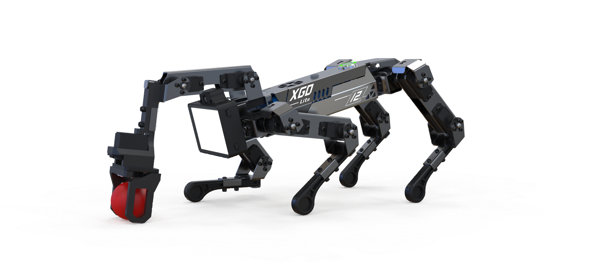
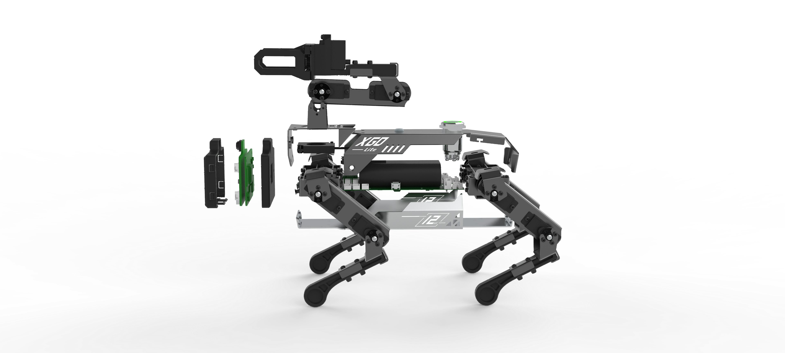

# 1.XGO-lite Robot Dog Tutorials

## Introduction

XGO-lite is an outstanding desktop AI robot dog. It is designed to meet the needs of various applications, especially in the fields of education, programming, robotics, and intelligent control. This robot dog integrates advanced sensors and a fine mechanical structure, so it is able to perform complex motion and operation tasks. The equipped Foxbit control board provides it with powerful control capabilities, allowing users to carry out secondary development or customize functions through various programming methods.

## Features

- **12-degree-of-freedom movement capability** : It is designed with 15 active joints to achieve all-round, highly flexible movements.
- **Six-dimensional Attitude control** : It can be dynamically adjusted in any direction to achieve complex motion patterns.
- **Self-balancing** : The built-in IMU (Inertial Measurement Unit) ensures the stability of the robot dog during movements.
- **Friendly programming interface** : It supports Microblocks graphical programming, which is suitable for users of different levels.
- **High-precision feedback system** : Real-time posture and force feedback is provided by its joint position sensors and current sensor.

## Parameters

### Overall parameters

- **Model** : XGO-lite
- **Dimensions** : Default standing position 250mm x 145mm x 170mm
- **Weight** : 575g
- **Material**
	- Body: 1mm aviation aluminum material
	- Legs: ABS engineering plastic

### Servo parameters

- **Model** : Bus Serial port servo
- **Output torque** : 2.3KG•CM
- **Speed (S/60°)** : 0.1 S/60°
- **Operating voltage** : 4.8V ~ 7.4V
- **Operating temperature** : -20℃ ~ +60℃
- **Angle range** : 0-300°
- **Weight** : 13±1g
- **Motor Type** : Iron core

### Power system parameters

- **Charging port** : Standard Type-C 5V 1A
- **Battery** : 18650 standard 2500mA 3C discharge

## Interface Function

### Communication interface

XGO-lite is equipped with multiple interfaces, allowing users to communicate and control between devices:

- **Serial Interface** : It is used for secondary development and supports serial communication protocols.
- **USB Hub** : It can be connected to external devices for functional expansion, such as sensors or control modules.

### Programming interface

- **Graphical Programming** : Microblocks for visual programming, is suitable for beginners.

## Applicable Scenarios

XGO-lite is suitable for the following scenarios:

- **Education and teaching** : As a STEM education tool, it helps students understand the basic principles of programming and robotics.
- **Programming practice** : It is suitable for programming enthusiasts and developers to innovate and experiment, test algorithms and control strategies.
- **Scientific researches** : It is used for robotics research, algorithms development and control strategies to verify theories in more complex applications.
- **Entertainment and display** : In exhibitions and events, it attracts the attention of audiences and participants by its flexible movements.

## Precautions

- **Avoid extreme environments** : Please ensure that the robot dog operates within the working temperature range (-20℃ to +60℃) and avoid using it in extreme environments.
- **Reasonable charging** : When charging it with the Type-C cable, please be sure to charge it with the standard current (5V 1A) to avoid damaging the battery.
- **Regular maintenance** : It is recommended to regularly check the working condition of the servo and joints to ensure smooth and stable movement.
- **Safe operation** : When programming or operating, ensure the safety of the surrounding environment to prevent the moving robot dog from causing harm to objects or people.

