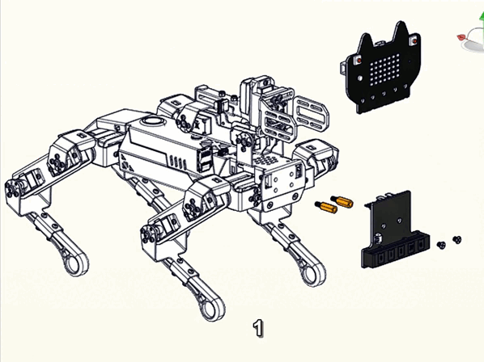

# 2.XGO-Foxbit Assembly

## XGO Start-up

* **Steps**:

  1. Place the robot dog in a lying position to ensure that its joints are not jammed.
  
  2. Press the power button on its back.
  3. The power indicator ring will flash rapidly and then remain on constantly.
  4. The robot dog will stand up slowly and its robot arm will automatically retract after extending, indicating a successful start-up.

* **Precautions**:
  * Do not turn it on in your hand. When the robot dog is turned on, it may shake, which could cause abnormal movement.
  * Do not shut down the dog during the startup process.

## XGO Shutdown

* **Steps**:
  1. Press the power button on its back.
  2. The indicator ring will flash slowly, the robot dog will lie down slowly, and the robot arm will retract.
  3. When the indicator ring turns off, it indicates that it is completely shut down.

* **Precautions**:
* Do not start up the dog during the shutdown process.

## XGO Charging

* **Charging indication**:
  * When the battery power is too low, the indicator ring of the robot dog flashes and the dog lies down, indicating that it needs to be charged.

* **Charging steps**:
   1. Insert the dedicated lithium battery charger into the charging port on the abdomen of the robot dog.
   2. It takes about 2 to 3 hours to charge. Once fully charged, the indicator changes from red to green.
   3. If there is only a Type-C port at the bottom of the robot, it can be charged by any Android phone charger.
* **Precautions**:
  1.  When charging, the charger indicator will show red and turn green when fully charged.
  2.  Do not operate the robot dog while charging to avoid affecting the charging.
