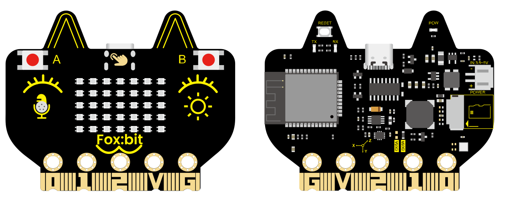
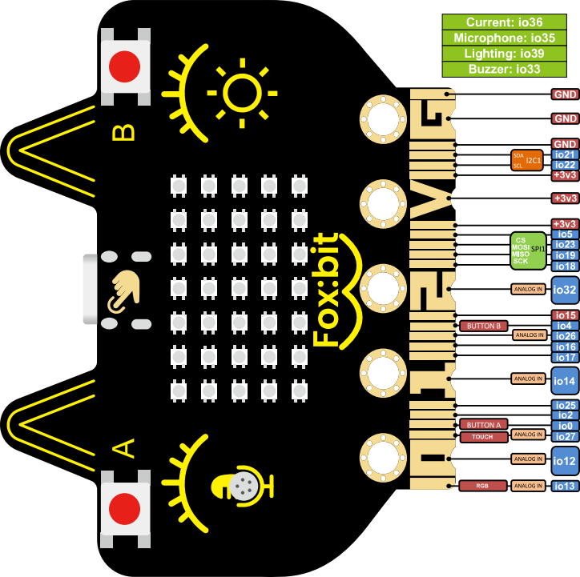

# 3.FoxBit Development Board User Manual 

## 1. Introduction

FoxBit is a multi-functional development board centered on ESP32, targeting IoT, STEAM education, intelligent control, and various DIY maker projects. It is equipped with a variety of sensors and peripherals on the board so can achieve wireless communication via Wi-Fi/BLE. It features high performance but low power consumption and is suitable for a wide range of needs from beginners to professional developers.

## 2. Core Properties

- ESP32 dual-core 240 MHz, 520 KB SRAM + 4 MB Flash, supports FreeRTOS

- 2.4GHz Wi-Fi (802.11 b/g/n, up to 150 Mbps) + Bluetooth v4.2 (BR/EDR & BLE)
- On-board sensors:

	- AHT20 Temperature and humidity sensor
	- QMI8658C six-axis IMU sensor
	- Photoresistor
	- MEMS microphone
- On-board peripherals:

	- Buzzer
	- 5 × 7 WS2812 RGB dot matrix
	- SD card slot
	- Two buttons + 7 touch channels
- Rich expansions: 19 digital I/O channels, 13 PWM channels, 2 DAC channels, SPI/I2C/UART all open

- Low-power design, battery-powered, with a current detection interface for easy power consumption analysis

## 3. Technical Parameters

### 3.1 Power Mode

| Mode | Connector | Description |
|------|--------|------|
| USB power supply | USB-C | 5 V / 1 A adapter recommended |
| DC port | PH2.0 | 5 V lithium battery pack |
| Gold finger pins | 3V3 / GND | Peak current ≈ 1 A |

Operating voltage: 3.3V	|	Peak current: ≈ 1000mA (All leds on)

### 3.2 Microcontroller

• Model: ESP32-D0WDQ6		

• Dual-core Xtensa LX6		

• Up to 240 MHz

### 3.3 Wireless Communication

| Protocol | Frequency band | Remarks |
|------|------|------|
| Wi-Fi 802.11 b/g/n | 2.412 – 2.484 GHz | 20/40 MHz channel |
| Bluetooth BR/EDR & BLE | 2.402 – 2.480 GHz | Supports CVSD/SBC audio |

### 3.4 On-board Resource Distribution

| Module | Interface type | Default GPIO | Description |
|------|----------|----------|------|
| Button A / B | Digital input | 0 / 4 | Developer Button |
| Logo touch | Touch input | 27 | Capacitive touch |
| Temperature and humidity AHT20 | I2C | SDA 21 / SCL 22 | Environmental monitoring |
| Six-axis IMU | I2C | ditto | Posture perception |
| Photoresistor | ADC | 39 | Ambient light |
| Microphone | ADC | 35 | Sound |
| buzzer | PWM | 33 | Prompt sound / music |
| RGB dot matrix 5 × 7 | Single line | 13 | 35 WS2812 |
| SD card slot | SPI | CS 5 / MOSI 23 / MISO 19 / SCK 18 | Storage expansion |
| Current detection | ADC | 36 | Power supply monitoring |

## 4. Driver & Development Environment

### 4.1 USB-to-serial Driver (CH340)

FoxBit is equipped with **CH340** chip. Before connecting to the computer for the first time, the corresponding driver must be installed; otherwise, the IDE will not recognize the serial port.

Please download a driver according to your system:

[https://docs.keyestudio.com/en/latest/docs/Download_Center/Download_Center.html#driver-download](https://docs.keyestudio.com/en/latest/docs/Download_Center/Download_Center.html#driver-download)

**Windows**  

1. Download `CH341SER.EXE`, and double-click to run and then【install】.
2. After that, restart the computer. The Device Manager should display **USB-SERIAL CH340 (COMx)**.

**macOS**  
1. For macOS 11+, it usually plug and play. If it cannot be recognized, download the  `CH34xVCPDriver.pkg` with the identification `macOS`.   
2. After installation, go to “System Settings ▸ privacy & security” to allow the driver to load and restart.
3. Terminal execute `ls /dev/cu.*` and you will see `/dev/cu.wchusbserialXXXX`. 

**Linux**

1. Most released versions come with built-in `ch341` modules, so `dmesg | grep ttyUSB` will show  `ttyUSB0`.

2. If it does not load automatically, run `sudo modprobe ch341` and check  `/dev/ttyUSB*` again.

3. After installation, please select the corresponding serial number (COMx / ttyUSBx / cu.wchusbserial) in MicroBlocks.

### 4.2 MicroBlocks IDE

1. Enter [https://microblocks.fun/download](https://microblocks.fun/download) to download an installation package suitable for the system. 
2. After installation, start the IDE. A gray indicator at the lower right corner indicates that it is not connected.
3. The FoxBit development board is connected to the computer via a Type-C cable.
4. Select **update firmware on board** in the drop-down box from the “Gear” at the top of Microblocks.
5. Select FoxBit and update the firmware. You need to wait for a few seconds.
6. After the firmware is updated, click 「Connect」 → select the corresponding serial port → OK. The appearance of a small green dot in the status bar indicates that it is connected. The model of the board is FoxBit, and its extension library is automatically displayed on the left side.

## 5. Typical Application Scenarios

1. **Internet of Things (IoT)** : Wi-Fi/BLE direct connection to the cloud, enabling smart home, environmental monitoring, and remote control.
2. **STEAM Education** : Integrating multiple sensors and combining with graphical programming, to help students quickly get started with hardware development.
3. **Intelligent Control** : Rich I/O and PWM, suitable for robots and automated equipment.
4. **DIY Creation** : RGB dot matrix + buzzer + IMU, capable of creating interactive lights, mini-games, etc.

## 6. FAQ

| Questions | Solutions |
|------|----------|
| IDE cannot find the board model | check the USB cable and CH340 driver,  or try another port or cable. |
| Report “I²C busy” when downloading script | The previous script occupied the bus;  Click Stop and then download again |
| No responce on the LED matrix | Ensure that the power supply is sufficient  and GPIO13 is not occupied by other functions |
| Cannot connect to Wi-Fi | It only supports 2.4GHz;  Check the SSID/passwords to avoid Chinese spaces |
