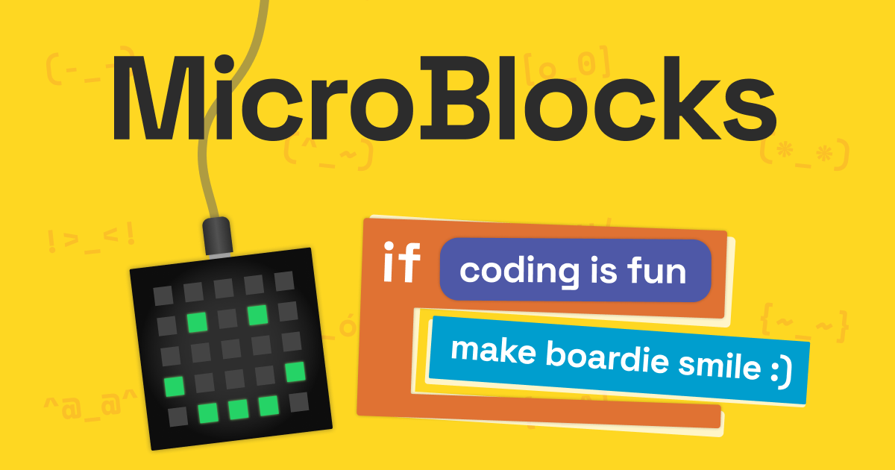
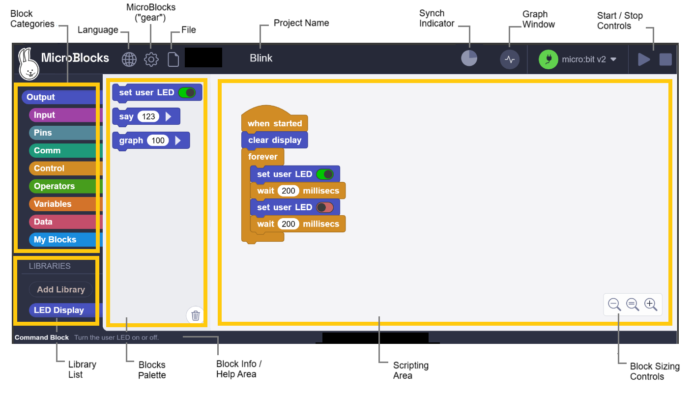
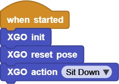

# 4.Microblocks & XGO: No Threshold! Journey of Robot Programming

## 1. What is Microblocks?

Microblocks is an open-source and free graphical programming environment. Its syntax is similar to Scratch, but it can run directly in real time on various microcontrollers (Micro:bit, ESP32/ESP8266, Raspberry PI Pico, etc.).

The official Microblocks comes with the FoxBit development board and the XGO robot dog library, which supports actions, sensors, and AI expansion by simply dragging code blocks.

- Official: <https://microblocks.fun>  
- Wiki: <https://wiki.microblocks.fun/en/home>

## 2. Online Version Guide

| Ver. | Url | Applicable Scenarios | Remarks |
|-|-|-|-|
| Online version | <https://microblocks.fun/run/microblocks.html> | There is a network environment and no installation is required | If the “Incompatible” prompt appears, please click the gear →「Erase Information and upgrade FoxBit firmware」. |

## 3. Offline Version Installation

Please refer to the previous chapter, “4.2 MicroBlocks IDE”.

## 4. Quick Tour of Development Environment

1. Workspace (center) : Drag and drop building blocks, write logic code.
2. Building Block Library (left) : All blocks are classified by color.
3. Module Library (lower left) : Add various types of libraries.
4. Sidebar (right) : Connect to the main board and simulator.
5. Toolbar (upper left): Switch languages, upgrade firmware, open examples.

## 5. Add XGO Library to Microblocks

1. Connect the XGO with the FoxBit development board to the computer, and long press the power button of the XGO to turn it on.
2. Click 「Connect」→ the corresponing serial port → OK. A small green dot in the status bar indicates that it is connected. The model of the board is FoxBit, and its extension library is automatically displayed on the left side.
3. In Library → Robot, tick **XGO-lite**. If there is no XGO blocks, pleasw resart the software or reload the extensions. 

## 6. XGO Basic Example: The dog greets you

   

Click  ▶Run, and drag the building blocks while observing its movements.

## 7. XGO Blocks Speediness Lookup Table

| Code blocks               |                          |
|--|--|
| **Function Description**  | Establish serial communication and put the servo in idle mode |
| **Application scenarios** | It must be placed at the beginning of the program            |
| **Code blocks** |  |
| **Function Description** | Return to the default standing position |
| **Application scenarios** | Reset among multiple movements |
| **Code blocks** |  |
| **Parameters** | List of preset actions |
| **Function Description** | One-click to complete set of actions |
| **Application scenarios** | Sit down, shake hands, pay New Year’s greetings... |
| **Code blocks** |  |
| **Parameters** | -100~100 |
| **Function Description** | Front/back stride |
| **Application scenarios** | Walk in a straight line |
| **Code blocks** | |
| **Parameters** |-100~100 |
| **Function Description** |Left/right stride |
| **Application scenarios** |Move sideways to dodge |
| **Code blocks** |  |
| **Parameters** | -100~100 |
| **Function Description** | Truning speed/angle |
| **Application scenarios** | Make a U-turn on the spot |
| **Code blocks** | |
| **Function Description** |Stop walking immediately |
| **Application scenarios** |Emergency braking |
|  | |
| **Parameters** |Slow/Normal/Fast |
| **Function Description** |Gear position of walk speed |
| **Application scenarios** |Performance rhythm |
| **Code blocks** |  |
| **Parameters** | Crawl/Walk/Trot/Bound |
| **Function Description** | Gait switching |
| **Application scenarios** | Power-saving or high-speed |
|**Code blocks** |  |
|**Parameters** | ±25 mm |
|**Function Description** | Body translation |
|**Application scenarios** | Fine-tuning of the center of gravity |
|**Code blocks** | |
|**Parameters** |±20° |
|**Function Description** |Body rotation |
|**Application scenarios** |Nod/tail |
|**Code blocks** |  |
|**Function Description** | Return the remaining battery power |
|**Application scenarios** | Low battery alarm |
|**Code blocks** |  |
|**Parameters** | 0-100% |
|**Function Description** | The claw opens and closes |
|**Application scenarios** | Grab or place objects |
|**Code blocks** |  |
|**Parameters** | -115°~70° |
|**Function Description** | Single-joint positioning |
|**Application scenarios** | Accurately pick up objects |
|**Code blocks** |  |
|**Parameters** | Upper/Lower -30°~30° |
|**Function Description** | Independent leg joint |
|**Application scenarios** | Custom-tailored actions |

## 8. FAQ

Q1: Cannot connect to the serial port?

A: ① Check whether the data cable supports data transmission; ② Whether 「USB-Serial」 appears in the device manager; ③ Try another ESP32 port.

Q2: XGO makes no responce but no error is reported?

A: You forgot  `XGO init` or it is in low battery protection. Check the battery capacity to determine whether it needs to be charged.

Q3: Sluggish movement or abnormal gait?

A: Add `XGO reset pose` before downloading, or go to 「Settings」→「Erase and Upgrade Firmware」 to refresh the underlying library.
