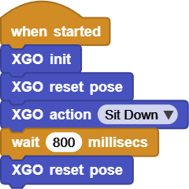
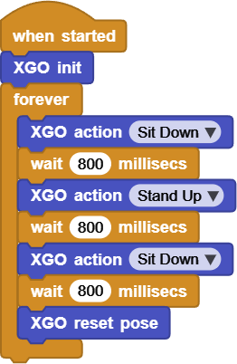

# Project 1 Hello XGO

## Ⅰ. Teaching Aims

1. Verify whether the communication between MicroBlocks and XGO-lite is normal and complete the power-on initialization.
2. Recognize and be able to use the three most basic “system blocks”.
3. Be able to invoke 1 ~ N built-in actions and insert appropriate waiting times based on their duration.
4. Understand the role of   `XGO reset pose` in the “posture baseline” to pave the way for follow-up experiments.

## Ⅱ. Pre-class Check

- XGO + Foxbit + MicroBlocks IDE.
- XGO battery power ≥ 60 %. 
- MicroBlocks status bar shows a green dot, and the development board model is **Foxbit**.
- In Library → Robot, tick **XGO-lite**. If there are no XGO blocks, please restart the software or reload the extension.

## Ⅲ. Key Blocks Analysis

|  |                                                              |
|------|------|
| **Functions**                           | `when started` Execute the script immediately after downloading |
| **Fallible points**                     | Forgot to put the script at beginning → The program will not work |
|  |                                                              |
| **Functions**                           | `XGO init` Initialize I2C, servo, and sensors                |
| **Fallible points**                     | It will report I2C busy after two consecutive calls          |
|  |                                                              |
| **Functions**                           | `XGO reset pose` The 12 servos return to angle zero          |
| **Fallible points**                     | Missing this step leads to overlapping movements and an imbalance in posture |
|  |                                                              |
| **Functions**                           | `XGO action "Sit Down"` Perform built-in actions             |
| **Fallible points**                     | The capitalization should be consistent with that in the drop-down box |

## Ⅳ. Practice

1. Open a blank script in the workspace.
2. Drag in and assemble the following blocks:

   

3. Click on the green ▶ above the workspace, and the XGO will sit down slowly.

   Online code: **[Click here](https://microblocks.fun/run/microblocks.html#scripts=GP%20Script%0Adepends%20%27XGO%20Lite%27%0A%0Ascript%20589%20150%20%7B%0AwhenStarted%0Axgo_init%0Axgo_reset_pose%0Axgo_action%20%27Sit%20Down%27%0A%7D%0A%0A)**

## Ⅴ. Test 1: A Single “Sit Down → Stand Up” Loop

Objective: Perform “Stand Up → Sit Down → Stand Up”.

The waiting time (`waitMillis`) can be fine-tuned by 600 ~ 1200 ms according to the actual speed of the servo.  

Online code: **[Click here](https://microblocks.fun/run/microblocks.html#scripts=GP%20Script%0Adepends%20%27XGO%20Lite%27%0A%0Ascript%20383%2089%20%7B%0AwhenStarted%0Axgo_init%0Axgo_reset_pose%0Axgo_action%20%27Sit%20Down%27%0AwaitMillis%20800%0Axgo_reset_pose%0A%7D%0A%0A)**  

## Ⅵ. Test 2: “Sit Down - Stand Up - Sit Down” Loop

Based on test 1, we put on a `forever` loop and add one more “`Sit Down` and `Stand Up`”.

Online code: **[Click here](https://microblocks.fun/run/microblocks.html#scripts=GP%20Script%0Adepends%20%27XGO%20Lite%27%0A%0Ascript%20446%2068%20%7B%0AwhenStarted%0Axgo_init%0Aforever%20%7B%0A%20%20xgo_action%20%27Sit%20Down%27%0A%20%20waitMillis%20800%0A%20%20xgo_action%20%27Stand%20Up%27%0A%20%20waitMillis%20800%0A%20%20xgo_action%20%27Sit%20Down%27%0A%20%20waitMillis%20800%0A%20%20xgo_reset_pose%0A%7D%0A%7D%0A%0A)**

The end `XGO reset pose` prevents the servo from overheating due to prolonged bending.

## Ⅶ. Quiz

1. Why is it recommended to put `XGO init` in the first sentence of almost all scripts?
2. What phenomenon will occur if `waitMillis` is omitted and the next action is executed immediately after?
3. Both `XGO reset pose` and `Stand Up` can make robots stand upright. What is the essential difference between them?

## Ⅷ. FAQ

| Questions                 | Possible causes                | Solutions                                             |
|------|----------|----------|
| No action was responded,  and the serial port reported an error | Forgot `XGO init`,  or USB is not connected. | Plug in the wire again,  restart MicroBlocks,  and add `XGO init` to the  first line of the script |
| Got stuck during the movement | Low battery / The servo is  blocked by the ground or cables | Charge until the battery power is ≥ 60%,  and clear the surrounding obstacles |
| Cannot stand steadily after sitting down | Forgot `XGO reset pose` | Add a reset action at the end |
| “I²C busy” pops up  when downloading the script | The old script is still running | First press “Stop”,  and then download again |

