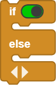
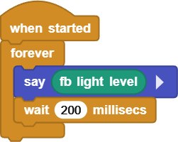
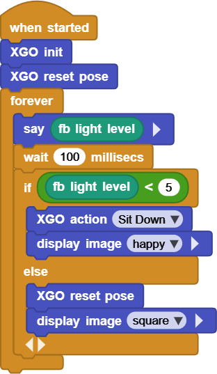
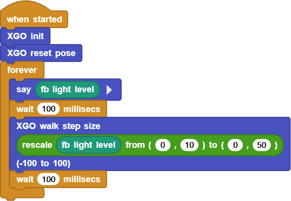

# Project 10 XGO Follows Light

## Ⅰ. Teaching Aims

1. Read the value `light level` (0-100) of the Fox:bit on-board photoresistor.
2. Use `map()` to linearly map light intensity to step size or speed.
3. Suppress bright and dark jitter through “double thresholds + return difference”.
4. Be capable of independently completing two types of self-developed scripts:
  - Bright → Stand up / Dark → sit down
  - Light following mode: the brighter the light is, the faster it will walk.

## Ⅱ. Pre-class Check

- XGO + Foxbit + MicroBlocks IDE.
- XGO battery power ≥ 60 %. Place the robot on a 1m × 1m flat ground and avoid direct strong light or flickering.
- MicroBlocks status bar shows a green dot, **XGO-lite** extension is loaded and the development board model is **Foxbit**.
- Run `XGO reset pose` and confirm that the zero position and step size are normal.

## Ⅲ. Key Blocks Analysis

|  |  |
|------|------|
| **Functions** | Return the ambient light intensity from 0 to 100 |
| **Fallible points** | **Must** be placed in `forever` for real-time reading |
|  |  |
| **Functions** | Linear mapping `a–b` → `c–d` |
| **Fallible points** | `a` and `b` cannot be the same |
|  |  |
| **Functions** | Determine the light intensity and switch actions |
| **Fallible points** | Missing “return difference” → shaking |
|  |  |
|**Functions** | Set the forward step size to n mm |
|**Fallible points** | Step size > 90 mm → Prone to falling |

Comparison table of photosensitivity and step size:

| Environment | `light level` | Recommended step size |
|------|---------------|----------|
| Dark room | 0 – 10 | 0(stop) |
| Ordinary classroom | 20 – 40 | 30 – 50 |
| Beside the desk lamp | 60 – 80 | 60 – 80 |
| Direct flashlight | 100+ | 80 – 90(upper limit) |

## Ⅳ. Practice

### Test 1: Read Real-time Light Intensity (for debugging)

Online code: **[Click here](https://microblocks.fun/run/microblocks.html#scripts=GP%20Script%0Adepends%20%27Foxbit%27%0A%0Ascript%20554%2068%20%7B%0AwhenStarted%0Aforever%20%7B%0A%20%20sayIt%20%28foxbit_light%29%0A%20%20waitMillis%20200%0A%7D%0A%7D%0A%0A)**  

### Test 2: Stand Up When Bright, Sit Down When Dark

High threshold `hiCut = 100`, low threshold `loCut = 60`, return difference 40 lx

Online code: **[Click here](https://microblocks.fun/run/microblocks.html#scripts=GP%20Script%0Adepends%20%27Foxbit%27%20%27LED%20Display%27%20%27XGO%20Lite%27%0A%0Ascript%20554%2068%20%7B%0AwhenStarted%0Axgo_init%0Axgo_reset_pose%0Aforever%20%7B%0A%20%20sayIt%20%28foxbit_light%29%0A%20%20waitMillis%20100%0A%20%20if%20%28%28foxbit_light%29%20%3C%205%29%20%7B%0A%20%20%20%20xgo_action%20%27Sit%20Down%27%0A%20%20%20%20led_displayImage%20%27happy%27%0A%20%20%7D%20else%20%7B%0A%20%20%20%20xgo_reset_pose%0A%20%20%20%20led_displayImage%20%27square%27%0A%20%20%7D%0A%7D%0A%7D%0A%0A)**  

### Test 3: Light Following Dog: Brighter Light for Faster Speed

Online code: **[Click here](https://microblocks.fun/run/microblocks.html#scripts=GP%20Script%0Adepends%20%27Foxbit%27%20%27XGO%20Lite%27%0A%0Ascript%20554%2068%20%7B%0AwhenStarted%0Axgo_init%0Axgo_reset_pose%0Aforever%20%7B%0A%20%20sayIt%20%28foxbit_light%29%0A%20%20waitMillis%20100%0A%20%20xgo_walk%20%28%27%5Bmisc%3Arescale%5D%27%20%28foxbit_light%29%200%2010%200%2050%29%0A%20%20waitMillis%20100%0A%7D%0A%7D%0A%0A)**  

## Ⅴ. Quiz

1. Why does Test 2 require “double thresholds” instead of just one?
2. What would happen if the `wait 100 ms` in Test 3 were changed to `20 ms`?
3. Besides photoresistor, what other sensors can you use to “drive” the step size? Please give two examples and explain their mapping range.

## Ⅵ. FAQ

| Questions           | Possible causes             | Solutions                    |
|------|----------|----------|
| Frequent switch between standing up  and sitting down | The interval between `hiCut`  and `loCut` is too small | Return difference ≥ 30 lx |
| The step size changes randomly | Ambient light flickering | `wait ≥ 100 ms`,  or perform a moving average |
| Fall while walking | Step size > 90 mm | Set the upper limit of `map()` to 90 |
| The reading is always either 0 or 100 | The sensor is blocked  or directly exposed to strong light | Clean the photoresistor holes;  Avoid direct light |
| Response delay | `wait` is too long | Shorten to 80–120 ms |

