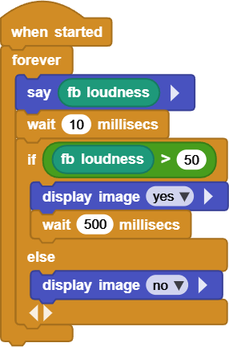
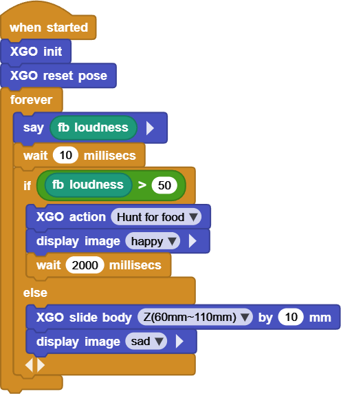

# Project 11 XGO Listens to Sounds

## Ⅰ. Teaching Aims

1. Read the on-board microphone `sound level`(0-100, refresh approximately each 20 ms).
2. Use single/double threshold(s) to enable XGO to switch emojis or actions based on the sound volume.
3. Build a simple “rest when quiet / forage when noisy” model.

## Ⅱ. Pre-class Check

- XGO + Foxbit + MicroBlocks IDE.
- XGO battery power ≥ 60 %. Place the robot on a flat ground.
- MicroBlocks status bar shows a green dot, **XGO-lite** extension is loaded and the development board model is **Foxbit**.
- The background noise in the classroom should be maintained at 5 - 15 to avoid continuous high noise from the outside.

## Ⅲ. Key Blocks Analysis

|  |  |
|------|------|
| **Functions** | Return 0 – 100 ambient volume |
| **Fallible points** | Forgot to put it in `forever` for real-time reading |
|  |  |
| **Functions** | Perform actions based on the threshold |
| **Fallible points** | Too small threshold interval → jitter |
|  |  |
| **Functions** | Stand up, sit down, slide, etc |
| **Fallible points** | Volume jitter causes repeated actions |
|  |  |
| **Functions** | Emojis on LED dot matrix |
| **Fallible points** | Not added `wait` → flash |
| |  |
|**Functions** | Eliminate jitter / delay |
|**Fallible points** | It's too short to display stably |

Reference value of `sound level`:

| Scenes | Typical readings |
|------|---------|
| Quiet classroom | 5 – 15 |
| Normal speaking environment | 20 – 35 |
| A round of handclap | 45 – 60 |
| Loud shouting | 70 – 90 |

## Ⅳ. Practice

### Test 1: “Sound Volume → Emoji”

Logic:
- Volume > 50 → `yes` for 0.5 s  
- Otherwise, `no`  

Online code: **[Click here](https://microblocks.fun/run/microblocks.html#scripts=GP%20Script%0Adepends%20%27Foxbit%27%20%27LED%20Display%27%0A%0Ascript%20554%2068%20%7B%0AwhenStarted%0Aforever%20%7B%0A%20%20sayIt%20%28foxbit_loudness%29%0A%20%20waitMillis%2010%0A%20%20if%20%28%28foxbit_loudness%29%20%3E%2050%29%20%7B%0A%20%20%20%20led_displayImage%20%27yes%27%0A%20%20%20%20waitMillis%20500%0A%20%20%7D%20else%20%7B%0A%20%20%20%20led_displayImage%20%27no%27%0A%20%20%7D%0A%7D%0A%7D%0A%0A)**  

### Test 2: “Rest When Quiet / Forage When Noisy”

Logic
- Volume > 50 → `Hunt for food` + `happy`, for 2 s  
- Otherwise, slightly squat down: `slide body Z by 10 mm` + `sad`  

Online code: **[Click here](https://microblocks.fun/run/microblocks.html#scripts=GP%20Script%0Adepends%20%27Foxbit%27%20%27LED%20Display%27%20%27XGO%20Lite%27%0A%0Ascript%20554%2074%20%7B%0AwhenStarted%0Axgo_init%0Axgo_reset_pose%0Aforever%20%7B%0A%20%20sayIt%20%28foxbit_loudness%29%0A%20%20waitMillis%2010%0A%20%20if%20%28%28foxbit_loudness%29%20%3E%2050%29%20%7B%0A%20%20%20%20xgo_action%20%27Hunt%20for%20food%27%0A%20%20%20%20led_displayImage%20%27happy%27%0A%20%20%20%20waitMillis%202000%0A%20%20%7D%20else%20%7B%0A%20%20%20%20xgo_slide_body%20%27Z%2860mm~110mm%29%27%2010%0A%20%20%20%20led_displayImage%20%27sad%27%0A%20%20%7D%0A%7D%0A%7D%0A%0A)**  

## Ⅴ. Quiz

1. What would happen if we changed `wait 500` in Test 1 to 50 ms?
2. Why does Test 2 use the `mode` variable instead of simply `if…else`?
3. If you want the volume to be louder and the steps to be wider, how should you use `map()`? Please write down the parameters.

## Ⅵ. FAQ

| Questions           | Possible causes       | Solutions                     |
|------|----------|----------|
| Emoji flashes | The volume jitter near the threshold | Increase the threshold interval; `wait ≥ 200 ms` |
| Repeated actions | There are no state variables. | Import `mode` and delay after switching |
| Sluggish switching between rest and foraging | The background noise is high, or the threshold is too far | Adjust the threshold; Perform the moving average |
| The microphone reading is always high | The sensor is affected by wind noise, or apply a film | Block the wind; Make sure the microphone hole is exposed |
| Large sliding amplitude | `slide body` distance exceeds limit | Maintain within ± 15 mm |
