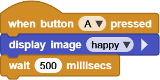
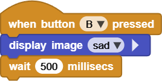
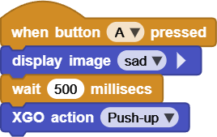
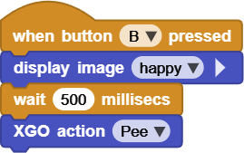

# Project 12 Button Control XGO

## Ⅰ. Teaching Aims

1. Understand the triggering methods of Foxbit A/B physical buttons and the structure of event scripts.
2. In `when button … pressed` event, call the XGO emoji and action block.
3. Map the two buttons to “Emoji Switch” and “Fun Action” respectively, and you can expand custom combination keys.

## Ⅱ. Pre-class Check

- XGO + Foxbit + MicroBlocks IDE.
- XGO battery power ≥ 60 %. The robot is placed on a flat ground.
- MicroBlocks status bar shows a green dot, **XGO-lite** extension is loaded and the development board model is **Foxbit**.
- First, run `XGO reset pose` to confirm that the robot is in zero position and there is sufficient space without any obstruction.

## Ⅲ. Key Blocks Analysis

|  |  |
|------|------|
| **Functions** | Detect button click |
| **Tips** | It can be triggered again after you release the button |
|   |  |
| **Functions** | Combined buttons |
| **Tips** | Both buttons must be pressed simultaneously |
|  |  |
| **Functions** | 5×7 dot matrix preset emojis |
| **Tips** | wink, angry, heart, etc |
|  |  |
| **Functions** | Delay /anti-shake /Display time for emojis |
| **Tips** | 30–500 ms visual effect adjustment |
|  |  |
| **Functions** | Trigger built-in fun actions |
| **Tips** | Firmware translation differences: PushUp /DogPee |

## Ⅳ. Practice

### Test 1: Button Control Emoji

- **A** → `happy`  
- **B** → `sad`  

Corresponding script:

Online code: **[Click here](https://microblocks.fun/run/microblocks.html#scripts=GP%20Script%0Adepends%20%27LED%20Display%27%0A%0Ascript%20554%2078%20%7B%0AwhenButtonPressed%20%27A%27%0Aled_displayImage%20%27happy%27%0AwaitMillis%20500%0A%7D%0A%0Ahttps://microblocks.fun/run/microblocks.html#scripts=GP%20Script%0Adepends%20%27LED%20Display%27%0A%0Ascript%20554%20210%20%7B%0AwhenButtonPressed%20%27B%27%0Aled_displayImage%20%27sad%27%0AwaitMillis%20500%0A%7D%0A%0A)**  

### Test 2: “PushUp/DogPee” in Joy

- **A**: *Push-up*
- **B**: Lift its leg to *Pee*  

Corresponding script:

Online code: **[Click here](https://microblocks.fun/run/microblocks.html#scripts=GP%20Script%0Adepends%20%27LED%20Display%27%20%27XGO%20Lite%27%0A%0Ascript%20554%2068%20%7B%0AwhenButtonPressed%20%27A%27%0Aled_displayImage%20%27sad%27%0AwaitMillis%20500%0Axgo_action%20%27Push-up%27%0A%7D%0A%0Ahttps://microblocks.fun/run/microblocks.html#scripts=GP%20Script%0Adepends%20%27LED%20Display%27%20%27XGO%20Lite%27%0A%0Ascript%20554%20227%20%7B%0AwhenButtonPressed%20%27B%27%0Aled_displayImage%20%27happy%27%0AwaitMillis%20500%0Axgo_action%20%27Pee%27%0A%7D%0A%0A)**  

## Ⅴ. Quiz

1. How to achieve the “long press for persistence”? (Tips: Poll `button A pressed?` in `forever`)
2. Why can adding `wait 30 ms` before and after high-time-consuming actions reduce button jitter and accidental touches?
3. If you want to change “press button A” to a random emoji, which two blocks need to be added?

## Ⅵ. FAQ

| Questions      | Possible causes    | Solutions                                      |
|------|----------|----------|
| The button has no response. | Poor contact /Insufficient anti-shake | `wait 30 ms` in the first line of the event;  Check the solder joints of the buttons |
| The action is stuck and  does not return to its original position | Ground obstruction /Low battery power | Clear the surrounding area;  Battery power ≥ 50% |
| The emoji does not refresh. | Long actions block the main progress | Run emojis concurrently using `launch`,  or display them after the action is completed |
| No response when pressing A+B | The timing of pressing the two buttons is inconsistent | Keep pressing them simultaneously for ≥ 50ms before releasing |
