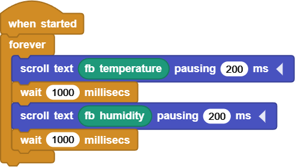
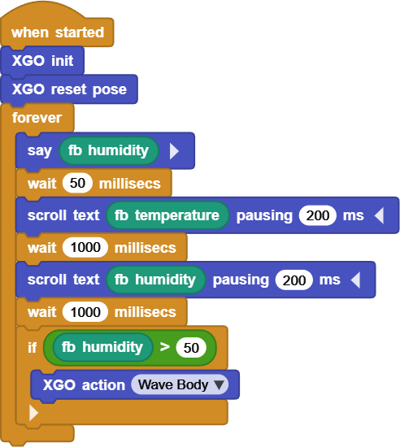

# Project 13 XGO Meteorological Station

## Ⅰ. Teaching Aims

1. Use `fb temperature` / `fb humidity` to obtain the real-time temperature and humidity.
2. Scroll or statically display values on a 5 × 7 LED dot matrix.
3. When the temperature/humidity exceeds the threshold, the built-in action of XGO is performed.
4. Understand temperature unit conversion (℃ ↔ ℉) and digital formatting.

## Ⅱ. Pre-class Check

- XGO + Foxbit + MicroBlocks IDE.
- XGO battery power ≥ 60 %. 
- MicroBlocks status bar shows a green dot, **XGO-lite** extension is loaded and the development board model is **Foxbit**.

## Ⅲ. Key Blocks Analysis

|                  |                |
|------|------|
| **Functions** | Return to ambient temperature (℃) |
| **Tips** | DHT22 resolution is 0.1℃, DHT11 is 1℃ |
|  |  |
|**Functions** | Return to ambient humidity (%) |
|**Tips** | DHT11 ≥ 1s sampling, DHT22 ≥ 0.5s |
| `() * () + ()` |  |
| **Functions** | Temperature unit conversion |
| **Tips** | ℉ = ℃ × 1.8 + 32 |
|  |  |
| **Functions** | Scroll to show the string to the LED dot matrix |
| **Tips** | The smaller the `pausing` is, , the faster the scrolling will be |
| `display text …` |  |
| **Functions** | Static display string |
| **Tips** | Text that is too long will be automatically truncated |
|  |  |
| **Functions** | Built-in body shaking action |
| **Tips** | `Shake`／`Pant`, etc., can be replaced |
| `XGO slide body Z by … mm` |  |
| **Functions** | The body slides up and down (like breathing) |
| **Tips** | Z, positive for up, negative for down |

## Ⅳ. Test 1: LED Scroll Temperature + Humidity

> Scroll “`26 °C 58 %`” once per second.

Online code: **[Click here](https://microblocks.fun/run/microblocks.html#scripts=GP%20Script%0Adepends%20%27Foxbit%27%20%27LED%20Display%27%0A%0Ascript%20554%2068%20%7B%0AwhenStarted%0Aforever%20%7B%0A%20%20scroll_text%20%28foxbit_temperature%29%20200%0A%20%20waitMillis%201000%0A%20%20scroll_text%20%28foxbit_humidity%29%20200%0A%20%20waitMillis%201000%0A%7D%0A%7D%0A%0A)**  

## Ⅴ. Test 2: Action of Humidity Threshold

> Humidity  > 50 % → `Wave Body`  as a reminder

Online code: **[Click here](https://microblocks.fun/run/microblocks.html#scripts=GP%20Script%0Adepends%20%27Foxbit%27%20%27LED%20Display%27%20%27XGO%20Lite%27%0A%0Ascript%20554%2068%20%7B%0AwhenStarted%0Axgo_init%0Axgo_reset_pose%0Aforever%20%7B%0A%20%20sayIt%20%28foxbit_humidity%29%0A%20%20waitMillis%2050%0A%20%20scroll_text%20%28foxbit_temperature%29%20200%0A%20%20waitMillis%201000%0A%20%20scroll_text%20%28foxbit_humidity%29%20200%0A%20%20waitMillis%201000%0A%20%20if%20%28%28foxbit_humidity%29%20%3E%2050%29%20%7B%0A%20%20%20%20xgo_action%20%27Wave%20Body%27%0A%20%20%7D%0A%7D%0A%7D%0A%0A)**  

## Ⅵ. Quiz

1. Double threshold determination: When temperature > 30℃ or humidity > 70%, XGO `Shake`; Otherwise, the `slide body` will “breathe” slightly.
2. Format output: Use the `join` to string `"T:" + fb temperature + " H:" + fb humidity` together and then scroll to display it.
3. Add a buzzer: `play tone 440 Hz 500 ms` when the threshold is reached to make the reminder more obvious.

### Ⅶ. FAQ

| Questions      | Possible causes      | Solutions                               |
|------|----------|----------|
| Temperature  /humidity displays 0.0 | Sampling is too fast  or the sensor is disconnected | `wait ≥ 1000 ms` (DHT11);  Check the P2 interface |
| No scrolling content on LED | Spelling mistake | Confirm that the `scroll text` parameter is a string |
| Actions never stop | The threshold judgment lacks “fallback” | After triggering,  add `wait` or set the lock flag |
| There is a conflict  in the sequence of actions | Both temperature and humidity  exceed the threshold | Set priorities or cooldown  times in the code |

