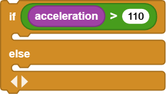
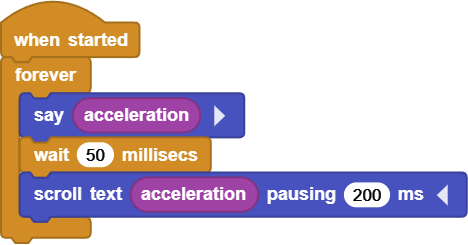
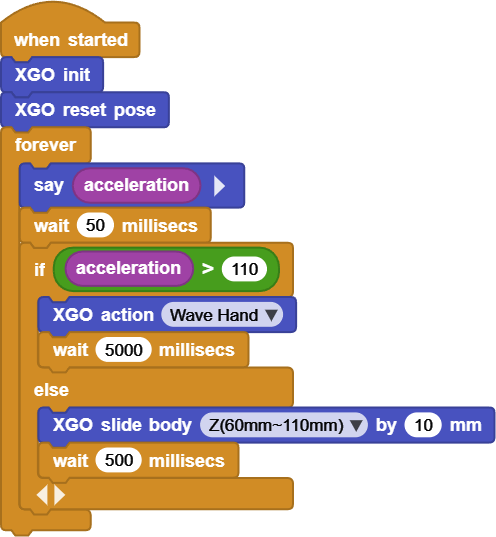

# Project 14  XGO Acceleration

## Ⅰ. Teaching Aims

1. Read the acceleration value of the on-board IMU (unit: mg or %, defined by the firmware).
2. Use a dot matrix to “broadcast” the acceleration in real time.
3. When the acceleration exceeds the threshold, enable XGO to provide built-in action feedback.

## Ⅱ. Pre-class Check

- XGO + Foxbit + MicroBlocks IDE.
- XGO battery power ≥ 60 %. 
- MicroBlocks status bar shows a green dot, **XGO-lite** extension is loaded and the development board model is **Foxbit**.

## Ⅲ. Key Blocks Analysis

|           |                |
|------|----------|
| **Functions** | Output single-axis or composite acceleration |
| **Tips** | The firmware unit may be %(1g≈100) or mg |
|  |  |
| **Functions** | Scroll the string to a 5×7 dot matrix |
| **Tips** | The smaller the `pausing` is, the faster the scrolling speed will be |
|  |  |
| **Functions** | Execute according to the threshold branch |
| **Tips** | `<` and `≥` are also available |
| |  |
|**Functions** | Perform the built-in wave action |
|**Tips** | When it cannot be found, a similar action can be used as a substitute |
|  |  |
| **Functions** | The body slides up and down, just like breathing |
| **Tips** | Z, positive for up, negative for down |

## Ⅳ. Test 1: LED Scroll + Bubble Broadcast

Online code: **[Click here](https://microblocks.fun/run/microblocks.html#scripts=GP%20Script%0Adepends%20%27Basic%20Sensors%27%20%27LED%20Display%27%0A%0Ascript%20554%2068%20%7B%0AwhenStarted%0Aforever%20%7B%0A%20%20sayIt%20%28%27%5Bsensors%3Aacceleration%5D%27%29%0A%20%20waitMillis%2050%0A%20%20scroll_text%20%28%27%5Bsensors%3Aacceleration%5D%27%29%20200%0A%7D%0A%7D%0A%0A)**  

## Ⅴ. Test 2: Action of Threshold

Online code: **[Click here](https://microblocks.fun/run/microblocks.html#scripts=GP%20Script%0Adepends%20%27Basic%20Sensors%27%20%27XGO%20Lite%27%0A%0Ascript%20554%2068%20%7B%0AwhenStarted%0Axgo_init%0Axgo_reset_pose%0Aforever%20%7B%0A%20%20sayIt%20%28%27%5Bsensors%3Aacceleration%5D%27%29%0A%20%20waitMillis%2050%0A%20%20if%20%28%28%27%5Bsensors%3Aacceleration%5D%27%29%20%3E%20110%29%20%7B%0A%20%20%20%20xgo_action%20%27Wave%20Hand%27%0A%20%20%20%20waitMillis%205000%0A%20%20%7D%20else%20%7B%0A%20%20%20%20xgo_slide_body%20%27Z%2860mm~110mm%29%27%2010%0A%20%20%20%20waitMillis%20500%0A%20%20%7D%0A%7D%0A%7D%0A%0A)**  

## Ⅵ. Quiz

1. If the `pausing 100 ms` of Test 1 is changed to `20 ms`, what will be the scrolling effect?
2. What will occur in the action trigger frequency if the threshold is changed from 100 to 140 in Test 2? Why?

3. How to calculate the composite acceleration by `sqrt(accX² + accY² + accZ²)` so that the threshold is independent of direction?

## Ⅶ. FAQ

| Questions          | Possible causes                     | Solutions                 |
|------|----------|----------|
| The value of acceleration remains almost unchanged | No `XGO init` / IMU crash | Restart or first execute `XGO init` |
| No scrolling content on LED | In `scroll text`,  no `acceleration` is put in it | Check the block parameters |
| Only do half of the action | `wait` is too short | Set `wait` ≥ action duration |
| The entire program is lagging | Multiple long `wait` stacks | Replace the blocking `wait` with a timer |
