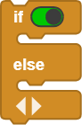
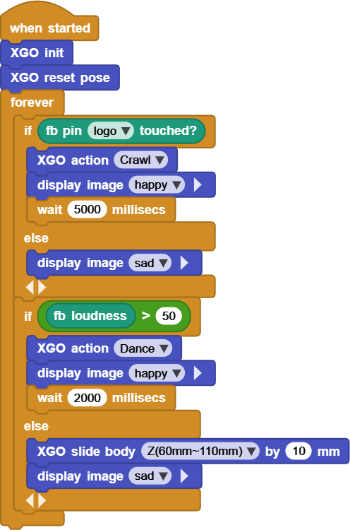

# Project 15 XGO Dance Show

## Ⅰ. Teaching Aims

1. Use both the on-board microphone and capacitive touch (Logo) to achieve dual-channel sensing input.

2. Mapping relationship:

	• Touch → `Crawl` (crawl forward) • Sound → `Dance` (dance)

3. Integrate LED dot matrix “emoji” and buzzer waiting to make the feedback more intuitive.

2. Practice multiple `if / else` and different waiting times, and experience the switching of “action fragments”.

## Ⅱ. Pre-class Check

- XGO + Foxbit + MicroBlocks IDE.
- XGO battery power ≥ 60 %. The desktop is spacious, making it convenient to clap hands and touch during the test.
- MicroBlocks status bar shows a green dot, **XGO-lite** extension is loaded and the development board model is **Foxbit**.

## Ⅲ. Key Blocks Analysis

|         |                       |
|------|------|
| **Functions** | Detect Logo touch (Boolean) |
| **Tips** | When it is true, directly enter `if` |
|  |  |
| **Functions** | Return ambient sound pressure (0-100 or 0-255) |
| **Tips** | It is recommended to first measure values by `print` |
|  |  |
| **Functions** | LED dot matrix preset emojis |
| **Tips** | happy😊, sad😞, heart❤️ … |
| `scroll text … pausing … `  |  |
| **Functions** | Scroll text |
| **Tips** | The smaller the `pausing` is,  the faster the scrolling speed will be |
| |  |
|**Functions** | Logic branch |
|**Tips** | It can be nested multiple ones |
| |  |
|**Functions** | Pause before the action and text are completed |
|**Tips** | It is suggested to change it to a variable  for easier parameter adjustment |
|  |  |
| **Functions** | Crawl forward |
| **Tips** | If you cannot find it in the list, try Crawl1 |
| |  |
|**Functions** | Dance in place |
|**Tips** | If the firmware is different, it might be called Dance1 |
|  |                                                              |
| **Functions** | The body slides up and down |
| **Tips** | Positive for up and negative for down,  doing a “tail swing” |
| `play tone … Hz … ms` |  |
| **Functions** | Buzzer sounds |
| **Tips** | 440Hz 500ms is standard A |

## Ⅳ. Test (Complete Code)

Online code: **[Click here](https://microblocks.fun/run/microblocks.html#scripts=GP%20Script%0Adepends%20%27Foxbit%27%20%27LED%20Display%27%20%27XGO%20Lite%27%0A%0Ascript%20554%2068%20%7B%0AwhenStarted%0Axgo_init%0Axgo_reset_pose%0Aforever%20%7B%0A%20%20if%20%28foxbit_isTouched%20%27logo%27%29%20%7B%0A%20%20%20%20xgo_action%20%27Crawl%27%0A%20%20%20%20led_displayImage%20%27happy%27%0A%20%20%20%20waitMillis%205000%0A%20%20%7D%20else%20%7B%0A%20%20%20%20led_displayImage%20%27sad%27%0A%20%20%7D%0A%20%20if%20%28%28foxbit_loudness%29%20%3E%2050%29%20%7B%0A%20%20%20%20xgo_action%20%27Dance%27%0A%20%20%20%20led_displayImage%20%27happy%27%0A%20%20%20%20waitMillis%202000%0A%20%20%7D%20else%20%7B%0A%20%20%20%20xgo_slide_body%20%27Z%2860mm~110mm%29%27%2010%0A%20%20%20%20led_displayImage%20%27sad%27%0A%20%20%7D%0A%7D%0A%7D%0A%0A)**  

## Ⅴ. Variant Practice

1. Change `wait 5000 ms` and `wait 2000 ms` to variables `touchDelay` / `soundDelay`, and define them at once at the top for convenient parameter adjustment in the future.
2. Change the sound threshold to 60 and print the current sound pressure `print fb loudness` in the `else` branch, so as to find a threshold that is more suitable for your classroom.
3. Replace the “sad emoji” with the  `scroll text "COME ON"`, and guide the interaction among classmates.
4. No applause? Let’s change “slide body up” to “slide body down” (`slide body Z by -10 mm`) and use the 😴 emoji to inject a note of humor.

## Ⅵ. FAQ

| Questions | Possible causes | Solutions |
|------|----------|----------|
| The touch is not sensitive | Dry finger / Poor grounding | Press the Logo for 2 s;  touch the metal to “power on” the human body |
| The sound threshold is difficult to reach | Noisy environment | Raise the threshold to 65-70;  Or shorten the microphone sampling window |
| `Crawl` / `Dance` blocks are missing | Firmware version differences | Look for synonymous blocks in the action panel,  such as `XGO action Crawl1` |
| LED emojis flash | The loop is too fast, resulting in repeated refreshing | Before entering the same state,  detect the current emoji first,  or update only when the state changes |
