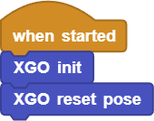
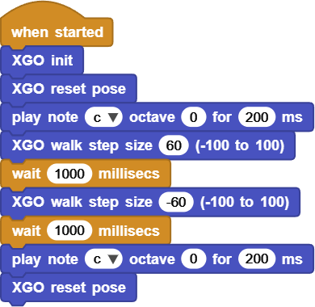
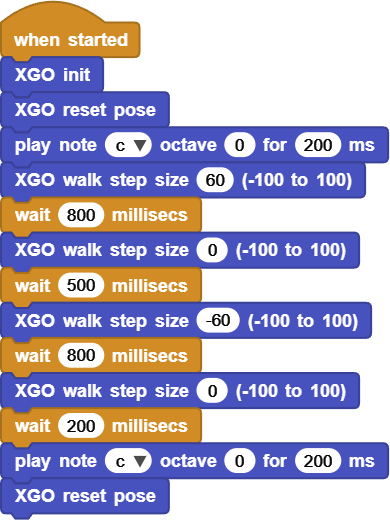

# Project 2 XGO’s First Step

## Ⅰ. Teaching Aims

1. Master the positive/negative values of `XGO walk step size` and their relationship with the direction of travel and speed.
2. Use  `wait … ms` to control the duration of one gait.
3. Write the minimum walking script of “forward - pause - backward” and add a beeping prompt sound.

## Ⅱ. Pre-class Check

- XGO + Foxbit + MicroBlocks IDE.
- XGO battery power ≥ 60 %. 
- The ground/desktop is flat, and the straight path is no less than 60 cm.
- MicroBlocks status bar shows a green dot, and the development board model is **Foxbit**.
- Run `XGO init` and `XGO reset pose` to confirm that everything is normal.

## Ⅲ. Key Blocks Analysis

|  |             |
|------|------|
| **Functions** | Keep walking and set the step size |
| **Value range** | −100 ~ 100; Positive for forwards, negative for backwards |
| **Fallible points** | 0 → not move |
|  |  |
| **Functions** | Pause the script to maintain the current gait |
| **Value range** | ms; 1000 ms = 1 s |
| **Fallible points** | Treat milliseconds as seconds |
|  |                         |
| **Functions** | The buzzer plays notes |
| **Value range** | Note C4–B6；ms > 0 |
| **Fallible points** | Forget the duration → Long beeping |

## Ⅳ. Test 1: Minimum Walking Script

1. Retain the first three lines of initialization:

   

2. Add 4 instructions in sequence:  

   

3. Click ▶Run and the XGO will perform “Forward - beep - Backward - beep”.

Online code: **[Click here](https://microblocks.fun/run/microblocks.html#scripts=GP%20Script%0Adepends%20%27Tone%27%20%27XGO%20Lite%27%0A%0Ascript%20446%2068%20%7B%0AwhenStarted%0Axgo_init%0Axgo_reset_pose%0A%27play%20tone%27%20%27nt%3Bc%27%200%20200%0Axgo_walk%2060%0AwaitMillis%201000%0Axgo_walk%20-60%0AwaitMillis%201000%0A%27play%20tone%27%20%27nt%3Bc%27%200%20200%0Axgo_reset_pose%0A%7D%0A%0A)**  

## Ⅴ. Test 2: Start/Stop Beeping+ Walking

Requirement:

1. Play `C5` once at the beginning and once at the end of the action.
2. The walking sequence is “forward → stop → backward → stop”.

Reference script:

Online code: **[Click here](https://microblocks.fun/run/microblocks.html#scripts=GP%20Script%0Adepends%20%27Tone%27%20%27XGO%20Lite%27%0A%0Ascript%20554%2068%20%7B%0AwhenStarted%0Axgo_init%0Axgo_reset_pose%0A%27play%20tone%27%20%27nt%3Bc%27%200%20200%0Axgo_walk%2060%0AwaitMillis%20800%0Axgo_walk%200%0AwaitMillis%20500%0Axgo_walk%20-60%0AwaitMillis%20800%0Axgo_walk%200%0AwaitMillis%20200%0A%27play%20tone%27%20%27nt%3Bc%27%200%20200%0Axgo_reset_pose%0A%7D%0A%0A)**  

## Ⅵ. Quiz

1. Why does `walk step size` remain in effect until the next walk instruction appears?
2. What will happen if we change `wait` to 100 ms? Try to find the minimum available waiting value.
3. If you want XGO to make a “woof” sound (buzzer) while moving, where should the `play tone` be inserted?

## Ⅶ. FAQ

| Questions      | Possible causes    | Solutions              |
|------|----------|----------|
| Only move forward,  never backward | Forgot to write negative step size | Check the script sequence |
| Shake/slip while walking | Excessive step size or slippery ground | Reduce the step size;  Pad with cardboard |
| No sound in the buzzer | The channel is occupied  or the volume is 0 | Restart the IDE;  Check the volume slider |
| Be imbalance while walking | Voltage drop | Pause the test and charge it |

