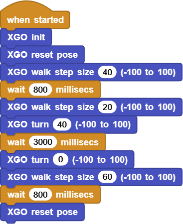
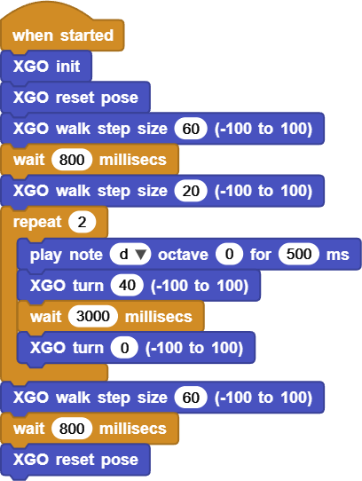

# Project 3 A Graceful Turn of XGO

## Ⅰ. Teaching Aims

1. Use `XGO turn`  to control left and right turning and understand positive and negative directions.
2. Use “multiple small angles + waiting” to form any rotation angle.
3. Reduce your step size before turning to enhance stability.
4. Complete a 180° U-turn and then resume movement.

## Ⅱ. Pre-class Check

- XGO + Foxbit + MicroBlocks IDE.
- XGO battery power ≥ 60 %. 
- MicroBlocks status bar shows a green dot, and the development board model is **Foxbit**.
- Test `XGO init` and `XGO reset pose`.
- Leave at least 40 cm of space around the desktop to prevent drops.

## Ⅲ. Key Blocks Analysis

|  |  |
|------|-----------|
| **Value range** | −100 ~ 100 |
| **Functions** | Set the “Yaw Angle speed per step” and keep it in effect |
| **Common misuses** | Forget to zero out→ it keeps spinning |
|  |  |
| **Value range** | −100 ~ 100 |
| **Functions** | Forward/backward step size |
| **Common misuses** | Still take large step size when turning |
|  |  |
| **Value range** | ≥ 0 ms |
| **Functions** | Maintain the time of the previous instruction |
| **Common misuses** | Write 100 as 1000 → an overly large angle |

Direction rule: Turn left when `n > 0`, turn right when `n < 0`.

## Ⅳ. Test 1: 90° Smooth Left Turn

Complete script:

Click ▶Run, and you will see the dog slows down first and makes a smooth left turn of about 90°, and then it goes straight.

Online code: **[Click here](https://microblocks.fun/run/microblocks.html#scripts=GP%20Script%0Adepends%20%27XGO%20Lite%27%0A%0Ascript%20554%2068%20%7B%0AwhenStarted%0Axgo_init%0Axgo_reset_pose%0Axgo_walk%2040%0AwaitMillis%20800%0Axgo_walk%2020%0Axgo_turn%2040%0AwaitMillis%203000%0Axgo_turn%200%0Axgo_walk%2060%0AwaitMillis%20800%0Axgo_reset_pose%0A%7D%0A%0A)**  

## Ⅴ. Test 2: 180° Smooth U-turn

Requirements: Walk → Slow down → turn left 90°×2 → Resume walking → Reset.

Sample (Fine-tune the waiting time according to the actual rotational speed):

Bonus point: After the U-turn is completed, `display image happy`.

Online code: **[Click here](https://microblocks.fun/run/microblocks.html#scripts=GP%20Script%0Adepends%20%27Tone%27%20%27XGO%20Lite%27%0A%0Ascript%20554%2068%20%7B%0AwhenStarted%0Axgo_init%0Axgo_reset_pose%0Axgo_walk%2060%0AwaitMillis%20800%0Axgo_walk%2020%0Arepeat%202%20%7B%0A%20%20%27play%20tone%27%20%27nt%3Bd%27%200%20500%0A%20%20xgo_turn%2040%0A%20%20waitMillis%203000%0A%20%20xgo_turn%200%0A%7D%0Axgo_walk%2060%0AwaitMillis%20800%0Axgo_reset_pose%0A%7D%0A%0Ahttps://microblocks.fun/run/microblocks.html#scripts=GP%20Script%0Adepends%20%27LED%20Display%27%0A%0Ascript%20554%20514%20%7B%0Aled_displayImage%20%27happy%27%0A%7D%0A%0A)**  

## Ⅵ. Quiz

1. Why is it prone to rollover if we directly set it `turn 100` and `wait 400`?
2. What is the difference between `XGO turn 0` and `XGO walk step size 0`?  
3. How to change “turn n×90°” into a custom Block?

## Ⅶ. FAQ

| Questions      | Possible causes       | Solutions           |
|------|----------|----------|
| There is no rotation  or the angle is insufficient | `wait` is too short  / step size has not been reduced | Extend the waiting time  or reduce the step size |
| Keep going around in circles | Forgot `turn 0` | Reset immediately after turning |
| Slip when turning | Slippery ground  / excessive step size | Put on an anti-slip mat;  Set the step size < 30 |
| Large deviation in U-turn | Single large-angle control | Change to multiple small-angle cumulative control |

