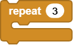

# Project 4 XGO Wave Hand

## Ⅰ. Teaching Aims

1. Recognize the three joints of **Upper / Middle / Lower**, and focus on the combined control of Middle and Lower.
2. While sitting, wave the claw three times by `repeat`.
3. After the action is completed, play a beeping sound as multimodal feedback.
4. Understand the importance of  `XGO reset pose` for clearing cumulative errors.

## Ⅱ. Pre-class Check

- XGO + Foxbit + MicroBlocks IDE.
- XGO battery power ≥ 60 %. 
- MicroBlocks status bar shows a green dot, and the development board model is **Foxbit**.
- Test `XGO init` and `XGO reset pose`.
- Leave a gap in front of the desktop to prevent the claw from hitting objects.

## Ⅲ. Key Blocks Analysis

|   |                                                              |
|------|------|
| **Functions**                           | Make the dog sit steadily                                    |
| **Tips**                                | It's safer to sit firmly before waving claw                  |
|  |                                                              |
| **Functions**                           | The front paws swing back and forth                          |
| **Parameter sample**                    | 30 / −30 / 0                                                 |
| **Tips**                                | angle > 0 ＝ Wave forward                                    |
|  |                                                              |
| **Functions**                           | Flexion and extension of the wrist                           |
| **Parameter sample**                    | 10 / 0                                                       |
| **Tips**                                | Change posture in coordination with Middle                   |
|  |                                                              |
| **Functions**                           | The sequence of circular claw swings                         |
| **Parameter sample**                    | 3 times                                                      |
| **Tips**                                | At the end of the loop,  be sure to return to the original position |
|  |                                                              |
| **Functions**                           | Give the servo time to be in place                           |
| **Parameter sample**                    | 500 ms                                                       |
| **Tips**                                | delay ≥ 300 ms for clearer movement                          |
| `play tone Note ms`                     |                                                              |
| **Functions**                           | Beeping sound                                                |
| **Parameter sample**                    | G5 120 ms                                                    |
| **Tips**                                | Put it after the loop                                        |

## Ⅳ. Test: Waving While Sitting

1. Drag in the initialization block: `when started → XGO init → XGO reset pose → XGO action Sit Down`  
2. Piece the main action logic as shown:

   

3. Click ▶Run, and the dog will “wave while sitting × 3” and then reset.

Online code: **[Click here](https://microblocks.fun/run/microblocks.html#scripts=GP%20Script%0Adepends%20%27XGO%20Lite%27%0A%0Ascript%20554%2068%20%7B%0AwhenStarted%0Axgo_init%0Axgo_reset_pose%0Axgo_action%20%27Sit%20Down%27%0Arepeat%203%20%7B%0A%20%20xgo_set_leg_joint%20%27Right%20Front%27%20%27Middle%28-70%C2%B0~90%C2%B0%29%27%2030%0A%20%20waitMillis%20500%0A%20%20xgo_set_leg_joint%20%27Right%20Front%27%20%27Lower%28-85%C2%B0~50%C2%B0%29%27%2010%0A%20%20xgo_set_leg_joint%20%27Right%20Front%27%20%27Middle%28-70%C2%B0~90%C2%B0%29%27%20-30%0A%20%20waitMillis%20500%0A%20%20xgo_set_leg_joint%20%27Right%20Front%27%20%27Middle%28-70%C2%B0~90%C2%B0%29%27%200%0A%7D%0Axgo_reset_pose%0A%7D%0A%0A)**  

## Ⅴ. Quiz

1. Why must `Sit Down` first and then wave the claw?
2. What will happen if the Lower joint is not reset to 0° and this cycle is repeated many times?
3. How to change “wave once” into a `waveOnce()` custom Block, and then call it by `repeat`?

## Ⅵ. FAQ

| Questions          | Possible causes               | Solutions                     |
|------|----------|----------|
| Sit down but do not wave | `repeat` is empty or omits joint instructions inside | Check the loop content |
| The amplitude is too small | Middle° is too low | Set up to 25–35° |
| “wrist” is not bent | Lower° = 0° | set 8–12° |
| The servo is shaking/screaming | The angle exceeds the limit or touches the table | Reduce the angle and remove the obstacle |
| The second and third movements are deformed | There is a lack of reset within the loop | After each waving, set Middle, Lower = 0° |
| The program ends in a strange posture | Forgot `XGO reset pose` | Add it before the end |

