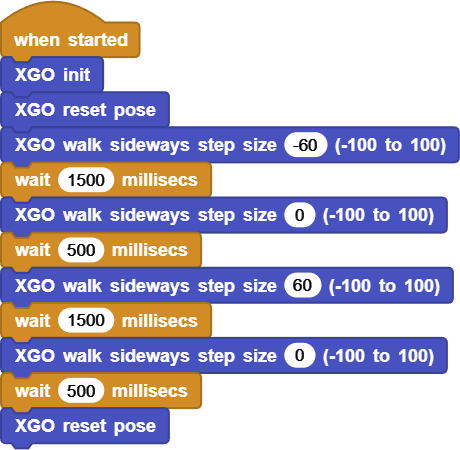

# Project 5 Domineering XGO

## Ⅰ. Teaching Aims

1. Master the positive and negative directions of the `XGO walk sideways step size`: positive for shift right, negative for shift left.
2. Understand the influence of lateral step size on displacement distance and thigh swing.
3. Write the basic side-shift script of “left shift - stop - right shift - stop”, and achieve the target shift by adjusting the waiting time.
4. Use `XGO reset pose` and small step to correct yaw to ensure a straight lateral step.

## Ⅱ. Pre-class Check

- XGO + Foxbit + MicroBlocks IDE.
- XGO battery power ≥ 60 %. The desktop width ≥ 80 cm, with no obstructions on either side. Place soft pads at the end of the path to prevent collisions.
- MicroBlocks status bar shows a green dot, **XGO-lite** extension is loaded and the development board model is **Foxbit**.
- Test `XGO init` and `XGO reset pose`.
- Click `XGO reset pose` once to maintain the standing position horizontally.

## Ⅲ. Key Blocks Analysis

|  |  |
|------|-----------|
|**Value range** | Positive → right shift, negative → left shift |
|**Function** | Set the lateral step size and keep it in effect |
|**Common misuses** | Excessive step size → slipping or rollover |
|  |  |
| **Value range** | ≥ 300 ms |
| **Function** | Maintain the current gait |
| **Common misuses** | Too small → Only shake without displacement |
|  |  |
| **Function** | Clear the accumulated errors  and restore the correct posture |
| **Common misuses** | Forget to use → Yaw in long-distance lateral step |

## Ⅳ. Test: Basic Shift Script

1. Initialization: `when started → XGO init → XGO reset pose`  
2. Piece the entire script according to the picture:

   

3. Click ▶Run, and the dog will move left for 1.5s → stop for 0.5s → move right for 1.5s → stop for 0.5s, and then it ends with `reset pose`.

Online code: **[Click here](https://microblocks.fun/run/microblocks.html#scripts=GP%20Script%0Adepends%20%27XGO%20Lite%27%0A%0Ascript%20554%2068%20%7B%0AwhenStarted%0Axgo_init%0Axgo_reset_pose%0Axgo_walk_sideways%20-60%0AwaitMillis%201500%0Axgo_walk_sideways%200%0AwaitMillis%20500%0Axgo_walk_sideways%2060%0AwaitMillis%201500%0Axgo_walk_sideways%200%0AwaitMillis%20500%0Axgo_reset_pose%0A%7D%0A%0A)**  

## Ⅴ. Quiz

1. Why are lateral steps more sensitive to changes in waiting time?
2.  If its nose gradually leans forward during the left-shift, how should the script be corrected?
3. How can lateral steps and forward steps be combined into an “L-shaped” path?

## Ⅵ. FAQ

| Questions      | Possible causes     | Solutions                             |
|------|----------|----------|
| Shake but stay in the place | The step size is too small or the waiting time is too short | step size ≥ 20, waiting time ≥ 600 ms |
| Obviously slippery | The step size is 100 and the ground is slippery | step size ≤ 70; Lay rough pads |
| The body rotates in lateral steps | Uneven friction / missed reset | Insert `reset pose` every 2 seconds or reduce step size |
| Continue gliding after stopping | Insufficient waiting time | Gradually reduce the step size to 0 before stopping |
| Overheating servo | Long time of large step size | Take a one-minute break every 30 seconds; Set a medium step size |

