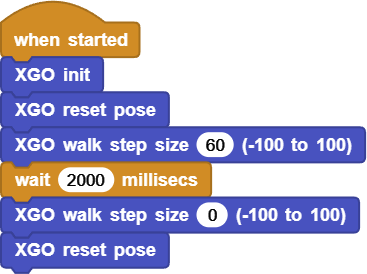
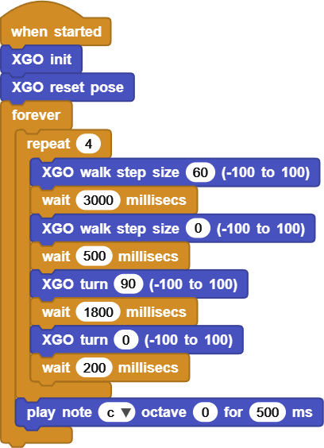

# Project 6 XGO Draws A Square

## Ⅰ. Teaching Aims

1. Consolidate the segmentation thinking of “walk - stop - turn - stop” and avoid taking arcs.
2. Use `repeat` to simplify the repeated path.
3. Adjust the step size and waiting time through distance measurement, making the displacement more accurate.
4. Use the `forever` infinite loop to perform square movements.

## Ⅱ. Pre-class Check

- XGO + Foxbit + MicroBlocks IDE.
- Prepare an 80 cm × 80 cm blank floor and stick positioning points at the four corners with tape.
- XGO battery power ≥ 60 %. 
- MicroBlocks status bar shows a green dot, **XGO-lite** extension is loaded and the development board model is **Foxbit**.
- If precise distance measurement is required, prepare a tape measure or stick a scale paper tape on the ground.

## Ⅲ. Key Blocks Analysis

|  |  |
|------|------------|
|**Functions**  | `n ∈ [−100, 100]`;  positive for forward,  negative for backward |
|**Common misuses** | The walking section still gives `turn` → Take an arc |
|  |  |
| **Functions** | Maintain the previous instruction for *ms* milliseconds |
| **Common misuses** | Write milliseconds as seconds → Wait too short |
|  |  |
| **Functions** | `n ∈ [−100, 100]`;  positive for left, negative for right;  additional `wait` is required |
| **Common misuses** | Forgot `turn 0` to zero out |
|  |  |
| **Functions** | Loop the code block *k* times |
| **Common misuses** | Forgot to write `wait` in the loop |
|  |  |
| **Functions** | Forever loop |

## Ⅳ. Calculation of Step Size and Distance

Hard ground, 6.0V experience value:

| Step size | 1000 ms Forward distance |
|------|-----------------|
| 40   | ≈ 12 cm |
| 60   | ≈ 15 cm |
| 80   | ≈ 19 cm |

Calculation:

`Waiting time(ms) ≈ Target distance(cm) ÷ (distance each 1000 ms) × 1000`

Example: target distance is 30 cm, so we use a step size of 60 → `30 ÷ 15 × 1000 ≈ 2000 ms`

## Ⅴ. Test 1: 30cm Straight Line

Click ▶Run, and then measure the displacement with a ruler; If the deviation is greater than 3 cm, fine-tune and wait for ±100 ms.

Online code: **[Click here](https://microblocks.fun/run/microblocks.html#scripts=GP%20Script%0Adepends%20%27XGO%20Lite%27%0A%0Ascript%20554%2074%20%7B%0AwhenStarted%0Axgo_init%0Axgo_reset_pose%0Axgo_walk%2060%0AwaitMillis%202000%0Axgo_walk%200%0Axgo_reset_pose%0A%7D%0A%0A)**  

## Ⅵ. Test 2: Square Route

1. Requirement: Walk 30 cm → turn right at 90° → repeat 4 times, and finally return to the starting point.
2. Recommended:
   - Go straight: `walk 60` + `wait 3000`  
   - Stop: `walk 0` + `wait 500`  
   - Turn: `turn 90` + `wait 1800` （≈ 90°）  
   - Zero out: `turn 0` + `wait 200`  

Loop script sample:

Online code: **[Click here](https://microblocks.fun/run/microblocks.html#scripts=GP%20Script%0Adepends%20%27Tone%27%20%27XGO%20Lite%27%0A%0Ascript%20554%2074%20%7B%0AwhenStarted%0Axgo_init%0Axgo_reset_pose%0Aforever%20%7B%0A%20%20repeat%204%20%7B%0A%20%20%20%20xgo_walk%2060%0A%20%20%20%20waitMillis%203000%0A%20%20%20%20xgo_walk%200%0A%20%20%20%20waitMillis%20500%0A%20%20%20%20xgo_turn%2090%0A%20%20%20%20waitMillis%201800%0A%20%20%20%20xgo_turn%200%0A%20%20%20%20waitMillis%20200%0A%20%20%7D%0A%20%20%27play%20tone%27%20%27nt%3Bc%27%200%20500%0A%7D%0A%7D%0A%0A)**  

Debugging tips:

- The turning angle is	 • too small → `wait` +50~100 ms • too large → `wait` −50 ms
- The route is trapezoidal → Reduce the step size to 50, and ensure the ground is flat.

## Ⅶ. Quiz

1. Why is it necessary to `walk 0` before starting the `turn` after the straight section ends?
2. If we modify it to turn left and draw a counter-clockwise square, which two parts of the script should be changed?
3. How to package “step size, distance, angle” with custom blocks to improve reusability?

## Ⅷ. FAQ

| Questions       | Possible causes     | Solutions                |
|------|----------|----------|
| Walk in an arc line | Still set `turn` in the walking section | Section: Reset to zero after walking and then turn |
| The turning angle is too small / too large | `wait` is mismatching | Fine-tune in steps of 50 ms |
| It's still rotating after turning | Forgot `turn 0` | Reset to zero immediately after the turn |
| Cannot return to the starting point | The accumulation of errors in walking distance | Slow the speed down, increase friction, or recalibrate |

