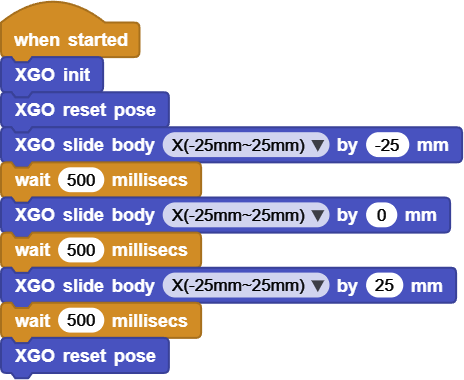
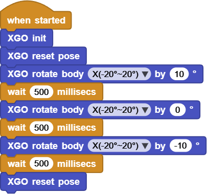
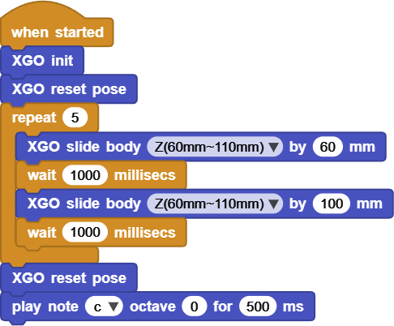

# Project 7 XGO Does Gymnastics

## Ⅰ. Teaching Aims

1. Understand the six-degree-of-freedom spatial posture of XGO (X, Y, Z translation + Pitch, Roll, Yaw rotation).
2. Master the instructions of **slide body** and **rotate body** and their positive and negative directions.
3. Learn to control “forward and backward displacement”, “left and right displacement” and “up and down push-ups” respectively through three independent examples.
4. Use `XGO reset pose` to eliminate cumulative errors and ensure a return-to-zero position after the action.

## Ⅱ. Pre-class Check

- XGO + Foxbit + MicroBlocks IDE.
- XGO battery power ≥ 60 %. The robot stands in the center of a flat table, with a space of no less than 20 cm around it.
- MicroBlocks status bar shows a green dot, **XGO-lite** extension is loaded and the development board model is **Foxbit**.
- Manually run `XGO reset pose` once to confirm the zero position.

## Ⅲ. Key Blocks Analysis

|  |  |
|------|------|
| **Functions**                           | forward and backward displacement |
| **Value range**                         | −25 ~ +25                         |
| **“+” Direction**                       | Forward                           |
|  |                                   |
| **Functions**                           | left and right displacement       |
| **Value range**                         | −25 ~ +25                         |
| **“+” Direction**                       | Left                              |
|  |                                   |
| **Functions**                           | up and down push-ups              |
| **Value range**                         | −25 ~ +45                         |
| **“+” Direction**                       | Up                                |
|    |                                   |
| **Functions**                           | Head down and head up (Pitch)     |
| **Value range**                         | −20 ~ +20                         |
| **“+” Direction**                       | Head up                           |

**Formulas**:

• slide X “+ forward − backward”

• slide Y “+ left − right”

• slide Z “+ up − down”

• rotate X “+ head up − head down”

## Ⅳ. Practice (Independent Operation)

Each section includes initialization, action, waiting, and reset.

### Test 1: Forward/Backward Displacement (slide body X)

Online code: **[Click here](https://microblocks.fun/run/microblocks.html#scripts=GP%20Script%0Adepends%20%27XGO%20Lite%27%0A%0Ascript%20554%2068%20%7B%0AwhenStarted%0Axgo_init%0Axgo_reset_pose%0Axgo_slide_body%20%27X%28-25mm~25mm%29%27%20-25%0AwaitMillis%20500%0Axgo_slide_body%20%27X%28-25mm~25mm%29%27%200%0AwaitMillis%20500%0Axgo_slide_body%20%27X%28-25mm~25mm%29%27%2025%0AwaitMillis%20500%0Axgo_reset_pose%0A%7D%0A%0A)**  

### Test 2: Left/Right Displacement (rotate body x)

Online code: **[Click here](https://microblocks.fun/run/microblocks.html#scripts=GP%20Script%0Adepends%20%27XGO%20Lite%27%0A%0Ascript%20554%2074%20%7B%0AwhenStarted%0Axgo_init%0Axgo_reset_pose%0Axgo_rotate_body%20%27X%28-20%C2%B0~20%C2%B0%29%27%2010%0AwaitMillis%20500%0Axgo_rotate_body%20%27X%28-20%C2%B0~20%C2%B0%29%27%200%0AwaitMillis%20500%0Axgo_rotate_body%20%27X%28-20%C2%B0~20%C2%B0%29%27%20-10%0AwaitMillis%20500%0Axgo_reset_pose%0A%7D%0A%0A)**  

### Test 3: Dog Push-ups

Debugging tips:
- If the dog sinks too much in a push-up, it will slip. → Adjust `100` to `60`.
- The speed is too fast to see clearly → Change the two `wait` to `1000 ms`.

Online code: **[Click here](https://microblocks.fun/run/microblocks.html#scripts=GP%20Script%0Adepends%20%27Tone%27%20%27XGO%20Lite%27%0A%0Ascript%20554%2068%20%7B%0AwhenStarted%0Axgo_init%0Axgo_reset_pose%0Arepeat%205%20%7B%0A%20%20xgo_slide_body%20%27Z%2860mm~110mm%29%27%2060%0A%20%20waitMillis%201000%0A%20%20xgo_slide_body%20%27Z%2860mm~110mm%29%27%20100%0A%20%20waitMillis%201000%0A%7D%0Axgo_reset_pose%0A%27play%20tone%27%20%27nt%3Bc%27%200%20500%0A%7D%0A%0A)**  

## Ⅴ. FAQ

| Questions  | Possible causes        | Solutions                                  |
|------|----------|----------|
| The movement is not obvious. | The parameter is too small / `wait` is too short | slide ≥ 6 mm，rotate ≥ 8°；`wait` ≥ 300 ms |
| The front feet are raised | The Pitch is large, but Z has not sunk | Sink synchronously by 5–10 mm to balance the center of gravity |
| The servo is screaming. | Maintain an extreme posture for a long time | Shorten the waiting time and `reset pose` immediately after the action |

