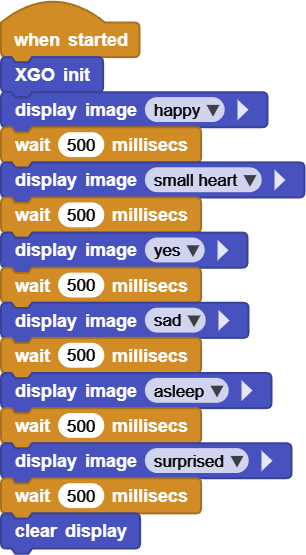
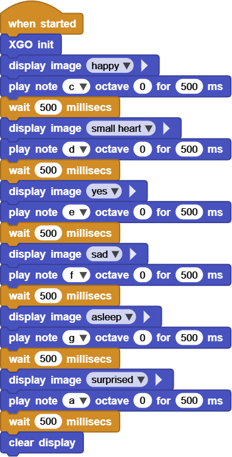

# Project 8 XGO Emoji Show

## Ⅰ. Teaching Aims

1. Invoke the built-in LED dot matrix emoji of Foxbit and control the switching rhythm.
2. Use the buzzer `play note` to play a single sound and add sound effects to the emojis.
3. Without using **loop** statements, present the “emoji + sound” in sequence.

## Ⅱ. Pre-class Check

- XGO + Foxbit + MicroBlocks IDE.
- XGO battery power ≥ 60 %. The robot is placed on a stable table.
- MicroBlocks status bar shows a green dot, **XGO-lite** extension is loaded and the development board model is **Foxbit**.
- First, run `play note "C4" 300` to confirm that the buzzer sounds normally.

## Ⅲ. Key Blocks Analysis

| **** |  |
|------|------|
| **Functions** | 5 × 7 dot matrix display preset expressions |
| **Common misuses** | Spell it as `display expression` → Report an error |
| |  |
|**Functions** | The buzzer plays a single tone |
|**Common misuses** | note is blank or the duration is 0 → silent |
|  |  |
| **Functions** | Maintain the current emoji or note |
| **Common misuses** | `<200 ms` , emojis are hard to distinguish |
|  |  |
| **Functions** | Tuzrn off the LED dot matrix |
| **Common misuses** | Omit this → The LED remains on constantly |

## Ⅳ. Test 1: Emoji

1. Drag `when started → XGO init` to initialize.
2. Copy the following script to MicroBlocks (without any loop statements):

After running, the 6 emojis are displayed in sequence, each frame for 500 ms, and `clear display` at the end.

Online code: **[Click here](https://microblocks.fun/run/microblocks.html#scripts=GP%20Script%0Adepends%20%27LED%20Display%27%20%27XGO%20Lite%27%0A%0Ascript%20554%2068%20%7B%0AwhenStarted%0Axgo_init%0Aled_displayImage%20%27happy%27%0AwaitMillis%20500%0Aled_displayImage%20%27small%20heart%27%0AwaitMillis%20500%0Aled_displayImage%20%27yes%27%0AwaitMillis%20500%0Aled_displayImage%20%27sad%27%0AwaitMillis%20500%0Aled_displayImage%20%27asleep%27%0AwaitMillis%20500%0Aled_displayImage%20%27surprised%27%0AwaitMillis%20500%0A%27%5Bdisplay%3AmbDisplayOff%5D%27%0A%7D%0A%0A)**  

## Ⅴ. Test 2: Emoji + Sound

Based on Test 1, add a note to each frame of emoji:

Every time an emoji is changed, the corresponding note is played immediately to form a “music-emoji show”.

Online code: **[Click here](https://microblocks.fun/run/microblocks.html#scripts=GP%20Script%0Adepends%20%27LED%20Display%27%20%27Tone%27%20%27XGO%20Lite%27%0A%0Ascript%20554%2078%20%7B%0AwhenStarted%0Axgo_init%0Aled_displayImage%20%27happy%27%0A%27play%20tone%27%20%27nt%3Bc%27%200%20500%0AwaitMillis%20500%0Aled_displayImage%20%27small%20heart%27%0A%27play%20tone%27%20%27nt%3Bd%27%200%20500%0AwaitMillis%20500%0Aled_displayImage%20%27yes%27%0A%27play%20tone%27%20%27nt%3Be%27%200%20500%0AwaitMillis%20500%0Aled_displayImage%20%27sad%27%0A%27play%20tone%27%20%27nt%3Bf%27%200%20500%0AwaitMillis%20500%0Aled_displayImage%20%27asleep%27%0A%27play%20tone%27%20%27nt%3Bg%27%200%20500%0AwaitMillis%20500%0Aled_displayImage%20%27surprised%27%0A%27play%20tone%27%20%27nt%3Ba%27%200%20500%0AwaitMillis%20500%0A%27%5Bdisplay%3AmbDisplayOff%5D%27%0A%7D%0A%0A)**  

## Ⅵ. Quiz

1. Why does `display image` have to be redone at each step in the action instead of just writing it once?
2. If you want the entire show to repeat three times, would using `repeat` be more concise than copying the code?
3. What other “accessory” can be added to it, such as the long sound of the buzzer, the rotation of the body, the flashing of the LED, etc.?

## Ⅶ. FAQ

| Questions    | Possible causes              | Solutions                          |
|------|----------|----------|
| No sound | note is misspelled or duration is 0 | Use capital note names `"G4"`,  with a duration of ≥ 100 ms |
| Emoji does not change | `display image` was misspelled  or omitted | Write one valid instruction for each frame |
| Emoji displays too fast | `wait` is too short | It is recommended that the single frame be ≥ 200 ms |
| LED is always on | Omit `clear display                       | Add `clear display` at the end of the script               ||
| The buzzer is distorted | note frequency is too fast | Select notes within C4 to C6 |

