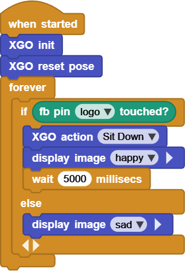
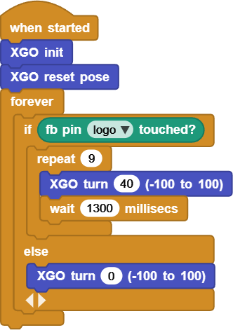

# Project 9 Pet the XGO

## Ⅰ. Teaching Aims

1. Read the status of the top touch pin **A0** (Foxbit logo) to understand the principle of “capacitive touch”.
2. Avoid misjudgment through the process of “trigger → anti-shake → re-detection”.
3. Utilize `if / else` to respond to touch events in real time within the `forever` loop.
4. Be able to quickly replace the “actions after being touched” as needed, such as sitting down, turnning in circles, and performing randomly.

## Ⅱ. Pre-class Check

- XGO + Foxbit + MicroBlocks IDE.
- XGO battery power ≥ 60 %. The robot is placed in the center of a flat ground.
- The copper foil on the top of its head is clean and free of oil stains. The wiring cable is firmly connected.
- MicroBlocks status bar shows a green dot, **XGO-lite** extension is loaded and the development board model is **Foxbit**.
- Run `XGO reset pose` to confirm that the zero position is OK.

## Ⅲ. Key Blocks Analysis

|  |  |
|------|---------------|
| **Return value / Functions** | `true / false` detects wheter it is touched |
| **Fallible points** | Wrong pin → always `false` |
|  |  |
| **Return value / Functions** | Perform different actions according to touching results |
| **Fallible points** | Forgot `else` → No touch, no movement |
|  |  |
| **Return value / Functions** | The action to be done after touching |
|  |  |
| **Return value / Functions** | The action to be done after touching |

## Ⅳ. Practice

The following two scripts demonstrate common touch responses and can be directly copied and run.

### Test 1: “Touch Head and Sit + Smile”

1. Tap the logo on the top of the device gently, and the dog will immediately sit down and display `happy`.
2. After `wait 5000`, the emoji will automatically go out and enter the next round of detection.

Online code: **[Click here](https://microblocks.fun/run/microblocks.html#scripts=GP%20Script%0Adepends%20%27Foxbit%27%20%27LED%20Display%27%20%27XGO%20Lite%27%0A%0Ascript%20554%2068%20%7B%0AwhenStarted%0Axgo_init%0Axgo_reset_pose%0Aforever%20%7B%0A%20%20if%20%28foxbit_isTouched%20%27logo%27%29%20%7B%0A%20%20%20%20xgo_action%20%27Sit%20Down%27%0A%20%20%20%20led_displayImage%20%27happy%27%0A%20%20%20%20waitMillis%205000%0A%20%20%7D%20else%20%7B%0A%20%20%20%20led_displayImage%20%27sad%27%0A%20%20%7D%0A%7D%0A%7D%0A%0A)**  

### Test 2: “Touch Head and Turn Around”

Touch once → Turn left round once (40° × 9 times), and then `XGO turn 0` to immediately stop.

Online code: **[Click here](https://microblocks.fun/run/microblocks.html#scripts=GP%20Script%0Adepends%20%27Foxbit%27%20%27XGO%20Lite%27%0A%0Ascript%20554%2068%20%7B%0AwhenStarted%0Axgo_init%0Axgo_reset_pose%0Aforever%20%7B%0A%20%20if%20%28foxbit_isTouched%20%27logo%27%29%20%7B%0A%20%20%20%20repeat%209%20%7B%0A%20%20%20%20%20%20xgo_turn%2040%0A%20%20%20%20%20%20waitMillis%201300%0A%20%20%20%20%7D%0A%20%20%7D%20else%20%7B%0A%20%20%20%20xgo_turn%200%0A%20%20%7D%0A%7D%0A%7D%0A%0A)**  

## Ⅴ. Quiz

1. What will occur if the anti-shake time is reduced from 50 ms to 5 ms?
2. Why must `XGO turn 0` be written at the end of Test 2 while Test 1 does not require additional return?
3. How to put an action list such as “sit down, turn around, bow” into an array for random selection? Which MicroBlocks block is used to implement it?

## Ⅵ. FAQ

| Questions        | Possible causes             | Solutions                              |
|------|----------|----------|
| No response when touching | The copper foil is dirty / wires are loose | Clean the electrode;  Reconnect the wire |
| Multiple actions when touching once | Insufficient anti-shake | `wait ≥ 50 ms` |
| Occasionally triggered by mistake | Electrostatic coupling /hand suspended too close | Add `wait 20` to the first line of the loop;  Add a grounding wire to the copper foil |
| Always turning around | `XGO turn 0` is omitted or  placed in the wrong position | Reset to zero immediately  after the action is completed |
| The action gets stuck halfway | There is a conflict because other scripts  are running simultaneously | Pause irrelevant scripts  or use `launch` concurrently |

