.. _5-arduino-tutorial:

5. Arduino Tutorial
===================

.. _51-resource-compression-package:

5.1 Ressourcendekompressionspaket
---------------------------------

Das Ressourcendekompressionspaket enthält Code, Bibliotheken, APP- und Treiberdateien. Sie
müssen diese Ressource haben, um mit dem Lernen fortzufahren.

:download:`Ressourcendekompressionspaket <./Resource-compression-package.7z>`

.. _52-getting-started-with-arduino:

5.2 Einstieg in Arduino
----------------------

.. _521-esp32-plus-development-board:

5.2.1 ESP32 PLUS Entwicklungsboard
~~~~~~~~~~~~~~~~~~~~~~~~~~~~~~~~~~

|image1|

ESP32PLUS ist ein universelles WIFI- plus Bluetooth-Entwicklungsboard basierend auf
ESP32, integriert mit dem ESP32-WOROOM-32 Modul und kompatibel mit
Arduino.

Es verfügt über einen Hallsensor, Hochgeschwindigkeits-SDIO/SPI, UART, I2S sowie I2C.
Außerdem ist es mit dem Betriebssystem freeRTOS ausgestattet, was es sehr
geeignet für das Internet der Dinge und Smart Home macht.

|image2|

.. _522-windows-system:

5.2.2 Windows-System
~~~~~~~~~~~~~~~~~~~~

|image3|

.. _1-installing-arduino-ide:

1 Installation der Arduino IDE
^^^^^^^^^^^^^^^^^^^^^^^^^^^^^^

Wenn Sie das Steuerungsboard erhalten, müssen Sie zuerst die Arduino IDE und den Treiber
herunterladen.

Sie können die Arduino IDE von der offiziellen Webseite herunterladen:
https://www.arduino.cc/, klicken Sie auf **SOFTWARE** in der Navigationsleiste, um
zur Download-Seite zu gelangen, wie unten gezeigt:

|image4|

⚠️ **Besonderer Hinweis:** Wenn Sie die Arduino IDE in der
Software auf der oben genannten offiziellen Webseite nicht finden können, können Sie direkt über diesen
Link zugreifen: \ https://www.arduino.cc/en/software zur Download-Seite der Arduino IDE.

Es gibt verschiedene Versionen der IDE für Arduino. Laden Sie einfach eine Version herunter,
die mit Ihrem System kompatibel ist. Hier zeigen wir Ihnen, wie Sie die Windows-Version der Arduino IDE herunterladen und installieren.

|image5|

Sie können zwischen dem Installer (.exe) und den Zip-Paketen wählen. Wir
empfehlen Ihnen, die erste Option zu verwenden, die direkt alles installiert, was Sie benötigen,
um die Arduino Software (IDE) zu verwenden, einschließlich der Treiber. Mit dem Zip-Paket müssen Sie die Treiber manuell installieren. Die Zip-Datei ist auch
nützlich, wenn Sie eine portable Installation erstellen möchten.

|image6|

Sie müssen nur auf JUST DOWNLOAD klicken.

.. _2-install-a-driver:

2 Installation eines Treibers
^^^^^^^^^^^^^^^^^^^^^^^^^^^^^

⚠️ **Besonderer Hinweis: Wenn Sie den CH340-Treiber bereits installiert haben, überspringen Sie diesen Schritt.**

Verbinden Sie das Hauptsteuerungsboard mit einem USB-Kabel mit Ihrem Computer, und
der Treiber wird auf MacOS- und Windows10-Systemen automatisch installiert. Wenn der Treiberinstallationsprozess fehlschlägt, müssen Sie
den Treiber manuell installieren.

(1) Überprüfen Sie, ob der Computer den Treiber automatisch installiert:

Rechtsklick auf Computer----- Eigenschaften anklicken----- Geräte-Manager anklicken, das
folgende Bild zeigt die erfolgreiche Installation:

|image7|

(2) Manuelle Installation:

Rechtsklicken Sie auf „\ **USB2.0-Serial**\ “ und klicken Sie auf „\ **Treiber aktualisieren...**\ “

|image8|

Klicken Sie auf „\ **Auf dem Computer nach Treibersoftware suchen**\ “

|image9|

Klicken Sie auf „\ **Durchsuchen...**\ “ und wählen Sie den „\ **usb_ch341_3.1.2009.06
Ordner**\ “ aus.

|image10|

Überprüfen Sie erneut den Status der seriellen Anschlussverbindung, wie in der folgenden
Abbildung gezeigt, der Treiber ist erfolgreich installiert.

|image11|

.. _3-add-the-esp32-environmentadd-version-310:

3 Fügen Sie die ESP32-Umgebung hinzu (Version 3.1.0)
^^^^^^^^^^^^^^^^^^^^^^^^^^^^^^^^^^^^^^^^^^^^^^^^^^^^^

(1) Öffnen Sie die Arduino IDE, klicken Sie auf Datei > Einstellungen, wie unten gezeigt:

|image12|

(2) Kopieren Sie den
Link: \ ``https://espressif.github.io/arduino-esp32/package_esp32_index.json``

(3) Öffnen Sie die unten markierte Schaltfläche:

|image13|

(4) Fügen Sie ihn dort ein und klicken Sie auf OK, wie unten gezeigt

|image14|

|Img|

(5) Klicken Sie auf Werkzeuge > Board > Boardverwalter

|image15|

(6) Suchen Sie im erscheinenden Boardverwalter nach ESP32 und klicken Sie dann
auf installieren. (Version 3.1.3 hinzufügen)!!! Sehr wichtig

|image16|

(7) Klicken Sie auf Werkzeuge > Board > esp32, um das ESP32 Dev Module auszuwählen.

|image17|

.. _4-arduino-ide-setting:

4 Arduino IDE-Einstellungen
^^^^^^^^^^^^^^^^^^^^^^^^^^^

Klicken Sie auf das |image18| Symbol, um die Arduino IDE zu öffnen.

|image19|

Um Fehler beim Hochladen des Programms auf das Board zu vermeiden, müssen Sie
das richtige Arduino-Board auswählen, das mit dem an Ihren Computer angeschlossenen Board übereinstimmt.

Kehren Sie dann zur Arduino-Software zurück, klicken Sie auf Werkzeuge→Board,
und wählen Sie das Board aus. (wie unten gezeigt)

|image20|

Wählen Sie dann den richtigen COM-Port aus (Sie können den entsprechenden COM-Port
sehen, nachdem der Treiber erfolgreich installiert wurde)

|image21|

Bevor Sie das Programm auf das Board hochladen, demonstrieren wir die
Funktion jedes Symbols in der Arduino IDE-Symbolleiste.

|image22|

1- Wird verwendet, um zu überprüfen, ob Kompilierungsfehler vorliegen.

2- Wird verwendet, um den Sketch auf Ihr ESP32-Board hochzuladen.

3- Wird verwendet, um die vom Board empfangenen seriellen Daten an das serielle
Plotterfenster zu senden.

4- Wird verwendet, um die vom Board empfangenen seriellen Daten an den seriellen
Monitor zu senden.

.. _523-mac-system:

5.2.3 Mac-System
~~~~~~~~~~~~~~~~

|image23|

.. _1-download-arduino-ide:
1 Download Arduino IDE
^^^^^^^^^^^^^^^^^^^^^^

|image24|

.. _2-download-the-ch340-driver:

2 Lade den CH340-Treiber herunter
^^^^^^^^^^^^^^^^^^^^^^^^^^^^^^^^^

Wir stellen ihn bereit, bitte gehe zum Ressourcenpaket 5.1, um ihn zu erhalten

|image-20250408105719588|

.. _3-how-to-install-the-ch340-driver:

3 Wie man den CH340-Treiber installiert
^^^^^^^^^^^^^^^^^^^^^^^^^^^^^^^^^^^^^^^

Nach dem Download sieht es wie folgt aus:

|image25|

Doppelklicke auf das Installationspaket und tippe auf Weiter

|image26|

Klicke auf Installieren

|image27|

Gib dein Benutzerpasswort ein und klicke auf Software installieren

|image28|

Tippe auf Installation fortsetzen

|image29|

Warte auf die Installation

|image30|

Klicke auf Neustart, nachdem die Installation abgeschlossen ist

|image31|

.. _4-arduino-ide-setting-1:

4 Arduino IDE Einstellungen:
^^^^^^^^^^^^^^^^^^^^^^^^^^^^

Abgesehen von den COM-Ports ist die Einstellungsmethode dieselbe wie in Kapitel 1.4:

|image32|

.. _53-how-to-add-libraries:

5.3 Wie fügt man Bibliotheken hinzu?
-------------------------------------

.. _531-what-are-libraries-:

5.3.1 Was sind Bibliotheken?
~~~~~~~~~~~~~~~~~~~~~~~~~~~~

`Bibliotheken <https://www.arduino.cc/en/Reference/Libraries>`__ sind eine
Sammlung von Code, die es dir erleichtert, einen Sensor, ein Display,
Modul usw. anzusteuern.

Zum Beispiel hilft die eingebaute LiquidCrystal-Bibliothek bei der Kommunikation mit LCD-Displays. Es gibt Hunderte weitere Bibliotheken, die im Internet zum Download verfügbar sind.

Die eingebauten Bibliotheken und einige dieser zusätzlichen Bibliotheken sind in der Referenz aufgelistet.

https://www.arduino.cc/en/Reference/Libraries

.. _532-add-zip-libraries:

5.3.2 ZIP-Bibliotheken hinzufügen
~~~~~~~~~~~~~~~~~~~~~~~~~~~~~~~~~

Wenn du eine ZIP-Bibliothek hinzufügen möchtest, musst du sie als ZIP-Datei herunterladen und im richtigen Verzeichnis ablegen. Die für den Betrieb des Smart Home benötigten Bibliotheken findest du unter:

|image33|

Klicke auf Sketch ----> Bibliothek einbinden —> ZIP-Bibliothek hinzufügen, navigiere dann zur heruntergeladenen Bibliotheksdatei und klicke auf „Öffnen“.

|image34|

|image-20250329140352208|

Importiere die Bibliothek. Du findest sie in der Liste der eingebundenen Bibliotheken.

|image35|
.. _54-arduino-projects:

5.4 Arduino-Projekte
--------------------

Code wird für alle Projekte bereitgestellt und ist im Ressourcenpaket 5.1 verfügbar

|image-20250408110257525|

Gut, kommen wir direkt zu unseren Projekten. Wir werden Ihnen das Smart Home vom einfachen Sensor ausgehend tiefgehend näherbringen.

**Hinweis: In diesem Kurs zeigt die Schnittstelle jedes Sensors / Moduls, die mit (G,-, GND) gekennzeichnet ist, den Minuspol an, G ist mit G, - oder GND des Sensorshields oder der Steuerplatine verbunden; „V“ ist der Pluspol und mit V, VCC oder 5V verbunden.**

.. _541-project-11-led-blink:

5.4.1 Projekt 1.1 LED Blink
~~~~~~~~~~~~~~~~~~~~~~~~~~

.. _1-description:

**1 Beschreibung**
^^^^^^^^^^^^^^^^^

|image-20230927115910677|

Wir haben den Treiber des ESP32 PLUS Entwicklungsboards installiert.

Im ersten Unterricht führen wir ein Experiment durch, um eine LED blinken zu lassen.

Verbinden wir GND und VCC mit der Stromversorgung. Die LED leuchtet, wenn das Signalende S auf hohem Pegel ist, andernfalls schaltet die LED aus, wenn das Signalende S auf niedrigem Pegel ist.

Außerdem kann durch Anpassen der Verzögerungszeit eine unterschiedliche Blinkfrequenz dargestellt werden.

.. _2-working-principle:

**2 Funktionsprinzip**
^^^^^^^^^^^^^^^^^^^^^

LED ist ebenfalls eine Leuchtdiode, die zu einem elektronischen Modul verarbeitet werden kann. Sie leuchtet, wenn wir die Pins auf hohen Pegel schalten, andernfalls ist sie aus.

.. _3-parameters:

**3 Parameter**
^^^^^^^^^^^^^^^

=============== =======
Betriebsspannung DC 3~5V
=============== =======
Betriebsstrom    <20mA
Leistung        0,1W
=============== =======

.. _4-control-pin:

**4 Steuerpin**
^^^^^^^^^^^^^^

========== ==
Gelb LED   12
========== ==
\          
========== ==

.. _5-test-code:

**5 Testcode**
^^^^^^^^^^^^^^

.. code:: c

   #define led_y 12  //Definiere den Pin der gelben LED als 12

   void setup() {    //Der Code innerhalb der Setup-Funktion läuft nur einmal
     pinMode(led_y, OUTPUT);  //Setze den Pin in den Ausgangsmodus
   }

   void loop() {     //Der Code innerhalb der Loop-Funktion läuft fortlaufend in einer Schleife
     digitalWrite(led_y, HIGH);  //Schalte die LED an
     delay(200);     //Verzögerung in ms
     digitalWrite(led_y, LOW);   //Schalte die LED aus
     delay(200);
   }

.. _6test-result:

**6. Testergebnis**
^^^^^^^^^^^^^^^^^^

Nach dem Hochladen des Codes können Sie sehen, wie weiße und gelbe LEDs zusammen blinken.
.. _542-project-12-breathing-led:

5.4.2 Projekt 1.2 Atmende LED
~~~~~~~~~~~~~~~~~~~~~~~~~~~~~

.. _1-description-1:

**1. Beschreibung**
^^^^^^^^^^^^^^^^^^

Eine „atmende LED“ ist ein Phänomen, bei dem die Helligkeit einer LED
sanft von dunkel zu hell und wieder zu dunkel wechselt, dies kontinuierlich
geschieht und die Illusion einer „atmenden“ LED erzeugt. Aber wie steuert man
die Helligkeit einer LED?

Es ist sinnvoll, PWM zu nutzen. Die Anzahl der High- und Low-Pegel in einer
Zeiteinheit auszugeben: Je mehr Zeit der High-Pegel einnimmt, desto größer
ist der PWM-Wert und desto heller leuchtet die LED.

|image36|

Wir stellen die PWM-Ausgabebibliothek < analogwrite.h > für ESP32 bereit,
daher kann allein eine einfache Anweisung analogWrite(); die PWM-Ausgabe steuern.

.. _2-test-code:

**2. Testcode**
^^^^^^^^^^^^^^

.. code:: c

   #include <Arduino.h>
   #define led_y 12    // Definiere LED-Pin

   void setup()
   {
     pinMode(led_y, OUTPUT);  // Setze Pin als Ausgang
   }

   void loop()
   {
     for(int i = 0; i < 255; i++)  // For-Schleife: Variable i inkrementieren bis 255
     {
       analogWrite(led_y, i);  // PWM-Ausgabe zur Steuerung der LED-Helligkeit
       delay(3);
     }
     
     for(int i = 255; i > 0; i--)  // For-Schleife: Variable i dekrementieren bis 0
     {
       analogWrite(led_y, i);
       delay(3);
     }
   }

.. _3-test-result:

**3. Testergebnis**
^^^^^^^^^^^^^^^^^^

Die LED wird allmählich dunkler und dann wieder heller, zyklisch, wie ein
menschlicher Atem.

.. _543-project-21-read-the-button:

5.4.3 Projekt 2.1 Taste auslesen
~~~~~~~~~~~~~~~~~~~~~~~~~~~~~~~

.. _1-description-2:

**1. Beschreibung**
^^^^^^^^^^^^^^^^^^

Die übliche Tischlampe verwendet LED-Leuchten und Tasten, mit denen das Licht
durch Drücken der Taste ein- und ausgeschaltet werden kann.

Wir werden den Statuswert der Taste auslesen und im seriellen Monitor anzeigen,
um ihn anschaulich zu sehen.

.. _2-button-principle:

**2. Prinzip der Taste**
^^^^^^^^^^^^^^^^^^^^^^^

Das Tastenmodul ist ein digitaler Sensor, der nur 0 oder 1 lesen kann. Wenn
das Modul nicht gedrückt wird, befindet es sich im High-Pegel-Zustand, also 1,
bei Druck ist es ein Low-Pegel 0.

|image37|

.. _3-pins-of-the-button:

**3. Pins der Taste**
^^^^^^^^^^^^^^^^^^^^^

======== ==
Taste 1 16
======== ==
Taste 2 27
======== ==
.. _4-test-code:

**4. Testcode**
^^^^^^^^^^^^^^

.. code:: c

   #define btn1 16
   #define btn2 27

   void setup() {
     Serial.begin(9600);
     pinMode(btn1, INPUT);
     pinMode(btn2, INPUT);
   }

   void loop() {
     boolean btn1_val = digitalRead(btn1);
     boolean btn2_val = digitalRead(btn2);
     Serial.print("button1 = ");
     Serial.print(btn1_val);
     Serial.print("   ");
     Serial.print("button2 = ");
     Serial.println(btn2_val);
     delay(100);
   }

.. _5-test-result:

**5. Testergebnis**
^^^^^^^^^^^^^^^^^^^

Öffnen Sie den seriellen Monitor der Arduino IDE

|image38|

Drücken Sie erneut die Taste, um die Änderung des Tastenstatuswerts zu sehen, wie
unten gezeigt:

|image39|

.. _544-project-22-table-lamp:

5.4.4 Projekt 2.2. Tischlampe
~~~~~~~~~~~~~~~~~~~~~~~~~~~~~

.. _1-description-3:

**1. Beschreibung**
^^^^^^^^^^^^^^^^^^^

Für eine einfache gewöhnliche Tischlampe: Drücken Sie die Taste, wird sie eingeschaltet, drücken Sie sie erneut, wird die Lampe ausgeschaltet.

.. _2-test-code-1:

**2. Testcode**
^^^^^^^^^^^^^^

Zählen Sie die Anzahl der Tastendrücke und nehmen Sie den Rest bei Division durch 2, so erhalten Sie zwei Zustände: 0 oder 1.

.. code:: c

   #define btn1 16
   #define led_y 12
   int btn_count = 0; // Zähler für Tastendrücke

   void setup() 
   {
     Serial.begin(9600);
     pinMode(btn1, INPUT);
     pinMode(led_y, OUTPUT);
   }

   void loop() 
   {
     boolean btn1_val = digitalRead(btn1);
     if(btn1_val == 0) // Wenn die Taste gedrückt ist
     {
       delay(10);  // 10 ms Verzögerung zum Entprellen
       if(btn1_val == 0) // Bestätigen, dass die Taste noch gedrückt ist
       {
         boolean btn_state = 1;
         while(btn_state == 1) // Schleife bis die Taste losgelassen wird
         {
           boolean btn_val = digitalRead(btn1);
           if(btn_val == 1)  // Wenn die Taste losgelassen wird
           {
             btn_count++;    // Zähler erhöhen
             Serial.println(btn_count);
             btn_state = 0;  // Schleife verlassen
           }
         }
       }
       boolean value = btn_count % 2; // Modulo-Operation (0 oder 1)
       if(value == 1)
       {
         digitalWrite(led_y, HIGH); // LED einschalten
       }
       else
       {
         digitalWrite(led_y, LOW); // LED ausschalten
       }
     }
   }
.. _3-test-result-1:

**3. Testergebnis**
^^^^^^^^^^^^^^^^^^

Öffnen Sie den seriellen Monitor und geben Sie die Anzahl der gedrückten Tasten aus, klicken Sie dann einmal auf die Taste, die LED leuchtet, klicken Sie erneut, wird sie ausgeschaltet.

|image40|

.. _545-project-31-read-the-pir-motion-sensor:

5.4.5 Projekt 3.1 PIR-Bewegungsmelder auslesen
~~~~~~~~~~~~~~~~~~~~~~~~~~~~~~~~~~~~~~~~~~~~~~

|image41|

.. _1-description-4:

**1. Beschreibung**
^^^^^^^^^^^^^^^^^^

Der PIR-Bewegungsmelder hat viele Anwendungsszenarien im Alltag, wie z.B. automatische Induktionslampe für Treppen, automatischer Induktionswasserhahn am Waschbecken usw.

Er ist auch ein digitaler Sensor wie Tasten, der zwei Zustände

mit den Werten 0 oder 1 hat. Und er wird ausgelöst, wenn sich Menschen bewegen.

Wir werden den Wert des PIR-Bewegungsmelders über den seriellen Monitor ausgeben.

.. _2-control-pin:

**2. Steuerpin**
^^^^^^^^^^^^^^^^^^

================= ==
PIR-Bewegungsmelder 14
================= ==
\                 
================= ==

.. _3-test-code:

**3. Testcode**
^^^^^^^^^^^^^^

.. code:: c

   #define pyroelectric 14

   void setup() {
     Serial.begin(9600);
     pinMode(pyroelectric, INPUT);
   }

   void loop() {
     boolean pyroelectric_val = digitalRead(pyroelectric);
     Serial.print("pyroelectric value = ");
     Serial.println(pyroelectric_val);
     delay(200);
   }

.. _4-test-result:

**4. Testergebnis**
^^^^^^^^^^^^^^^^^^

Wenn Sie still vor dem Sensor stehen, ist der Messwert 0,
bewegen Sie sich ein wenig, ändert er sich auf 1.

|image42|

.. _546-project-32-pir-motion-sensor:

5.4.6 Projekt 3.2 PIR-Bewegungsmelder
~~~~~~~~~~~~~~~~~~~~~~~~~~~~~~~~~~~~~

Wenn sich jemand vor dem Sensor bewegt, leuchtet die LED auf.

.. _1-test-code:

**1. Testcode**
^^^^^^^^^^^^^^

.. code:: c

   #define pyroelectric 14
   #define led_y 12  // Definition des gelben LED-Pins

   void setup() 
   {
     Serial.begin(9600);
     pinMode(pyroelectric, INPUT);
     pinMode(led_y, OUTPUT);  // Pin als Ausgang setzen
   }

   void loop() 
   {
     boolean pyroelectric_val = digitalRead(pyroelectric);
     
     Serial.print("pyroelectric value = ");
     Serial.println(pyroelectric_val);
     
     delay(200);
     
     if(pyroelectric_val == 1)
     {
       digitalWrite(led_y, HIGH);  // LED einschalten, wenn Bewegung erkannt
     }
     else
     {
       digitalWrite(led_y, LOW);   // LED ausschalten, wenn keine Bewegung
     }
   }
.. _2-test-result:

**2. Testergebnis**
^^^^^^^^^^^^^^^^^^

Bewege deine Hand vor den Sensor, die LED wird eingeschaltet. Nach 5 Sekunden
der Bewegungslosigkeit gehen die LED-Leuchten aus.

.. _547-project-41-play-happy-birthday:

5.4.7 Projekt 4.1 Happy Birthday abspielen
~~~~~~~~~~~~~~~~~~~~~~~~~~~~~~~~~~~~~~~~~~

|image43|

.. _1-description-5:

**1. Beschreibung**
^^^^^^^^^^^^^^^^^^^^

Auf der Auto-Erweiterungsplatine befindet sich ein Audio-Leistungsverstärker,
der als externe Verstärkerausrüstung zum Musikwiedergabe dient.

In diesem Projekt werden wir damit ein Musikstück abspielen.

.. _2-component-knowledge:

**2. Bauteilwissen**
^^^^^^^^^^^^^^^^^^^^

**Passiver Summer:** Der Audio-Leistungsverstärker (wie der passive Summer)
hat keine interne Oszillation. Beim Steuern müssen wir Rechtecksignale
verschiedener Frequenzen an den Pluspol des Bauteils einspeisen und den
Minuspol auf Masse legen, um den Leistungsverstärker zu steuern und Töne
verschiedener Frequenzen zu erzeugen.

.. _3-control-pin:

**3. Steuerpin**
^^^^^^^^^^^^^^^^

============== ==
Passiver Summer 25
============== ==
\              
============== ==

.. _4-test-code-1:

**4. Testcode**
^^^^^^^^^^^^^^

.. code:: c

   #include <BuzzerESP32.h>

   BuzzerESP32 buzzer(25); // Initialisiere Summer an GPIO25

   void setup() 
   {
     buzzer.setTimbre(30); // Setze Klangfarbe (Soundqualität)
     birthday();          // Spiele Geburtstagsmelodie
   }

   void loop() 
   {
     // Leere Schleife, da Melodie nur einmal beim Start abgespielt wird
   }

   void birthday() 
   {
     // Spiele Geburtstagsmelodie - Parameter sind (Frequenz, Dauer)
     buzzer.playTone(294, 250);  // D4
     buzzer.playTone(440, 250);  // A4
     buzzer.playTone(392, 250);  // G4
     buzzer.playTone(532, 250);  // C5 (leicht erhöht)
     buzzer.playTone(494, 250);  // B4
     buzzer.playTone(392, 250);  // G4
     buzzer.playTone(440, 250);  // A4
     buzzer.playTone(392, 250);  // G4
     buzzer.playTone(587, 250);  // D5
     buzzer.playTone(532, 250);  // C5 (leicht erhöht)
     buzzer.playTone(392, 250);  // G4
     buzzer.playTone(784, 250);  // G5
     buzzer.playTone(659, 250);  // E5
     buzzer.playTone(532, 250);  // C5 (leicht erhöht)
     buzzer.playTone(494, 250);  // B4
     buzzer.playTone(440, 250);  // A4
     buzzer.playTone(698, 250);  // F5
     buzzer.playTone(659, 250);  // E5
     buzzer.playTone(532, 250);  // C5 (leicht erhöht)
     buzzer.playTone(587, 250);  // D5
     buzzer.playTone(532, 500);  // C5 (leicht erhöht) - längere Dauer
     buzzer.playTone(0, 0);      // Summer ausschalten
   }

.. _5-test-result-1:

**5. Testergebnis**
^^^^^^^^^^^^^^^^^^
Der passive Summer spielt Happy Birthday.

.. _548-project-42-music-box:

5.4.8 Projekt 4.2 Musikbox
~~~~~~~~~~~~~~~~~~~~~~~~~~

Wir werden eine Musikbox bauen und die Melodien durch Drücken von Tasten wechseln.

.. _1-test-code-1:

**1. Testcode**
^^^^^^^^^^^^^^

.. code:: c

   #include <musicESP32_home.h>   
   music Music(25);  // Initialisiere Musikspieler auf GPIO25
   #define btn1 16    // Tasten-Pin
   int btn_count = 0; // Zähler für Tastendrücke
   boolean music_flag = 0; // Flag zum Auslösen der Musikwiedergabe

   void setup() 
   {
     Serial.begin(9600);
     pinMode(btn1, INPUT);
     // Verfügbare Musikoptionen:
     // Music.tetris();
     // Music.birthday();
     // Music.Ode_to_Joy();
     // Music.christmas();
     // Music.star_war_tone();
   }

   void loop() 
   {
     boolean btn1_val = digitalRead(btn1);
     
     if(btn1_val == 0) // Wenn Taste gedrückt ist
     {
       delay(10);  // 10ms Verzögerung zum Entprellen
       
       if(btn1_val == 0) // Bestätige, dass Taste noch gedrückt ist
       {
         boolean btn_state = 1;
         
         while(btn_state == 1) // Warte bis Taste losgelassen wird
         {
           boolean btn_val = digitalRead(btn1);
           
           if(btn_val == 1)  // Wenn Taste losgelassen wird
           {
             music_flag = 1;
             btn_count++;    // Erhöhe Druckzähler
             Serial.println(btn_count);
             
             // Zähle zyklisch von 1 bis 3
             if(btn_count == 4)
             {
               btn_count = 1;
             }
             
             // Spiele je nach Druckanzahl ein anderes Lied
             switch(btn_count)
             {
               case 1: 
                 if(music_flag == 1)
                 {
                   Music.Ode_to_Joy();
                   music_flag=0;
                 } 
                 break;
                 
               case 2: 
                 if(music_flag == 1)
                 {
                   Music.christmas();
                   music_flag=0;
                 } 
                 break;
                 
               case 3: 
                 if(music_flag == 1)
                 {
                   Music.tetris();
                   music_flag=0;
                 } 
                 break;
             }
             
             btn_state = 0;  // Verlasse Warte-Schleife
           }
         }
       }
     }
   }

.. _2-test-result-1:

**2. Testergebnis**
^^^^^^^^^^^^^^^^^^
Klicken Sie einmal auf Taste 1, es wird Tetris abgespielt, klicken Sie dann erneut darauf, es wird *Ode an die Freude* gespielt, nach dem Abspielen klicken Sie zum dritten Mal auf Taste 1, es wird Weihnachten gespielt.

.. _549-project-51-control-the-door:

5.4.9 Projekt 5.1 Türsteuerung
~~~~~~~~~~~~~~~~~~~~~~~~~~~~~~

.. _1-description-6:

**1. Beschreibung**
^^^^^^^^^^^^^^^^^^

Automatische Türen und Fenster benötigen ein Antriebsgerät, das mit einem 180-Grad-Servo und einigen Sensoren automatischer wird. Durch Hinzufügen eines Regensensors kann man den Effekt erreichen, dass sich die Fenster bei Regen automatisch schließen. Wenn man einen RFID hinzufügt, kann man den Effekt des Aufziehens zum Öffnen der Tür realisieren und so weiter.

.. _2-component-knowledge-1:

**2. Komponentenwissen**
^^^^^^^^^^^^^^^^^^^^^^^^

**Servo:** Ein Servo ist ein Positionsservoantrieb, der aus einem Gehäuse, einer Leiterplatte, einem kernlosen Motor, einem Getriebe und einem Positionsdetektor besteht.

Sein Arbeitsprinzip ist, dass der Servo das vom MCU oder Empfänger gesendete Signal empfängt und ein Referenzsignal mit einer Periode von 20 ms und einer Breite von 1,5 ms erzeugt, dann die erfasste Gleichspannungs-Vorspannung mit der Spannung des Potentiometers vergleicht und die Spannungsdifferenzausgabe erhält.

Der IC auf der Leiterplatte beurteilt die Drehrichtung und treibt dann den kernlosen Motor zum Starten der Drehung an. Die Kraft wird über das Untersetzungsgetriebe auf den Schwenkarm übertragen, und das Signal wird vom Positionsdetektor zurückgesendet, um zu beurteilen, ob die Positionierung erreicht wurde, was für Steuerungssysteme geeignet ist, die eine konstante Winkeländerung erfordern und gehalten werden können.

Wenn die Motordrehzahl konstant ist, wird das Potentiometer über das Kaskadenuntersetzungsgetriebe angetrieben, was dazu führt, dass die Spannungsdifferenz 0 ist und der Motor aufhört zu drehen. Im Allgemeinen liegt der Winkelbereich der Servodrehung bei 0° bis 180°.

Die Pulsperiode des Steuer-Servos beträgt 20 ms, die Pulsbreite 0,5 ms bis 2,5 ms, und die entsprechende Position ist -90° bis +90°. Hier ist ein Beispiel für einen 180°-Servo:

|image44|

Im Allgemeinen hat ein Servo drei Leitungen in Braun, Rot und Orange. Die braune Leitung ist Masse, die rote ist die Plusleitung und die orange ist die Signalleitung.

|image45|

|image46|

.. _3-pin:

**3. Pin**
^^^^^^^^^^

======================= ==
Das Servo des Fensters 5
======================= ==
Das Servo der Tür      13
======================= ==

.. _4-test-code-2:

**4. Testcode**
^^^^^^^^^^^^^^

.. code:: c

   #include <ESP32Servo.h>
   Servo myservo;  // Erstelle ein Servo-Objekt zur Steuerung eines Servos
                   // Auf dem ESP32 können 16 Servo-Objekte erstellt werden
                   
   int pos = 0;    // Variable zur Speicherung der Servoposition
   // Empfohlene PWM-GPIO-Pins auf dem ESP32 sind 2,4,12-19,21-23,25-27,32-33 
   int servoPin = 13;
                   
   void setup() {
       // Erlaube die Zuweisung aller Timer
       ESP32PWM::allocateTimer(0);
       ESP32PWM::allocateTimer(1);
       ESP32PWM::allocateTimer(2);
       ESP32PWM::allocateTimer(3);
       myservo.setPeriodHertz(50);    // Standard 50 Hz Servo
       myservo.attach(servoPin, 1000, 2000); // Verbindet das Servo am Pin 18 mit dem Servo-Objekt
       // Verwendung der Standard-Min/Max-Werte von 1000us und 2000us
       // Verschiedene Servos benötigen möglicherweise unterschiedliche Min/Max-Einstellungen
       // für einen genauen 0 bis 180 Grad Bereich

   }

   void loop() {
       for (pos = 0; pos <= 180; pos += 1) { // Geht von 0 Grad bis 180 Grad
           // in Schritten von 1 Grad
           myservo.write(pos);    // Sagt dem Servo, zur Position in der Variable 'pos' zu gehen
           delay(15);             // Wartet 15 ms, damit das Servo die Position erreicht
       }
       for (pos = 180; pos >= 0; pos -= 1) { // Geht von 180 Grad bis 0 Grad
           myservo.write(pos);    // Sagt dem Servo, zur Position in der Variable 'pos' zu gehen
           delay(15);             // Wartet 15 ms, damit das Servo die Position erreicht
       }

   }
.. _5-test-result-2:

**5. Testergebnis**
^^^^^^^^^^^^^^^^^^

Der Servo der Tür dreht sich mit der Tür, hin und her

.. _5410-project-52-close-the-window:

5.4.10 Projekt 5.2 Fenster schließen
~~~~~~~~~~~~~~~~~~~~~~~~~~~~~~~~~~~

.. _1-description-7:

**1. Beschreibung**
^^^^^^^^^^^^^^^^^^

Wir werden daran arbeiten, einen Servo und einen Regentropfensensor zu verwenden, um ein Gerät zu bauen, das Fenster automatisch schließt, wenn es regnet.

.. _2-component-knowledge-2:

**2. Komponentenwissen**
^^^^^^^^^^^^^^^^^^^^^^^^^^

**Regentropfensensor:** Dies ist ein Analog-Eingangsmodul, je größer die von Wasser bedeckte Fläche auf der Erkennungsoberfläche ist, desto größer ist der zurückgegebene Wert (Bereich 0~4096).

.. _3-test-code-1:

**3. Testcode**
^^^^^^^^^^^^^^

.. code:: c

   #include <ESP32Servo.h>

   #define servoPin 5
   #define waterPin 34
   Servo myservo;

   void setup() {
     Serial.begin(9600);
     pinMode(waterPin, INPUT);

       // Allow allocation of all timers
       ESP32PWM::allocateTimer(0);
       ESP32PWM::allocateTimer(1);
       ESP32PWM::allocateTimer(2);
       ESP32PWM::allocateTimer(3);
       myservo.setPeriodHertz(50);    // standard 50 hz servo
       myservo.attach(servoPin, 1000, 2000); // attaches the servo on pin 18 to the servo object
       // using default min/max of 1000us and 2000us
       // different servos may require different min/max settings
       // for an accurate 0 to 180 sweep

     delay(200);
   }

   void loop() {
     int water_val = analogRead(waterPin);
     Serial.println(water_val);
     if(water_val > 1500) {
       myservo.write(0);
       delay(200);
     }
     else {
       myservo.write(176);
       delay(200);
     }
   }

.. _4-test-result-1:

**4. Testergebnis**
^^^^^^^^^^^^^^^^^^

Zuerst öffnet sich das Fenster automatisch, und wenn Sie den Regentropfensensor mit Ihrer Hand berühren (die Wasser auf der Haut hat), schließt sich das Fenster.

.. _5411-project-61-control-sk6812:

5.4.11 Projekt 6.1 Steuerung SK6812
~~~~~~~~~~~~~~~~~~~~~~~~~~~~~~~~~

.. _1-description-8:

**1. Beschreibung**
^^^^^^^^^^^^^^^^^^

Die Atmosphärenlampe des Smart Homes besteht aus 4 SK6812RGB-LEDs. RGB-LED gehört zu einem einfachen Leuchtmodul, das die Farbe anpassen kann, um den Lichteffekt in verschiedenen Farben zu erzeugen. Darüber hinaus kann es weit verbreitet in Gebäuden, Brücken, Straßen, Gärten, Höfen, Etagen und anderen Bereichen der dekorativen Beleuchtung und Veranstaltungsanordnung, Weihnachten, Halloween, Valentinstag, Ostern, Nationalfeiertag sowie anderen Festen während der Atmosphäre und anderen Szenen verwendet werden.
In diesem Experiment werden wir verschiedene Lichteffekte erzeugen.

.. _2-component-knowledge-3:

**2. Bauteilwissen**
^^^^^^^^^^^^^^^^^^^^^

Aus dem Schaltplan können wir sehen, dass diese vier RGB-LEDs alle in Reihe geschaltet sind. Tatsächlich können wir, egal wie viele es sind, einen Pin verwenden, um eine RGB-LED zu steuern und sie jede Farbe anzeigen zu lassen. Jede RGB-LED ist ein unabhängiges Pixel, das aus den Farben R, G und B besteht und 256 Helligkeitsstufen darstellen kann, wodurch die vollständige echte Farbdarstellung von 16777216 Farben möglich ist.

Außerdem enthält der Pixelpunkt eine Datenspeicher-Signalformungs-Verstärker-Treiberschaltung und eine Signalformungsschaltung, die effektiv sicherstellt, dass die Farbe des Pixellichts sehr konsistent ist.

|image47|

|image48|

.. _3-pin-1:

**3. Pin**
^^^^^^^^^^

====== ==
SK6812 26
====== ==
\      
====== ==

.. _4-test-code-3:

**4. Testcode**
^^^^^^^^^^^^^^

::

   #include <Adafruit_NeoPixel.h>
   #ifdef __AVR__
    #include <avr/power.h>                              // Erforderlich für 16 MHz Adafruit Trinket
   #endif
   #define LED_PIN    26                                // Welcher Pin am Arduino ist mit den NeoPixels verbunden?
   #define LED_COUNT 4                                  // Wie viele NeoPixels sind am Arduino angeschlossen?
   Adafruit_NeoPixel strip(LED_COUNT, LED_PIN, NEO_GRB + NEO_KHZ800); // Deklariere unser NeoPixel-Strip-Objekt:

   void setup() {
   #if defined(__AVR_ATtiny85__) && (F_CPU == 16000000)
     clock_prescale_set(clock_div_1);                   // Diese Zeilen unterstützen speziell den Adafruit Trinket 5V 16 MHz.
   #endif
     strip.begin();                                     // INITIALISIERE NeoPixel-Strip-Objekt (ERFORDERLICH)
     strip.show();                                      // Schalte ALLE Pixel SO SCHNELL WIE MÖGLICH AUS
     strip.setBrightness(50);                           // Setze die HELLIGKEIT auf etwa 1/5 (max = 255)
   }

   void loop() {
     colorWipe(strip.Color(255,   0,   0), 50);         // Rot
     colorWipe(strip.Color(  0, 255,   0), 50);         // Grün
     colorWipe(strip.Color(  0,   0, 255), 50);         // Blau

     theaterChase(strip.Color(127, 127, 127), 50);      // Weiß, halbe Helligkeit
     theaterChase(strip.Color(127,   0,   0), 50);      // Rot, halbe Helligkeit
     theaterChase(strip.Color(  0,   0, 127), 50);      // Blau, halbe Helligkeit

     rainbow(10);                                       // Fließender Regenbogenzyklus über den gesamten Strip
     theaterChaseRainbow(50);                           // Regenbogenverstärkte TheaterChase-Variante
   }

   void colorWipe(uint32_t color, int wait) {
     for(int i=0; i<strip.numPixels(); i++) {           // Für jedes Pixel im Strip...
       strip.setPixelColor(i, color);                   // Setze die Farbe des Pixels (im RAM)
       strip.show();                                    // Aktualisiere den Strip entsprechend
       delay(wait);                                     // Kurze Pause
     }
   }

   void theaterChase(uint32_t color, int wait) {
     for(int a=0; a<10; a++) {                         // 10-mal wiederholen...
       for(int b=0; b<3; b++) {                        // 'b' zählt von 0 bis 2...
         strip.clear();                                // Setze alle Pixel im RAM auf 0 (aus)
         for(int c=b; c<strip.numPixels(); c += 3) {    // 'c' zählt von 'b' bis zum Ende des Strips in Schritten von 3...
           strip.setPixelColor(c, color);               // Setze Pixel 'c' auf den Wert 'color'
         }
         strip.show();                                 // Aktualisiere den Strip mit neuen Inhalten
         delay(wait);                                  // Kurze Pause
       }
     }
   }

   void rainbow(int wait) {
     for(long firstPixelHue = 0; firstPixelHue < 5*65536; firstPixelHue += 256) {
       for(int i=0; i<strip.numPixels(); i++) {        // Für jedes Pixel im Strip...
         int pixelHue = firstPixelHue + (i * 65536L / strip.numPixels());
         strip.setPixelColor(i, strip.gamma32(strip.ColorHSV(pixelHue)));
       }
       strip.show();                                   // Aktualisiere den Strip mit neuen Inhalten
       delay(wait);                                   // Kurze Pause
     }
   }

   void theaterChaseRainbow(int wait) {
     int firstPixelHue = 0;                           // Erstes Pixel beginnt bei Rot (Farbton 0)
     for(int a=0; a<30; a++) {                        // 30-mal wiederholen...
       for(int b=0; b<3; b++) {                       // 'b' zählt von 0 bis 2...
         strip.clear();                               // Setze alle Pixel im RAM auf 0 (aus)
         for(int c=b; c<strip.numPixels(); c += 3) {  // 'c' zählt von 'b' bis zum Ende des Strips in Schritten von 3...
           int      hue   = firstPixelHue + c * 65536L / strip.numPixels();
           uint32_t color = strip.gamma32(strip.ColorHSV(hue)); // Farbton -> RGB
           strip.setPixelColor(c, color);             // Setze Pixel 'c' auf den Wert 'color'
         }
         strip.show();                               // Aktualisiere den Strip mit neuen Inhalten
         delay(wait);                               // Kurze Pause
         firstPixelHue += 65536 / 90;               // Ein Zyklus des Farbkreises über 90 Frames
       }
     }
   }
.. _5-test-result-3:

**5. Testergebnis**
^^^^^^^^^^^^^^^^^^

Die Atmosphärenlampen des Smart Homes zeigen eine Vielzahl von Farben
und Lichteffekten an.

.. _5412-project-62-button:

5.4.12 Projekt 6.2 Taste
~~~~~~~~~~~~~~~~~~~~~~~~

.. _1-description-9:

**1. Beschreibung**
^^^^^^^^^^^^^^^^^^

Es gibt zwei Tasten, um die Farbe der Atmosphärenlampe zu wechseln.

.. _2-test-code-2:

**2. Testcode**
^^^^^^^^^^^^^^

::

   #define btn1 16    // Button 1 pin
   #define btn2 27    // Button 2 pin

   #include <Adafruit_NeoPixel.h>
   #ifdef __AVR__
    #include <avr/power.h> // Required for 16 MHz Adafruit Trinket
   #endif

   #define LED_PIN    26    // NeoPixel data pin
   #define LED_COUNT 4      // Number of NeoPixels
   Adafruit_NeoPixel strip(LED_COUNT, LED_PIN, NEO_GRB + NEO_KHZ800);

   int btn_count = 0; // Zähler für Tastendrücke

   void setup() 
   {
     Serial.begin(9600);
     pinMode(btn1, INPUT);
     pinMode(btn2, INPUT);
     
     #if defined(__AVR_ATtiny85__) && (F_CPU == 16000000)
       clock_prescale_set(clock_div_1);
     #endif

     strip.begin();           // NeoPixel-Streifen initialisieren
     strip.show();            // Alle Pixel ausschalten
     strip.setBrightness(50); // Helligkeit einstellen (max. 255)
   }

   void loop() 
   {
     boolean btn1_val = digitalRead(btn1);
     boolean btn2_val = digitalRead(btn2);
     
     // Taste 1 (Dekrement) Behandlung
     if(btn1_val == 0) // Wenn Taste gedrückt ist
     {
       delay(10);  // Entprell-Verzögerung
       if(btn1_val == 0) // Tastendruck bestätigen
       {
         boolean btn_state = 1;
         while(btn_state == 1) // Auf Loslassen der Taste warten
         {
           boolean btn_val = digitalRead(btn1);
           if(btn_val == 1)  // Wenn Taste losgelassen
           {
             btn_count--;    // Zähler verringern
             if(btn_count <= 0) // Mindestwert begrenzen
             {
               btn_count = 0;
             }
             Serial.println(btn_count);
             btn_state = 0;  // Schleife verlassen
           }
         }
       }
     }
       
     // Taste 2 (Inkrement) Behandlung  
     if(btn2_val == 0) // Wenn Taste gedrückt ist
     {
       delay(10);  // Entprell-Verzögerung
       if(btn2_val == 0) // Tastendruck bestätigen
       {
         boolean btn_state2 = 1;
         while(btn_state2 == 1) // Auf Loslassen der Taste warten
         {
           boolean btn2_val = digitalRead(btn2);
           if(btn2_val == 1)  // Wenn Taste losgelassen
           {
             btn_count++;    // Zähler erhöhen
             if(btn_count >= 6) // Maximalwert begrenzen
             {
               btn_count = 6;
             }
             Serial.println(btn_count);
             btn_state2 = 0;  // Schleife verlassen
           }
         }
       }
     }

     // LED-Farbe basierend auf Zähler ändern
     switch(btn_count)
     {
       case 0: colorWipe(strip.Color(0,   0,   0), 50); break;    // Aus
       case 1: colorWipe(strip.Color(255,  0,   0), 50); break;   // Rot
       case 2: colorWipe(strip.Color(0,   255,   0), 50); break;  // Grün
       case 3: colorWipe(strip.Color(0,   0,   255), 50); break;  // Blau
       case 4: colorWipe(strip.Color(255, 255,   0), 50); break;  // Gelb
       case 5: colorWipe(strip.Color(255, 0,   255), 50); break;  // Magenta
       case 6: colorWipe(strip.Color(255, 255, 255), 50); break;  // Weiß
     }
   }

   // Streifen mit einer Farbe füllen
   void colorWipe(uint32_t color, int wait) 
   {
     for(int i=0; i<strip.numPixels(); i++) 
     { 
       strip.setPixelColor(i, color); // Pixel-Farbe setzen
       strip.show();                  // Streifen aktualisieren
       delay(wait);                   // Pause
     }
   }
.. _3-test-result-2:

**3. Testergebnis**
^^^^^^^^^^^^^^^^^^

Wir können die Farbe der Atmosphärenlampe durch Klicken auf die Tasten 1 und
2 wechseln.

.. _5413-project-71-control-the-fan:

5.4.13 Projekt 7.1 Steuerung des Lüfters
~~~~~~~~~~~~~~~~~~~~~~~~~~~~~~~~~~~~~~~

.. _1-description-10:

**1. Beschreibung**
^^^^^^^^^^^^^^^^^^

In diesem Projekt lernen wir, wie man einen kleinen Lüfter baut.

.. _2-component-knowledge-4:

**2. Komponentenwissen**
^^^^^^^^^^^^^^^^^^^^^^^^^^

Der kleine Lüfter verwendet einen 130-DC-Motor und sichere Lüfterblätter. Sie können PWM-
Ausgang verwenden, um die Lüftergeschwindigkeit zu steuern.

|image49|

.. _3-control-method:

**3. Steuerungsmethode**
^^^^^^^^^^^^^^^^^^^^^^

Zum Steuern des Motors des Lüfters werden zwei Pins benötigt, einer für INA und
zwei für INB. Der PWM-Wertebereich liegt zwischen 0 und 255. Wenn der PWM-Ausgang der
beiden Pins unterschiedlich ist, kann sich der Lüfter drehen.

================== ====================
INA - INB <= -45   Dreht im Uhrzeigersinn
================== ====================
INA - INB >= 45    Dreht gegen den Uhrzeigersinn
INA == 0, INB == 0 Stopp
================== ====================

.. _4-control-pins:

**4. Steuerpins**
^^^^^^^^^^^^^^^^^

=== ==
INA 19
=== ==
INB 18
=== ==

.. _5-test-code-1:

**5. Testcode**
^^^^^^^^^^^^^^

.. code:: c

   #define fanPin1 19
   #define fanPin2 18

   void setup() {
     pinMode(fanPin1, OUTPUT);
     pinMode(fanPin2, OUTPUT);
   }

   void loop() {
     digitalWrite(fanPin1, LOW); //pwm = 0
     analogWrite(fanPin2, 180);
     delay(3000);
     digitalWrite(fanPin1, LOW);
     digitalWrite(fanPin2, LOW);
     delay(1000);
     digitalWrite(fanPin1, HIGH); //pwm = 255
     analogWrite(fanPin2, 210);
     delay(3000);
     digitalWrite(fanPin1, LOW);
     digitalWrite(fanPin2, LOW);
     delay(1000);

   }

.. _6-test-result:

**6. Testergebnis**
^^^^^^^^^^^^^^^^^^

Der Lüfter dreht sich mit unterschiedlichen Geschwindigkeiten im Uhrzeigersinn und gegen den Uhrzeigersinn.

.. _5414-project-72-switch-on-or-off-the-fan:

5.4.14 Projekt 7.2 Lüfter ein- oder ausschalten
~~~~~~~~~~~~~~~~~~~~~~~~~~~~~~~~~~~~~~~~~~~~~
Eine Taste schaltet den Lüfter ein und die andere Taste steuert die Geschwindigkeit
des Lüfters.

.. _1-test-code-2:

**1. Testcode**
^^^^^^^^^^^^^^

.. code:: c

   #define fanPin1 19    // Lüfter-Steuerpin 1
   #define fanPin2 18    // Lüfter-Steuerpin 2
   #define btn1 16       // Taste 1 Pin
   #define btn2 27       // Taste 2 Pin

   int btn_count = 0;    // Zähler für Tastendrücke von Taste 1
   int btn_count2 = 0;   // Zähler für Tastendrücke von Taste 2
   int speed_val = 130;  // Anfangsgeschwindigkeit des Lüfters (PWM-Wert)

   void setup() {
     Serial.begin(9600);
     pinMode(btn1, INPUT);
     pinMode(btn2, INPUT);
     pinMode(fanPin1, OUTPUT);
     pinMode(fanPin2, OUTPUT);
   }

   void loop() {
     boolean btn1_val = digitalRead(btn1);
     
     // Behandlung von Taste 1 (Ein/Aus/Geschwindigkeitssteuerung)
     if(btn1_val == 0) // Wenn Taste gedrückt ist
     {
       delay(10);  // Entprell-Verzögerung
       if(btn1_val == 0) // Bestätigung des Tastendrucks
       {
         boolean btn_state = 1;
         while(btn_state == 1) // Warten auf Loslassen der Taste
         {
           boolean btn_val = digitalRead(btn1);
           if(btn_val == 1)  // Wenn Taste losgelassen
           {
             btn_count++;    // Zähler erhöhen
             Serial.println(btn_count);
             btn_state = 0;  // Schleife verlassen
           }
         }
       }
       
       boolean power_state = btn_count % 2; // Ein/Aus-Zustand umschalten (0 oder 1)
       
       while(power_state == 1) // Solange Lüfter an ist
       {
         digitalWrite(fanPin1, LOW);  // Richtung setzen
         analogWrite(fanPin2, speed_val); // Geschwindigkeit setzen
         
         // Behandlung von Taste 2 (Geschwindigkeitsanpassung)
         boolean btn2_val = digitalRead(btn2);
         if(btn2_val == 0) // Wenn Geschwindigkeitstaste gedrückt
         {
           delay(10); // Entprell-Verzögerung
           if(btn2_val == 0) // Bestätigung des Tastendrucks
           {
             boolean btn_state2 = 1;
             while(btn_state2 == 1) // Warten auf Loslassen
             {
               boolean btn2_val = digitalRead(btn2);
               if(btn2_val == 1) // Wenn losgelassen
               {
                 btn_count2++; // Geschwindigkeitsstufe erhöhen
                 if(btn_count2 > 3) // Zyklus durch 1-3
                 {
                   btn_count2 = 1;
                 }
                 
                 // Geschwindigkeit basierend auf Zähler setzen
                 switch(btn_count2)
                 {
                   case 1: 
                     speed_val = 130; // Niedrige Geschwindigkeit
                     Serial.println(speed_val);
                     break;
                   case 2: 
                     speed_val = 180; // Mittlere Geschwindigkeit
                     Serial.println(speed_val);
                     break;
                   case 3: 
                     speed_val = 230; // Hohe Geschwindigkeit
                     Serial.println(speed_val);
                     break;
                 }
                 btn_state2 = 0;
               }
             }
           }
         }
         
         // Prüfen auf Ausschalten
         btn1_val = digitalRead(btn1);
         if(btn1_val == 0) // Wenn Ein/Aus-Taste gedrückt
         {
           delay(10); // Entprell-Verzögerung
           if(btn1_val == 0) // Bestätigung des Tastendrucks
           {
             digitalWrite(fanPin1, LOW); // Lüfter stoppen
             analogWrite(fanPin2, 0);
             power_state = 0;  // Lüfter-Steuerschleife verlassen
           }
         }
       }
     }
   }
.. _2-test-result-2:

**2. Testergebnis**
^^^^^^^^^^^^^^^^^^

Klicken Sie auf Taste 1, der Lüfter beginnt sich zu drehen, klicken Sie auf Taste 2, die Geschwindigkeit kann
eingestellt werden (es gibt drei verschiedene Geschwindigkeiten), drücken Sie erneut Taste 1,
der Lüfter stoppt.

.. _5415-project-81-display-characters:

5.4.15 Projekt 8.1 Zeichen anzeigen
~~~~~~~~~~~~~~~~~~~~~~~~~~~~~~~~~~

.. _1-description-11:

**1. Beschreibung**
^^^^^^^^^^^^^^^^^^

Wie wir alle wissen, ist der Bildschirm eine der besten Möglichkeiten für Menschen, mit elektronischen Geräten zu interagieren.

.. _2-component-knowledge-5:

**2. Bauteilwissen**
^^^^^^^^^^^^^^^^^^^^

1602 ist ein Display, das 16 Zeichen anzeigen kann. Es gibt zwei Zeilen,
die das IIC-Kommunikationsprotokoll verwenden.

|image50|

.. _3-control-pins:

**3. Steuerpins**
^^^^^^^^^^^^^^^^^

=== ===
SDA SDA
=== ===
SCL SCL
=== ===

.. _4-test-code-4:

**4. Testcode**
^^^^^^^^^^^^^^

.. code:: c

   #include <Wire.h>
   #include <LiquidCrystal_I2C.h>
   LiquidCrystal_I2C mylcd(0x27,16,2);

   void setup(){
     mylcd.init();
     mylcd.backlight();
   }

   void loop(){
     mylcd.setCursor(0, 0);
     mylcd.print("hello");
     mylcd.setCursor(0, 1);
     mylcd.print("keyestudio");
     //mylcd.clear();
   }

.. _5-test-result-4:

**5. Testergebnis**
^^^^^^^^^^^^^^^^^^

Die erste Zeile des LCD1602 zeigt „hello“ und die zweite Zeile zeigt „keyestudio“.

.. _5416-project-82-dangerous-gas-alarm:

5.4.16 Projekt 8.2 Alarm für gefährliche Gase
~~~~~~~~~~~~~~~~~~~~~~~~~~~~~~~~~~~~~~~~~~~~

.. _1-description-12:

**1. Beschreibung**
^^^^^^^^^^^^^^^^^^

Wenn ein Gassensor eine hohe Konzentration gefährlicher Gase erkennt,
gibt der Summer einen Alarmton von sich und die Anzeige zeigt „dangerous“ an.

.. _2-component-knowledge-6:

**2. Bauteilwissen**
^^^^^^^^^^^^^^^^^^^^

**MQ2 Rauchsensor**: Es ist ein Gasleck-Überwachungsgerät für Häuser und
Fabriken, das für Flüssiggas, Benzol, Alkyl, Alkohol,
Wasserstoff sowie Raucherkennung geeignet ist. Unser Sensor führt zum digitalen Pin D
und zum analogen Ausgangspin A, der in diesem Projekt als digitaler Sensor an D angeschlossen ist.

|image51|
.. _3-test-code-2:

**3. Testcode**
^^^^^^^^^^^^^^^

.. code:: c

   #include <Wire.h>
   #include <LiquidCrystal_I2C.h>

   // Initialisiere LCD mit I2C-Adresse 0x27, 16 Spalten und 2 Zeilen
   LiquidCrystal_I2C mylcd(0x27, 16, 2);

   #define gasPin 23    // Eingangspin für Gassensor
   #define buzPin 25    // Ausgangspin für Summer

   // Statusflags für LCD-Anzeigeaktualisierungen
   boolean dangerDisplayed = 1;
   boolean safetyDisplayed = 1;

   void setup() {
     Serial.begin(9600);
     
     // LCD initialisieren
     mylcd.init();
     mylcd.backlight();
     
     // Pin-Modi setzen
     pinMode(buzPin, OUTPUT);
     pinMode(gasPin, INPUT);
     
     // Anfangsnachricht anzeigen
     mylcd.setCursor(0, 0);
     mylcd.print("safety");
   }

   void loop() {
     boolean gasVal = digitalRead(gasPin);  // Wert des Gassensors lesen
     Serial.println(gasVal);
     
     if(gasVal == 0)  // Wenn gefährliches Gas erkannt wird
     {
       while(dangerDisplayed == 1)  // Anzeige bei Bedarf aktualisieren
       {
         mylcd.clear();
         mylcd.setCursor(0, 0);
         mylcd.print("dangerous");
         dangerDisplayed = 0;
         safetyDisplayed = 1;
       }
       
       // Alarm-Summer ertönen lassen (kurze Impulse)
       digitalWrite(buzPin, HIGH);
       delay(1);
       digitalWrite(buzPin, LOW);
       delay(1);
     }
     else  // Kein gefährliches Gas erkannt
     {
       digitalWrite(buzPin, LOW);  // Sicherstellen, dass Summer aus ist
       
       while(safetyDisplayed == 1)  // Anzeige bei Bedarf aktualisieren
       {
         mylcd.clear();
         mylcd.setCursor(0, 0);
         mylcd.print("safety");
         dangerDisplayed = 1;
         safetyDisplayed = 0;
       }
     }
   }

.. _4-test-result-2:

**4. Testergebnis**
^^^^^^^^^^^^^^^^^^

Der Bildschirm zeigt im Normalzustand „safety“ an. Wenn jedoch der Gassensor
gefährliche Gase wie Kohlenmonoxid in einer bestimmten Konzentration erkennt,
ertönt der Summer als Alarm und der Bildschirm zeigt „dangerous“ an.

.. _5417-project-9-temperature-and-humidity-tester:

5.4.17 Projekt 9 Temperatur- und Feuchtigkeitstester
~~~~~~~~~~~~~~~~~~~~~~~~~~~~~~~~~~~~~~~~~~~~~~~~~~~~

.. _1-component-knowledge:

**1. Bauteilwissen**
^^^^^^^^^^^^^^^^^^^^

Sein Kommunikationsmodus ist serielle Datenübertragung und Single-Bus. Der
Temperaturmessbereich liegt bei -20 ~ +60℃, die Genauigkeit beträgt ±2℃.
Der Feuchtigkeitsbereich liegt bei 5 ~ 95%RH, die Genauigkeit beträgt ±5%RH.

|image52|

.. _2-control-pin-1:
**2. Steuerpin**
^^^^^^^^^^^^^^^^^^

=============================== ==
Temperatur- und Feuchtigkeitssensor 17
=============================== ==
\                               
=============================== ==

.. _3-test-code-3:

**3. Testcode**
^^^^^^^^^^^^^^^^

.. code:: c

   #include <Wire.h>
   #include <LiquidCrystal_I2C.h>
   LiquidCrystal_I2C mylcd(0x27,16,2);
   #include <dht11.h>

   // Definiere die Pin-Konstanten
   const int DHT11PIN = 17; // Pin für Temperatur- und Feuchtigkeitssensor
   dht11 DHT11; // Initialisiere dht11

   void setup() {
     Serial.begin(9600);//Starte den seriellen Monitor und setze die Baudrate auf 9600
     mylcd.init();
     mylcd.backlight();
     mylcd.clear();
   }

   void loop() {
      // Definiere zwei Werte für Temperatur und Feuchtigkeit
      int Temperature;
      int Humidity;
      // Daten erfassen
      int chk = DHT11.read(DHT11PIN); 
      Temperature = DHT11.temperature;
      Humidity = DHT11.humidity;
      // Zeige die Temperaturinformationen an der entsprechenden Position auf dem LCD an
      mylcd.setCursor(0, 0);
      mylcd.print("Temp:");
      mylcd.setCursor(5, 0);
      mylcd.print(Temperature); 
      mylcd.setCursor(8, 0);
      mylcd.print("C");
      // Zeige die Feuchtigkeitsinformationen an der entsprechenden Position auf dem LCD an
      mylcd.setCursor(0, 1);
      mylcd.print("Hum:");
      mylcd.setCursor(5, 1);
      mylcd.print(Humidity);
      mylcd.setCursor(8, 1);
      mylcd.print("%RH");
      delay(500);
   }

.. _4-test-result-3:

**4. Testergebnis**
^^^^^^^^^^^^^^^^^^

Das LCD1602 zeigt die Temperatur (T = \*\* C) und die Feuchtigkeit (H = \*\*
%RH) an. Wenn man in den T/H-Sensor hineinatmet, sieht man, dass die
Feuchtigkeit ansteigt.

.. _5418-project-10-open-the-door:

5.4.18 Projekt 10 Tür öffnen
~~~~~~~~~~~~~~~~~~~~~~~~~~~~~~~

.. _1-component-knowledge-1:

**1. Bauteilwissen**
^^^^^^^^^^^^^^^^^^^^^^^^^^

Radiofrequenz-Identifikation, der Kartenleser besteht aus einem
Radiofrequenzmodul und einem hochfrequenten Magnetfeld. Der Tag-Transponder ist
ein Sensorgerät, das keine Batterie enthält. Es enthält nur winzige
integrierte Schaltkreise und Medien zur Datenspeicherung sowie Antennen zum
Empfangen und Senden von Signalen.

Um die Daten im Tag auszulesen, bringt man ihn zuerst in die Lesereichweite des
Kartenlesers. Der Leser erzeugt ein Magnetfeld, das gemäß dem Lenzschen Gesetz
Strom erzeugen kann, woraufhin der RFID-Tag Strom liefert und somit das Gerät aktiviert.

|image53|

.. _2-control-pins:

**2. Steuerpins**
^^^^^^^^^^^^^^^^^^^

Verwenden Sie IIC-Kommunikation

=== ===
SDA SDA
=== ===
SCL SCL
=== ===
.. _3-test-code-4:

**3. Testcode**
^^^^^^^^^^^^^^^

.. code:: c

   //**********************************************************************************
   /*  
    * Dateiname  : RFID
    * Beschreibung : RFID Leser UID
    * Autor      : http//www.keyestudio.com
   */
   #include <Wire.h>
   #include <LiquidCrystal_I2C.h>
   LiquidCrystal_I2C mylcd(0x27,16,2);
   #include <ESP32Servo.h>
   Servo myservo;
   #include <Wire.h>
   #include "MFRC522_I2C.h"
   // IIC Pins standardmäßig auf GPIO21 und GPIO22 des ESP32
   // 0x28 ist die I2C-Adresse von SDA, falls nicht passend, bitte Adresse mit i2c prüfen.
   MFRC522 mfrc522(0x28);   // MFRC522 erstellen.
   #define servoPin  13
   #define btnPin 16
   boolean btnFlag = 0;

   String password = "";

   void setup() {
     Serial.begin(115200);           // Initialisiere serielle Kommunikation mit PC
     mylcd.init();
     mylcd.backlight();
     Wire.begin();                   // Initialisiere I2C
     mfrc522.PCD_Init();             // Initialisiere MFRC522
     ShowReaderDetails();            // Zeige PCD - MFRC522 Leser Details an
     Serial.println(F("Scanne PICC um UID, Typ und Datenblöcke zu sehen..."));

       // Erlaube Zuweisung aller Timer
       ESP32PWM::allocateTimer(0);
       ESP32PWM::allocateTimer(1);
       ESP32PWM::allocateTimer(2);
       ESP32PWM::allocateTimer(3);
       myservo.setPeriodHertz(50);    // Standard 50 Hz Servo
       myservo.attach(servoPin, 1000, 2000); // Servo an Pin 18 an Servo-Objekt anhängen
       // Verwendung der Standard-Min/Max von 1000us und 2000us
       // Verschiedene Servos benötigen unterschiedliche Min/Max Einstellungen
       // für einen genauen 0 bis 180 Grad Bereich

     mylcd.setCursor(0, 0);
     mylcd.print("Card");
   }

   void loop() {
     // 
     if ( ! mfrc522.PICC_IsNewCardPresent() || ! mfrc522.PICC_ReadCardSerial() ) {
       delay(50);
       password = "";
       if(btnFlag == 1)
       {
         boolean btnVal = digitalRead(btnPin);
         if(btnVal == 0)  // Wenn Tür-Schließknopf gedrückt (aktiv-low)
         {
           Serial.println("close");
           mylcd.setCursor(0, 0);
           mylcd.print("close");
           myservo.write(0);
           btnFlag = 0;
         }
       }
       return;
     }
     
     // Wähle eine der Türkarten. UID und SAK sind mfrc522.uid.
     
     // UID speichern
     Serial.print(F("Karten UID:"));
     for (byte i = 0; i < mfrc522.uid.size; i++) {
       Serial.print(mfrc522.uid.uidByte[i] < 0x10 ? " 0" : " ");
       //Serial.print(mfrc522.uid.uidByte[i], HEX);
       Serial.print(mfrc522.uid.uidByte[i]);
       password = password + String(mfrc522.uid.uidByte[i]);
     }
     if(password == "")  // Kartennummer ist korrekt, Tür öffnen
     {
       Serial.println("open");
       mylcd.setCursor(0, 0);
       mylcd.clear();
       mylcd.print("open");
       myservo.write(180);
       password = "";
       btnFlag = 1;
     }
     else   // Kartennummer fehlerhaft, Fehler anzeigen
     {
       password = "";
       mylcd.setCursor(0, 0);
       mylcd.print("error");
     }
     //Serial.println(password);
   }

   void ShowReaderDetails() {
     //  MFRC522 Softwareversion ermitteln
     byte v = mfrc522.PCD_ReadRegister(mfrc522.VersionReg);
     Serial.print(F("MFRC522 Softwareversion: 0x"));
     Serial.print(v, HEX);
     if (v == 0x91)
       Serial.print(F(" = v1.0"));
     else if (v == 0x92)
       Serial.print(F(" = v2.0"));
     else
       Serial.print(F(" (unbekannt)"));
     Serial.println("");
     // Bei Rückgabe 0x00 oder 0xFF kann die Kommunikation fehlschlagen
     if ((v == 0x00) || (v == 0xFF)) {
       Serial.println(F("WARNUNG: Kommunikationsfehler, ist der MFRC522 korrekt angeschlossen?"));
     }
   }
   //**********************************************************************************
.. _4-test-result-4:

**4. Testergebnis**
^^^^^^^^^^^^^^^^^^

Laden Sie den Code hoch, zeigen Sie "Card" auf dem LCD1602 an, öffnen Sie den seriellen Monitor
und stellen Sie die Baudrate auf "115200" ein.

Halten Sie die bereitgestellte Karte an den RFID-Induktionsbereich, es wird "error" auf
dem LCD1602 angezeigt, aber die Ausgabe im seriellen Monitor sieht wie in der Abbildung aus:

|image54|

Geben Sie die "Card UID" aus dem Bild an der in der Abbildung gezeigten Stelle ein
(entfernen Sie Leerzeichen in der "Card UID" und in der **Card UID** des seriellen Monitors, entfernen Sie führende **0** nur, wenn sie **vor einer Ziffer** steht
(z.B. ``" 0123"`` → ``"123"``), behalten Sie jedoch **0** bei, wenn sie einer Zahl folgt
(z.B. ``"601"`` bleibt ``"601"``).):

|image55|

Laden Sie den Code hoch, halten Sie die bereitgestellte Karte an den RFID-Induktionsbereich,
die Tür dreht sich und öffnet sich, und das LCD1602 zeigt "open" an.

Drücken Sie Taste 1 und die Tür dreht sich und schließt sich. Wenn Sie jedoch einen anderen blauen Induktionsblock darüberhalten,
zeigt das LCD1602 "Error" an.

.. _5419-project-11-morse-code-open-the-door:

5.4.19 Projekt 11 Morse-Code Tür öffnen
~~~~~~~~~~~~~~~~~~~~~~~~~~~~~~~~~~~~~~~

Morsecode, auch bekannt als Morse-Passwort, ist ein an- und abschaltender
Signalcode, der verschiedene Buchstaben, Zahlen und Satzzeichen in unterschiedlichen Sequenzen ausdrückt. Jetzt verwenden wir ihn als unser Passworttor.

Der Morsecode entspricht den folgenden Zeichen:

|image56|

.. _1-description-13:

**1. Beschreibung**
^^^^^^^^^^^^^^^^^^

Wir verwenden |image57|\ als das korrekte Passwort. Außerdem gibt es eine
Button-Bibliotheksdatei OneButton, die sehr einfache Funktionen für Klick, Doppelklick, Langdruck und andere bietet. Für das Morse-Passwort ist Klick “.”,
Langdruck und Loslassen ist “-”.

.. _2-test-code-3:

**2. Testcode**
^^^^^^^^^^^^^^

.. code:: c

   #include <Wire.h>
   #include <LiquidCrystal_I2C.h>
   LiquidCrystal_I2C mylcd(0x27,16,2);
   #include "OneButton.h"
   // Richte einen neuen OneButton an Pin 16 ein.  
   OneButton button1(16, true);
   // Richte einen neuen OneButton an Pin 27 ein.  
   OneButton button2(27, true);
   #include <ESP32Servo.h>
   Servo myservo;
   int servoPin = 13;
   String password = "";
   String correct_p = "-.-";  //Passwort

   // Setup-Code hier, wird einmal ausgeführt:
   void setup() {
     Serial.begin(115200);
     mylcd.init();
     mylcd.backlight();
     // Verknüpfe die Funktionen von Button 1.
     button1.attachClick(click1);
     button1.attachLongPressStop(longPressStop1);
     // Verknüpfe die Funktionen von Button 2.
     button2.attachClick(click2);
     button2.attachLongPressStop(longPressStop2);

       // Erlaube die Zuweisung aller Timer
       ESP32PWM::allocateTimer(0);
       ESP32PWM::allocateTimer(1);
       ESP32PWM::allocateTimer(2);
       ESP32PWM::allocateTimer(3);
       myservo.setPeriodHertz(50);    // Standard 50 Hz Servo
       myservo.attach(servoPin, 1000, 2000); // verbindet den Servo an Pin 18 mit dem Servo-Objekt
       // verwendet Standard-Min/Max von 1000us und 2000us
       // verschiedene Servos benötigen möglicherweise unterschiedliche Min/Max-Einstellungen
       // für einen genauen 0 bis 180 Grad Bereich
     
     mylcd.setCursor(0, 0);
     mylcd.print("Enter password");
   }

   void loop() {
     // Überwache die Taster kontinuierlich:
     button1.tick();
     button2.tick();
     delay(10);
   }

   // ----- Callback-Funktionen für Button 1
   // Diese Funktion wird aufgerufen, wenn Button1 einmal gedrückt wurde (und kein zweiter Tastendruck folgt).
   void click1() {
     Serial.print(".");
     password = password + '.';
     mylcd.setCursor(0, 1);
     mylcd.print(password);
   } // click1

   // Diese Funktion wird einmal aufgerufen, wenn Button1 nach langem Drücken losgelassen wird.
   void longPressStop1() {
     Serial.print("-");
     password = password + '-';
     mylcd.setCursor(0, 1);
     mylcd.print(password);
   } // longPressStop1

   // ... und das gleiche für Button 2:
   void click2() {
     Serial.println(password);
     if(password == correct_p)
     {
       myservo.write(180);  // öffne die Tür, wenn das Passwort korrekt ist
       mylcd.clear();
       mylcd.setCursor(0, 0);
       mylcd.print("open");
     }
     else
     {
       mylcd.clear();
       mylcd.setCursor(0, 0);
       mylcd.print("error");
       delay(2000);
       mylcd.clear();
       mylcd.setCursor(0, 0);
       mylcd.print("input again");
     }
     password = "";
   } // click2

   void longPressStop2() {
     //Serial.println("Button 2 longPress stop");
      myservo.write(0);  // Tür schließen
      mylcd.clear();
      mylcd.setCursor(0, 0);
      mylcd.print("close");
   } // longPressStop2
.. _3-test-result-3:

**3. Testergebnis**
^^^^^^^^^^^^^^^^^^

Zuerst zeigt das LCD1602 „Enter password“ an, dann klicken oder halten Sie
Taste 1 gedrückt, um das Passwort einzugeben. Wenn wir das korrekte Passwort
„-.-“ eingeben und dann Taste 2 drücken, öffnet sich die Tür und das LCD1602
zeigt „open“ an.

Wenn andere falsche Passwörter eingegeben werden, bewegt sich die Tür nicht,
das LCD1602 zeigt „error“ und dann 2 Sekunden später „enter again“ an.
Außerdem kann durch langes Drücken von Taste 2 die Tür geschlossen werden.

.. _5420-project-121-wifi-test:

5.4.20 Projekt 12.1 WiFi-Test
~~~~~~~~~~~~~~~~~~~~~~~~~~~~~

Der einfachste Weg, auf das Internet zuzugreifen, ist die Verbindung über WiFi.
Das ESP32-Hauptsteuerungsboard verfügt über ein WiFi-Modul, wodurch unser
Smart Home einfach mit dem Internet verbunden werden kann.

|image58|

.. _1-description-14:

**1. Beschreibung**
^^^^^^^^^^^^^^^^^^

Wir verbinden das Smart Home mit einem LAN, das entweder das WiFi in Ihrem
Zuhause oder der Hotspot Ihres Telefons ist. Nach erfolgreicher Verbindung
wird eine Adresse zugewiesen, die für die Kommunikation verwendet werden kann.
Wir geben die zugewiesene Adresse im seriellen Monitor aus.

.. _2-test-code-4:

**2. Testcode**
^^^^^^^^^^^^^^

⚠️ \ **ACHTUNG:**\  Nach dem Öffnen der Code-Datei müssen Sie den WiFi-Namen
und das Passwort ändern, mit denen das ESP32-Entwicklungsboard sich verbinden
soll. Ersetzen Sie ``ChinaNet-2.4G-0DF0`` und ``ChinaNet@233`` jeweils durch
Ihren eigenen WiFi-Namen und Ihr Passwort. Dies muss vor dem Hochladen des
Codes erfolgen, da das ESP32-Board sonst keine Verbindung zum Netzwerk herstellen
kann.

.. code:: c

   const char* ssid = "ChinaNet-2.4G-0DF0";  // Geben Sie Ihren eigenen WiFi-Namen ein
   const char* password = "ChinaNet@233"; // Geben Sie Ihr eigenes WiFi-Passwort ein

⚠️ **HINWEIS: Bitte stellen Sie sicher, dass der WiFi-Name und das Passwort im
Code mit dem Netzwerk übereinstimmen, mit dem Ihr Computer, Mobiltelefon/Tablet,
ESP32-Entwicklungsboard und Router verbunden sind. Sie müssen sich im selben
lokalen Netzwerk (WiFi) befinden.**

⚠️ **HINWEIS: Das WiFi muss auf einer 2,4-GHz-Frequenz betrieben werden; andernfalls
kann das ESP32 keine Verbindung zum WiFi herstellen.**

.. code:: c

   #include <Arduino.h>
   #include <WiFi.h>
   #include <ESPmDNS.h>
   #include <WiFiClient.h>

   // Netzwerkkonfiguration
   const char* ssid = "ChinaNet-2.4G-0DF0";
   const char* password = "ChinaNet@233";
   WiFiServer server(80);

   // Globale Variablen
   String requestPath = "/";  // Speichert den HTTP-Anfragepfad

   void setup() {
     Serial.begin(115200);
     
     // Mit WiFi verbinden
     Serial.println("\nVerbinde mit WiFi...");
     WiFi.begin(ssid, password);
     
     while (WiFi.status() != WL_CONNECTED) {
       delay(500);
       Serial.print(".");
     }
     
     // Netzwerk-Informationen
     Serial.println("\nWiFi verbunden");
     printNetworkInfo();
     
     // Server und mDNS starten
     server.begin();
     if (!MDNS.begin("esp32")) {
       Serial.println("Fehler beim Einrichten des MDNS-Responders!");
     }
     MDNS.addService("http", "tcp", 80);
     Serial.println("HTTP-Server gestartet");
   }

   void loop() {
     WiFiClient client = server.available();
     
     if (!client) {
       return;
     }
     
     // Auf Client-Daten warten
     while (client.connected() && !client.available()) {
       delay(1);
     }
     
     // HTTP-Anfrage lesen
     String request = client.readStringUntil('\r');
     parseHttpRequest(request);
     
     // Anfrage bearbeiten
     String response;
     if (requestPath == "/") {
       response = buildHomepageResponse();
       Serial.println("Startseite wird ausgeliefert");
     } else {
       response = buildNotFoundResponse();
       Serial.println("Unbekannte Anfrage: " + requestPath);
     }
     
     // HTTP-Antwort senden
     client.println(response);
     client.stop();
     
     // Kleine Verzögerung zwischen den Anfragen
     delay(100);
   }

   // Hilfsfunktionen
   void printNetworkInfo() {
     Serial.print("SSID: ");
     Serial.println(WiFi.SSID());
     Serial.print("IP-Adresse: ");
     Serial.println(WiFi.localIP());
   }

   void parseHttpRequest(String req) {
     int addr_start = req.indexOf(' ');
     int addr_end = req.indexOf(' ', addr_start + 1);
     
     if (addr_start == -1 || addr_end == -1) {
       Serial.print("Ungültige Anfrage: ");
       Serial.println(req);
       requestPath = "/404";
       return;
     }
     
     requestPath = req.substring(addr_start + 1, addr_end);
     Serial.println("Angeforderter Pfad: " + requestPath);
   }

   String buildHomepageResponse() {
     IPAddress ip = WiFi.localIP();
     String ipStr = String(ip[0]) + '.' + ip[1] + '.' + ip[2] + '.' + ip[3];
     
     String html = "HTTP/1.1 200 OK\r\n";
     html += "Content-Type: text/html\r\n";
     html += "Connection: close\r\n";
     html += "\r\n";
     html += "<!DOCTYPE HTML>\n";
     html += "<html><head><title>ESP32 Web Server</title></head>\n";
     html += "<body><h1>Hallo vom ESP32</h1>\n";
     html += "
IP-Adresse: " + ipStr + "
\n";
     html += "</body></html>\n";
     
     return html;
   }

   String buildNotFoundResponse() {
     String html = "HTTP/1.1 404 Not Found\r\n";
     html += "Content-Type: text/html\r\n";
     html += "Connection: close\r\n";
     html += "\r\n";
     html += "<!DOCTYPE HTML>\n";
     html += "<html><head><title>404 Nicht gefunden</title></head>\n";
     html += "<body><h1>404</h1>
Seite nicht gefunden
</body></html>\n";
     
     return html;
   }
.. _3-test-result-4:

**3. Testergebnis**
^^^^^^^^^^^^^^^^^^

⚠️ **Hinweis: Das Mobiltelefon oder Tablet muss über dasselbe WiFi mit dem ESP32-Entwicklungsboard verbunden sein. Andernfalls kann nicht auf die Steuerungsseite zugegriffen werden. Außerdem verbraucht das ESP32-Entwicklungsboard bei Nutzung der WiFi-Funktion viel Strom. Eine externe Gleichstromversorgung ist erforderlich, um den Strombedarf für den Betrieb zu decken. Wenn der Strombedarf nicht gedeckt wird, startet das ESP32-Board ständig neu, was dazu führt, dass der Code nicht normal ausgeführt wird.**

Wenn die WiFi-Verbindung erfolgreich hergestellt wurde, gibt der serielle Monitor die zugewiesene IP-Adresse aus.

|image59|

Öffnen Sie einen Browser, um auf die IP-Adresse zuzugreifen, dann lesen wir den Inhalt des Strings S, der im Code durch client.println(s); gesendet wird.

|image60|

.. _5421-project-122-wifi-control-led-and-fan:

5.4.21 Projekt 12.2 WiFi-Steuerung von LED und Lüfter
~~~~~~~~~~~~~~~~~~~~~~~~~~~~~~~~~~~~~~~~~~~~~~~~~~~~~~

.. _1-description-15:

**1. Beschreibung**
^^^^^^^^^^^^^^^^^^

In diesem Projekt lernen wir, wie verschiedene Funktionen des Smart Home durch den Zugriff auf unterschiedliche Strings unter der Adresse realisiert werden können. Es gibt einen LCD-Bildschirm, der die IP-Adresse anzeigen kann, was viel bequemer ist.

.. _2-test-code-5:

**2. Testcode**
^^^^^^^^^^^^^^

⚠️ \ **ACHTUNG:**\  Nach dem Öffnen der Code-Datei müssen Sie den WiFi-Namen und das Passwort ändern, mit denen sich das ESP32-Entwicklungsboard verbinden soll. Ersetzen Sie ``ChinaNet-2.4G-0DF0`` und ``ChinaNet@233`` jeweils durch Ihren eigenen WiFi-Namen und Ihr Passwort. Dies muss vor dem Hochladen des Codes erfolgen; andernfalls kann sich das ESP32-Board nicht mit dem Netzwerk verbinden.

.. code:: c

   const char* ssid = "ChinaNet-2.4G-0DF0";  // Geben Sie Ihren eigenen WiFi-Namen ein
   const char* password = "ChinaNet@233"; // Geben Sie Ihr eigenes WiFi-Passwort ein

⚠️ **HINWEIS: Bitte stellen Sie sicher, dass der WiFi-Name und das Passwort im Code mit dem Netzwerk übereinstimmen, mit dem Ihr Computer, Mobiltelefon/Tablet, ESP32-Entwicklungsboard und Router verbunden sind. Sie müssen sich im selben lokalen Netzwerk (WiFi) befinden.**

⚠️ **HINWEIS: Das WiFi muss auf einer 2,4-GHz-Frequenz betrieben werden; andernfalls kann sich das ESP32 nicht mit dem WiFi verbinden.**

.. code:: c

   #include <Arduino.h>
   #include <WiFi.h>
   #include <ESPmDNS.h>
   #include <WiFiClient.h>

   String item = "0";
   const char* ssid = "ChinaNet-2.4G-0DF0";
   const char* password = "ChinaNet@233";
   WiFiServer server(80);

   #include <Wire.h>
   #include <LiquidCrystal_I2C.h>
   LiquidCrystal_I2C mylcd(0x27,16,2);
   //#include <analogWrite.h>
   #define fanPin1 19
   #define fanPin2 18
   #define led_y 12  //Definiere gelbe LED-Pin als 12

   void setup() {
     Serial.begin(115200);
     mylcd.init();
     mylcd.backlight();
     pinMode(led_y, OUTPUT);
     pinMode(fanPin1, OUTPUT);
     pinMode(fanPin2, OUTPUT);
     
     WiFi.begin(ssid, password);
     while (WiFi.status() != WL_CONNECTED) {
       delay(500);
       Serial.print(".");
     }
     Serial.println("");
     Serial.print("Verbunden mit ");
     Serial.println(ssid);
     Serial.print("IP-Adresse: ");
     Serial.println(WiFi.localIP());
     server.begin();
     Serial.println("TCP-Server gestartet");
     MDNS.addService("http", "tcp", 80);
     mylcd.setCursor(0, 0);
     mylcd.print("ip:");
     mylcd.setCursor(0, 1);
     mylcd.print(WiFi.localIP());  //LCD zeigt IP-Adresse an
   }

   void loop() {
     WiFiClient client = server.available();
     if (!client) {
         return;
     }
     while(client.connected() && !client.available()){
         delay(1);
     }
     String req = client.readStringUntil('\r');
     int addr_start = req.indexOf(' ');
     int addr_end = req.indexOf(' ', addr_start + 1);
     if (addr_start == -1 || addr_end == -1) {
         Serial.print("Ungültige Anfrage: ");
         Serial.println(req);
         return;
     }
     req = req.substring(addr_start + 1, addr_end);
     item=req;
     Serial.println(item);
     String s;
     if (req == "/")  //Browser kann die vom Client mit client.println(s) gesendeten Informationen beim Zugriff auf die Adresse lesen
     {
         IPAddress ip = WiFi.localIP();
         String ipStr = String(ip[0]) + '.' + String(ip[1]) + '.' + String(ip[2]) + '.' + String(ip[3]);
         s = "HTTP/1.1 200 OK\r\nContent-Type: text/html\r\n\r\n<!DOCTYPE HTML>\r\n<html>Hallo vom ESP32 bei ";
         s += ipStr;
         s += "</html>\r\n\r\n";
         Serial.println("Sende 200");
         client.println(s);  //Sende den Inhalt des Strings S. Beim Zugriff auf die E-Smart-Home-Adresse mit einem Browser können die Informationen gelesen werden.
     }
     if(req == "/led/on") //Browser greift auf IP-Adresse/led/on zu
     {
       client.println("LED einschalten");
       digitalWrite(led_y, HIGH);
     }
     if(req == "/led/off") //Browser greift auf IP-Adresse/led/off zu
     {
       client.println("LED ausschalten");
       digitalWrite(led_y, LOW);
     }
     if(req == "/fan/on") //Browser greift auf IP-Adresse/fan/on zu
     {
       client.println("Lüfter einschalten");
       digitalWrite(fanPin1, LOW); //pwm = 0
       analogWrite(fanPin2, 180);
     }
     if(req == "/fan/off") //Browser greift auf IP-Adresse/fan/off zu
     {
       client.println("Lüfter ausschalten");
       digitalWrite(fanPin1, LOW); //pwm = 0
       analogWrite(fanPin2, 0);
     }
     //client.print(s);
     client.stop();
   }
.. _3-test-result-5:

**3. Testergebnis**
^^^^^^^^^^^^^^^^^^

⚠️ **Hinweis: Das Mobiltelefon oder Tablet muss über dasselbe WLAN mit dem ESP32-Entwicklungsboard verbunden sein. Andernfalls kann nicht auf die Steuerungsseite zugegriffen werden. Außerdem verbraucht das ESP32-Entwicklungsboard bei Nutzung der WLAN-Funktion viel Strom. Eine externe Gleichstromversorgung ist erforderlich, um den Strombedarf für den Betrieb zu decken. Wenn der Strombedarf nicht gedeckt ist, wird das ESP32-Board ständig neu gestartet, was dazu führt, dass der Code nicht normal ausgeführt wird.**

Wenn das Smart Home erfolgreich mit dem WLAN verbunden ist, zeigt der LCD-Bildschirm die zugewiesene Adresse an.

|image61|

Beim Zugriff auf die Adresse muss beim Verwenden des Browsers /led/on hinzugefügt werden, z. B. meine Adresse ist 192.168.0.129/led/on. Dann werden die LED-Leuchten des Smart Homes eingeschaltet, bei Zugriff auf 192.168.0.129/led/off werden die LED-Leuchten ausgeschaltet.

|image62|

Wenn der Browser 192.168.0.129/fan/on aufruft, wird der Lüfter des Smart Homes eingeschaltet, und bei 192.168.0.129/fan/off wird er ausgeschaltet.

|image63|

.. _5422-project-131-mobile-phone-app-test:

5.4.22 Projekt 13.1: Test der Mobiltelefon-APP
~~~~~~~~~~~~~~~~~~~~~~~~~~~~~~~~~~~~~~~~~~~~~

.. _1-download-app:

**1. APP herunterladen**
^^^^^^^^^^^^^^^^^^^^^^^

**Android APP:**

**Methode Eins:** Das Android apk-Installationspaket ist in unserem Ressourcenpaket enthalten, wie unten gezeigt:

|image64|

Sie können die Android apk per USB-Kabel auf Ihr Mobiltelefon übertragen und dann installieren.

**Methode Zwei:** Download über Google Play:

Bitte suchen Sie auf Google Play nach **keyes IoT home**, um es herunterzuladen.

|image65|

**APP-Oberfläche**

|image66|

**iOS APP herunterladen**

Bitte suchen Sie im APP Store nach **keyes IoT home**, um es herunterzuladen.

|image67|

**APP-Oberfläche**

|image68|

.. _2-description:

**2. Beschreibung**
^^^^^^^^^^^^^^^^^^^^

Wir werden die APP verwenden, um die LED-Leuchten und Lüfterschalter des Smart Homes zu steuern.

.. _3-test-code-5:

**3. Testcode**
^^^^^^^^^^^^^^

⚠️ \ **ACHTUNG:**\  Nach dem Öffnen der Code-Datei müssen Sie den WLAN-Namen und das Passwort ändern, mit dem sich das ESP32-Entwicklungsboard verbinden soll. Ersetzen Sie ``ChinaNet-2.4G-0DF0`` und ``ChinaNet@233`` jeweils durch Ihren eigenen WLAN-Namen und Ihr Passwort. Dies muss vor dem Hochladen des Codes erfolgen; andernfalls kann sich das ESP32-Board nicht mit dem Netzwerk verbinden.

.. code:: c

   const char* ssid = "ChinaNet-2.4G-0DF0";  // Geben Sie Ihren eigenen WLAN-Namen ein
   const char* pwd = "ChinaNet@233"; // Geben Sie Ihr eigenes WLAN-Passwort ein

⚠️ **HINWEIS: Bitte stellen Sie sicher, dass der WLAN-Name und das Passwort im Code mit dem Netzwerk übereinstimmen, mit dem Ihr Computer, Mobiltelefon/Tablet, ESP32-Entwicklungsboard und Router verbunden sind. Sie müssen sich im selben lokalen Netzwerk (WLAN) befinden.**

⚠️ **HINWEIS: Das WLAN muss auf einer 2,4-GHz-Frequenz sein; andernfalls kann sich das ESP32 nicht mit dem WLAN verbinden.**
.. code:: c

   #include <Arduino.h>
   #ifdef ESP32
   #include <WiFi.h>
   #elif defined(ESP8266)
   #include <ESP8266WiFi.h>
   #endif

   #include <LiquidCrystal_I2C.h>

   #define fanPin1 19 //IN+ Pin
   #define fanPin2 18 //IN- Pin
   #define led_y 12  //Definiere den gelben LED-Pin als 12

   const char* ssid = "ChinaNet-2.4G-0DF0";
   const char* pwd = "ChinaNet@233";

   #include <Wire.h>
   //Initialisiere die LCD-Adresse, Spalten und Zeilen
   LiquidCrystal_I2C lcd(0x27, 16, 2);

   WiFiServer server(80);  //Initialisiere den WiFi-Dienst

   //Definiere die Variable als den erfassten Wert
   String request;

   unsigned long prevTask = 0;

   void setup() {
     Serial.begin(9600);
     //Verbinde mit WLAN
     WiFi.begin(ssid, pwd);
     //Bestimme, ob verbunden ist
     Serial.println("Verbinde mit WiFi...");
     while (WiFi.status() != WL_CONNECTED) {
       delay(1000);
       Serial.print(".");
     }
     delay(1000);
     //Der serielle Monitor zeigt den Namen und die IP-Adresse des drahtlosen Netzwerks an
     Serial.println("Mit WiFi verbunden");
     Serial.print("WiFi NAME:");
     Serial.println(ssid);
     Serial.print("IP:");
     Serial.println(WiFi.localIP());

     //Initialisiere das LCD
     lcd.init();
     //Schalte die LCD-Hintergrundbeleuchtung ein
     lcd.backlight();
     //lcd.noBacklight();
     lcd.clear();
     //Setze die Position des Cursors
     lcd.setCursor(0, 0);
     //LCD-Ausgabe
     lcd.print("IP:");
     //Setze die Position des Cursors
     lcd.setCursor(0, 1);
     //LCD-Ausgabe
     lcd.print(WiFi.localIP());

     //Setze Pin-Modi
     pinMode(led_y, OUTPUT);
     pinMode(fanPin1, OUTPUT);
     pinMode(fanPin2, OUTPUT);
     //Starte den Dienst
     server.begin();
   }

   void loop() {
     //Überprüfe, ob der Client mit dem Netzwerkserver verbunden wurde
     //Wenn der Client eine Verbindung mit dem Server herstellt, gibt die Funktion "server.available()" ein WiFiClient-Objekt für die Client-Kommunikation zurück.
     WiFiClient client = server.available();
     if (client) {
       Serial.println("Neuer Client verbunden");
       while (client.connected()) {
         //Bestimme, ob der Server Daten sendet
         if (client.available()) {
           request = client.readStringUntil('s');
           Serial.print("Empfangene Nachricht: ");
           Serial.println(request);
         }

         //LED
         if (request == "a") {
           digitalWrite(led_y, HIGH);
         } else if (request == "A") {
           digitalWrite(led_y, LOW);
         }

         //Lüfter
         if (request == "f") {
           digitalWrite(fanPin1, LOW); //pwm = 0
           analogWrite(fanPin2, 100); //LEDC Kanal 5 ist an den angegebenen linken Motor-Ausgang PWM-Wert von 100 gebunden.
         } else if (request == "F") {
           digitalWrite(fanPin1, LOW); //pwm = 0
           analogWrite(fanPin2, 0); //LEDC Kanal 5 ist an den angegebenen linken Motor-Ausgang PWM-Wert von 0 gebunden.
         }

         request = "";
       }
       Serial.println("Client getrennt");
     }
   }
.. _4-test-result-5:

**4. Testergebnis**
^^^^^^^^^^^^^^^^^^

⚠️ **Hinweis: Das Mobiltelefon oder Tablet muss mit dem ESP32-Entwicklungsboard über dasselbe WLAN verbunden sein. Andernfalls kann nicht auf die Steuerungsseite zugegriffen werden. Außerdem verbraucht das ESP32-Entwicklungsboard bei Nutzung der WLAN-Funktion viel Strom. Eine externe Gleichstromversorgung ist erforderlich, um den Strombedarf für den Betrieb zu decken. Wenn der Strombedarf nicht gedeckt wird, setzt sich das ESP32-Board ständig zurück, was dazu führt, dass der Code nicht normal ausgeführt wird.**

1. Öffnen Sie die APP und wählen Sie WIFI

|image69|

2. APP steuert LED und den Lüfter

Das Mobiltelefon und das Smart Home müssen dasselbe WLAN teilen oder das Smart Home verbindet sich mit dem Hotspot des Mobiltelefons.

APP gibt die IP-Adresse ein (LCD1602 zeigt die zugewiesene IP-Adresse an), dann klicken Sie auf Verbinden. Die Verbindung ist erfolgreich, wenn ESP32 IP: 192.168.xx.xx angezeigt wird.

Anschließend können Sie auf die LED klicken, dann wird die LED des Smart Homes eingeschaltet.
Klicken Sie auf die Lüftertaste und der Lüfter wird eingeschaltet, wie unten gezeigt:

|image70|

.. _5423-project-132-iot-smart-home:

5.4.23 Projekt 13.2 IoT Smart Home
~~~~~~~~~~~~~~~~~~~~~~~~~~~~~~~~~~

.. _1-description-16:

**1. Beschreibung**
^^^^^^^^^^^^^^^^^^

Das IoT Smart Home verbindet sich über WLAN mit dem Familien-WLAN, und das für die Bedienung verwendete Mobiltelefon sollte ebenfalls mit demselben WLAN verbunden sein.

Darüber hinaus kann sich das Smart Home auch mit dem Hotspot des Mobiltelefons verbinden. Wenn die Verbindung erfolgreich ist, zeigt das LCD1602 die IP-Adresse an. Die Verwendung der Telefon-APP zur Eingabe der entsprechenden IP für die Kommunikation ermöglicht die APP-Steuerung verschiedener Funktionen des Smart Homes.

.. _2-test-code-6:

**2. Testcode**
^^^^^^^^^^^^^^

⚠️ \ **ACHTUNG:**\  Nach dem Öffnen der Code-Datei müssen Sie den WLAN-Namen und die Passwörter ändern, mit denen sich das ESP32-Entwicklungsboard verbinden soll. Ersetzen Sie ``ChinaNet-2.4G-0DF0`` und ``ChinaNet@233`` jeweils durch Ihren eigenen WLAN-Namen und Ihr Passwort. Dies muss vor dem Hochladen des Codes erfolgen; andernfalls kann sich das ESP32-Board nicht mit dem Netzwerk verbinden.

.. code:: c

   const char* ssid = "ChinaNet-2.4G-0DF0";  // Geben Sie Ihren eigenen WLAN-Namen ein
   const char* pwd = "ChinaNet@233"; // Geben Sie Ihr eigenes WLAN-Passwort ein

⚠️ **HINWEIS: Bitte stellen Sie sicher, dass der WLAN-Name und die Passwörter im Code mit dem Netzwerk übereinstimmen, mit dem Ihr Computer, Mobiltelefon/Tablet, ESP32-Entwicklungsboard und Router verbunden sind. Sie müssen sich im selben lokalen Netzwerk (WLAN) befinden.**

⚠️ **HINWEIS: Das WLAN muss auf einer 2,4-GHz-Frequenz betrieben werden; andernfalls kann sich das ESP32 nicht mit dem WLAN verbinden.**

::

   #include <Arduino.h>
   #ifdef ESP32
   #include <WiFi.h>
   #elif defined(ESP8266)
   #include <ESP8266WiFi.h>
   #endif

   #include <Wire.h>
   #include <Adafruit_NeoPixel.h>
   #define LED_PIN    26
   #define LED_COUNT 4     // Anzahl der angeschlossenen NeoPixels
   Adafruit_NeoPixel strip(LED_COUNT, LED_PIN, NEO_GRB + NEO_KHZ800);

   //Definieren der Variable als den erfassten Wert
   String request;
   const char* ssid = "ChinaNet-2.4G-0DF0";
   const char* pwd = "ChinaNet@233";
   WiFiServer server(80);  //Initialisieren des WLAN-Dienstes

   #include <LiquidCrystal_I2C.h>
   LiquidCrystal_I2C lcd(0x27,16,2);

   #include <dht11.h>
   #define DHT11PIN 17
   dht11 DHT11; // Initialisieren von dht11

   #include <BuzzerESP32.h>
   #define buzzer_pin 25
   BuzzerESP32 buzzer(buzzer_pin);   // GPIO25

   #define waterPin 34
   #define fanPin1 19
   #define fanPin2 18
   #define led_y 12           // Definition des gelben LED-Pins
   #define gasPin 23
   #define pyroelectric 14

   // Servo-Kanäle
   int channel_PWM1 = 13;
   int channel_PWM2 = 10;
   int freq_PWM = 50; 
   int resolution_PWM = 10;
   const int PWM_Pin1 = 5;
   const int PWM_Pin2 = 13;

   String dataBuffer = "4095,0,0,32,65";

   int Rainwater, gas, pir, t, h;  //Variablen definieren
   unsigned long prevTask = 0;

   void setup() {
     Serial.begin(9600);
     //Mit WLAN verbinden
     WiFi.begin(ssid, pwd);
     //Überprüfen, ob verbunden
     Serial.println("Verbinde mit WiFi...");
     while (WiFi.status() != WL_CONNECTED) {
       delay(1000);
       Serial.print(".");
     }
     delay(1000);
     //Der serielle Monitor zeigt den Namen und die IP-Adresse des drahtlosen Netzwerks an
     Serial.println("Mit WiFi verbunden");
     Serial.print("WiFi NAME:");
     Serial.println(ssid);
     Serial.print("IP:");
     Serial.println(WiFi.localIP());

     //LCD initialisieren
     lcd.init();
     //LCD-Hintergrundbeleuchtung einschalten
     lcd.backlight();
     //lcd.noBacklight();
     lcd.clear();
     //Position des Cursors setzen
     lcd.setCursor(0, 0);
     //LCD-Ausgabe
     lcd.print("IP:");
     //Position des Cursors setzen
     lcd.setCursor(0, 1);
     //LCD-Ausgabe
     lcd.print(WiFi.localIP());

     pinMode(led_y, OUTPUT);
     pinMode(fanPin1, OUTPUT);
     pinMode(fanPin2, OUTPUT);
     pinMode(waterPin, INPUT);

     buzzer.setTimbre(30);                                  // Klangfarbe einstellen
     buzzer.playTone(0,0);                                  // Summer ausschalten

     pinMode(gasPin, INPUT);
     pinMode(pyroelectric, INPUT);

     ledcAttach(PWM_Pin1, freq_PWM, resolution_PWM);
     ledcAttachChannel(PWM_Pin1, freq_PWM, resolution_PWM, channel_PWM1);
     ledcAttach(PWM_Pin2, freq_PWM, resolution_PWM);
     ledcAttachChannel(PWM_Pin2, freq_PWM, resolution_PWM, channel_PWM2);
     ledcWrite(PWM_Pin1, 25);
     delay(500);
     ledcWrite(PWM_Pin2, 25);
     delay(500);
     //Dienst starten
     server.begin();
   }

   void loop() {
     //Überprüfen, ob der Client mit dem Netzwerkserver verbunden ist
     //Wenn der Client eine Verbindung mit dem Server herstellt, gibt die Funktion "server.available()" ein WiFiClient-Objekt für die Client-Kommunikation zurück.
     WiFiClient client = server.available();
     if (client) {
       Serial.println("Neuer Client verbunden");
       while (client.connected()) {
         //Überprüfen, ob der Server Daten sendet
         if (client.available()) {
           request = client.readStringUntil('s');
           Serial.print("Empfangene Nachricht: ");
           Serial.println(request);
         }
         //Alle Sensordaten abrufen
         getSensorsData();
         //Alle Daten in "dataBuffer" einfügen
         dataBuffer = "";
         dataBuffer += String(Rainwater);
         dataBuffer += ",";
         dataBuffer += String(gas);
         dataBuffer += ",";
         dataBuffer += String(pir);
         dataBuffer += ",";
         dataBuffer += String(t);
         dataBuffer += ",";
         dataBuffer += String(h);
         //Daten an den Server senden und dann an die Anwendung weiterleiten.
         if (millis() - prevTask >= 1000) {  // Jede Sekunde ausführen
           prevTask = millis();
           client.print(dataBuffer);
         }

         delay(500);

         //LED
         if (request == "a") {
           digitalWrite(led_y, HIGH);
         } else if (request == "A") {
           digitalWrite(led_y, LOW);
         }

         //Fenster-Servo
         if (request == "b") {
           ledcWrite(PWM_Pin1, 100); //Das High-Level von 20ms beträgt ca. 2,5ms, also 2,5/20*1024, und der Servo dreht sich auf den angegebenen Winkel.
           delay(500);
         } else if (request == "B") {
           ledcWrite(PWM_Pin1, 25);  //Das High-Level von 20ms beträgt ca. 0,5ms, also 0,5/20*1024, und der Servo dreht sich auf den angegebenen Winkel.
           delay(500);
         }

         //Summer spielt Musik
         if (request == "c") {
           birthday();
           buzzer.playTone(0,0);
         } else if (request == "C") {
           buzzer.playTone(0,0);
         }

         //Der Summer ertönt
         if (request == "d") {
           buzzer.playTone(392,250);
         } else if (request == "D") {
           buzzer.playTone(0,0);
         }

         //Tür-Servo
         if (request == "e") {
           ledcWrite(PWM_Pin2, 120);
           delay(500);
         } else if (request == "E") {
           ledcWrite(PWM_Pin2, 25);
           delay(500);
         }
    
         //Lüfter
         if (request == "f") {
           digitalWrite(fanPin2, LOW); //pwm = 0
           analogWrite(fanPin1, 100); //LEDC-Kanal 5 ist an den angegebenen linken Motor-Ausgang PWM-Wert 100 gebunden.
         } else if (request == "F") {
           digitalWrite(fanPin2, LOW); //pwm = 0
           analogWrite(fanPin1, 0); //LEDC-Kanal 5 ist an den angegebenen linken Motor-Ausgang PWM-Wert 0 gebunden.
         }

         //SK6812RGB schaltet sein rotes Licht ein und aus
         if (request == "g") {
           colorWipe(strip.Color(255,   0,   0), 50);
         } else if (request == "G") {
           colorWipe(strip.Color(0,   0,   0), 50);
         }
    
         //SK6812RGB schaltet sein orangefarbenes Licht ein und aus
         if (request == "h") {
           colorWipe(strip.Color(200,   100,   0), 50);
         } else if (request == "H") {
           colorWipe(strip.Color(0,   0,   0), 50);
         }
    
         //SK6812RGB schaltet sein gelbes Licht ein und aus
         if (request == "i") {
           colorWipe(strip.Color(200,   200,   0), 50);
         } else if (request == "I") {
           colorWipe(strip.Color(0,   0,   0), 50);
         }

         //SK6812RGB schaltet sein grünes Licht ein und aus
         if (request == "j") {
           colorWipe(strip.Color(0,   255,   0), 50);
         } else if (request == "J") {
           colorWipe(strip.Color(0,   0,   0), 50);
         }
    
         //SK6812RGB schaltet sein blau-grünes Licht ein und aus
         if (request == "k") {
           colorWipe(strip.Color(0,   100,   255), 50);
         } else if (request == "K") {
           colorWipe(strip.Color(0,   0,   0), 50);
         }

         //SK6812RGB schaltet sein blaues Licht ein und aus
         if (request == "l") {
           colorWipe(strip.Color(0,   0,   255), 50);
         } else if (request == "L") {
           colorWipe(strip.Color(0,   0,   0), 50);
         }
    
         //SK6812RGB schaltet sein violettes Licht ein und aus
         if (request == "m") {
           colorWipe(strip.Color(100,   0,   255), 50);
         } else if (request == "M") {
           colorWipe(strip.Color(0,   0,   0), 50);
         }

         //SK6812RGB schaltet sein weißes Licht ein und aus
         if (request == "n") {
           colorWipe(strip.Color(255,   255,   255), 50);
         } else if (request == "N") {
           colorWipe(strip.Color(0,   0,   0), 50);
         }

         //SK6812RGB-sfx1
         if (request == "o") {
           rainbow(10);
         } else if (request == "O") {
           colorWipe(strip.Color(0,   0,   0), 50);
         }

         //SK6812RGB-sfx2
         if (request == "p") {
           theaterChaseRainbow(50);
         } else if (request == "P") {
           colorWipe(strip.Color(0,   0,   0), 50);
         }
         request = "";
       }
       Serial.println("Client getrennt");
     }
   }

   void getSensorsData() { 
      //Daten abrufen
      int chk = DHT11.read(DHT11PIN); 
      t = DHT11.temperature;
      h = DHT11.humidity;
         
      //Dampfsensor
      Rainwater = analogRead(waterPin); //Analogen Wert des Dampfsensors lesen und der Variablen Rainwater zuweisen

      //Gassensor
      gas = digitalRead(gasPin); //Analogen Wert des Gassensors lesen und der Variablen gas zuweisen

      //PIR-Bewegungssensor
      pir = digitalRead(pyroelectric); //Analogen Wert des PIR-Bewegungssensors lesen und der Variablen gas zuweisen
   }

   //Daten in Prozentsätze umwandeln
   String dataHandle(int data) {
     // Die analogen Werte in Prozentsätze umrechnen
     int percentage = (data / 4095.0) * 100;
     // Wenn der umgerechnete Prozentsatz größer als 100 ist, wird 100 ausgegeben.
     percentage = percentage > 100 ? 100 : percentage;
     // Sechs Zeichen werden verwendet, um einen hexadezimalen String zu speichern, wobei eines als Terminator dient
     char hexString[3];
     // Den hexadezimalen Wert in einen 6-Bit-Hexadezimalstring umwandeln und führende Nullen hinzufügen: 0 steht für 00, 1 für 01...
     sprintf(hexString, "%02X", percentage);

     return hexString;
   }

   void birthday()
   {
     buzzer.playTone(294,250);  //Die vier Parameter sind Frequenz, Verzögerung usw.
     buzzer.playTone(440,250);
     buzzer.playTone(392,250);
     buzzer.playTone(532,250);
     buzzer.playTone(494,250);
     buzzer.playTone(392,250);
     buzzer.playTone(440,250);
     buzzer.playTone(392,250);
     buzzer.playTone(587,250);
     buzzer.playTone(532,250);
     buzzer.playTone(392,250);
     buzzer.playTone(784,250);
     buzzer.playTone(659,250);
     buzzer.playTone(532,250);
     buzzer.playTone(494,250);
     buzzer.playTone(440,250);
     buzzer.playTone(698,250);
     buzzer.playTone(659,250);
     buzzer.playTone(532,250);
     buzzer.playTone(587,250);
     buzzer.playTone(532,500);
     buzzer.playTone(0,0);  //aus
   }

   void colorWipe(uint32_t color, int wait) {
     for(int i=0; i<strip.numPixels(); i++) { // Für jeden Pixel im Streifen...
       strip.setPixelColor(i, color);         // Setze die Farbe der Pixel (im RAM)
       strip.show();                          // Aktualisiere den Streifen entsprechend
       delay(wait);                           // Verzögerung
     }
   }

   // Der Regenbogen läuft über den gesamten Streifen. Übergabe der Verzögerungszeit (in Millisekunden) zwischen den Frames.
   void rainbow(int wait) {
     for(long firstPixelHue = 0; firstPixelHue < 5*65536; firstPixelHue += 256) {
       for(int i=0; i<strip.numPixels(); i++) { // Für jeden Pixel im Streifen...
         int pixelHue = firstPixelHue + (i * 65536L / strip.numPixels());
         strip.setPixelColor(i, strip.gamma32(strip.ColorHSV(pixelHue)));
       }
       strip.show(); // Streifeninhalt aktualisieren
       delay(wait);  // Verzögerung
     }
   }

   // Regenbogen im Marquise-Stil. Übergabe der Verzögerungszeit (Millisekunden) zwischen den Frames
   void theaterChaseRainbow(int wait) {
     int firstPixelHue = 0;     // Der erste Pixel startet bei Rot (Farbton 0).
     for(int a=0; a<30; a++) {  // 30-mal wiederholen...
       for(int b=0; b<3; b++) { // 'b' zählt von 0 bis 2...
         strip.clear();         // Setze alle Pixel im RAM auf 0 (aus)
         // 'c' wird ab 'b' gezählt und in 3er-Schritten erhöht...
         for(int c=b; c<strip.numPixels(); c += 3) {
           int      hue   = firstPixelHue + c * 65536L / strip.numPixels();
           uint32_t color = strip.gamma32(strip.ColorHSV(hue)); // Farbe -> RGB
           strip.setPixelColor(c, color); // Setze den Wert von Pixel c auf Farbe
         }
         strip.show();                // Streifeninhalt aktualisieren
         delay(wait);                 // Verzögerung
         firstPixelHue += 65536 / 90; // Der Farbzyklus überschreitet 90 Frames
       }
     }
   }
.. _3-test-result-6:

**3. Testergebnis**
^^^^^^^^^^^^^^^^^^

⚠️ **Hinweis: Das Mobiltelefon oder Tablet muss über dasselbe WLAN mit dem ESP32-Entwicklungsboard verbunden sein. Andernfalls kann nicht auf die Steuerungsseite zugegriffen werden. Außerdem verbraucht das ESP32-Entwicklungsboard bei Nutzung der WLAN-Funktion viel Strom. Eine externe Gleichstromversorgung ist erforderlich, um den Strombedarf für den Betrieb zu decken. Wenn der Strombedarf nicht gedeckt wird, startet das ESP32-Board ständig neu, was dazu führt, dass der Code nicht normal ausgeführt wird.**

A. Geben Sie die IP-Adresse in der APP ein (Die zugewiesene IP-Adresse wird auf dem LCD1602 oder im seriellen Monitorfenster der IDE angezeigt.)

B. Klicken Sie auf "CONNECT", um eine Verbindung zur IP-Adresse herzustellen.

C. Die erfolgreiche Verbindung wird durch das Aufpoppen des Wortes "Connected" angezeigt. Bitte achten Sie darauf.

D. Nachdem die IP-Adresse verbunden ist, klicken Sie auf die entsprechende Schaltfläche in der APP-Oberfläche, um das entsprechende Sensormodul zu steuern.

|image71|

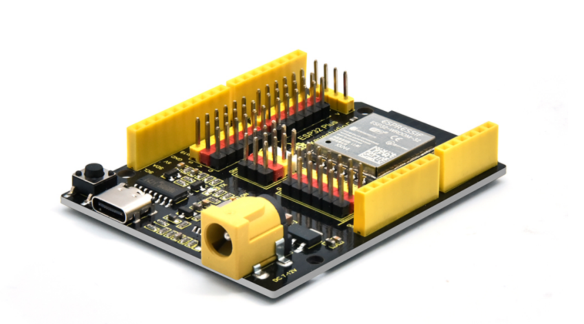
.. |image2| image:: media/e00562548e84b885ad18510b261ade05.png
.. |image3| image:: media/6cf6312dc7c7db27794b54d58a8bf80c.png
.. |image4| image:: media/83a843a56d49e93ec9f99bfb33fee269.png
.. |image5| image:: media/fac59eb6f401fa9e6ce711bb5f3f62f2.png
.. |image6| image:: media/0ab58d5303a100e9638be44131a34b51.png
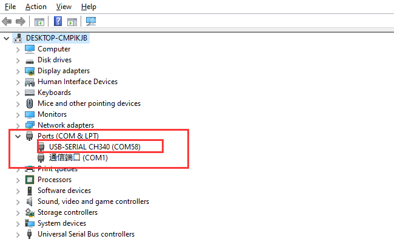
.. |image8| image:: media/378b65e69d5a926721245ecb4d2209a7.png
.. |image9| image:: media/dc27c46ecc96141df0ff60cf605875f3.png
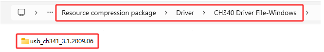

.. |image12| image:: media/cd670e08b43572b8b90f11a3d1edd61c.png
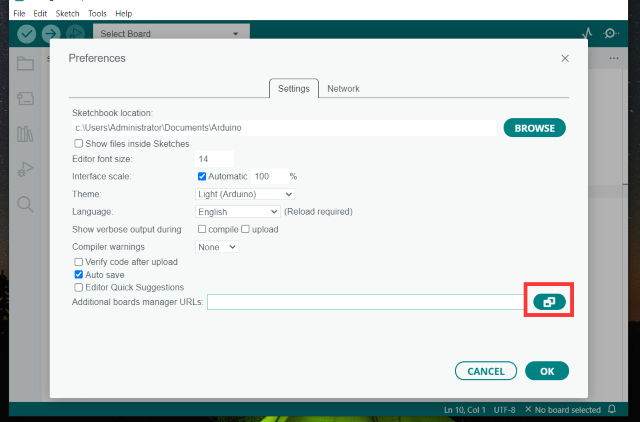
.. |image14| image:: media/58a1317f28e334e6fcdc833bf7161f29.png
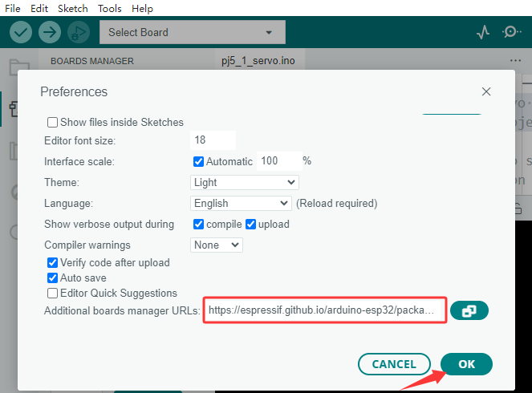
.. |image15| image:: media/dab13b40132ce5c687ca4726b75733f6.png
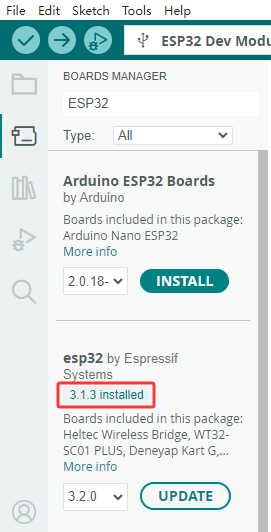
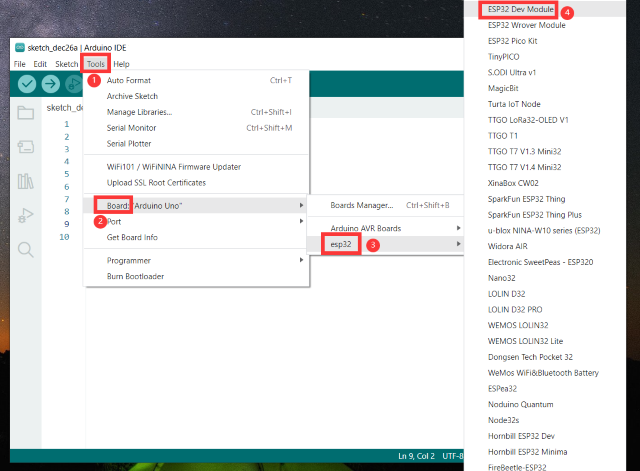
.. |image18| image:: media/9035a01879f001b75827e908d7dceb2d.png
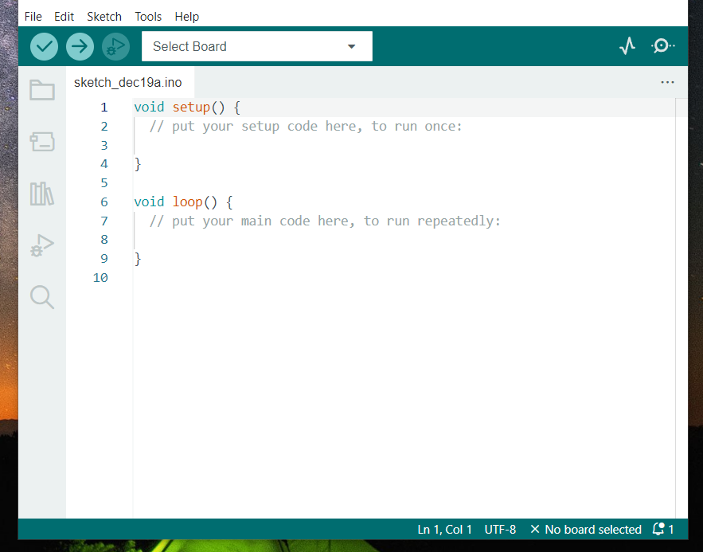
.. |image20| image:: media/82243fba22e2575044b1c29decef18d9.png
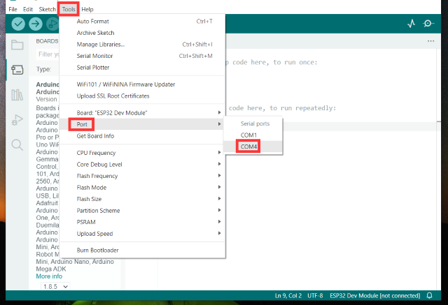
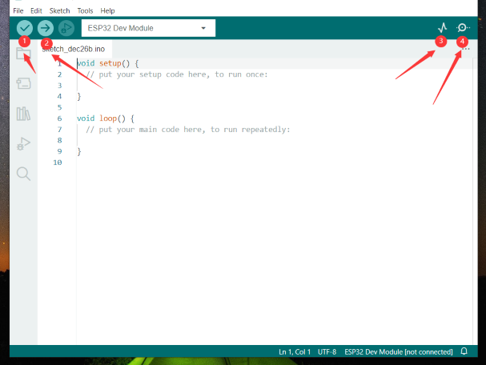

.. |image24| image:: media/77c03a9d0b23a0cc760d32095fa08e21.png
.. |image-20250408105719588| image:: media/image-20250408105719588.png
.. |image25| image:: media/63eee4c4643c4638a659346edbd2500f.png
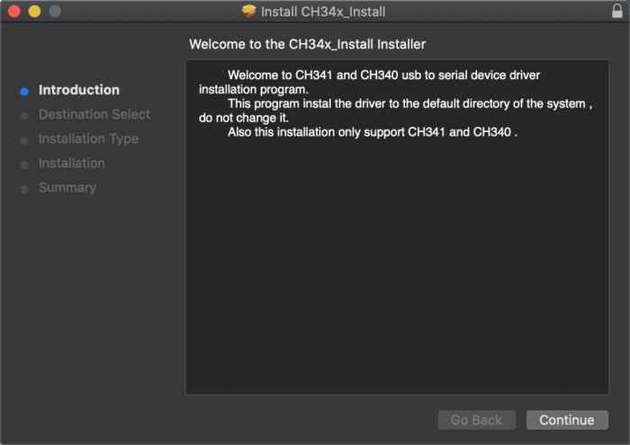
.. |image27| image:: media/de96ded3dc9582e151dd7713d3ef33a1.png
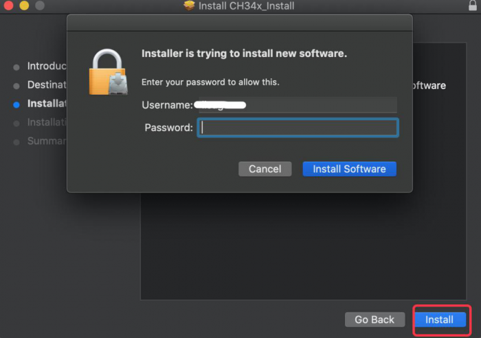
.. |image29| image:: media/55c6bd90dc3ce4762e2598f76700e978.png
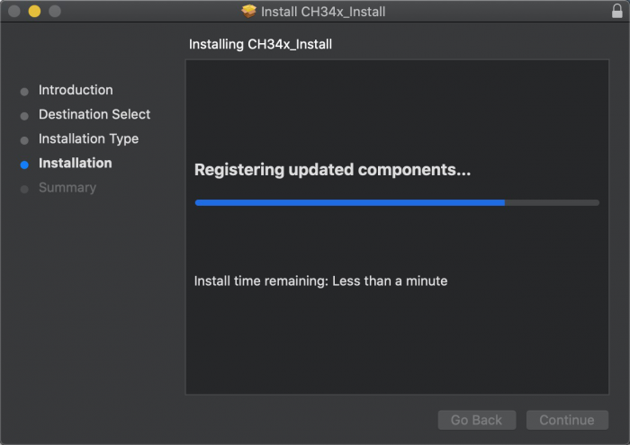
.. |image31| image:: media/7416a8a6aedcae63e931880a1f033db6.png
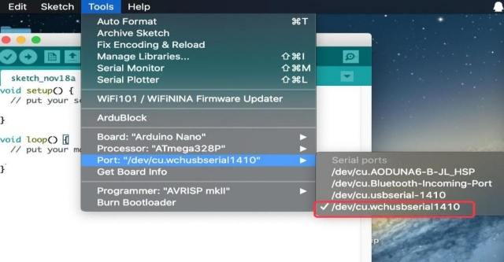
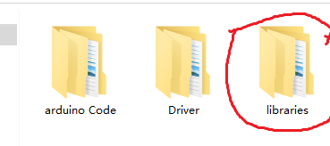
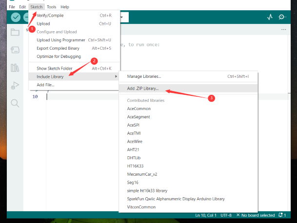
.. |image-20250329140352208| image:: media/image-20250329140352208.png
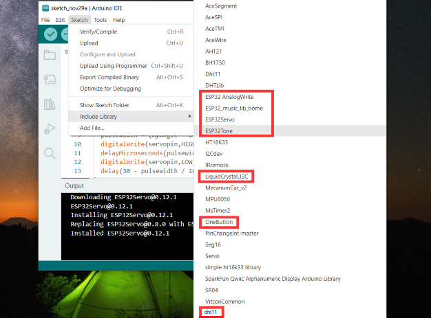

.. |image-20230927115910677| image:: media/image-20230927115910677.png
.. |image36| image:: media/704984700612966b997127cb9bde5c96.jpeg
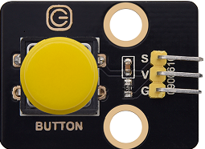
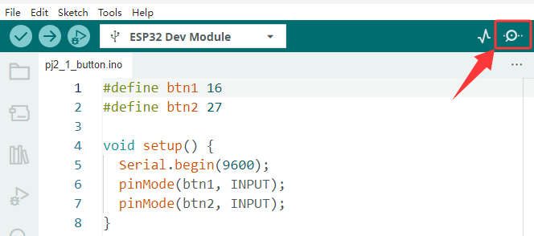
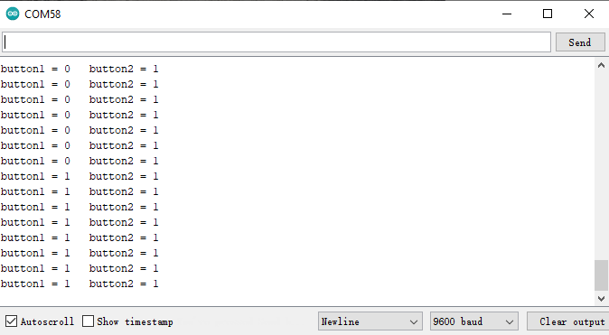
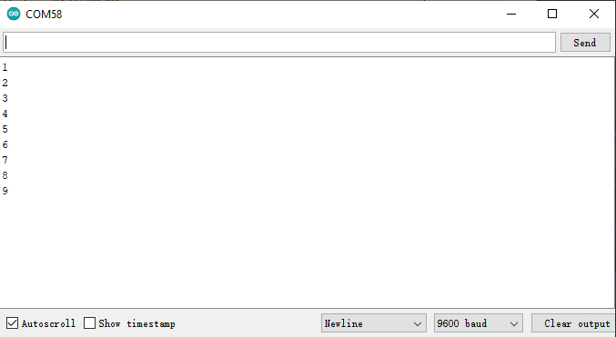
.. |image41| image:: media/c1518252606b111bfa66878a2bfcc965.png
.. |image42| image:: media/e50f0f6c666cdb14857511dccd71ed73.png
.. |image43| image:: media/2e6fd6b7975ef84ab94eee896161347b.png
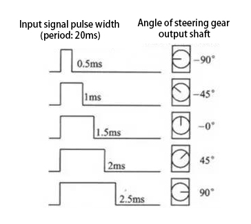
.. |image45| image:: media/35084ae289a08e35bdb8c89ceb134ba4.png
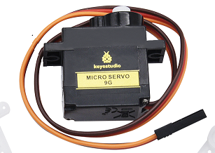
.. |image47| image:: media/86e292d0666046b72a1e0e68adfb17e8.png
.. |image48| image:: media/c0df93f61c6b9272f62b1847ccfbdb10.png
.. |image49| image:: media/33da52918e88862a94035d61a9050f2e.png
.. |image50| image:: media/066e093f1711ada67d3309ddc9bdc66e.png
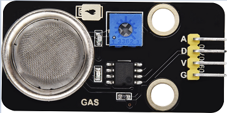
.. |image52| image:: media/0b9c44c3e4f3706638b9cf15871b861c.png
.. |image53| image:: media/982ac6a9da0e8f55465ca5a969ac0dfe.png
.. |image54| image:: media/bb.png
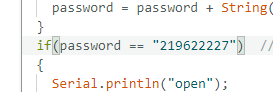
.. |image56| image:: media/1a5e70c0d091e2617acbfc274827b4fd.png
.. |image57| image:: media/9491f7768f28ee4901e6fdb83632c27c.png
.. |image58| image:: ./media/img-20250620091221.png
.. |image59| image:: media/978de9389d1f427010faadcfe2669e08.png
.. |image60| image:: media/cd11492bc27df711a04eafb7696f0dfb.png
.. |image61| image:: media/b61227cbbfd35940c62fac04a680484e.png
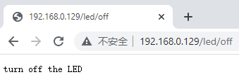
.. |image63| image:: media/1af74f12f1a18d08dfc4c88f0b65f89b.png
.. |image64| image:: media/e1ad649f98cab75e4619b8fc1ca1e24a.png
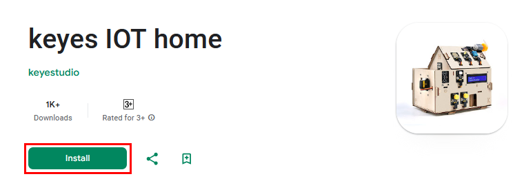
.. |image66| image:: media/8e7c339852876017b41a39d5a0b31323.png

.. |image68| image:: media/8e7c339852876017b41a39d5a0b31323.png
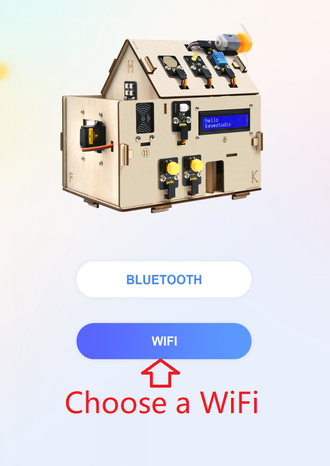
.. |image70| image:: media/aba40215ce81fc7c326f6666c67059b8.png
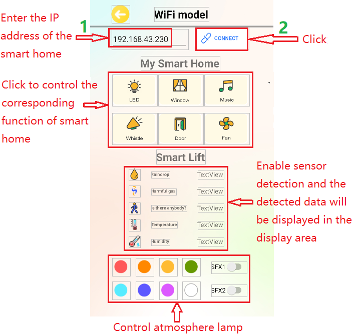