# FB0005 fox:bit Camera

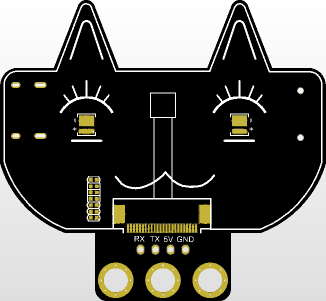

[TOC]

## Description

The fox:bit camera adopts the ESP32-S module and the OV2640 camera module. It can operate independently in minimum system and can be applied in various Internet of Things applications, such as home smart devices, industrial wireless control, wireless monitoring, QR code recognition, wireless positioning system signals. It also supports secondary development and various Internet of Things device applications.

## Parameters

- It adopts a low-power, dual-core 32-bit CPU and can be used as an application processor.
- The main frequency is as high as 240MHz and the computing power reaches 600 DMIPS.
- Built-in 520 KB SRAM and external 8MB PSRAM.
- Compatible with UART.
- Supports OV2640 and OV7670 cameras, with built-in flash.
- Supports TF card, multiple sleep modes, WIFI upload and STA/AP/STA+AP working modes.
- Built-in Lwip and FreeRTOS.
- Support Smart Config/AirKiss intelligent configuration.
- Power range: 5V
- Operating current: 0.21A
- Product dimensions: 55*51mm

## Schematic Diagram

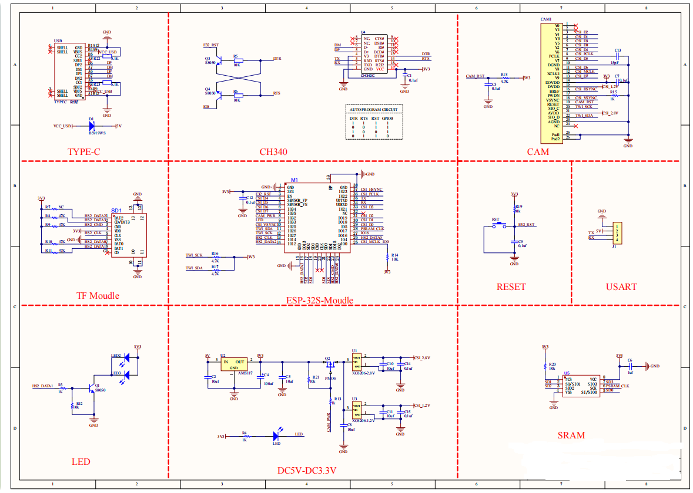

## Connection & Environment Configuration

**Arduino IDE (Windows)**

Arduino official: https://www.arduino.cc/

Download the latest version of the arduino. After entering the website，as shown below:

There are many versions of Arduino, including those for Windows,mac and linux systems, as well as older ones.You just need to download a version that suits your system.

Here, we take the Windows system as an example to introduce the steps of downloading and installing. There are also two versions of the Windows system: one for installation, one for download(no need to install and just unzip it to use).

Click JUST DOWNLOAD.

**Environment Configuration**

Step 1: Connect the computer to the fox:bit camera via a Type-C data cable;

Step 2: Insert the camera and SD card into the SD card slot of the fox:bit camera;

Set up the test environment:
If you see  in the board types of the Arduino IDE, jump to Settings environment.

Configure esp32: Go to Arduino-->File-->Preferences + comma
Configure ESP url
Copy “https://dl.espressif.com/dl/package_esp32_index.json” to “Additional Board Manager URLs”.

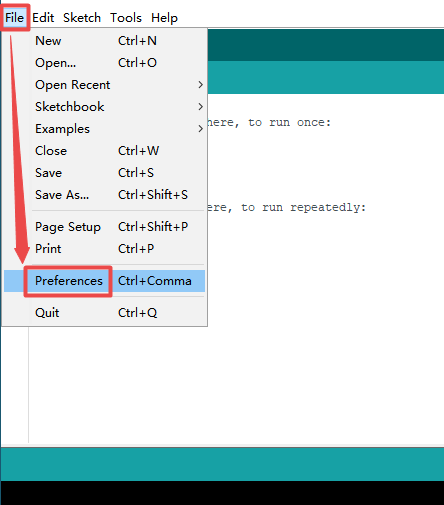

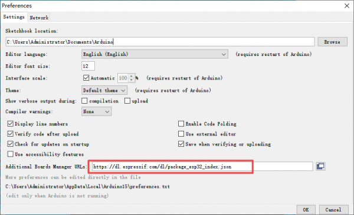

Configure the development board: Open Tools --> Board: (Arduino UNO) --> Board Manager.
Search for esp32, select the version and install it.

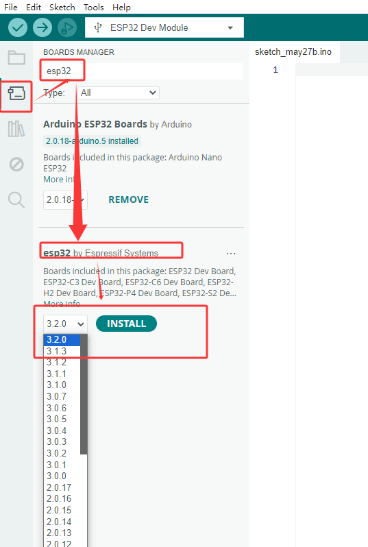

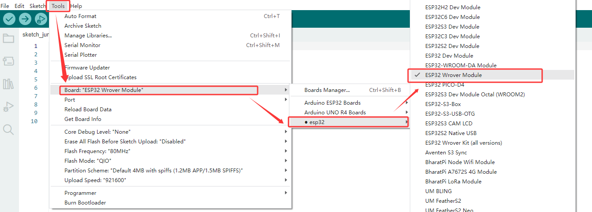

## Sample Code

Ensure that the serial port and board model are correct.

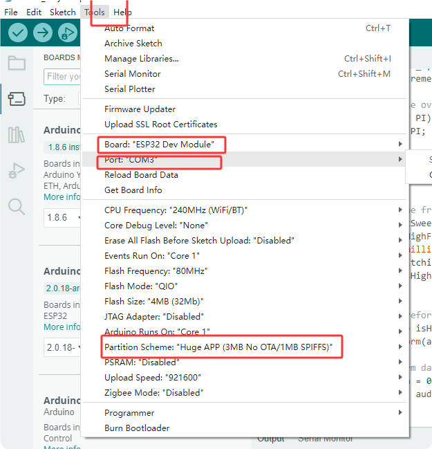

Select the sample code.

Modify the camera type to esp32-cam.

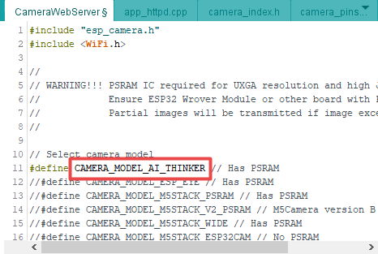

Configure WiFi:

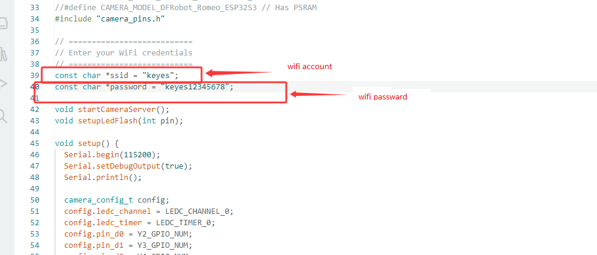

Click  to compile and burn the code.

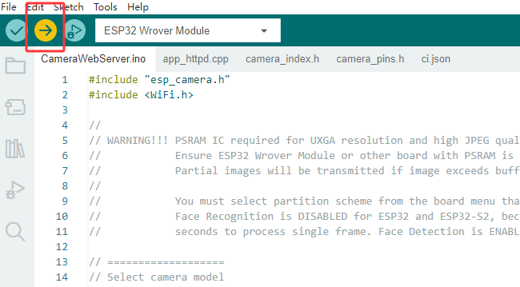

If the IDE shows as shown below, it indicates that the test code has been uploaded successfully. After that, open the Serial monitor in the upper right corner of the Arduino.

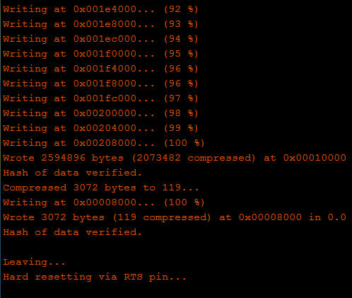

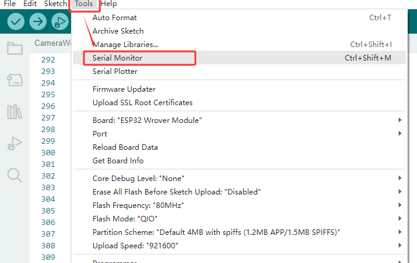

**Test**

Set the baud rate to 11500 and remove the IO0 and GND lines. Press the reset button and the LED indicator will flash. If it is unable to connect to WiFi, please press the reset button again.

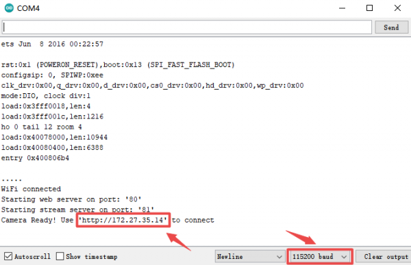

Step 1: Connect your computer to the development board via WiFi and paste the IP address displayed on it into the search box of Google or Foxfire browsers. (Other browsers may not be compatible).

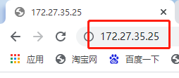

Step 2: Set the parameters as follows, and then click Start Streaming. Then the camera starts to work, the WiFi module gets hot, and a large amount of communication data will be displayed on the serial monitor. Yet please do not worry about them.

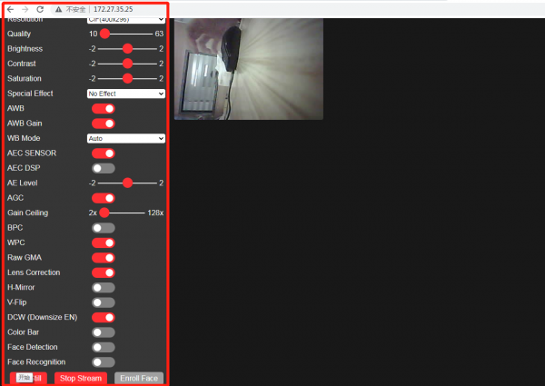

## Test Result

The video screen will appear. Please note that the IP address should be displayed normally on the serial monitor, the camera should be connected properly, and the video image should be clear.
