# KE4085 Keyes I2S音频功率放大器模块

[TOC]

## 实物图

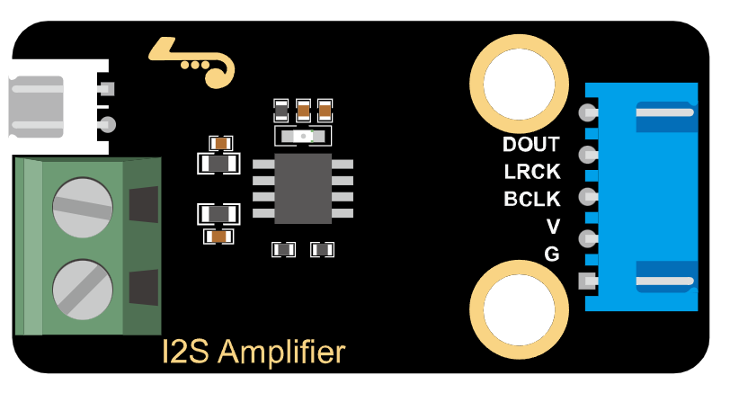

## 描述

​      本模块是以MAX98375为主控芯片，是一款高效、低噪声、高集成度的 D 类音频功放模块，特别适合对功耗和抗干扰要求高的便携式音频设备。其 I2S 数字输入、防失真功能和丰富的保护机制使其在消费类电子产品中具有广泛的应用前景。

## 产品参数

- I2S串行数字音频输入接口
- 支持宽范围采样速率：8kHz~96kHz
- 自动采样率检测，自适应功能
- 内置数字高通滤波器，一线脉冲设置其转折点
- 左右声道可选，通过CTRL管脚电平设置
- 防失真NCN功能，
- 无需滤波器的Class D放大器
- 输出功率：2.5W(VDD=5V, RL=4Ω)
- 工作电压范围：3.0V～5.5V
- 0.2%THD（VDD=5V, RL=4Ω, Po=1W）
- 80%的效率(VDD=5V, RL=4Ω, Po=2.5W)
- 优异的“上电，掉电”噪声抑制
- 过流保护、过热保护、欠压保护
- eSOP8封装
- 尺寸：48/*24mm
- 重量：7.29g

## 原理图

​	下图为产品原理图

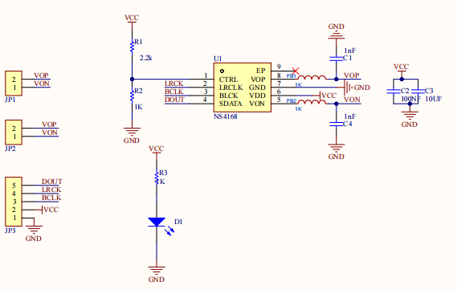

## 连接图

|        **名称**         | 数量 |
| :---------------------: | :--: |
|    ESP32-Dev-Moudle     |  1   |
|   I2S音频功率放大模块   |  1   |
| XH-2.54 5P 转杜邦公单头 |  1   |
|       TypeC数据线       |  1   |
|          喇叭           |  1   |

| 麦克风模块 | ESP32 |
| :--------: | :---: |
|    VCC     |  3V3  |
|    GND     |   G   |
|    BCL     | io19  |
|    LRCK    | io17  |
|    DOUT    | io18  |

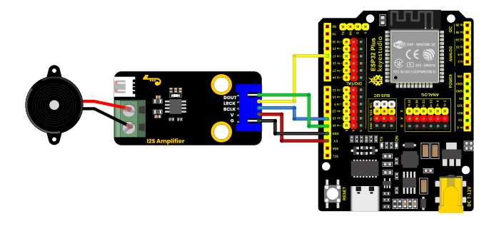

模块后面的两个接口任意一个接上喇叭，烧录程序后便可以产生实验效果。

## 环境搭建及示例代码

**安装Arduino IDE（Windows）**

我们先到Arduino官方软件的下载网站：https://www.arduino.cc/en/software/#ide

下载最新版本的arduino开发软件，进入网站之后,如下图：

Arduino 软件有很多版本，有wodows,mac linux系统的（如下图），而且还有过去老的版本，你只需要下载一个适合系统的版本即可。

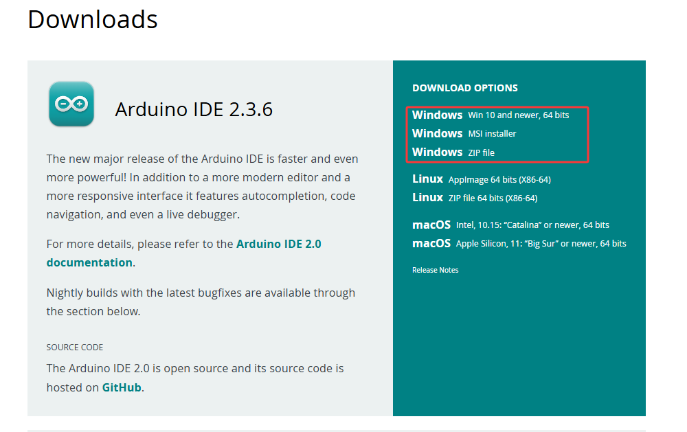

这里我们以Windows系统的为例给大家介绍下载和安装的步骤。Windows系统的也有两个版本，一个版本是安装版的，一个是下载版的不用安装，直接下载文件到电脑，解压缩就可以用了。


一般情况下，我们点击JUST DOWNLOAD就可以下载了。

**环境搭建**

首先打开Arduino IDE，File-->Preferences-->Setings-->Lauguage;修改为简体中文接下来点击“OK”，就会自动切换为中文。

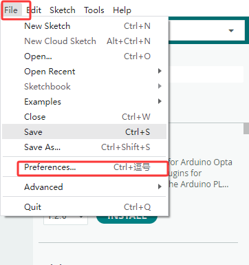


安装对应的开发板平台

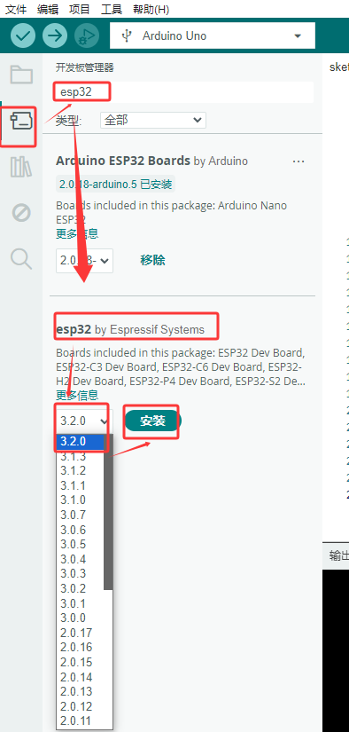


单击选择开发板选择对应的端口号，选择对应的开发板平台

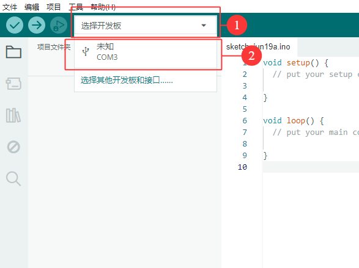

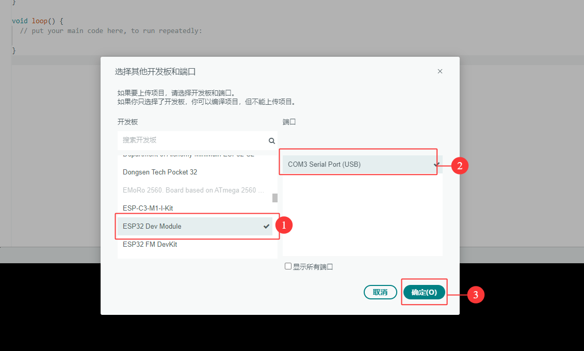


在菜单中点击文件找到首选项，点击进入，在其他开发板管理中输入“https://espressif.github.io/arduino-esp32/package_esp32_index.json”，单击确定

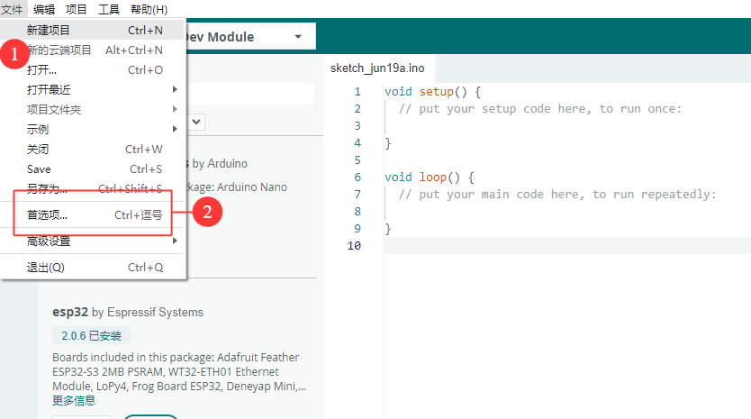

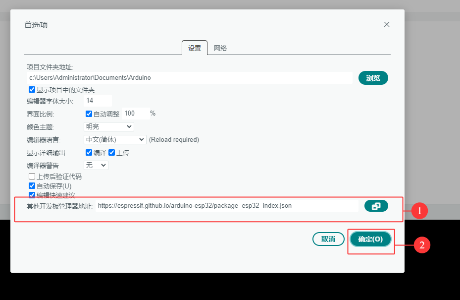

安装模块所需的驱动库，在库管理的框中输入“ESP32-audioI2S-master”，安装对应的库文件

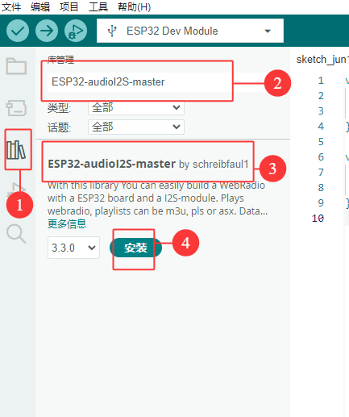

随后复制下列代码到编辑框，通过ArduinoIDE上传到ESP32主板中。

```c
#include <driver/i2s.h>

#define I2S_PORT I2S_NUM_0

// 音频参数配置
#define SAMPLE_RATE     44100    // 采样率(Hz)
#define BITS_PER_SAMPLE 16       // 采样位数
#define BUFFER_SIZE     1024     // 缓冲区大小

// 救护车警笛参数
#define LOW_FREQ        500      // 低频(Hz)
#define HIGH_FREQ       700      // 高频(Hz)
#define SWEEP_TIME      1000     // 频率变化周期(ms)

// 音频缓冲区
int16_t audioBuffer[BUFFER_SIZE];
int bufferIndex = 0;
bool isHighFreq = false;
unsigned long lastSweepTime = 0;

// I2S引脚配置(根据实际连接修改)
#define I2S_MCLK_PIN    I2S_PIN_NO_CHANGE  // 没有MCLK引脚
#define I2S_BCLK_PIN    19
#define I2S_LRCK_PIN    17
#define I2S_DOUT_PIN    18
#define I2S_DATA_IN_PIN I2S_PIN_NO_CHANGE

void setup() {
  Serial.begin(115200);
  
  // 配置I2S参数
  i2s_config_t i2s_config = {
    .mode = (i2s_mode_t)(I2S_MODE_MASTER | I2S_MODE_TX),
    .sample_rate = SAMPLE_RATE,
    .bits_per_sample = (i2s_bits_per_sample_t)BITS_PER_SAMPLE,
    .channel_format = I2S_CHANNEL_FMT_ONLY_LEFT,
    .communication_format = I2S_COMM_FORMAT_STAND_I2S,
    .intr_alloc_flags = ESP_INTR_FLAG_LEVEL1,
    .dma_buf_count = 8,
    .dma_buf_len = BUFFER_SIZE,
    .use_apll = false,
    .tx_desc_auto_clear = true,
    .fixed_mclk = 0  // 禁用固定MCLK
  };
  
  // 配置I2S引脚
  i2s_pin_config_t pin_config = {
    .bck_io_num = I2S_BCLK_PIN,
    .ws_io_num = I2S_LRCK_PIN,
    .data_out_num = I2S_DOUT_PIN,
    .data_in_num = I2S_DATA_IN_PIN
  };
  
  // 安装并启动I2S驱动
  i2s_driver_install(I2S_PORT, &i2s_config, 0, NULL);
  i2s_set_pin(I2S_PORT, &pin_config);
  i2s_start(I2S_PORT);
  
  Serial.println("救护车警笛模拟器已启动");
}

// 生成救护车警笛波形
void generateSirenWaveform(int16_t* buffer, int size, float frequency) {
  float amplitude = 16000.0;  // 音量大小(0-32767)
  float phase = 0.0;
  float phaseIncrement = 2.0 * PI * frequency / SAMPLE_RATE;
  
  for (int i = 0; i < size; i++) {
    // 生成正弦波
    buffer[i] = (int16_t)(amplitude * sin(phase));
    phase += phaseIncrement;
    
    // 处理相位溢出
    if (phase > 2.0 * PI) {
      phase -= 2.0 * PI;
    }
  }
}

void loop() {
  // 检查是否需要切换频率
  if (millis() - lastSweepTime > SWEEP_TIME) {
    isHighFreq = !isHighFreq;
    lastSweepTime = millis();
    Serial.print("切换频率: ");
    Serial.println(isHighFreq ? "高频" : "低频");
  }
  
  // 生成当前频率的波形
  float currentFreq = isHighFreq ? HIGH_FREQ : LOW_FREQ;
  generateSirenWaveform(audioBuffer, BUFFER_SIZE, currentFreq);
  
  // 将波形数据发送到I2S接口
  size_t bytesWritten = 0;
  i2s_write(I2S_PORT, audioBuffer, BUFFER_SIZE * sizeof(int16_t), &bytesWritten, portMAX_DELAY);
}

```

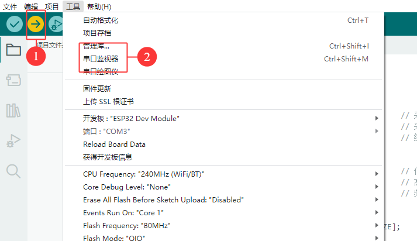

## 测试结果

​	烧录上传完成后会产生救护车警笛声的特点是两种频率交替变化，形成 "呜～哇～呜～哇～" 的效果，串口会打印以下数据，如下图：

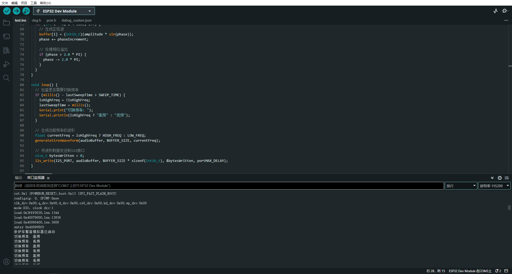
