# KE4086 Keyes STEM电子积木 MES麦克风模块 

[TOC]

## 实物图

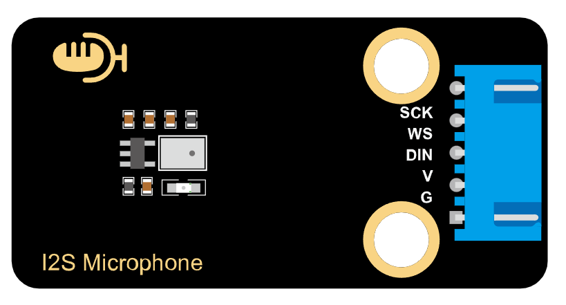

## 描述

​       该款MEMS数字I2S麦克风模块是以MSM261S4030H0声音传感器为核心，内置一个对声音敏感的电容式驻极体话筒。声波使话筒内的驻极体薄膜振动导致电容的变化，而产生与之对应变化的微小电压。这一电压随后被转化成0-5V的电压，经过A/D转换被数据采集器接收通过I2S协议和主控通讯。 该模块不仅具有小巧的体积，还具有高灵敏度和低噪音特性，非常适合用于各种需要高质量音频输入的应用场景。结合ESP32等主控设备的强大处理能力，用户可以轻松实现语音识别、录音、AI学习等功能。

## 产品参数

- 工作电压：3.3~5V
- 麦克风封装工艺：MEMS
- 方向性：全向 顶进音
- 数据接口：I2S
- 灵敏度：-26dB
- 声压等级：124dB
- 信噪比：61dB
- 尺寸：48/*24mm
- 重量：5.1g

## 原理图

​	下图为产品原理图

​	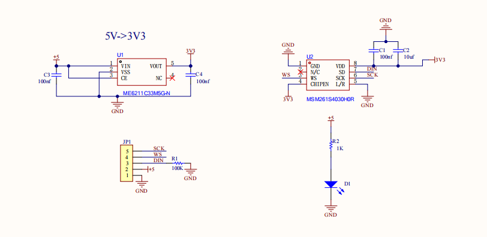

## 连接图

|        **名称**         | 数量 |
| :---------------------: | :--: |
|    ESP32-Dev-Moudle     |  1   |
|      MES麦克风模块      |  1   |
| XH-2.54 5P 转杜邦公单头 |  1   |
|       TypeC数据线       |  1   |

| 麦克风模块 | ESP32 |
| :--------: | :---: |
|    VCC     |  3V3  |
|    GND     |   G   |
|     WS     | io12  |
|    DIN     | io13  |
|    SCK     | io14  |

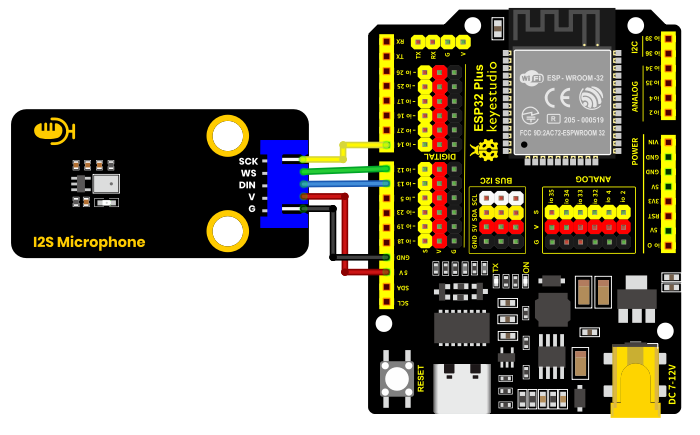

## 环境搭建及示例代码

**安装Arduino IDE（Windows）**

我们先到Arduino官方软件的下载网站：https://www.arduino.cc/en/software/#ide

下载最新版本的arduino开发软件，进入网站之后,如下图：

Arduino 软件有很多版本，有wodows,mac linux系统的（如下图），而且还有过去老的版本，你只需要下载一个适合系统的版本即可。


这里我们以Windows系统的为例给大家介绍下载和安装的步骤。Windows系统的也有两个版本，一个版本是安装版的，一个是下载版的不用安装，直接下载文件到电脑，解压缩就可以用了。


一般情况下，我们点击JUST DOWNLOAD就可以下载了。

**环境搭建**

首先打开Arduino IDE，File-->Preferences-->Setings-->Lauguage;修改为简体中文接下来点击“OK”，就会自动切换为中文。

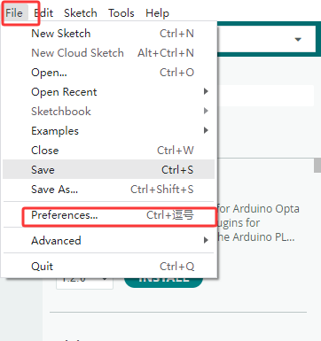

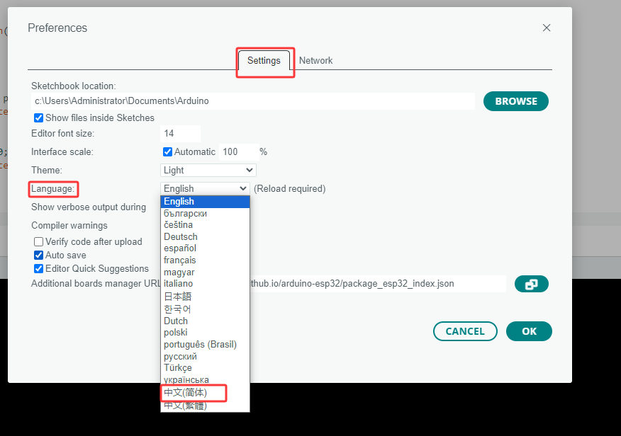

安装对应的开发板平台

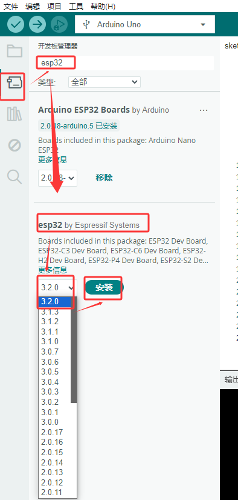

单击选择开发板选择对应的端口号，选择对应的开发板平台

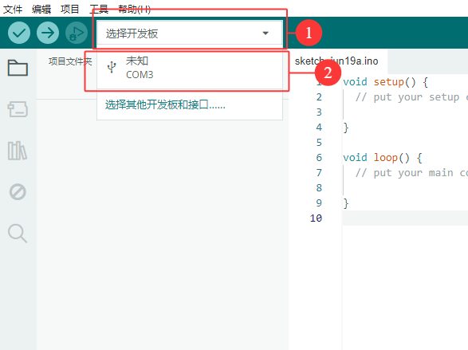

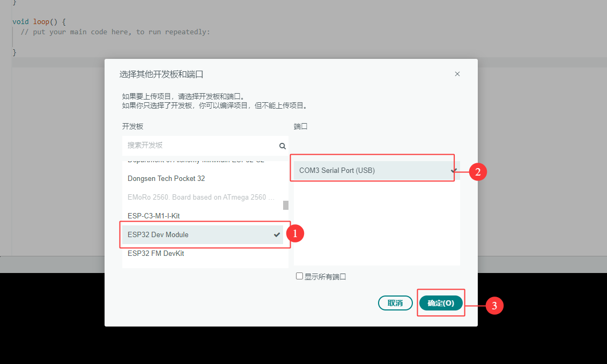


在菜单中点击文件找到首选项，点击进入，在其他开发板管理中输入“https://espressif.github.io/arduino-esp32/package_esp32_index.json”，单击确定

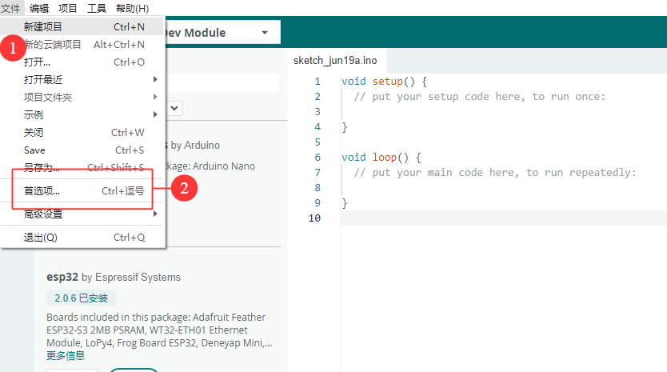

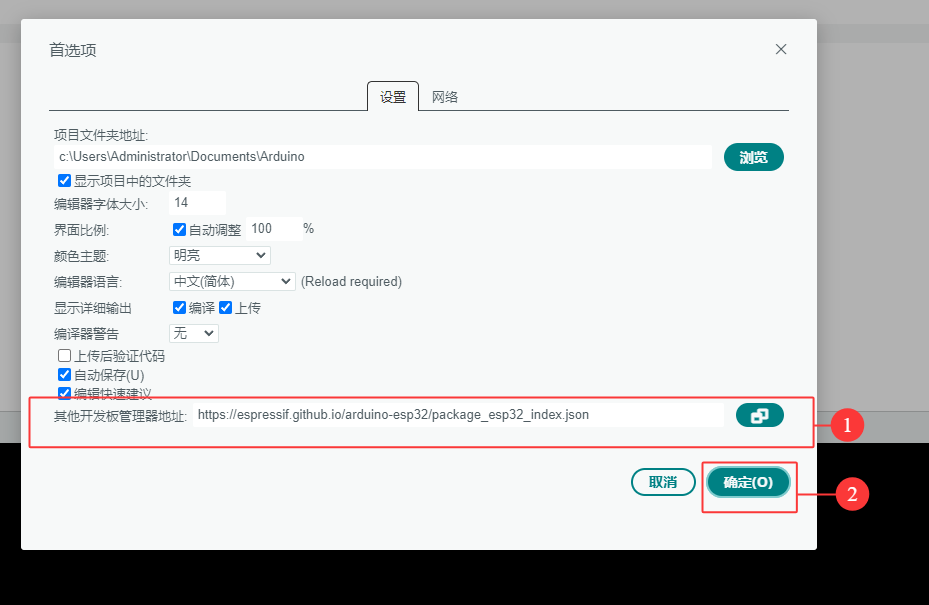

安装模块所需的驱动库，在库管理的框中输入“ESP32-audioI2S-master”，安装对应的库文件

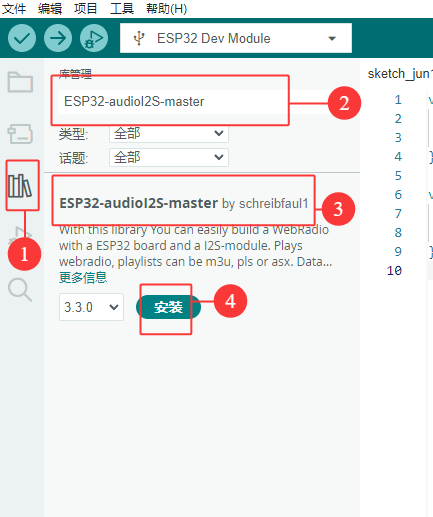

随后复制下列代码到编辑框，通过ArduinoIDE上传到ESP32主板中。

```c
#include "driver/i2s.h"
#define SAMPLE_RATE (44100)

#define I2S_MIC_WS 12
#define I2S_MIC_DIN 13
#define I2S_MIC_BCK 14
#define I2S_PORT I2S_NUM_0
#define bufferLen 64

int16_t sBuffer[bufferLen];

  // 安装I2S驱动
  void i2s_install(){

    // 配置I2S接收
    i2s_config_t i2s_config = {
      .mode = (i2s_mode_t)(I2S_MODE_MASTER | I2S_MODE_RX),
      .sample_rate = SAMPLE_RATE,
      .bits_per_sample = I2S_BITS_PER_SAMPLE_16BIT,  
      .channel_format = I2S_CHANNEL_FMT_ONLY_LEFT,
      .communication_format = (i2s_comm_format_t)(I2S_COMM_FORMAT_I2S | I2S_COMM_FORMAT_I2S_MSB),
      .intr_alloc_flags = 0,
      .dma_buf_count = 16,
      .dma_buf_len = bufferLen,
      .use_apll = false      
   };
   if (ESP_OK != i2s_driver_install(I2S_PORT, &i2s_config, 0, NULL)) {
      Serial.println("Install I2S driver failed");
      return;
     }  
}

  // 配置I2S引脚
  void i2s_setpin(){

    i2s_pin_config_t pin_config = {};
    pin_config.bck_io_num = I2S_MIC_BCK;
    pin_config.ws_io_num = I2S_MIC_WS;
    pin_config.data_out_num = I2S_PIN_NO_CHANGE;
    pin_config.data_in_num = I2S_MIC_DIN;

   if (ESP_OK != i2s_set_pin(I2S_PORT, &pin_config)) {
    Serial.println("I2S set pin failed");
    return;
  }
 }

void setup() {

  Serial.begin(115200);
  Serial.println("Setup I2S ...");

  delay(1000);
  i2s_install();
  i2s_setpin();
  i2s_start(I2S_PORT);
  delay(500);  
}


void loop() {
   size_t bytesIn = 0;
  esp_err_t result = i2s_read(I2S_PORT, &sBuffer, bufferLen, &bytesIn, portMAX_DELAY);
  if (result == ESP_OK)
  {
    int samples_read = bytesIn / 2;
    if (samples_read > 0) {
      float mean = 0;
      for (int i = 0; i < samples_read; ++i) {
        mean += (sBuffer[i]);
      }
      mean /= samples_read;
      Serial.println(mean);
      delay(50);
    }
  }

}


```

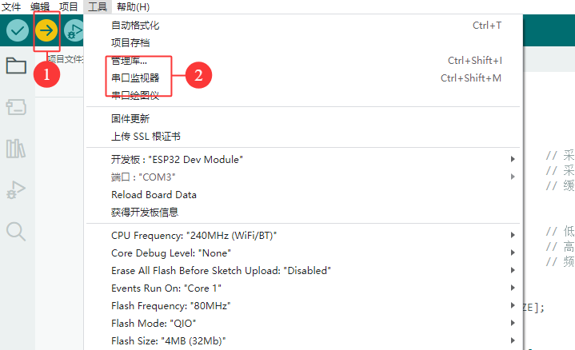

## 测试结果

​	一 开始接收到的是外界的声音，波形是杂乱无章的。后面用嘴吹气，波形会跟着吹气变化，不吹气波形是平缓不变的，后面大概吹了几次，可以看到波形变化，如下图：

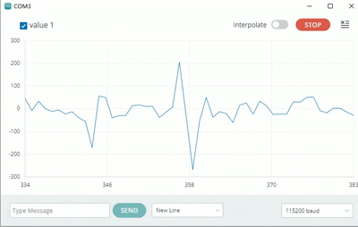