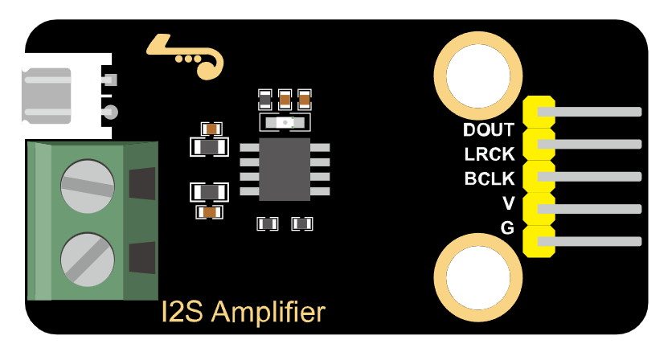
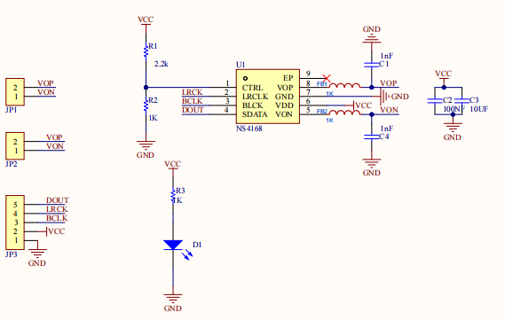
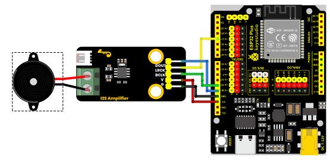
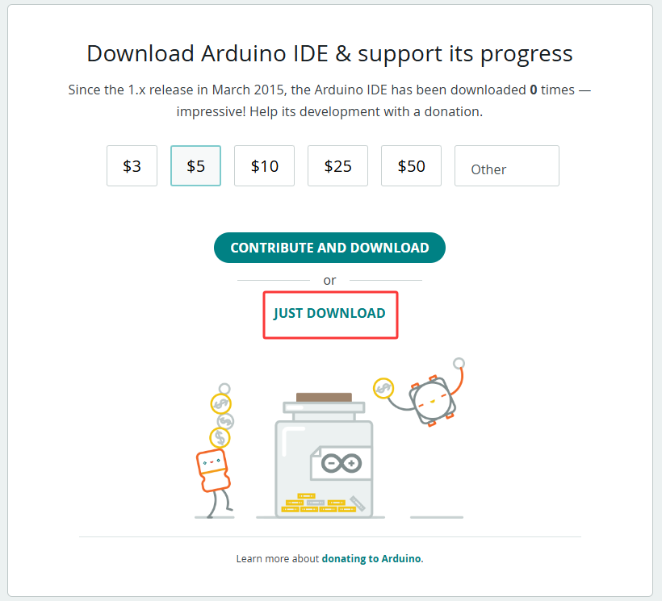
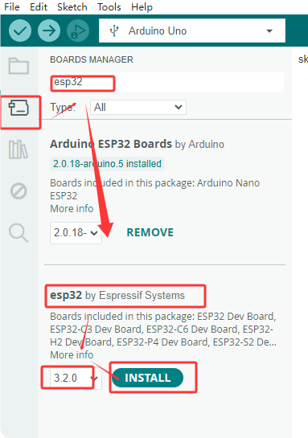
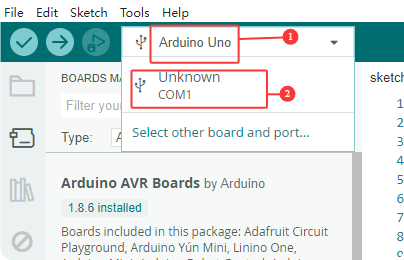
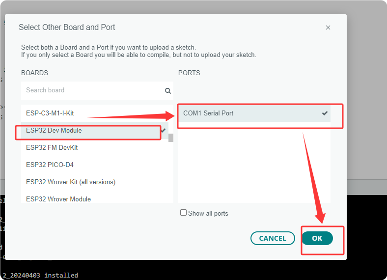
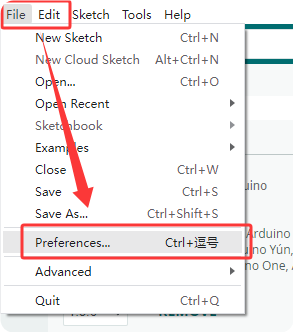
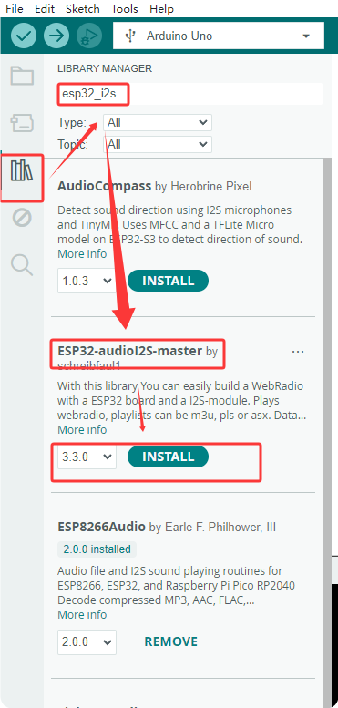
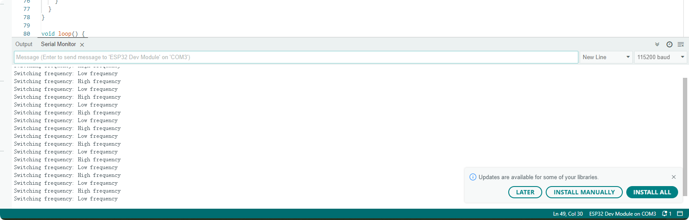

# KS6085 keyestudio I2S Audio Power Amplifier Module

[TOC]

## Physical Picture



## Description

This module is equipped with the MAX98375 as the main control chip. It is a highly efficient, low-noise and highly integrated D-class audio power amplifier, which is particularly suitable for portable audio devices with high requirements for power consumption and anti-interference. Its I2S digital input, anti-distortion function and rich protection mechanisms make it have broad applications in consumer electronic products.

## Parameters

- I2S serial digital audio input interface
- Supports wide-range sampling rates: 8kHz to 96kHz
- Automatic sampling rate detection, self-adaption
- Built-in digital high-pass filter, a single pulse sets its turning point
- Optional left and right channels can be set by pressing CTRL to the pin level
- Anti-distortion NCN function
- Class D amplifier without filter
- Output power: 2.5W(VDD=5V, RL=4Ω)
- Operating voltage range: 3.0V to 5.5V
- 0.2% THD (VDD=5V, RL=4Ω, Po=1W)
- 80% efficiency (VDD=5V, RL=4Ω, Po=2.5W)
- Excellent noise suppression for “power-on and power-off”
- Overcurrent protection, overheat protection, under-voltage protection
- eSOP8 packaging
- Dimensions: 48 *24mm
- Weight: 6.96g

## Schematic Diagram



## 连接图

|            **Module**            | QTY  |
| :------------------------------: | :--: |
|    Kidsbits ESP32-Dev-Module     |  1   |
| I2S audio power amplifier module |  1   |
|         M-F DuPont wire          |  5   |
|        Type C data cable         |  1   |
|             Speaker              |  1   |

| Microphone module | ESP32 |
| :---------------: | :---: |
|        VCC        |  3V3  |
|        GND        |   G   |
|       BCLK        | io19  |
|       LRCK        | io17  |
|       DOUT        | io18  |



Connect either of the two interfaces at the back of the module to a speaker. After burning the program, the experimental effect can be achieved.

## Environment Configuration & Sample Code

**Arduino IDE (Windows)**

First, let's go to the download website of Arduino official software: https://www.arduino.cc/en/software/#ide.   

Download the latest version of the Arduino development software. After entering the website, it is as shown in the following figure:

There are many versions of Arduino, including those for Windows,mac and linux systems, as well as older ones.You just need to download a version that suits your system.


Here, we take the Windows system as an example to introduce the steps of downloading and installing. There are also two versions of the Windows system: one for installation, one for download(no need to install and just unzip it to use).



Click JUST DOWNLOAD.

**Environment Configuration**

First, open the Arduino IDE,Install the corresponding development board platform.



 select Development Board, the port number and the corresponding development board platform.






In the menu, click on “File” to find “Preferences” and “Enter”, and then enter “https://espressif.github.io/arduino-esp32/package_esp32_index.json” in “Other Development Board Management” and click OK.




Next, install the required driver libraries. Enter “ESP32-audioI2S-master” in the library management box to install the corresponding library file.



Then copy the following code to the editing box and upload it to the ESP32 board via ArduinoIDE.

```c
#include <driver/i2s.h>

#define I2S_PORT I2S_NUM_0

// Audio parameter configuration
#define SAMPLE_RATE     44100    // Sampling rate (Hz)
#define BITS_PER_SAMPLE 16       // Sampling bit number
#define BUFFER_SIZE     1024     // Buffer size

// Ambulance siren parameters
#define LOW_FREQ        500      // Low frequency (Hz)
#define HIGH_FREQ       700      // High frequency (Hz)
#define SWEEP_TIME      1000     // Frequency variation period (ms)

// Audio buffer
int16_t audioBuffer[BUFFER_SIZE];
int bufferIndex = 0;
bool isHighFreq = false;
unsigned long lastSweepTime = 0;

// I2S pin configuration (Modify according to actual connection)
#define I2S_MCLK_PIN    I2S_PIN_NO_CHANGE  // There are no MCLK pins
#define I2S_BCLK_PIN    19
#define I2S_LRCK_PIN     17
#define I2S_DOUT_PIN    18
#define I2S_DATA_IN_PIN I2S_PIN_NO_CHANGE

void setup() {
  Serial.begin(115200);
  
  // Configure the I2S parameters
  i2s_config_t i2s_config = {
    .mode = (i2s_mode_t)(I2S_MODE_MASTER | I2S_MODE_TX),
    .sample_rate = SAMPLE_RATE,
    .bits_per_sample = (i2s_bits_per_sample_t)BITS_PER_SAMPLE,
    .channel_format = I2S_CHANNEL_FMT_ONLY_LEFT,
    .communication_format = I2S_COMM_FORMAT_STAND_I2S,
    .intr_alloc_flags = ESP_INTR_FLAG_LEVEL1,
    .dma_buf_count = 8,
    .dma_buf_len = BUFFER_SIZE,
    .use_apll = false,
    .tx_desc_auto_clear = true,
    .fixed_mclk = 0  // Disable the fixed MCLK
  };
  
  // Configure the I2S pins
  i2s_pin_config_t pin_config = {
    .bck_io_num = I2S_BCLK_PIN,
    .ws_io_num = I2S_LRCK_PIN,
    .data_out_num = I2S_DOUT_PIN,
    .data_in_num = I2S_DATA_IN_PIN
  };
  
  // Install and start the I2S driver
  i2s_driver_install(I2S_PORT, &i2s_config, 0, NULL);
  i2s_set_pin(I2S_PORT, &pin_config);
  i2s_start(I2S_PORT);
  
  Serial.println("The ambulance siren simulator has been activated");
}

// Generate the waveform of the ambulance siren
void generateSirenWaveform(int16_t* buffer, int size, float frequency) {
  float amplitude = 16000.0;  // Volume level(0-32767)
  float phase = 0.0;
  float phaseIncrement = 2.0 * PI * frequency / SAMPLE_RATE;
  
  for (int i = 0; i < size; i++) {
    // Generate a sine wave
    buffer[i] = (int16_t)(amplitude * sin(phase));
    phase += phaseIncrement;
    
    // Deal with phase overflow
    if (phase > 2.0 * PI) {
      phase -= 2.0 * PI;
    }
  }
}

void loop() {
  // Check whether the frequency needs to be switched
  if (millis() - lastSweepTime > SWEEP_TIME) {
    isHighFreq = !isHighFreq;
    lastSweepTime = millis();
    Serial.print("Switching frequency: ");
    Serial.println(isHighFreq ? "High frequency" : "Low frequency");
  }
  
  // Generate the waveform of the current frequency
  float currentFreq = isHighFreq ? HIGH_FREQ : LOW_FREQ;
  generateSirenWaveform(audioBuffer, BUFFER_SIZE, currentFreq);
  
  // Send the waveform data to the I2S interface
  size_t bytesWritten = 0;
  i2s_write(I2S_PORT, audioBuffer, BUFFER_SIZE * sizeof(int16_t), &bytesWritten, portMAX_DELAY);
}

```


## Test Result

After the burning and uploading the code, the ambulance siren sound will be produced, alternating between two frequencies. It sounds like “woo ~ wah ~ woo ~ wah ~”. The serial monitor will print the following data, as shown below:


