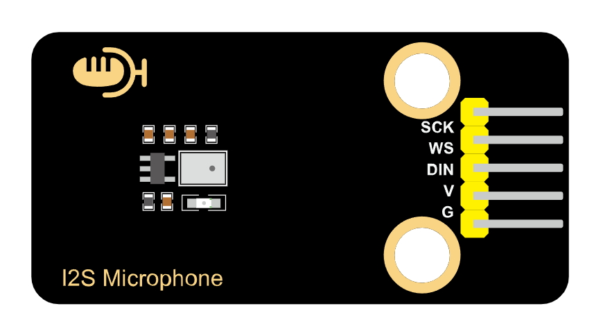
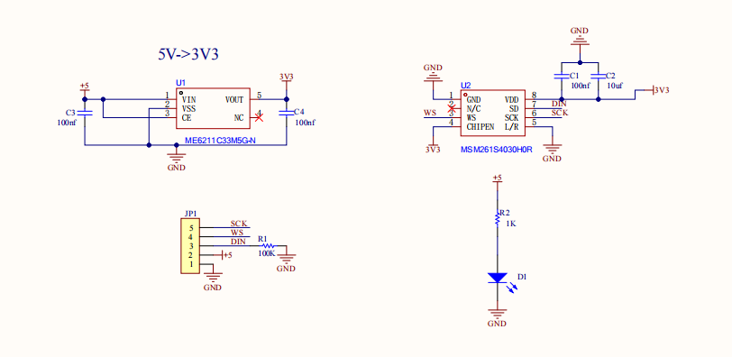
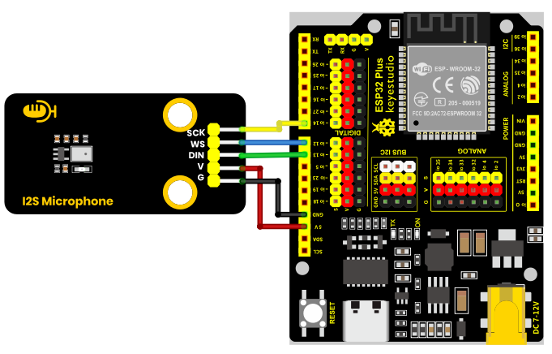
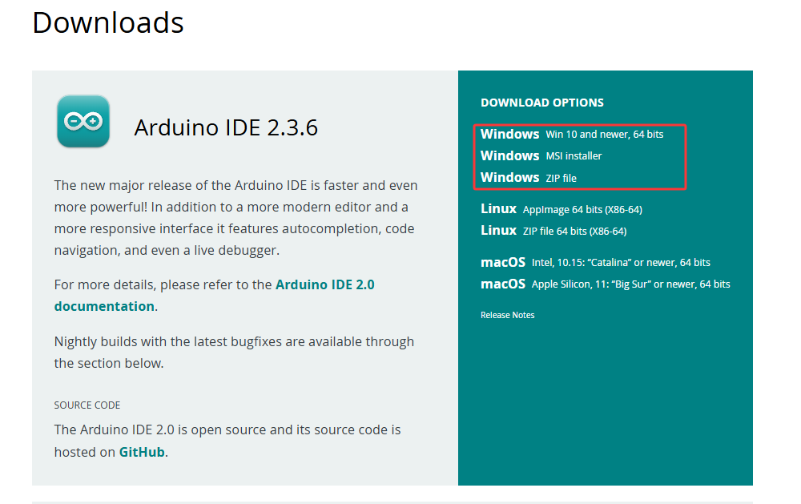
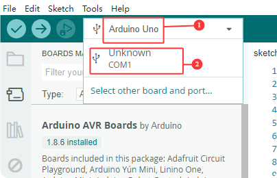
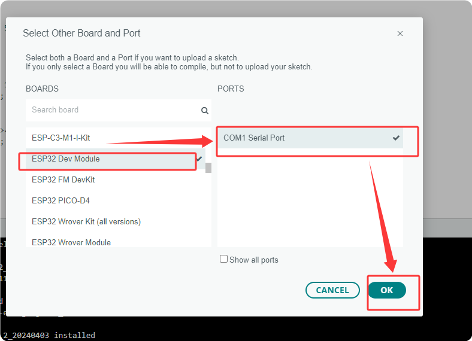
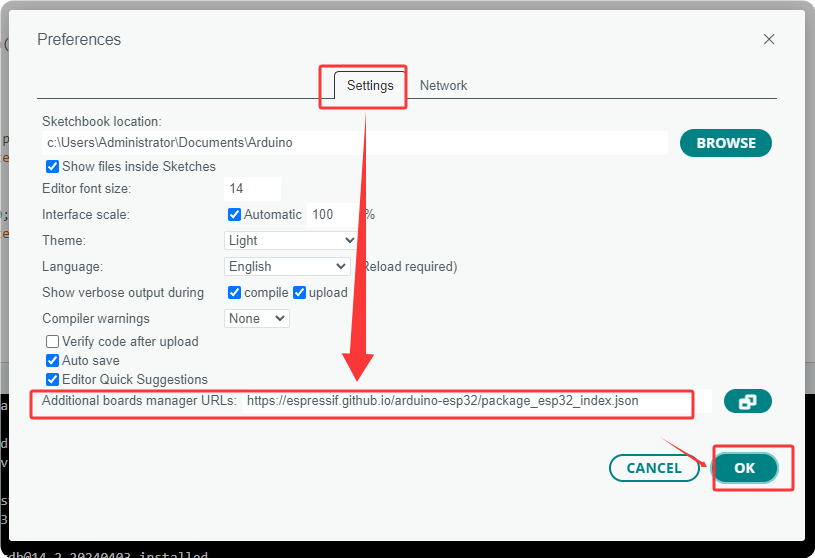
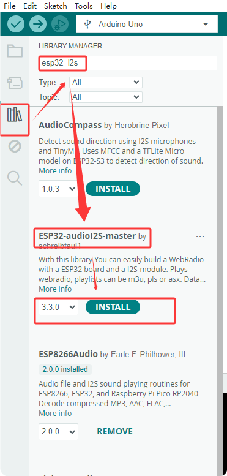
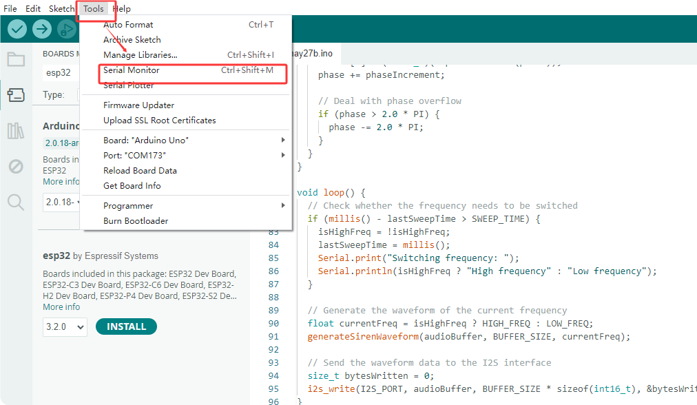
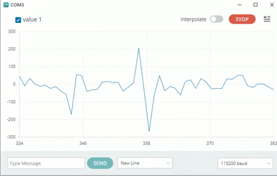

# KS6086 keyestudio MES Microphone Module

[TOC]

## Physical Picture



## Description

This MEMS digital I2S microphone module takes the MSM261S4030H0 sound sensor as its core and is equipped with a sound-sensitive capacitive electret microphone inside. 

Sound waves cause this electret film to vibrate, resulting in a change in capacitance and generating a tiny voltage that changes accordingly. This voltage becomes into 0-5V, and then it is received by the data collector after A/D conversion and communicates with the main control through the I2S protocol. 

This module features a compact size but high sensitivity and low noise, making it highly suitable for various applications that require high-quality audio input. Therefore, users can easily achieve functions such as voice recognition, recording, and AI learning by combining with main control devices with powerful processing capabilities, such as ESP32.

## Parameters

- Operating voltage: 3.3-5V
- Microphone packaging process: MEMS
- Directionality: Omnidirectional push sound
- Data interface: I2S
- Sensitivity: -26dB
- Sound pressure level: 124dB
- Signal-to-noise ratio: 61dB
- Dimensions: 48 *24mm
- Weight: 4.23g

## Schematic Diagram



## Wiring Diagram

|      **Module**       | QTY  |
| :-------------------: | :--: |
|   ESP32-Dev-Module    |  1   |
| MES microphone module |  1   |
|    M-F DuPont wire    |  5   |
|   Type C data cable   |  1   |

| Microphone module | ESP32 |
| :---------------: | :---: |
|        VCC        |  3V3  |
|        GND        |   G   |
|        WS         | io12  |
|        DIN        | io13  |
|        SCK        | io14  |



## Environment Configuration & Sample Code

**Arduino IDE (Windows)**

First, let's go to the download website of Arduino official software: https://www.arduino.cc/en/software/#ide.   

Download the latest version of the Arduino development software. After entering the website, it is as shown in the following figure:

There are many versions of Arduino, including those for Windows,mac and linux systems, as well as older ones.You just need to download a version that suits your system.



Here, we take the Windows system as an example to introduce the steps of downloading and installing. There are also two versions of the Windows system: one for installation, one for download(no need to install and just unzip it to use).


Click JUST DOWNLOAD.

**Environment Configuration**

First, open the Arduino IDE, Install the corresponding development board platform.


select Development Board, the port number and the corresponding development board platform.





In the menu, click on “File” to find “Preferences” and “Enter”, and then enter “https://espressif.github.io/arduino-esp32/package_esp32_index.json” in “Other Development Board Management” and click OK.




Next, install the required driver libraries. Enter “ESP32-audioI2S-master” in the library management box to install the corresponding library file.



Then copy the following code to the editing box and upload it to the ESP32 board via ArduinoIDE.

```c
#include "driver/i2s.h"
#define SAMPLE_RATE (44100)

#define I2S_MIC_WS 12
#define I2S_MIC_DIN 13
#define I2S_MIC_BCK 14
#define I2S_PORT I2S_NUM_0
#define bufferLen 64

int16_t sBuffer[bufferLen];

  // Install the I2S driver
  void i2s_install(){

    // Configure I2S reception
    i2s_config_t i2s_config = {
      .mode = (i2s_mode_t)(I2S_MODE_MASTER | I2S_MODE_RX),
      .sample_rate = SAMPLE_RATE,
      .bits_per_sample = I2S_BITS_PER_SAMPLE_16BIT,  
      .channel_format = I2S_CHANNEL_FMT_ONLY_LEFT,
      .communication_format = (i2s_comm_format_t)(I2S_COMM_FORMAT_I2S | I2S_COMM_FORMAT_I2S_MSB),
      .intr_alloc_flags = 0,
      .dma_buf_count = 16,
      .dma_buf_len = bufferLen,
      .use_apll = false      
   };
   if (ESP_OK != i2s_driver_install(I2S_PORT, &i2s_config, 0, NULL)) {
      Serial.println("Install I2S driver failed");
      return;
     }  
}

  // Configure the I2S pin
  void i2s_setpin(){

    i2s_pin_config_t pin_config = {};
    pin_config.bck_io_num = I2S_MIC_BCK;
    pin_config.ws_io_num = I2S_MIC_WS;
    pin_config.data_out_num = I2S_PIN_NO_CHANGE;
    pin_config.data_in_num = I2S_MIC_DIN;

   if (ESP_OK != i2s_set_pin(I2S_PORT, &pin_config)) {
    Serial.println("I2S set pin failed");
    return;
  }
 }

void setup() {

  Serial.begin(115200);
  Serial.println("Setup I2S ...");

  delay(1000);
  i2s_install();
  i2s_setpin();
  i2s_start(I2S_PORT);
  delay(500);  
}


void loop() {
   size_t bytesIn = 0;
  esp_err_t result = i2s_read(I2S_PORT, &sBuffer, bufferLen, &bytesIn, portMAX_DELAY);
  if (result == ESP_OK)
  {
    int samples_read = bytesIn / 2;
    if (samples_read > 0) {
      float mean = 0;
      for (int i = 0; i < samples_read; ++i) {
        mean += (sBuffer[i]);
      }
      mean /= samples_read;
      Serial.println(mean);
      delay(50);
    }
  }

}


```



## Test Result

At the beginning, what was received was the sound from the outside, so the waveform was chaotic. Later then, if you blow air with your mouth, the waveform will change accordingly. Without blowing air, the waveform remains smooth and unchanged. After blowing a few times, you can observe the the changes as shown in the following figure:

