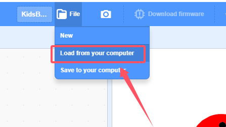
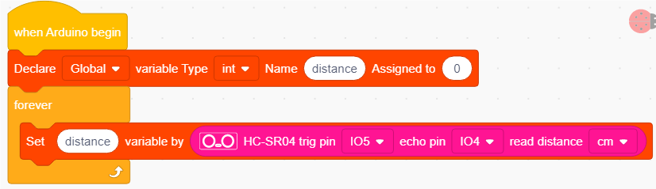
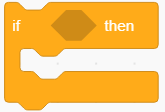
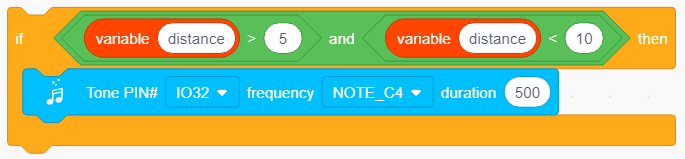
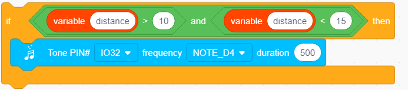
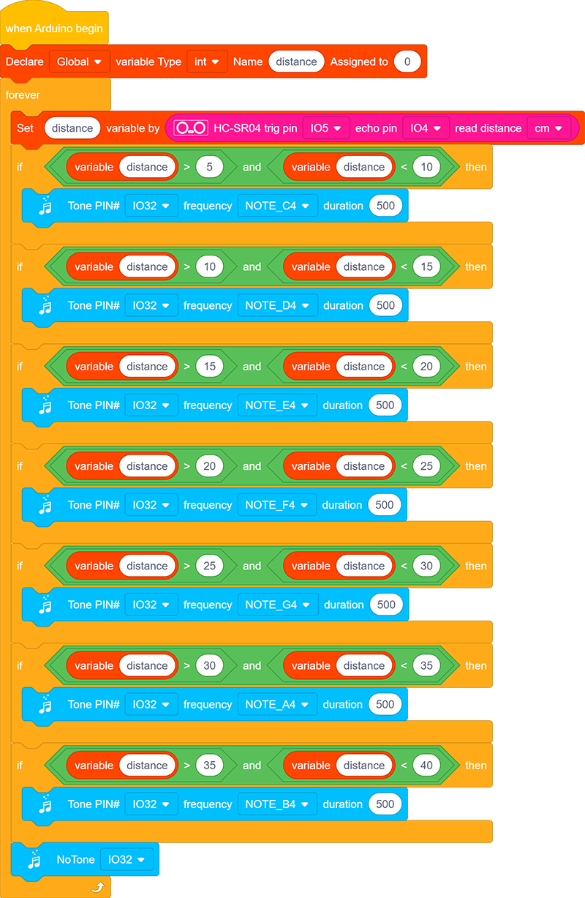

# 3.23 Human Body Piano

## 3.23.1 Overview

The analog piano mainly includes an ultrasonic sensor to detect the distance of your position. It plays different tones according to distance values. If there is an open space, you may place it on ground to play musics.

## 3.23.2 Test Code

### 3.23.2.1 Code Flow

### 3.23.2.2 Build Code

There are two ways to upload the code: directly open the code file we provide; or manually build blocks.

**Directly open the code file we provide:**

1. Click  and choose `Load from your computer`

2. We have already downloaded the codes on computer desktop, so open the file and choose `3-23-separatedPiano.sb3`

**Manually build blocks:**

1. Build the two basic blocks:

2. Declare a variable and name to *distance*
3. Assign the detected value by the ultrasonic sensor to *distance*

2. Add a  to determine the value of *distance*. If **distance > 5 and distance < 10**, the speaker will play Tone Do.

3. Duplicate the above code blocks, and modify the condition to **distance > 10 and distance < 15**. Under this condition, the speaker plays Re.

4. Duplicate the above code blocks, and modify the condition to **distance > 15 and distance < 20**. Under this condition, the speaker plays Mi.
5. Duplicate the above code blocks, and modify the condition to **distance > 20 and distance < 25**. Under this condition, the speaker plays Fa.
6. Duplicate the above code blocks, and modify the condition to **distance > 25 and distance < 30**. Under this condition, the speaker plays So.
7. Duplicate the above code blocks, and modify the condition to **distance > 30 and distance < 35** . Under this condition, the speaker plays La.
8. Duplicate the above code blocks, and modify the condition to **distance > 35 and distance < 40**. Under this condition, the speaker plays Si.
9. At last, add a  to stop the tone playing.

**Complete Test Code**

### 3.23.2.3 Test Result

After uploading code, put your hand in front of the ultrasonic sensor and the speaker will emit sound. You can control the tone by moving your hand in front of the sensor.

Tones corresponding to distance: 

Do: 5-10cm

Re: 10-15cm

Mi: 15-20cm

Fa: 20-25cm

So: 25-30cm

La: 30-35cm

Si: 35-40cm

