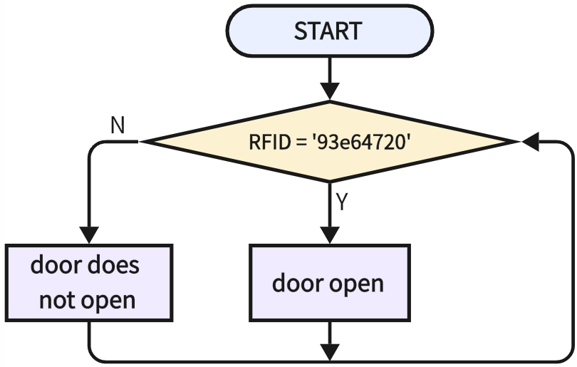
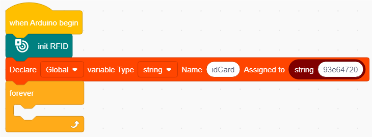
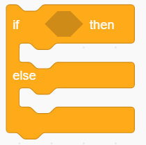
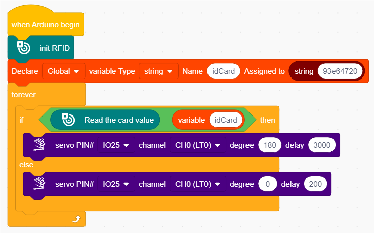

# 3.26 Access Card

## 3.26.1 Overview

A common access card is a  magnetic card or a key chain. So in this experiment, we make a simple access device through servo, a magnetic card and an RFID module.

## 3.26.2 Code Blocks

 

This block assigns strings. You only need to input strings into it. 

## 3.26.2 Test Code

### 3.26.2.1 Code Flow

ATTENTION: '93e64720' is my IC card code in the experiment. You need to replace it with yours (details please see in chapter 7.8).

### 3.26.2.2 Build Code

There are two ways to upload the code: directly open the code file we provide; or manually build blocks.

**Directly open the code file we provide:**

1. Click  and choose `Load from your computer`

2. We have already downloaded the codes on computer desktop, so open the file and choose `3-26-accessControl.sb3`

**Manually build blocks:**

1. Build the two basic blocks:
2. Add a  to initialize the RFID module.
3. Declare a string variable named “idCard”

4. In ,  drag  and input “93e64720” ('93e64720' is my IC card code in the experiment. You need to replace it with yours), and put this block into the assignment box of 

5. use  to determine the read code of RFID module. If the code is “93e64720”, the servo will rotate to 180 degree and stays for a delay of 3000. If not, the servo will stay still.

**Complete Test Code**

### 3.26.2.3 Test Result

After uploading code, put your IC card at the sensing area of the RFID module, and the servo will rotate to 180 degree for 3s and then come back. If the card code is not correct, the servo will stay still.