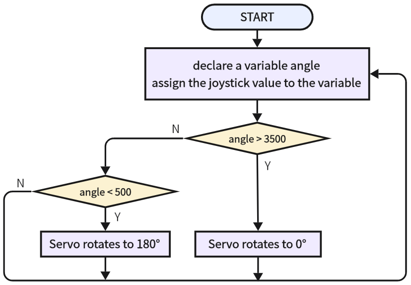
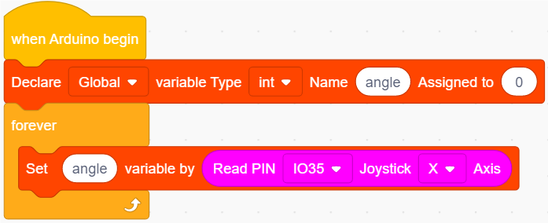
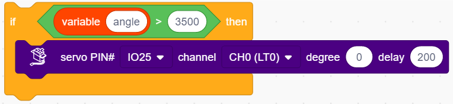
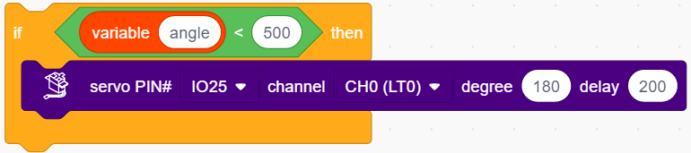
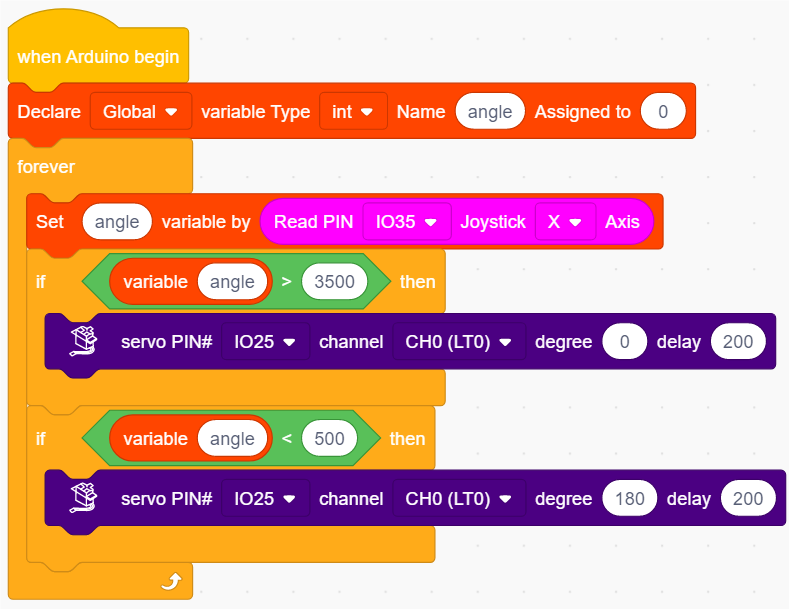

# 3.31 Joystick Control Servo

## 3.31.1 Overview

We control the servo via the axis X of the joystick. This model is widely applied to mechanical ON/OFF of lights and doors.

## 3.31.2 Test Code

### 3.31.2.1 Code Flow

### 3.31.2.2 Build Code

There are two ways to upload the code: directly open the code file we provide; or manually build blocks.

**Directly open the code file we provide:**

1. Click  and choose `Load from your computer`

2. We have already downloaded the codes on computer desktop, so open the file and choose `3-31-remoteControlServo.sb3`

**Manually build blocks:**

1. Build the two basic blocks:
2. Declare a variable *angle* and assign the x value of joystick to *angle*.

3. Add a  to determine whether *angle* > 3500. If yes, servo rotates to 0 degree.

4. Add a  to determine whether *angle* < 500. If yes, servo rotates to 180 degree.

**Complete Test Code**

### 3.31.2.3 Test Result

After uploading code, push the joystick to the left and the servo rotates to 180 degree. Push it to the right and the servo rotates to 0 degree.