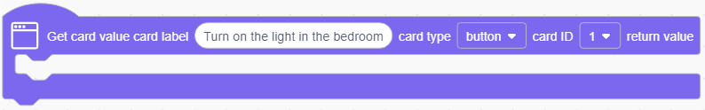
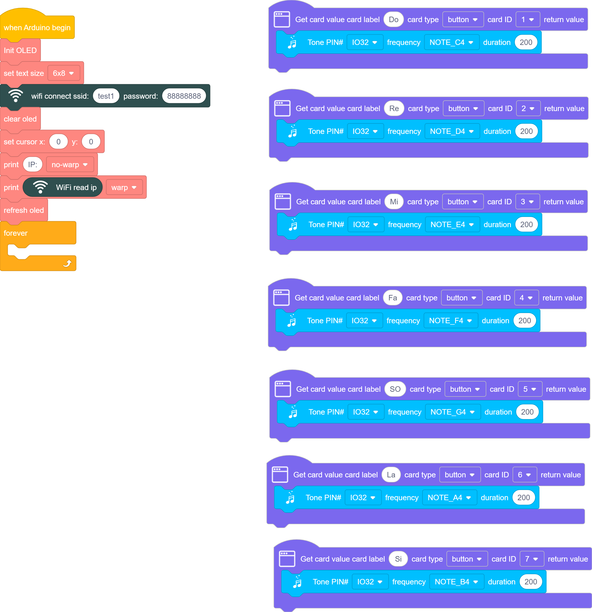
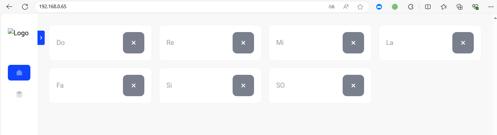

# 3.37 WiFi Piano

## 3.37.1 Overview

In this project, we set seven buttons to control the speaker to play tones of Do, Re, Mi, Fa, So, La, Si.

## 3.37.2 Test Code

### 3.37.2.1 Build Code

There are two ways to upload the code: directly open the code file we provide; or manually build blocks.

**Directly open the code file we provide:**

1. Click  and choose `Load from your computer`

2. We have already downloaded the codes on computer desktop, so open the file and choose `3-37-wifiWebPiano.sb3`

**Manually build blocks:**

1. Initialize wifi and OLED module, display the IP address of the wifi on the OLED
2. define buttons through , modify the button names and functions, press buttons to play tones of Do, Re, Mi, Fa, So, La, Si.

**Complete Test Code**

### 3.37.2.2 Test Result

Upload the code, and the OLED shows the IP address after connecting to wifi. 

Connect your computer/mobile phone and ESP32 to the same wifi, and you can access the IP address to see the control page through your device. 

