# KidsBlock Desktop Tutorial

## 1. KidsBlock Desktop Graphical Programming

KidsBlock Desktop is a graphical programming tool designed to help children and beginners learn programming. It uses a visual programming interface to build programs by dragging code blocks rather than writing codes directly. This is especially suitable for users without programming background, as it simplifies the process and lowers the learning threshold.

**Main Features:**

1. **Graphical interface**: Users create programs by dragging code blocks with different functions (such as loops, conditional judgments, variables, etc.), rather than learning complex code syntax issues. 
2. **Educational orientation**: It is designed for children and teens with a user-friendly interface, and it helps them learn programming thinking and logic in fun.
3. **Interactive learning**: Through graphical programming, children see how the programs they write process and respond in real time, increasing the joy and interactivity.
4. **Diversified functional blocks**: It provides a wealth of blocks for the creation of different types of programs and projects, including simple animations, games and gadgets.
5. **Easy to expand**: Some versions of KidsBlock are able to extend the functionality through custom modules or plug-ins, thus providing more programming possibilities.

With graphical programming, KidsBlock Desktop aims to stimulate children's interest in programming and develop their problem-solving and logical thinking skills.

## 2. Install Kidsblock on Windows

1.Download Kidsblock package: [http://xiazai.keyesrobot.cn/KidsBlock.exe](http://xiazai.keyesrobot.cn/KidsBlock.exe)

2.Click “KidsBlock Desktop.exe”.

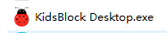

3.Tick “**Anyone who uses this computer(all users)**” and click “**Next**”.

4.Click “**Browse...**” to choose a path for the software (here we choose Disk C) and then “**Install**”.

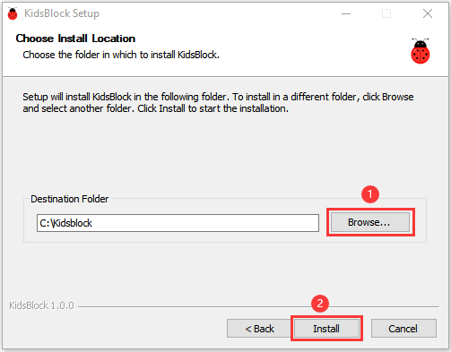

5.Click “Finish” and open Kidsblock.

6.If a warning interface pops up, just “**Allow access**”. 

​	Main interface of Kidsblock:

## 3. Install Kidsblock on MacOS

1.Download Kidsblock package: [https://xiazai.keyesrobot.cn/KidsBlock.dmg](https://xiazai.keyesrobot.cn/KidsBlock.dmg)

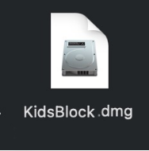

2.After downloading, Click KidsBlock. Drag the icon of KidsBlock Desktop into Applications.

3.After installation, you can see the icon of KidsBlock.

## 4. Kidsblock

(**Here we demonstrate on Windows, and it can be a reference for MacOS.**)

### 4.1  Main Interface Functions 1

### 4.2 Languages

Click  to choose “English” or “简体中文”: 

### 4.3 Driver

**NOTE: If the driver has already installed on your computer, please skip the following steps.**

Click  to choose “**Install driver**”.

A. Welcome to the Device Driver Installation Wizard and click “**Next**”.

B. “**Finish**”.

C. “**Next**”

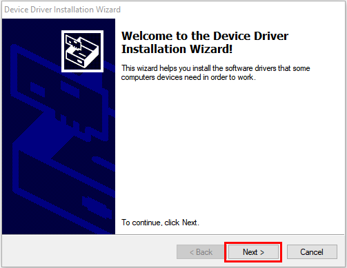

D. “**Finish**”

E. If a warning interface pops up, just “**Allow**”. And then click “**Install**”.

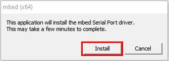

F.“**Install**”

G. “**Finish**”

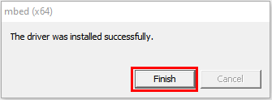

H. “**Extract**”

I. “**Next**”

J. Tick “**I accept this agreement**” and then “**Next**”.

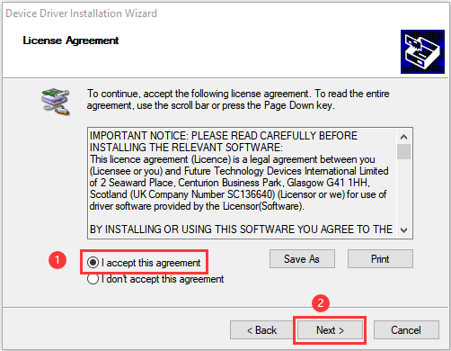

K. “**Finish**”

L. “**INSTALL**”

M. Wait for the completion of driver installing. And click “**OK**”.

### 4.4 Development Board

Click  to choose a control board. We have integrated the board we need in this software: click “Kit” and find “ESP32 coding box” to “**Connect**”. After connecting, “**Go to Editor**”. 

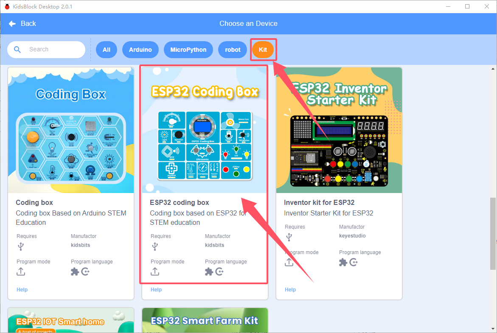

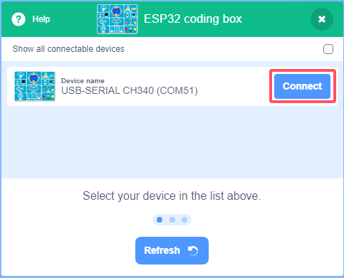

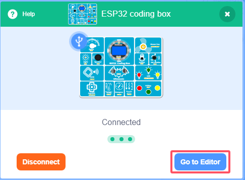

 changes into , and  changes into . These means ESP32 board and COM port are both connected.

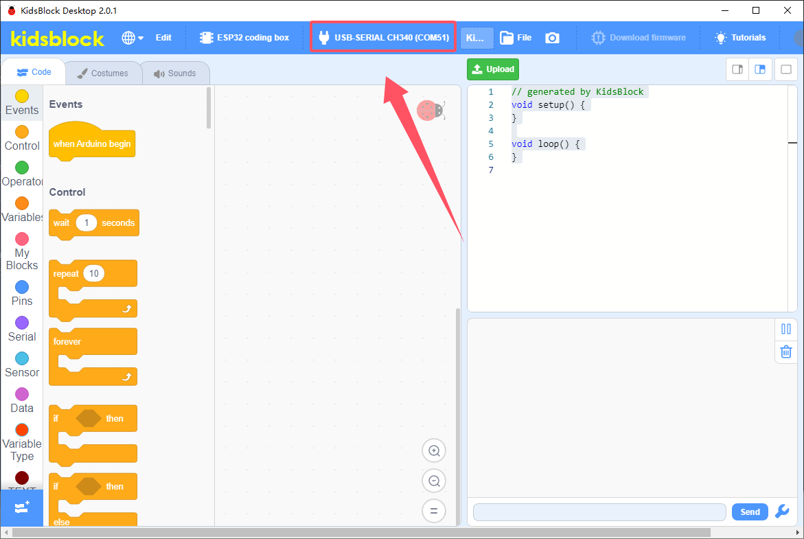

### 4.5 Serial Port

If the ESP32 board is connected but  does not change into , we need to set a COM port manually. 

Click  and “**Connect**”. When you see "connected", the port is set.

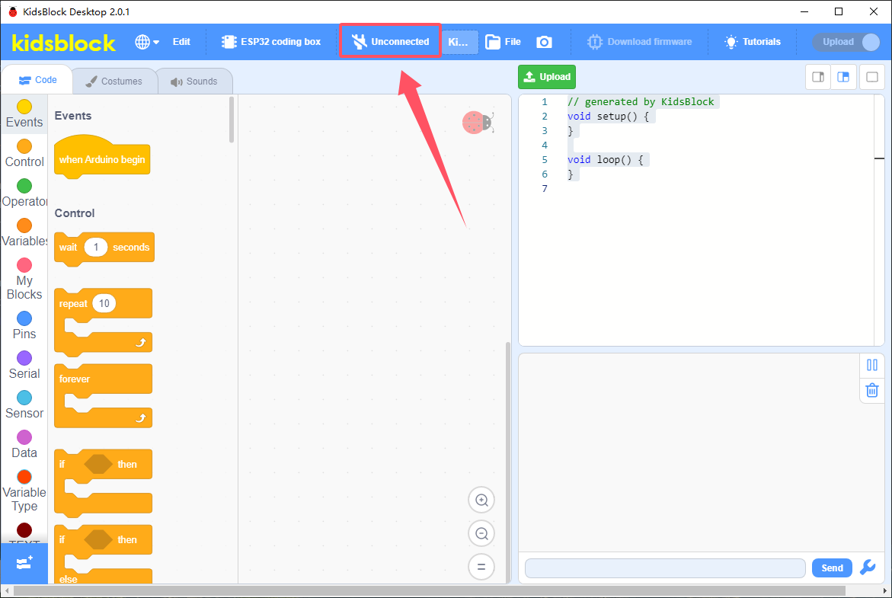

Disconnection: click  and “**Disconnect**”.

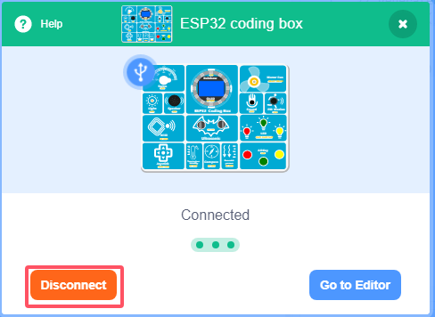

### 4.6 Main Interface Functions 2

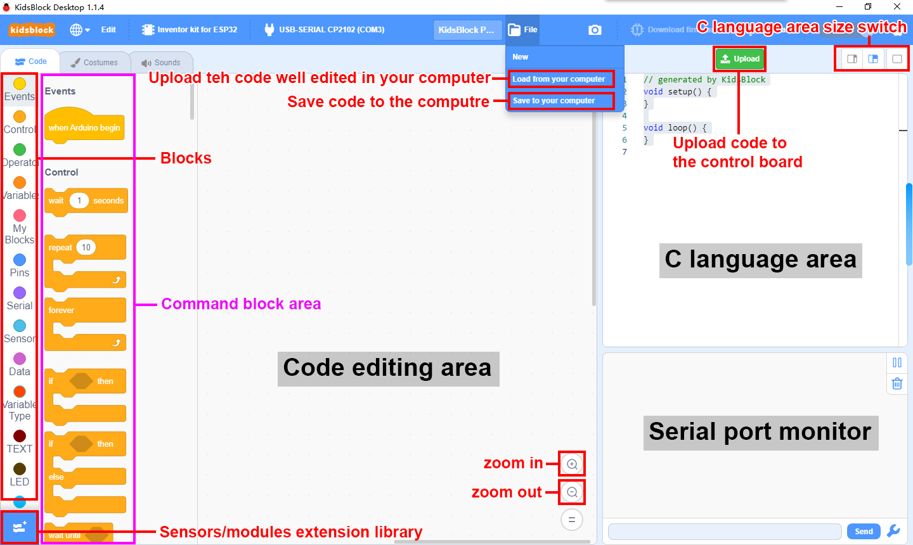

### 4.7 Extensions

**NOTE: All required modules are integrated in main board, so this section is for reference.**

Extensions: 

Click  to search and load sensors/modules. For instance, click “passive buzzer”  and “**Not loaded**” changes into “**Loaded**”. Passive buzzer is added.

   

Click  to back to editor, and you will see the Passive buzzer block.

If you want to remove it, enter  and click  again, and “Loaded” changes into “Not loaded”. That means this block is removed. 

    

### 4.8 Code

**Method 1:**

[click here to download codes](./codes.zip)

Click the SB3 file you want to load. If you want to open 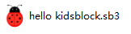, click it to directly load to the software. After that, connect to the board and port.

**Method 2:**

Open Kidsblock and click “**file**” to choose “**Load from your computer**”, open a file of .SB3, for example, .

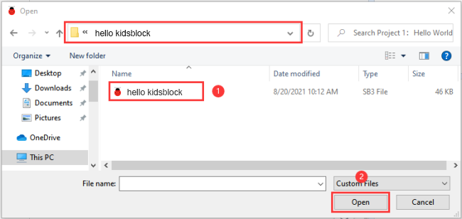

## 5.Upload Code and Set Baud Rate

### 5.1 Upload Code

Load  into Kidsblock, and set the development board and port. Click .

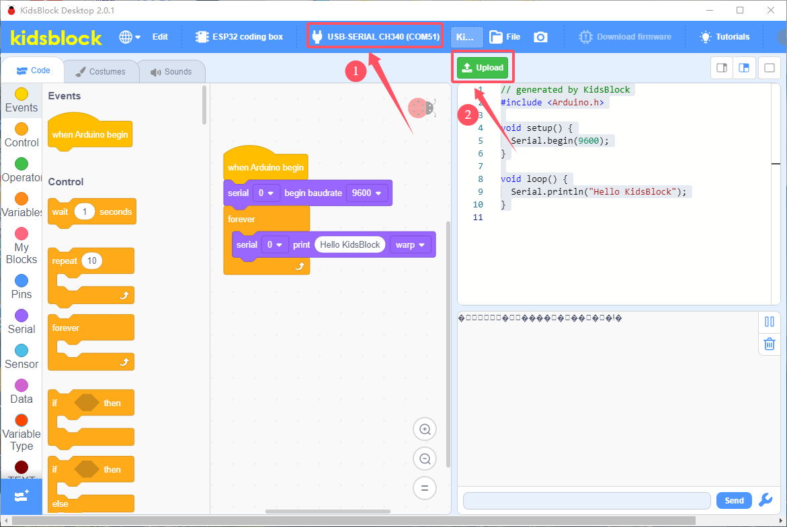

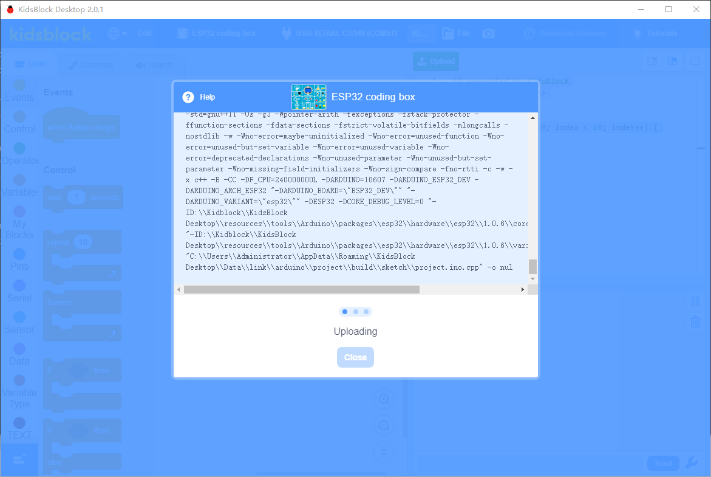

After uploading, the printing box of Kidsblock prints “Hello KidsBlock”.

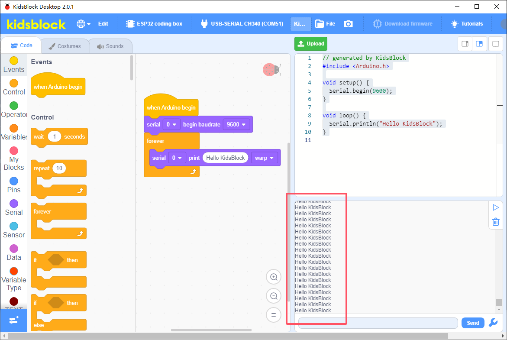

### 5.2 Set Baud Rate

Set printing box: 

: small

: large

: none

If there is no output or it outputs garbled words, please click  to set baud rate first. The baud rate should be consistent with the code. Here it is 9600.

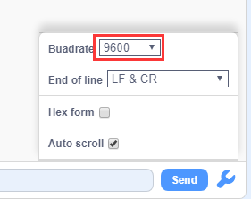

## 6. Tutorial Download

Click to download the compressed code file and extract it, then store it on the computer desktop.

[click here to download](./codes.zip)

## 7. ESP32 Coding Box

### 7.1 LED Blink

#### 7.1.1 Overview

LED Blink is one of the simplest entry-level programming projects. It only needs an LED and then upload the code  This simple project helps beginners better master basic concepts.

#### 7.1.2 Schematic Diagram

**LED lighting on:** The output current of the IO ports is limited, so the LED brightness may not be enough. Therefore, a NPN triode (Q2) is added to the circuit as a switch. We only need to add a high(low) level at the triode base pin 1 to light it up(out).

**Triode on/off:** To put it simple, when the base(pin 1) receives a high level, the collector(pin 3) and the transmitter(pin 2) are connected, so then VCC passes through the current-limiting resistor to the LED and then into the triode to GND, forming a loop. At this time, LED is on. When pin 1 receives a low level, pin 3 and 2 are disconnected so the current loop cannot be formed, resulting LED off.

#### 7.1.3 Code Blocks

1.  

	The start of the execution of a code. Codes will not run without this block. The module blocks that need to be initialized should be added below the block.

2.  

	Code run in here and are executing all the time (in a loop).

3.  

	This block controls the ON/OFF of an LED. You only need to set the pin and power level(HIGH/LOW).

4.  

	The delay seconds can be modified as needed. 

	Unit: s. 

	Some conversions: 1S=1000mS; 1mS=1000uS; For instance, if a delay of 10ms is required, input 0.01.

#### 7.1.4 Test Code

##### 7.1.4.1 Build Code

There are two ways to upload the code: directly open the code file we provide; or manually build blocks.

**Directly open the code file we provide:**

1. Click  and choose `Load from your computer`

2. We have already downloaded the codes on computer desktop, so open the file and choose `7-1-led.sb3`

**Manually build blocks:**

1. In , find  block.
2. In 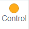, find and place  block under .

3. In , drag and put  block into . Set pin to IO23 and output to HIGH.

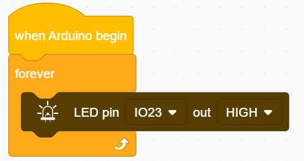

4. In , add a delay  of 500ms. So we set it to 0.5s.

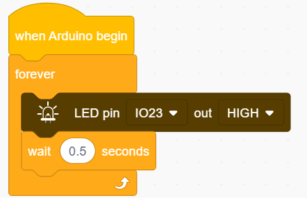

5. Right-click  and you will see . Choose `Duplicate` and put the copy under :

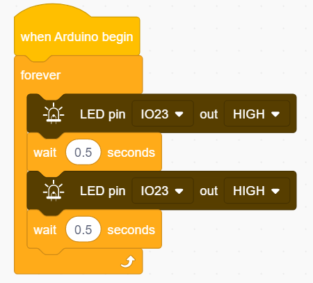

6. Modify  output into LOW.

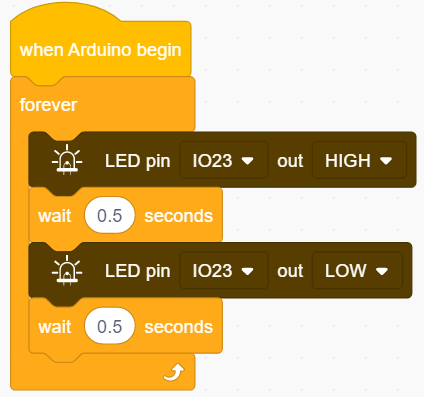

##### 5.1.4.2 Test Result

After uploading code, the red LED will blink with an interval of 0.5 seconds.

#### 7.1.5 Extension

If you want the LED to blink more frequently, just modify the delay time in . If we set the time shorter, it will blink faster. Now let's set it to 0.25s.

##### 7.1.5.1 Test Code

There are two ways to upload the code: directly open the code file we provide; or manually build blocks.

**Directly open the code file we provide:**

1. Click  and choose `Load from your computer`

2. We have already downloaded the codes on computer desktop, so open the file and choose `7-1-led2.sb3`

**Manually build blocks:**

Build code blocks as above but set delay to 0.25.

##### 7.1.5.2 Test Result

After uploading code, the red LED will blink with an interval of 0.25 seconds. Compared to 7.1.4.1, it blinks more frequently.

### 7.2 Sound Sensor

#### 7.2.1 Overview

The sound sensor, with excellent sound reception, mainly contains a high sensitivity microphone and an LM358 operational amplifier. Weak sound signals are captured by the microphone and amplified by LM358, so the output is clear and recognizable, which can be effectively detected the sounds. 

This sensor features high sensitivity, fast response speed, so is widely used in sound detection and recognition, providing a stable and reliable voice input solution for various intelligent devices.

#### 7.2.2 Schematic Diagram

**Working principle:** If the built-in electret film vibrates after receiving sounds, its capacitance will change to produce a tiny voltage. The LM358 chip is adopted in circuits to amplify the sound signals detected by the high-sensitivity microphone.

#### 7.2.3 Code Blocks

1.  

	This block sets baud rate, generally 9600 or 115200. In this project, the baud rate is 9600 by default.

2.  

	This block sets printing content on the monitor. There are three printing modes can be set: warp, no-warp, HEX(hexadecimal). **Warp** is the default mode. 

3.  

	This module reads the analog value of the detected sound. 

#### 7.2.4 Test Code

##### 7.2.4.1 Build Code

There are two ways to upload the code: directly open the code file we provide; or manually build blocks.

**Directly open the code file we provide:**

1. Click  and choose `Load from your computer`

2. We have already downloaded the codes on computer desktop, so open the file and choose `7-2-sound.sb3`

**Manually build blocks:**

1. In , find  block.
2. In , find  block and set baud rate to 9600, and put it under .
3. In , put  under .

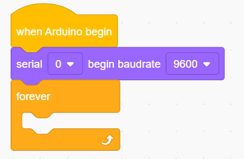

4. In , place  block into 
5. In , drag and put  into the content box of .

**Complete Test Code**

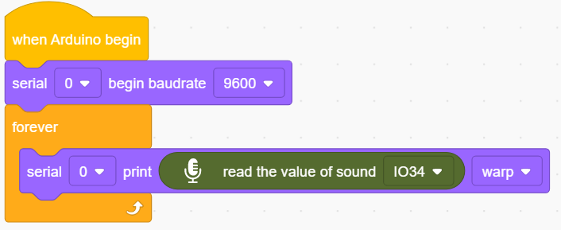

##### 7.2.4.2 Test Result

After uploading code, the analog value of the sound will be printed on the serial monitor. Note that click  to set the baud rate before uploading code.

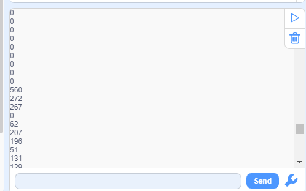

### 7.3 PIR Motion Sensor

#### 7.3.1 Overview

The PIR motion sensor adopts RE200B-P element. 

Based on pyroelectric effect, the sensor is able to detect the infrared ray emitted by human body or animal. With Fresnel lens, it can even detect farther and wider. When a nearby human or animal motion is detected, the sensor outputs a high level.

####  7.3.2 Schematic Diagram

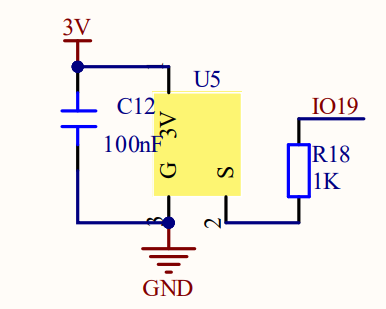

**Working principle:** The human body maintains at 37 degrees, so it will emit a specific wavelength of about 10μm infrared. The sensor captures 10μM infrared to determine whether there is a motion.

#### 7.3.3 Code Blocks

1.  

	This block reads PIR motion sensor value. If there is a human motion, it outputs 1; otherwise, it outputs 0. 

2.  

	This block determines whether a condition is satisfied. If yes, code in “if” will be executed. Or else, code in “else” will be executed.

#### 7.3.4 Test Code

##### 7.3.4.1 Build Code

There are two ways to upload the code: directly open the code file we provide; or manually build blocks.

**Directly open the code file we provide:**

1. Click  and choose `Load from your computer`

2. We have already downloaded the codes on computer desktop, so open the file and choose `7-3-pir.sb3`

**Manually build blocks:**

1. In , find  block.

2. In , find  block and set baud rate to 9600, and put it under .

3. In , drag .

	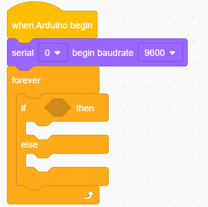

4. In , drag  into .

5. In , find and put  into the condition box of . 

	Add the following block under "if":  prints “Someone!”; Add the following block under "else":  prints “No one!”

**Complete Test Code**

##### 7.3.4.2 Test Result

After uploading code, when human motion is detected, the monitor prints “Someone!”; If not, it shows “No one!” (Note that click  to set the baud rate before uploading code to avoid garbled words.)

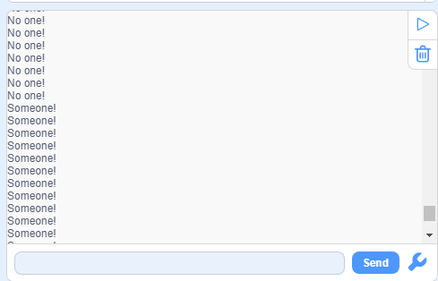

### 7.4 Power Amplifier

#### 7.4.1 Overview

The 8002b power amplifier mainly consists of a speaker and an audio amplification chip. It can amplify small audio signals for about 8.5 times. These amplified sounds will be played through its speaker. Besides, it can also play some music or melodies. 

####  7.4.2 Schematic Diagram

#### 7.4.3 Code Blocks

1.  

	This block sets tones and durations to emit a certain sound of tone.

2.  

	This block integrates some songs so that you can directly use.

3.  

	This block stops the play of tones.

#### 7.4.4 Test Code

##### 7.4.4.1 Build Code

There are two ways to upload the code: directly open the code file we provide; or manually build blocks.

**Directly open the code file we provide:**

1. Click  and choose `Load from your computer`

2. We have already downloaded the codes on computer desktop, so open the file and choose `7-4-speaker.sb3`

**Manually build blocks:**

1. In , find  block.
2. In , find and place  block under .

3. In , set frequency to NOTE_C4 and duration to 500 in block.
4. Similarly, add NOTE_D4, NOTE_E4, NOTE_F4, NOTE_G4, NOTE_A4, NOTE_B4
5. At last add a .

**Complete Test Code**

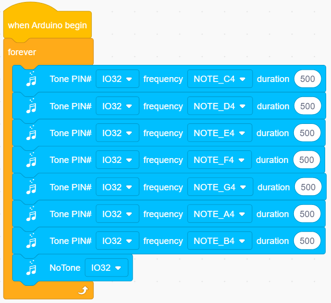

##### 7.4.4.2 Test Result

After uploading code, the power amplifier plays Do, Re, Mi, Fa, So, La, Si, in a loop.

####  7.4.5 Extension

We make the module to play music.

##### 7.4.5.1 Test Code

There are two ways to upload the code: directly open the code file we provide; or manually build blocks.

**Directly open the code file we provide:**

1. Click  and choose `Load from your computer`

2. We have already downloaded the codes on computer desktop, so open the file and choose `7-4-speaker2.sb3`

**Manually build blocks:**

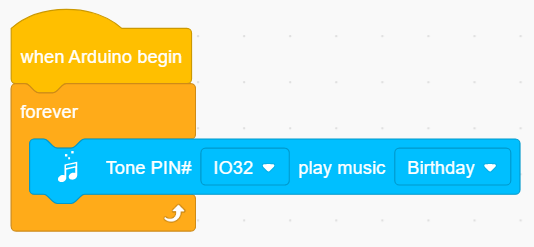

##### 7.4.5.2 Test Result

After uploading code, the amplifier plays *Birthday Song*.

### 7.5 Photoresistor

#### 7.5.1 Overview

Photoresistor is photoelectric device that works according to semiconductor photoconductivity. It can be used to sense the brightness of the current environment to output a corresponding analog value.

####  7.5.2 Schematic Diagram

Photoresistor takes advantage of the photoelectric effect of semiconductors. Its resistance varies with ambient light. 

In the light, the semiconductor material absorbs photon energy to produce electron-hole pairs, increasing the conductivity and reducing the resistance. The brighter the light is, the lower the resistance will be. From the changes of resistance, it can sense light intensity accurately. Therefore, it is widely used in automatic lighting, photoelectric control, real-time monitoring and regulation of light.

#### 7.5.3 Code Blocks

 

This block reads the analog value of the photoresistor.

#### 7.5.4 Test Code

##### 7.5.4.1 Build Code

There are two ways to upload the code: directly open the code file we provide; or manually build blocks.

**Directly open the code file we provide:**

1. Click  and choose `Load from your computer`

2. We have already downloaded the codes on computer desktop, so open the file and choose `7-5-light.sb3`

**Manually build blocks:**

1. In , find  block.
2. In , find  block and set baud rate to 9600, and put it under .
3. In , put  under .

4. In , drag block  into 

5. In , find block  into the print box of 

6. At last, add a delay of 0.5s for better observing the results.

   

   **Complete Test Code**

   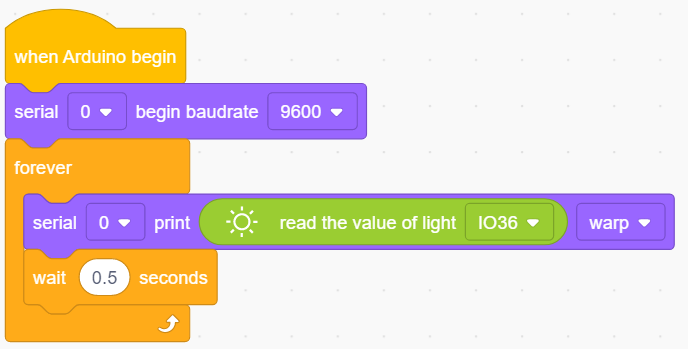

##### 7.5.4.2 Test Result

After uploading code, the serial monitor will print the analog value of the photoresistor. Cover the sensor with your hand, and you will see the value decreases. (Note that click  to set the baud rate before uploading code to avoid garbled words.)

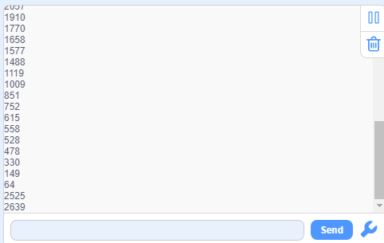

### 7.6 AD Button

#### 7.6.1 Overview

The AD button requires only one analog pin to read multiple button states, which greatly saves IO ports. It adopts analog acquisition, and the output voltages vary from pressed buttons, so that different analog values can be obtained. We can determine which button is pressed according to these values.

####  7.6.2 Schematic Diagram

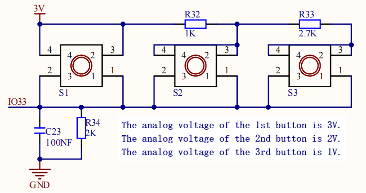

From the Schematic Diagram: 

When no button is pressed, the output at signal pin IO33 is pulled down by R34 (connected to GND. So the analog value of IO33 is 0, that is, low level 0V;

When button S1(the red button) is pressed, pin IO33 is connected to VCC. So the analog value of IO33 is 4095 (voltage = 3.3V).

When button S2(the yellow button) is pressed, the voltage of IO33 is that between R32 and R34: VCCxR34/(R32+R34) ≈ 2.2V, and the analog value is about 2432;

When button S3(the green button) is pressed, the voltage of IO33 is that between R32+R33 and R34: VCCxR34/(R32+R33+R34) ≈ 1.1V, and the analog value is about 1175.

#### 7.6.3 Code Blocks

1.  

	This block reads the analog value of AD button module and determines which button is pressed according to this value.

2.  

	This block declares variables. Its type is int by default. You can input a Name and an Assignment(initial value).

3.  

	This block records a value of a variable so that we can directly use it to replace the value. Before using, you only need to modify its name into the needed variable.

4.  

	This block assigns a value to a variable. For example, we need to assign 100 to variable val, just input the variable name and value in the block accordingly. 

5.  

	This is a comparison block that compares the values on both sides. If the left one is greater than the right one, output 1; or else, output 0.

6.  

	Similarly, this is also a comparison block. If the left one is lower than the right one, output 1; or else, output 0.

7.  

	This is a logical block with two condition boxes. Only when both sides output 1, this block outputs 1. One or both of the two sides output 0, and this block will output 0.

8.  

	This "if...then" block determines conditions. Put condition(s) in the diamond box to output 1 or 0 (as above introduced). If 1 is output, execute the following codes; If it is 0, do not execute. 

#### 7.6.4 Test Code

##### 7.6.4.1 Build Code

There are two ways to upload the code: directly open the code file we provide; or manually build blocks.

**Directly open the code file we provide:**

1. Click  and choose `Load from your computer`

2. We have already downloaded the codes on computer desktop, so open the file and choose `7-6-adKey.sb3`

**Manually build blocks:**

1. In , find  block.
2. In , find  block and set baud rate to 9600, and put it under .
3. In 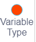, find and drag block  under .
4. In , put  under 

5. In , put  into 

6. In , find  and put it into the variable name box in 

   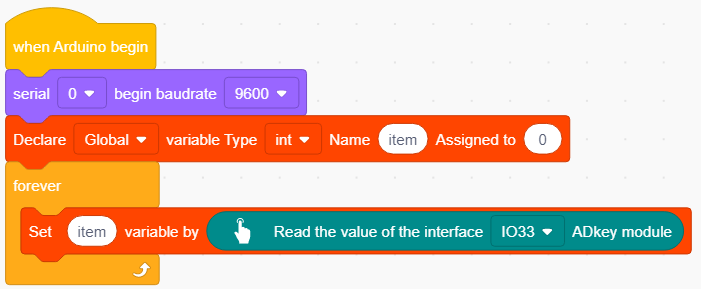

5. In , place  under
6. In , put  into
7. At last, add a delay of 0.3S for better observing results.

**Complete Test Code**

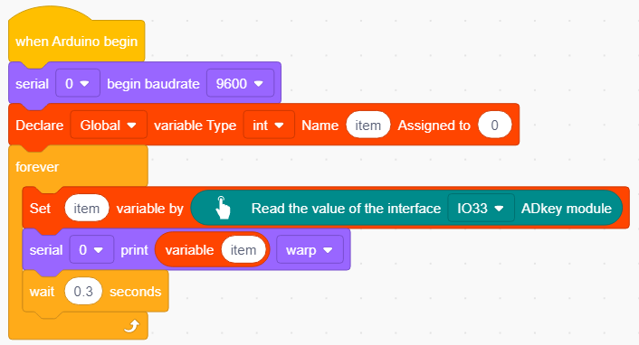

##### 7.6.4.3 Test Result

After uploading code, the serial monitor will print the analog value of the module. When the red button is pressed, the value is about 4095, and the yellow is about 2432, and the green is about 1175. If no button is pressed, the value equals 0.

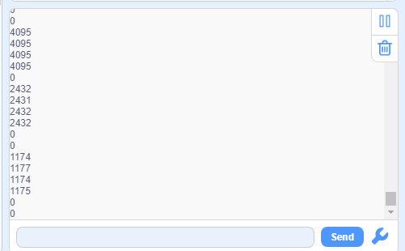

####  7.6.5 Extension

##### 7.6.5.1 Code Flow

AD button logic table: 

|      Button       | the analog value of button being pressed | the analog value of button being released |
| :---------------: | :--------------------------------------: | :---------------------------------------: |
|  the red button   |                   4095                   |                     0                     |
| the green button  |                about 2432                |                     0                     |
| the yellow button |                about 1175                |                     0                     |

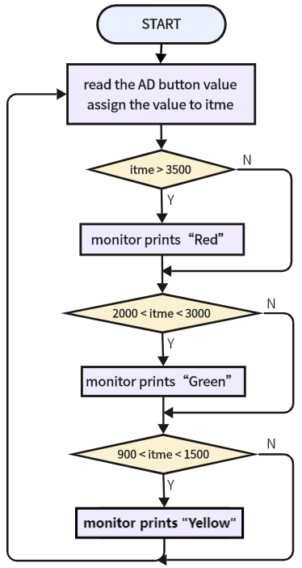

##### 7.6.5.2 Test Code

There are two ways to upload the code: directly open the code file we provide; or manually build blocks.

**Directly open the code file we provide:**

1. Click  and choose `Load from your computer`

2. We have already downloaded the codes on computer desktop, so open the file and choose `7-6-adKey2.sb3`

**Manually build blocks:**

Based on `7-6-adKey.sb3`, we add a condition statement to determine the read analog value of AD button module so that we can tell which button is pressed.

1. Remove block : just click **Delete**
2. In , put  under 
3. In , put  into the condition box of 

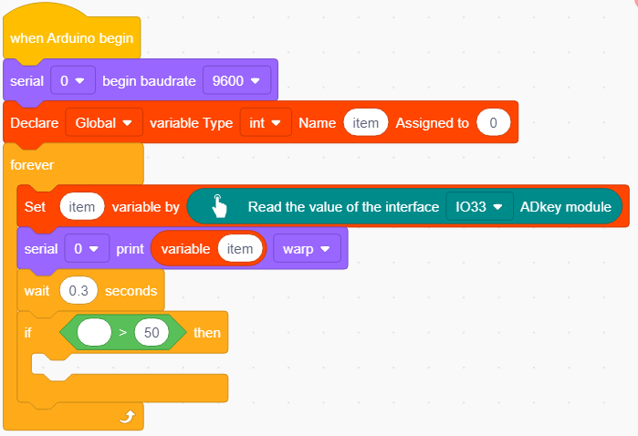

4. In , put into the left part of , and input 3500 in the right: itme > 3500

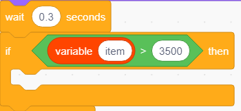

5. In , put  into the "if...then" block  and modify the printing content into “Red”, so as to determine whether the red button is pressed.

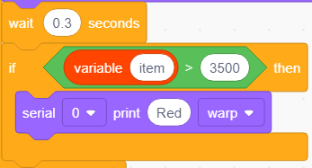

6. In , drag  under 

7. In , put  into the condition box of 

8. In , find block , and put  in its left part and modify the right part to 3000:  item < 3000

9. In , find block , and put  in its left part and modify the right part to 3000:  item > 2000

10. Put  into  respectively. 

	Add a  under , and modify the printing content into “Green”.

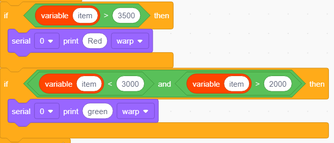

11. Duplicate 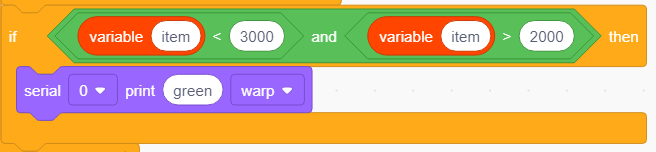 and modify 3000 to 1500, and 2000 to 100, and printing content into “Yellow”: 

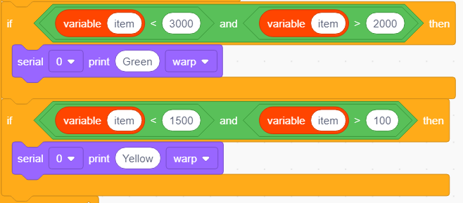

**Complete Test Code**

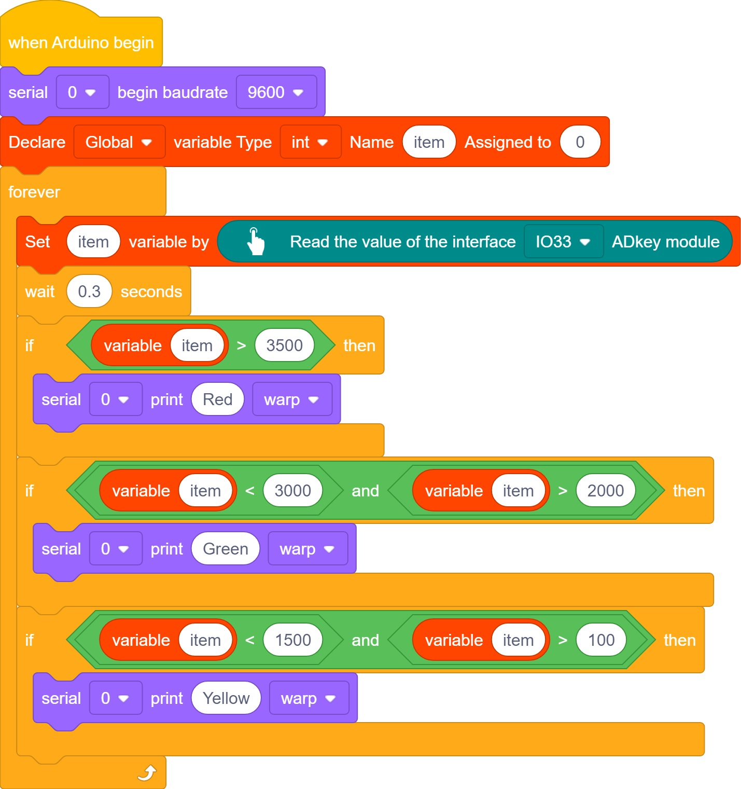

##### 7.6.5.3 Test Result

After uploading code, the serial monitor will print the colors of the buttons. If one of the buttons is pressed, its color will be displayed: “Red”, “Green” or “Yellow”.

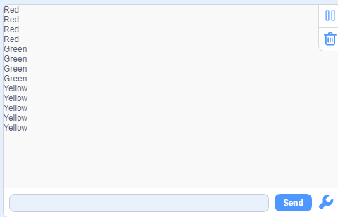

### 7.7 Ultrasonic Sensor

#### 7.7.1 Overview

Ultrasonic sensor measures the distance of an object by sound waves. It boasts a transmitter and a receiver to emit sound waves and then measure the returned waves. The time difference between transmitting and receiving can be used to calculate the distance value. Beyond that, it is also used to detect the shape or presence of objects, build automatic doors, and measure flow rates and pressures.

####  7.7.2 Schematic Diagram

**Working principle:** Like bats, the ultrasonic sensor sends an ultrasonic signal with a high frequency that human cannot hear. If these signals encounter obstacles, they will immediately reflect back and be received by the sensor. After that, the distance between the sensor and the obstacle is calculated according to the time difference between signals transmitting and receiving. 

**Maximum detection distance:** 3M

**Minimum detection distance:** 4cm

**Detection angle:** no greater than 15 degrees

#### 7.7.3 Code Blocks

 

This block reads the distance value. You can modify its unit into cm (default) or inch.

#### 7.7.4 Test Code

##### 7.7.4.1 Build Code

There are two ways to upload the code: directly open the code file we provide; or manually build blocks.

**Directly open the code file we provide:**

1. Click  and choose `Load from your computer`

2. We have already downloaded the codes on computer desktop, so open the file and choose `7-7-ultrasonic.sb3`

**Manually build blocks:**

1. In , find  block.
2. In , find  block and set baud rate to 9600, and put it under .
3. In , put  under 

4. In , put  in the block  and set the printing content to “Distance:” in no-warp mode.

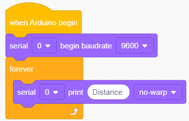

5. In , put  under the block 

4. In , put  into the printing content of .

5. At last add a delay of 0.5S for better observing results.

**Complete Test Code**

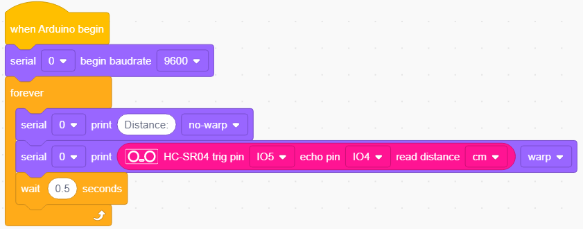

##### 7.7.4.2 Test Result

After uploading code, the serial monitor prints the distance values and refreshes them per second.

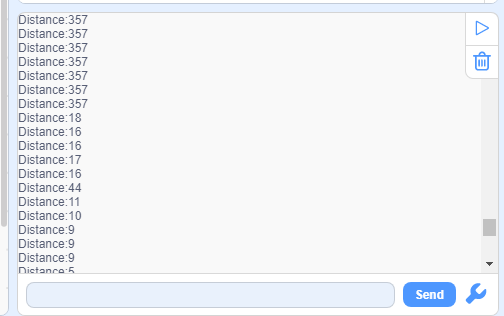

### 7.8 RFID Sensor

#### 7.8.1 Overview

RFID-RC522 module adopts Phillips MFRC522 original chip in card reading circuit, which is easy to use and with low cost. It is suitable for equipment and reader development, advanced applications, RF card terminal design and producing.

####  7.8.2 Schematic Diagram

**RFID (Radio Frequency Identification)**: 

The card reader is composed of a frequency transmitter module and a high level magnetic field. The Tag transponder is a device to be sensed without a battery. It consists only of tiny integrated circuit chips, media for storing data, and antennas for receiving and transmitting signals. To read the data in the tag, it must be placed within the reading range of the reader. After that, the reader will generate a magnetic field. According to Lenz's law (magnetic energy generates electricity), the RFID Tag will be powered, thus activating the device.

NOTE: this module only recognize card working at 13.56MHz. It is recommended to use the provided card in the kit.

#### 7.8.3 Code Blocks

1.  

	This block initializes RFID module. Without it, its data cannot be read.

2.  

	This block reads the card value of the RFID sensor.

3.  

	This is a comparison block that determines whether the value of two parts equals each other. When they are equal, it outputs 1, or else it outputs 0.

4.  

	This is a logical block to reverse the value. That means this block outputs 0 when the condition block outputs 1, and it outputs 1 when the condition outputs 0. It reverses outputs. 

5.  

	This is a conversion block that converts values into one of types of integer, decimal or string.

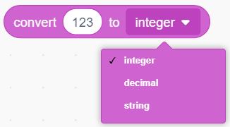

#### 7.8.4 Test Code

##### 7.8.4.1 Build Code

There are two ways to upload the code: directly open the code file we provide; or manually build blocks.

**Directly open the code file we provide:**

1. Click  and choose `Load from your computer`

2. We have already downloaded the codes on computer desktop, so open the file and choose `7-8-rfid.sb3`

**Manually build blocks:**

1. In , find  block.
2. In , find and put  under 
3. In , find  and set baud rate to 9600
4. In , put  under , and set variable Type to `string`
5. In , put  below the block 

6. In , place  in 
7. In , put  in the right box of block 
8. In , add a  under 
9. In , put  into the condition box of 
10. In , put  into the condition box of 

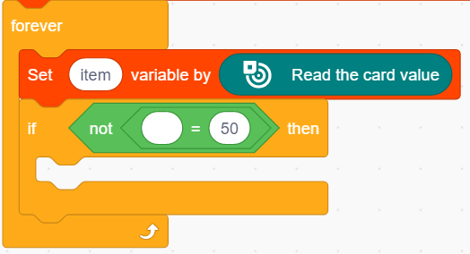

11. In , put  into the left part of 

12. In , put  into the right part of  and modify the conversion value to “0” and conversion type to "string".

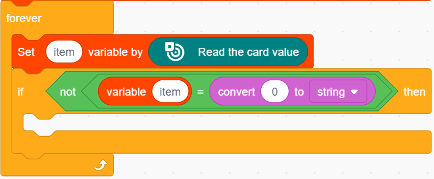

13. In , find  and put it into 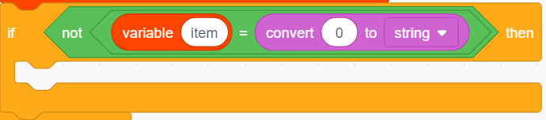, and modify the printing content into “RFID:” and set printing mode to no-warp.

14. Drag another , and then add a variable block  into the printing content box.

As follows:

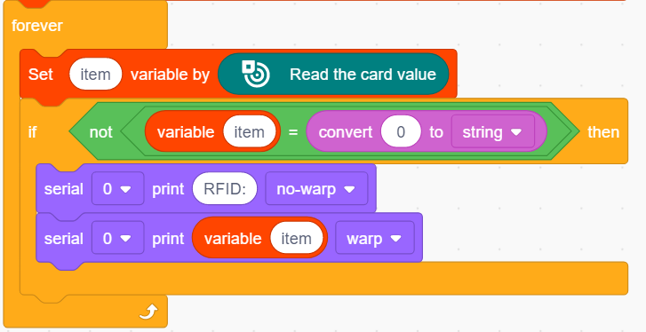

**Complete Test Code**

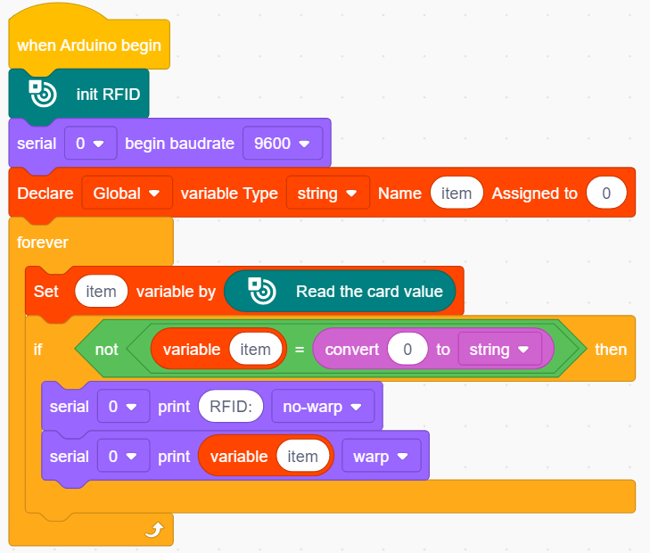

##### 7.8.4.2 Test Result

After uploading code, cover the RFID sensing area with the IC card or the key in the kit, and you will see the serial monitor prints the ID numbers.

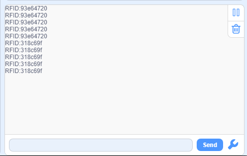

### 7.9 Axis-X&Y Joystick Module

#### 7.9.1 Overview

Axis-X&Y Joystick is a high-precision input device for bidirectional control. Its X and Y axes are separated to control horizontal and vertical movements respectively. This module contains 10K resistance so that it ensures the stability and accuracy of signals. 

####  7.9.2 Schematic Diagram

ESP32 Axis-X&Y Joystick works based on a two-axis potentiometer that detects movements on two axes. When the joystick moves on axis X or Y, the resistance of the potentiometer changes, outputting analog voltage signals. After being received by ESP32 analog input pin (ADC), these signals will be read by ESP32 board and converted to digital values. Therefore, the joystick coordinate can be easily revealed during controlling. 

#### 7.9.3 Code Blocks

 

This block reads the values of Axis-X&Y Joystick module. You can set pins and axis.

#### 7.9.4 Test Code

##### 7.9.4.1 Build Code

There are two ways to upload the code: directly open the code file we provide; or manually build blocks.

**Directly open the code file we provide:**

1. Click  and choose `Load from your computer`

2. We have already downloaded the codes on computer desktop, so open the file and choose `7-9-joystick.sb3`

**Manually build blocks:**

1. In , find  block.
2. In , find  block and set baud rate to 9600, and put it under .
3. In , drag .

4. In , put  into , change printing content into “X:” and set to no-warp.

5. Add another  and set to no-warp

6. In , find and drag block  into the printing content box of  , set pin to IO35 and axis to X

   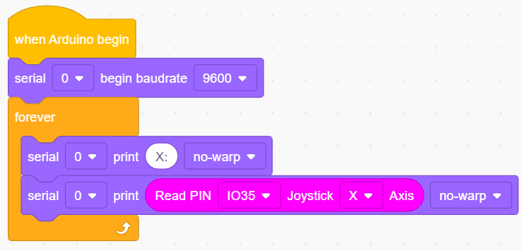

   

7. Duplicate block , and modify the printing content “X:” into “    Y:”(the two spaces separates the two values to be output). Change pin to IO39 and set axis to Y.

8. Add a delay of 0.3s for better observing results. 

   

**Complete Test Code**

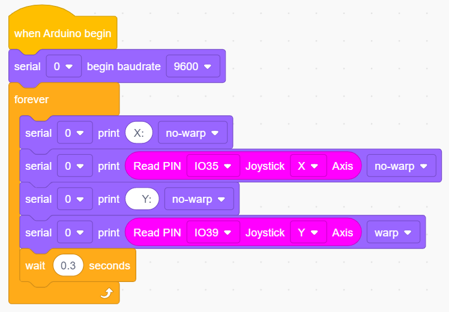

##### 7.9.4.2 Test Result

After uploading code, the serial monitor prints the values on axis X and Y. Toggle the joystick, and these value changes. 

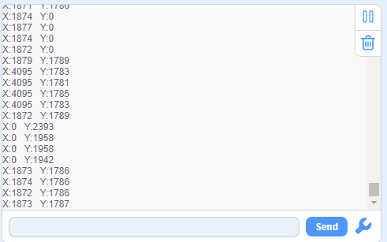

### 7.10 Temperature and Humidity Sensor

#### 7.10.1 Overview

AHT20 temperature and humidity sensor adopts I2C interface and 20Bit ADC, and its operating voltage is 2V-5V. It features small volume, stable performance and high precision (accuracy: temperature ±0.3℃, humidity ±2%RH). So it is widely used in smart home, consumer electronics, medical and automotive. The sensor is stable and can work in harsh environments.

####  7.10.2 Schematic Diagram

ATH20 temperature and humidity sensor transmits data via I2C interface, and it works according to resistive and capacitive technology. It detects the temperature because the material's conductivity changes with temperature, and it reflects humidity through the change in the capacitance value. The temperature measurement range is -40 ° C to +85 ° C with accuracy of ±0.3 ° C, and the humidity range is 0% ~ 100%RH ±2%RH. Besides, it features high accuracy, high reliability and long-term stability. With I2C protocol, ATH20 provides real-time and accurate temperature and humidity data under a variety of environmental conditions.

#### 7.10.3 Code Blocks

 

This block reads reads the temperature and humidity values. But it only reads one of them at once.

#### 7.10.4 Test Code

##### 7.10.4.1 Build Code

There are two ways to upload the code: directly open the code file we provide; or manually build blocks.

**Directly open the code file we provide:**

1. Click  and choose `Load from your computer`

2. We have already downloaded the codes on computer desktop, so open the file and choose `7-10-aht20.sb3`

**Manually build blocks:**

1. In , find  block.
2. In , find  block and set baud rate to 9600, and put it under .
3. In , drag .

4. In , put  in , and set to print “T: ” in no-warp mode.

5. Add another  and set to no-warp

6. In 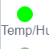, put  into the printing box of  to read “Temperature”.

   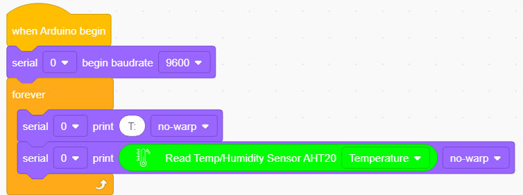

   

7. Duplicate  and change “T: ” into “    RH:”(the two spaces separates the two values to be output). Read “Humidity” value.

8. Add a delay of 1S for better observing the results.

**Complete Test Code**

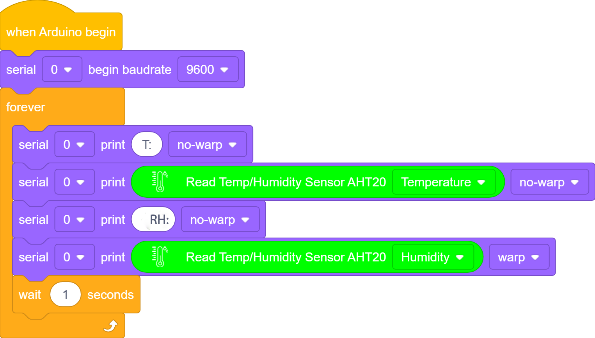

##### 7.10.4.2 Test Result

After uploading code,  the serial monitor prints temperature and humidity values and refreshes the results per second.

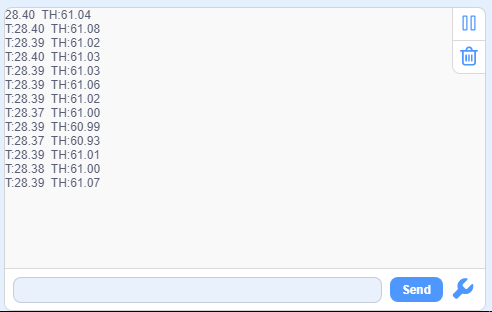

### 7.11 Pressure Sensor

#### 7.11.1 Overview

BMP388 pressure sensor is a pneumatic MEMS sensor a very compact package, featuring small size, low power consumption but high performance. In brief, it is a combination of the temperature and pressure sensor, which is perfect for mobile applications. 

This module adopts proven piezoresistive pressure sensing technology with high accuracy and linearity, as well as long-term stability and high EMC stability. Besides, it maximize flexibility in multi-device working, and is ideal for altitude tracking in consumer electronics drones, wearables, smart homes, etc. 

As for improvement, we can optimize the device in terms of power consumption, resolution and filtering performance.

####  7.11.2 Schematic Diagram

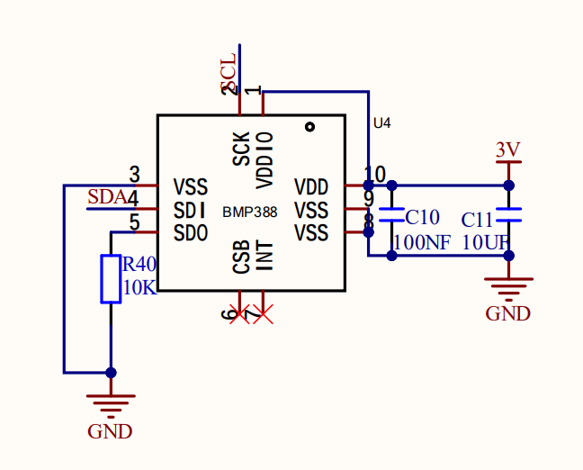

Based on piezoelectric pressure sensing technology, the BMP388 pressure sensor accurately measures pressure and temperature. It is capable of measuring air pressure in the 300 ~ 1250 hPa range without consuming much power (consuming only 3.4 µA at 1 Hz operating frequency). In addition, the built-in infinite impulse response filter can effectively reduce effects from external interference.

#### 7.11.3 Code Blocks

1.  

	This block initializes the BMP388 pressure sensor. Without this block, the module will not work.

2.  

	This block reads BMP388 sensor values. If the values are not read, they cannot be output.

3. 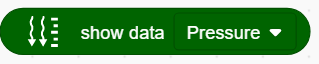 

	This block outputs the values read by BMP388 sensor, including Pressure, Altitude and Temperature.

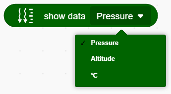

#### 7.11.4 Test Code

##### 7.11.4.1 Build Code

There are two ways to upload the code: directly open the code file we provide; or manually build blocks.

**Directly open the code file we provide:**

1. Click  and choose `Load from your computer`

2. We have already downloaded the codes on computer desktop, so open the file and choose `7-11-bmp388.sb3`

**Manually build blocks:**

1. In , find  block.
2. In , find and put  under .
3. In , drag  and set baud rate to 9600, and put it under .
4. In , drag .

4. In , put  in 

5. In , put  under and set to print “Pressure:” in no-warp mode.

   

7. Add one more  block and set to no-warp

8. In , drag and put  block in the printing content of  and set to show “Pressure:” values.

   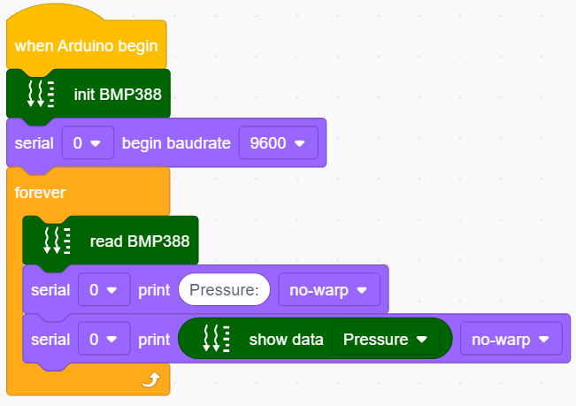

9. Duplicate  and set to print “    Altitude:”(the two spaces separates the two values to be output). Modify to show data “Altitude”.

10. Duplicate  and set to print “      Temperature:” (the two spaces separates the two values to be output). Modify to show data “°C”.

11. Set  to print in warp mode.

12. Add a delay of 1S for better observing the results.

**Complete Test Code**

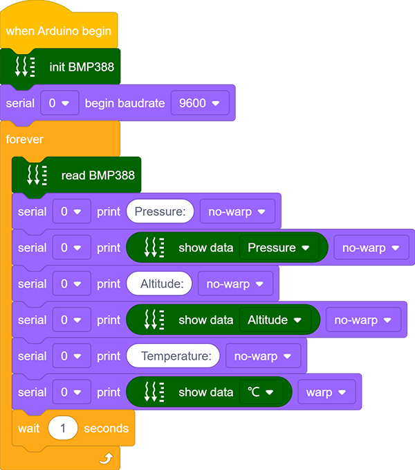

##### 7.11.4.2 Test Result

After uploading code, the serial monitor prints the values read by BMP388 sensor.

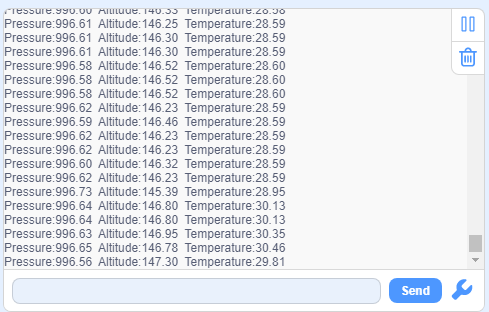

### 7.12 (Direction Recognition) Geomagnetic Sensor

#### 7.12.1 Overview

AK8975C geomagnetic sensor is a three-axis electronic compass IC with high sensitivity. It can output 13-bit data and accurately detect X, Y, Z axes geomagnetic values. Thus, it is suitable for portable devices with navigation function such as mobile phones and tablets.

####  7.12.2 Schematic Diagram

The AK8975C geomagnetic sensor works in the principle of electromagnetic induction. It takes the Earth's magnetic field as a measurement benchmark to sense changes in the magnetic field through its internal magnetic material and coils. Specifically, when the magnetic material is affected by geomagnetic field, a directional constrained electron spin deflection will happen due to the field force, which in turn forms a magnetic field. This field induces potential signals in the coil.

This sensor amplifies and processes the induced potential signals, which are then transmitted to the system for further calculation, analysis and processing. So it measures geomagnetic magnetic field in the axis X, Y, and Z to determine the direction.

#### 7.12.3 Code Blocks

1.  

	This block is used to initialize AK8975 geomagnetic sensor.

2.  

	This block reads the magnetic field direction.

3.  

	This block reads the values on axis X, Y and Z: 

	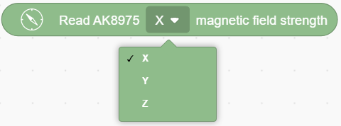

#### 7.12.4 Test Code

##### 7.12.4.1 Build Code

There are two ways to upload the code: directly open the code file we provide; or manually build blocks.

**Directly open the code file we provide:**

1. Click  and choose `Load from your computer`

2. We have already downloaded the codes on computer desktop, so open the file and choose `7-12-ak8975.sb3`

**Manually build blocks:**

1. In , find  block.
2. In , put  under 
3. In , drag  and set baud rate to 9600, and put it under 
4. In , drag .

4. In , put  in  and set to print “X:” in no-warp mode.

   

5. Add a  and set to no-warp mode.

6. In , put  into the printing content of , and set to read axis “X”.

   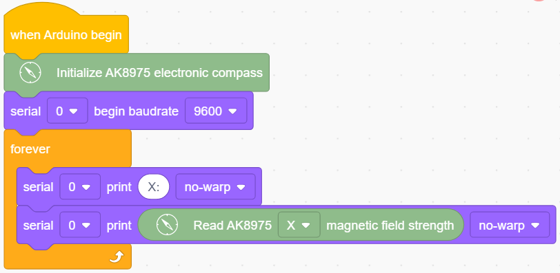

7. Duplicate  and change to read “    Y:”(the two spaces separates the two values to be output). Set to read value in axis “Y”.

8. Duplicate and change to read “      Z:”(the spaces separates the two values to be output). Set to read value in axis “Z”.

9. Duplicate and change to read “        Direction:”(the spaces separates the two values to be output).

10. In , put  into the printing content of  and set mode to warp.

11. Add a delay of 1S for better observing the results.

**Complete Test Code**

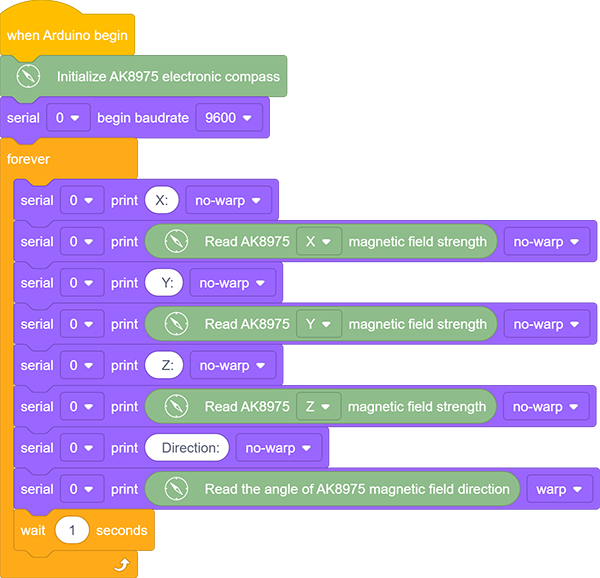

##### 7.12.4.2 Test Result

After uploading code, the serial monitor prints the sensor values. Move the coding box to see the changes of these values.

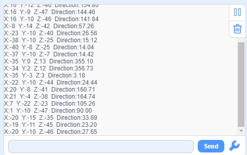

### 7.13 Fan/Motor Module

#### 7.13.1 Overview

The motor adopts HR1124S motor control chip that is a single channel H-bridge driver chip used in DC motors. The H-bridge drive uses PMOS and NMOS power tubes with low on-resistance, ensuring lower power loss and longer safe working time. In addition, its standby and static working current are both low, so it is commonly used in toys.

####  7.13.2 Schematic Diagram

**Motor control logic table:**

| IO18 | IO17 |      motor state      |
| :--: | :--: | :-------------------: |
| HIGH | LOW  |    forward rotate     |
| LOW  | HIGH |    reverse rotate     |
| HIGH | HIGH | stop (a gradual stop) |
| LOW  | LOW  | brake (a brake stop)  |

#### 7.13.3 Code Blocks

 

This block controls the rotation of the motor. You only need to set motor pins and output levels of the pins.

#### 7.13.4 Test Code

##### 7.13.4.1 Build Code

There are two ways to upload the code: directly open the code file we provide; or manually build blocks.

**Directly open the code file we provide:**

1. Click  and choose `Load from your computer`

2. We have already downloaded the codes on computer desktop, so open the file and choose `7-13-fan.sb3`

**Manually build blocks:**

1. In , find  block.
2. In , find and place  block under .

3. In , put  into , and set pin IO17 to output `LOW` and pin IO18 to output `HIGH`.
4. Add a delay of 2S.

5. Duplicate the above code and modify pin IO17 to `HIGH` and IO18 to `LOW`.
6. Duplicate again and set both IO17 and IO18 to `LOW`.

**Complete Test Code**

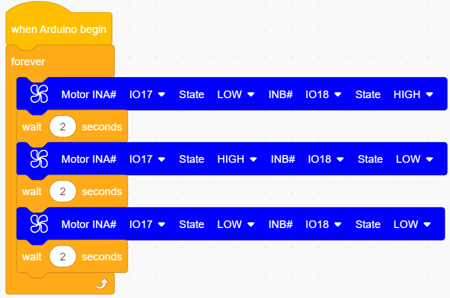

##### 7.13.4.2 Test Result

After uploading code, you will see the fan forward rotates for 2s and then reverses for another 2s. Then it stops. These actions repeat.

### 7.14 Servo

#### 7.14.1 Overview

The 9g servo features small size but high performance and precision and is with good torque and accuracy, so it is perfect for small machines. With up to 180 degrees rotation angle, it enables extremely precise rotation and control and can be started fast with low noise.

####  7.14.2 Schematic Diagram

**Angle range:** 180°(there are 360°, 180° and 90°)

**Drive voltage:** 3.3V / 5V

Usually three wires:

**GND:** grounded, in brown

**VCC:** connect to +5v (3.3V) power, in red

**S:** signal pin to control PWM signal, in orange

**Control principle**: The rotation Angle of the servo is controlled by adjusting the duty cycle of the PWM (pulse width modulation) signals. Theoretically, the period of the standard PWM signal is fixed at 20ms (50Hz), so the pulse width should be 1ms ~ 2ms. But in fact, it is 0.5ms ~ 2.5ms, corresponding to the servo angle of  0° ~ 180°. Note that the angle for the same signal varies from servo brands.

#### 7.14.3 Code Blocks

1.  

	This block controls servo angle. You only need to set a pin, channel, degree(range of 0-180) and delay(1000=1S).

2.  

	This block reads servo angle.

3. 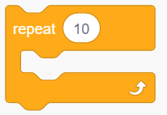 

	This is a repeat block with repeating times. You can set the times. For instance, here it is 10, so codes in it will repeatedly execute for 10 times.

#### 7.14.4 Test Code

##### 7.14.4.1  Build Code

There are two ways to upload the code: directly open the code file we provide; or manually build blocks.

**Directly open the code file we provide:**

1. Click  and choose `Load from your computer`

2. We have already downloaded the codes on computer desktop, so open the file and choose `7-14-servo.sb3`

**Manually build blocks:**

1. In , find  block.
2. In , find and place  block under .

3. In , put  in block  and set degree to “0” and delay to “2000”.
4. Duplicate the block twice and set degree to “90” and “180” respectively.

**Complete Test Code**

##### 7.14.4.2 Test Result

After uploading code, the servo rotates to 0 degree, 90 degree and 180 degree accordingly, with each position staying for 2 seconds, and then it back to 0 degree. It repeats these rotations.

####  7.14.5 Extension

We control servo to repeatedly and gradually rotate from 0 degree to 180 degree and then gradually back to 0 degree.

##### 7.14.5.1 Test Code

There are two ways to upload the code: directly open the code file we provide; or manually build blocks.

**Directly open the code file we provide:**

1. Click  and choose `Load from your computer`

2. We have already downloaded the codes on computer desktop, so open the file and choose `7-14-servo2.sb3`

**Manually build blocks:**

1. In , find  block.
2. In , find and place  block under .

3. In , drag  and put it under 

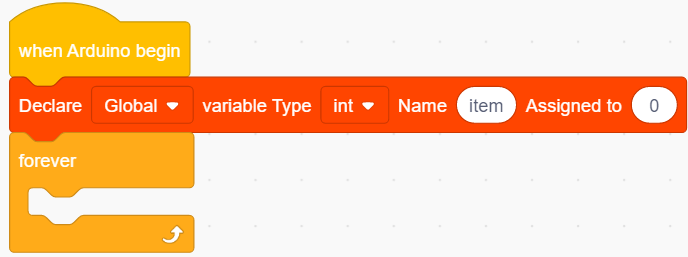

4. In , drag  to set times to 180, and put it into 
5. In , put into 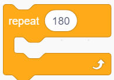

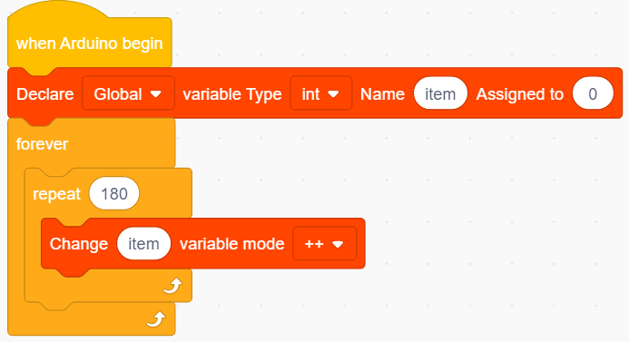

6. In , drag and put  under 

7. In , set  to the degree in block , and set delay to 10 (unit: ms)

   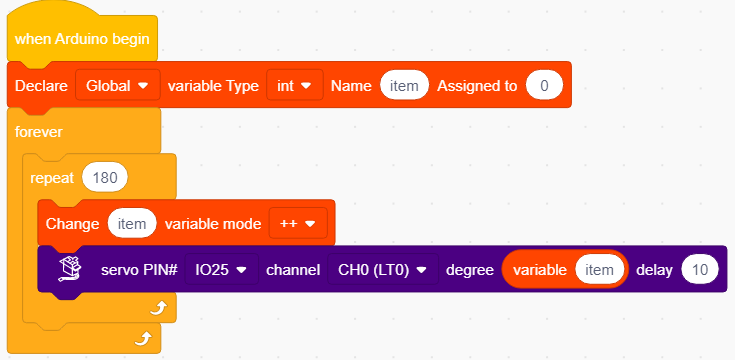

   

8. Duplicate  and change “++” into “- -” in

**Complete Test Code**

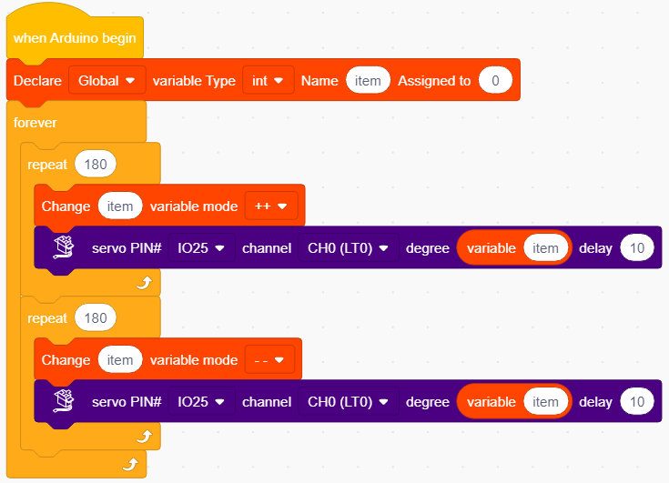

##### 7.14.5.1 Test Result

After uploading code, the servo repeatedly and gradually rotates from 0 degree to 180 degree and then gradually back to 0 degree.

### 7.15 WS2818 RGB LED

#### 7.15.1 Overview

WS2812 RGB LED is an external control LED integrating control circuit and light emitting circuit. It adopts single-line return-to-zero code communication, and supports 256 gray levels to display full-colors. The integrated chip inside each pixels efficiently stabilizes color output. So it is widely used in lighting, display and decoration.

####  7.15.2 Schematic Diagram

From the Schematic Diagram, ws2812 connects and transmits data over a single wire, which is the communication method named single-bus return-to-zero code (single NZR). The data enters in serial through the DIN port, and each pixel receives and processes 24 bits data (R, G, B color channels with 8 bits each). 

For detailed information of transmission mode, please refer the specification of ws2812.

#### 7.15.3 Code Blocks

1.  

	This block initialize the ws2812 module. You only need to set its numbers and pin.

2.  

	This module appoints one certain ws2812 pixel to light up. You only need to input the ws2812 pixel number (starting from 0) and set its color.

3.  

	This block appoints a certain range of ws2812 pixels to light up. You only need to input two ws2812 pixel number (a starting and a ending pixel)  and set their colors.

4.  

	This block sets colors of the LED. Three parameters (R, G, B) should be set. 

5.  

	This block sets the brightness of ws2812 pixels. Its range is 0 ~ 255.

6.  

	This block turns off all ws2812 pixels.

7.  

	This block refreshes the state of each ws2812 pixel. Before every part that controls pixels, this block should be added after them. Otherwise, they are invalid settings.

#### 7.15.4 Test Code

##### 7.15.4.1 Build Code

There are two ways to upload the code: directly open the code file we provide; or manually build blocks.

**Directly open the code file we provide:**

1. Click  and choose `Load from your computer`

2. We have already downloaded the codes on computer desktop, so open the file and choose `7-15-rgbLed.sb3`

**Manually build blocks:**

1. In , find  block.
2. In , find and put  under
3. In , put  under and set brightness to 50 to avoid glaring.
4. In , put  under 

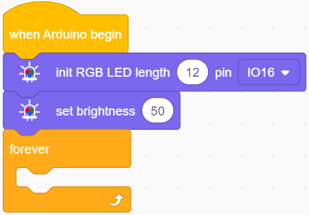

5. In , put  into , and set pixel to 0 and color to red. 
6. In , add a  to refresh the above settings so that ws2812 will light up.

**Complete Test Code**

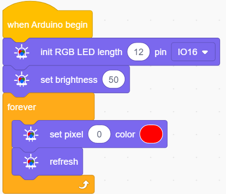

##### 7.15.4.2 Test Result

After uploading code, the first pixel of ws2812 lights up in red.

####  7.15.5 Extension

Light up all LED circulating red, green, and blue.

##### 7.15.5.1 Test Code

There are two ways to upload the code: directly open the code file we provide; or manually build blocks.

**Directly open the code file we provide:**

1. Click  and choose `Load from your computer`

2. We have already downloaded the codes on computer desktop, so open the file and choose `7-15-rgbLed2.sb3`

**Manually build blocks:**

1. In , find  block.
2. In , drag and put  under 
3. In , drag and put  under , and set brightness to 50 to avoid glaring.
4. In , put  under 

5. In , put  in , and set to fill pixel from “0” to “11”, and modify the color to red.
6. In , add a  to refresh the above settings so that ws2812 will light up.
7. Add a delay of 1S.

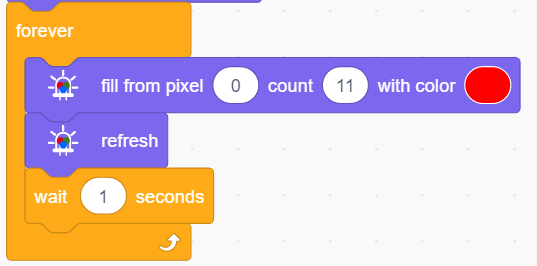

8. Duplicate  and set the color to green.
9. Duplicate again  and set the color to blue. 

**Complete Test Code**

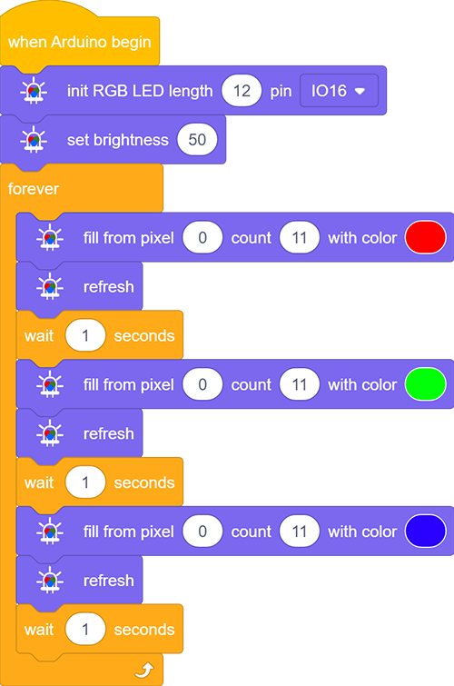

##### 7.15.5.2 Test Result

After uploading code, ws2812 repeatedly lights up in red, green and blue with 1s each.

### 7.16 OLED Display

#### 7.16.1 Overview

OLED display is also called organic light-emitting diode or organic dot laser display. This display is self-luminous. It adopts a very thin coating of organic materials and glass substrate which will light up if current passes through. Therefore, it does not require a back-light. Note that it will not light up when just powering on; programing and wiring are also needed.

Besides, it features large viewing Angle, low power consumption, high contrast, thin display, fast response, simple structure, and can work on flexion boards within a wide temperature range.

####  7.16.2 Schematic Diagram

Communication mode: I2C communication

Internal driver chip: SSH1106

Resolution: 128 x 64

#### 7.16.3 Code Blocks

1.  

	This block initializes OLED display, which is necessary when using OLED module.

2. 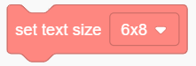 

	This block sets size and color of the displayed text. The default settings are usually used.

3. 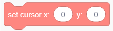 

	This block sets the position of text starting to be displayed on the OLED.

4.  

	This block inputs the printing text on OLED, and only strings are available. 

5.  

	This block displays icons. Some commonly used icons are integrated in this block.

6.  

	This block clears all text on OLED.

7.  

	This block refreshes OLED display. This block should be added after your settings. Otherwise, they are invalid.

#### 7.16.4 Test Code

##### 7.16.4.1 Build Code

There are two ways to upload the code: directly open the code file we provide; or manually build blocks.

**Directly open the code file we provide:**

1. Click  and choose `Load from your computer`

2. We have already downloaded the codes on computer desktop, so open the file and choose `7-16-oled.sb3`

**Manually build blocks:**

1. In , find  block.

2. In , find and put  and  under  in sequence.

3. Add  under 

4. In , put  under 

5. Put  into 

6. Add a  under , and you can modify the text into whatever you like.

7. Put  under 

**Complete Test Code**

##### 7.16.4.2 Test Result

After uploading code, you will see the OLED shows the text you set. Here we maintain it as default, so it displays “Hello KidsBlock”, as shown below:

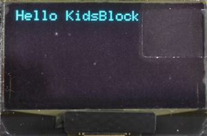

### 7.17 Traffic Light

#### 7.17.1 Overview

The traffic light module limits the pedestrian and vehicular thoroughfare. It includes a red, a yellow and a green light, which imply different instructions.

**Red for Stop:** Pedestrians and vehicles stop proceeding.

**Yellow for Caution:** Pedestrians and vehicles are ready for stopping. If the drive is already in process, the speed should be slow.

**Green for Proceed:** Pedestrians and vehicles keep going with the abidance of traffic regulations.

In this project, you can program on ESP32 Coding Boxto control a mini traffic light. For instance, set the duration of each lights and the interval time among them. Besides, you may also add a timer to alter light colors to schedule.

#### 7.17.2 Test Code

##### 7.17.2.1 Code Flow

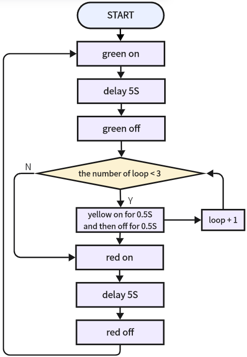

##### 7.17.2.2 Build Code

There are two ways to upload the code: directly open the code file we provide; or manually build blocks.

**Directly open the code file we provide:**

1. Click  and choose `Load from your computer`

2. We have already downloaded the codes on computer desktop, so open the file and choose `7-17-trafficLight.sb3`

**Manually build blocks:**

1. In , find  block.
2. In , find and place  block under .

3. In , find and put  into  and set pin to IO27 and output HIGH.

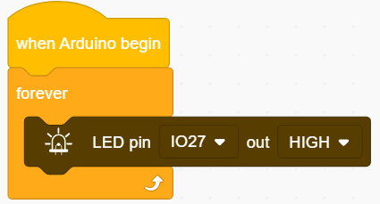

4. In , add a  and set to 5S. And set pin to IO27 to output LOW on block .

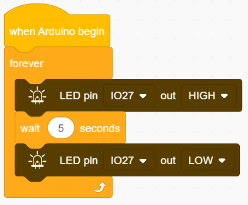

5. In , find  and set repeating times to 3, place it under 

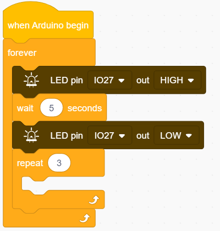

6. Build code in  to make yellow LED blink with an interval of 0.5s: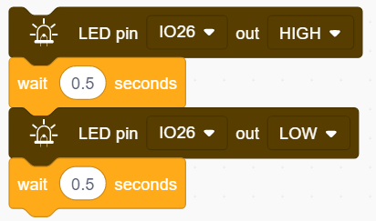

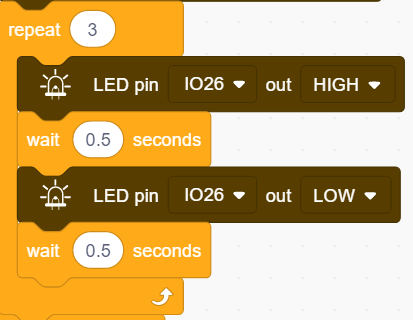

7. Build code under  to make red LED light up for 5S then go off.

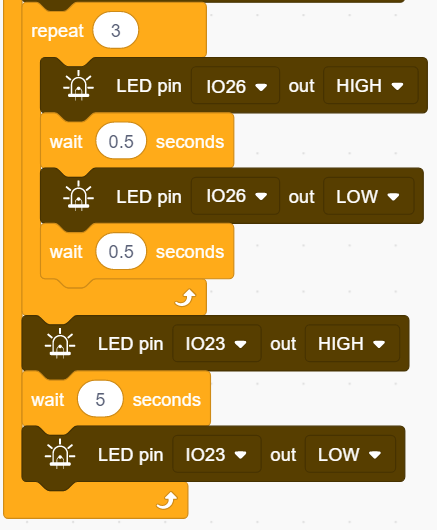

**Complete Test Code**

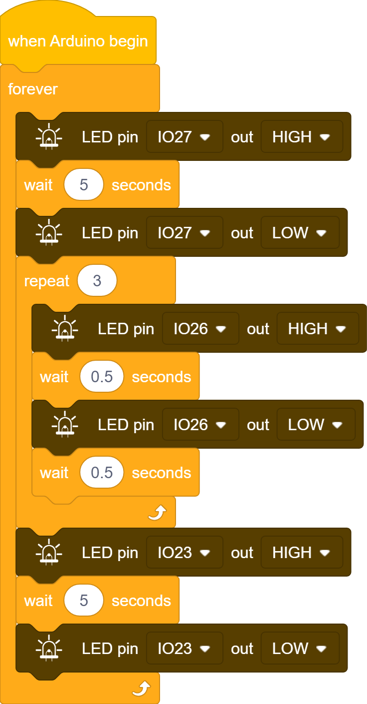

##### 7.17.2.3 Test Result

After uploading code, the green LED lights up for 5s and goes off. Immediately, the yellow LED blinks for three times. After that, the red LED lights up for 5s and goes off. These actions are exactly a model of traffic light and will repeat. 

### 7.18 Breathing LED

#### 7.18.1 Overview

PWM breathing LED utilizes on-board programmable PWM to output analog waveform. After powering on, LED brightness can be adjusted through duty cycle of the waveform to eventually realize a breathing light.

In this way, ambient light can be simulated by changing LED brightness along with time. Also, breathing LED can form a colorful mini light show to construct a tranquil and warm environment.

#### 7.18.2 Working Principle

PWM controls analog output via digital means, which are able to adjust the duty cycle of the wave (a signal circularly shifting between high level and low level).

digital ports of voltage output are LOW and HIGH, which respectively correspond to 0V and 5V. Generally, we define LOW as 0 and HIGH as 1. will output 500 signals of 0 or 1 within 1s. If they are 500 “1”s, 5V will be output. Oppositely, if they are all 0s, the output will be 0V. Or if they are 010101010101…, the average output will be 2.5V. In other words, output ratio of 0 and 1 affects the voltage value. 

Honestly, it differs from real continuous output, yet the more 0 and 1 signals are output per unit time, the more accurate the control will be.

#### 7.18.2 Code Blocks

1.  

	This block will increase or decrease one on the value of the variable when it is execute each time. The variable name can be set. There are ++ and – – can be chosen: ++ add 1; – – minus 1.

2. 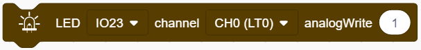 

	This block the brightness of the LED. You need to set LED pin, channel and analog value of brightness(ranging from 0-255).

#### 7.18.3 Test Code

##### 7.18.3.1 Code Flow

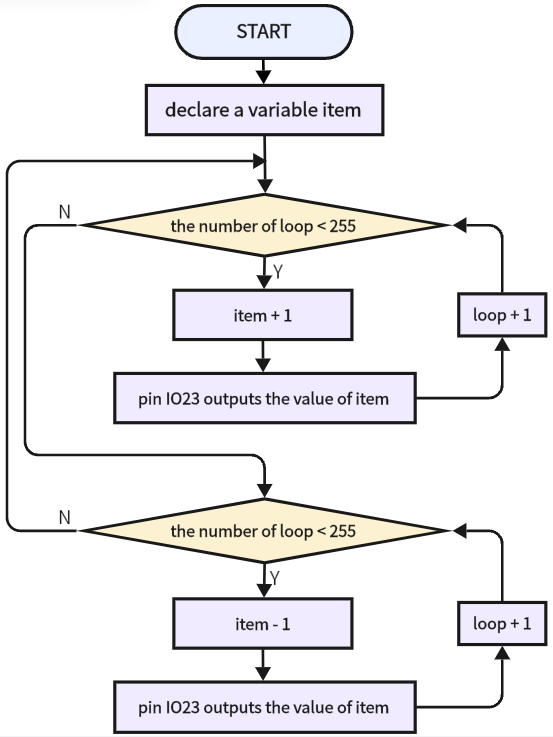

##### 7.18.3.2 Build Code

There are two ways to upload the code: directly open the code file we provide; or manually build blocks.

**Directly open the code file we provide:**

1. Click  and choose `Load from your computer`

2. We have already downloaded the codes on computer desktop, so open the file and choose `7-18-gradientLight.sb3`

**Manually build blocks:**

1. In , find  block.
2. In , find and place  block under .

3. In , drag block  (keep the default) and put it under 

4. In , drag  and set times to 255, put it in 
5. In , put  in 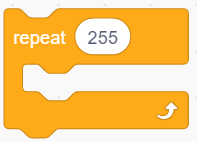

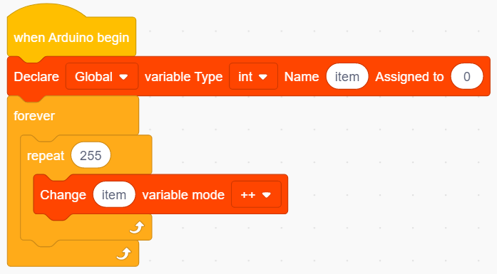

6. In , put  under 

7. In , find  and do not need to modify the name, put it in the analog value of . 

7. Add a delay of 0.01S.

   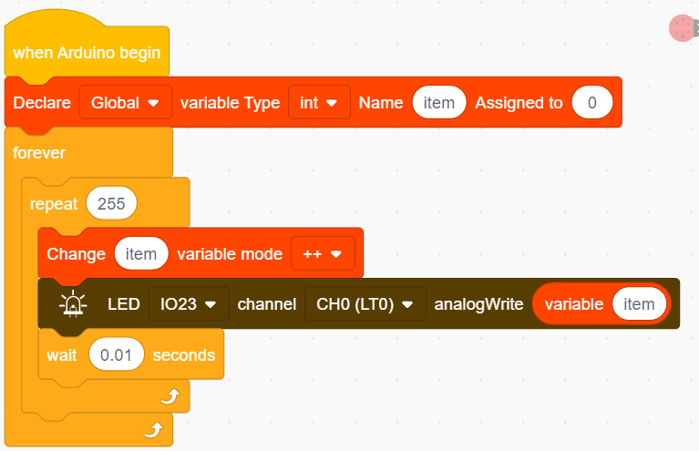

   

8. Duplicate , modify ++ in  into – –.

**Complete Test Code**

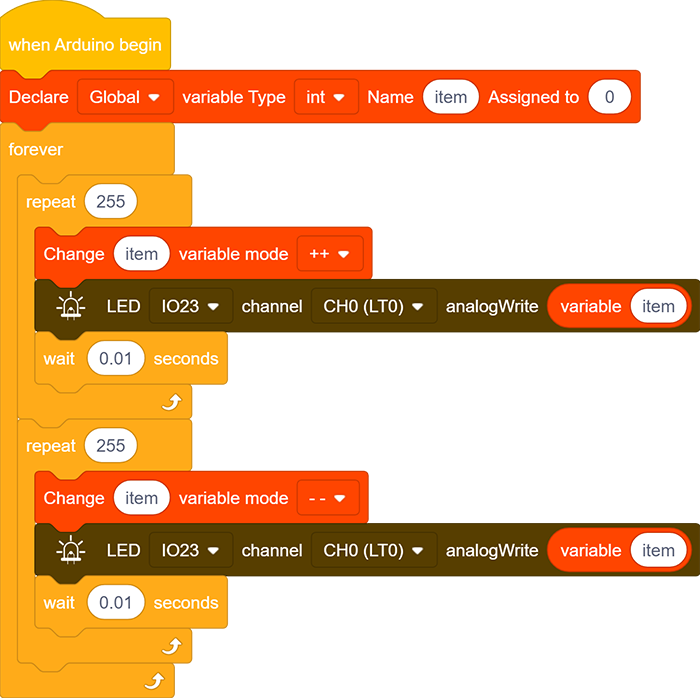

##### 7.18.3.3 Test Result

After uploading code, the red LED gradually lights on and dims out, in a circulation. It “breathes” evenly.

### 7.19 Button Control LED

#### 7.19.1 Overview

In this project, we control the ON/OFF of the LED via an AD button. The LED will light up if we press the button and it goes off when we press the button again.

#### 7.19.2 Test Code

##### 7.19.2.1 Code Flow

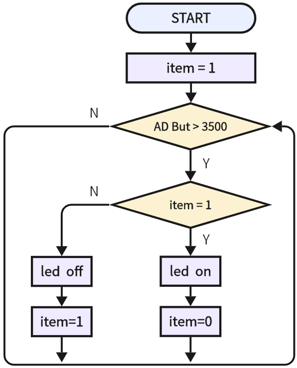

##### 7.19.2.2 Build Code

There are two ways to upload the code: directly open the code file we provide; or manually build blocks.

**Directly open the code file we provide:**

1. Click  and choose `Load from your computer`

2. We have already downloaded the codes on computer desktop, so open the file and choose `7-19-tableLamp.sb3`

**Manually build blocks:**

1. In , find  block.
2. In , find and place  block under .

3. In , find  and put it under , name the variable to “item“ and assign to “1” as its initial value.

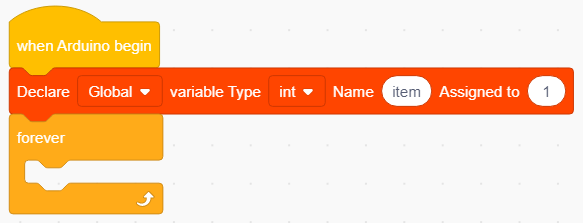

4. In , put  into .
5. In , find and put  into the condition box of 

4. In , find  and put it in the left part of , and set the right part to value 3500: AD key analog value > 3500

5. In , find and put block  into .
6. In , put  into the condition box of 
7. In , put  into the left part of the , and modify the right part into “1”: variable item = 1

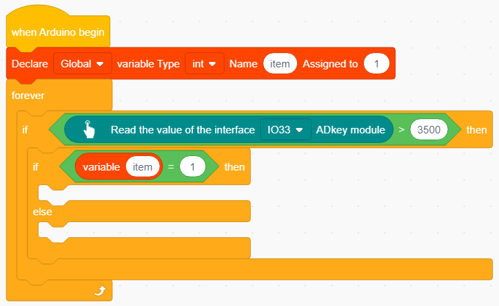

8. In , drag and put  in "if" of block 
9. In , put  under 
10. Duplicate  and put into "else" of block , and set LED to output “LOW” and set item variable by “1”.
11. Add a delay of 0.3s below .

**Complete Test Code**

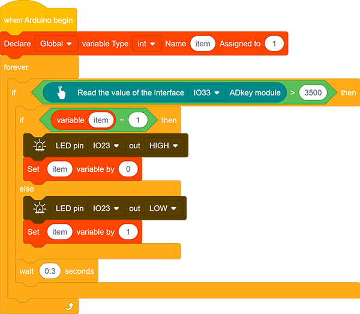

##### 7.19.2.3 Test Result

After uploading code, press the red button and the red LED lights up; press it again and the LED goes off.

### 7.20 Intrusion Alarm

#### 7.20.1 Overview

Intrusion alarm is a device alerting illegal intrusion into a prevention area. It plays an important role in security. We can see it everywhere: families, stores, warehouses, supermarkets and so on. 

All in all, it protects our personal and property safety.

#### 7.20.2 Test Code

##### 7.20.2.1 Code Flow

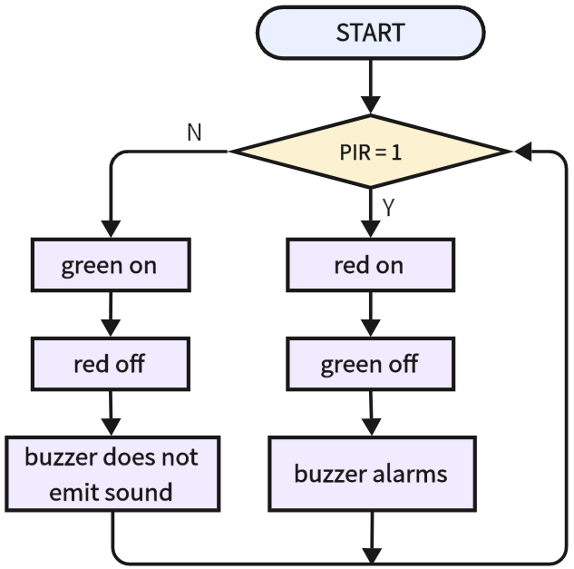

##### 7.20.2.2 Build Code

There are two ways to upload the code: directly open the code file we provide; or manually build blocks.

**Directly open the code file we provide:**

1. Click  and choose `Load from your computer`

2. We have already downloaded the codes on computer desktop, so open the file and choose `7-20-IntrusionAlarm.sb3`

**Manually build blocks:**

1. Build the two basic blocks:

2.  

	We use this block to determine the PIR motion sensor value. When the sensor outputs 1, the speaker alarms, the red LED turns on and the green one is off. If the sensor value equals 0, the red LED will go off and the green will be on; at the same time, the speaker stays quiet. 

**Complete Test Code**

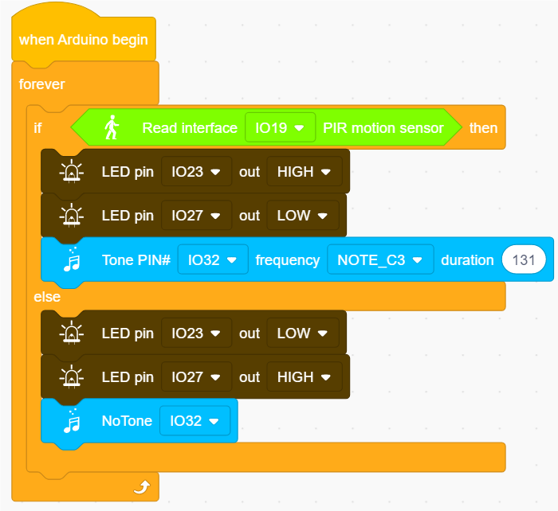

##### 7.20.2.3 Test Result

After uploading code, when the sensor detects a motion around, the speaker alarms, the red LED turns on and the green one is off. If no intrusion is detected, the red LED will go off and the green will be on; at the same time, the speaker stays quiet. 

### 7.21 Window Close In Dark

#### 7.21.1 Overview

In this project, we program to make the window automatically close when getting dark. So the photoresistor is required to sense the ambient light. We set a threshold for the resistor. When ambient light value is lower than the threshold, the servo closes the window. 

#### 7.21.2 Test Code

##### 7.21.2.1 Code Flow

##### 7.21.2.2 Build Code

There are two ways to upload the code: directly open the code file we provide; or manually build blocks.

**Directly open the code file we provide:**

1. Click  and choose `Load from your computer`

2. We have already downloaded the codes on computer desktop, so open the file and choose `7-21-automaticWindow.sb3`

**Manually build blocks:**

1. Build the two basic blocks:

2. We add  to determine the photoresistor value. If the analog value is lower than 500, the servo will rotate to 180 degree. If not, servo will rotate to 0 degree.

**Complete Test Code**

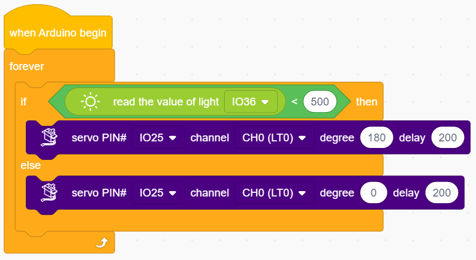

##### 7.21.2.2 Test Result

After uploading code, cover the photoresistor with something, and the servo will rotate to 180 degree. Remove the cover, and the analog value exceeds 500, so the servo rotates to 0 degree.

### 7.22 Voice Control Light

#### 7.22.1 Overview

Voice-control-light device mainly consists of a sound sensor, a photoresistor and an LED. The photoresistor is adopted to avoid LED lighting up during daytime. The sound sensor measures sound volume to determine whether it is reached the set threshold. If yes, the LED will light up for a few seconds. 

#### 7.22.2 Test Code

##### 7.22.2.1 Code Flow

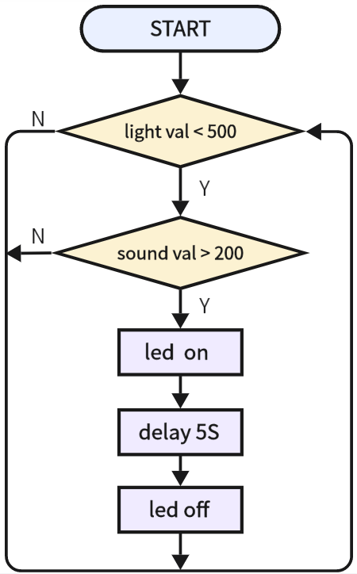

##### 7.22.2.2 Build Code

There are two ways to upload the code: directly open the code file we provide; or manually build blocks.

**Directly open the code file we provide:**

1. Click  and choose `Load from your computer`

2. We have already downloaded the codes on computer desktop, so open the file and choose `7-22-hallwayLight.sb3`

**Manually build blocks:**

1. Build the two basic blocks:

2. Drag  to determine the photoresistor value. If it is lower than 500 (light < 500), execute its following code blocks.

3. Add a  again to determine the sound sensor value. If the value is greater than 200 (sound > 200), execute its following code blocks. 

4. When sound > 200, red LED lights up and then goes off after 5 seconds.

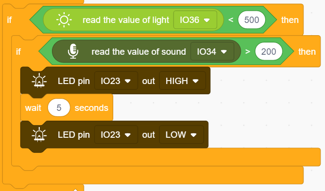

**Complete Test Code**

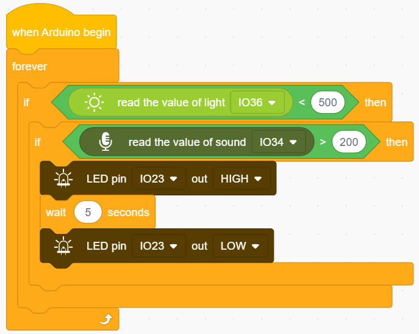

##### 7.22.2.3 Test Result

After uploading code, the LED never lights up no matter how loud the noise you make. Cover the photoresistor, and make some sounds, and you will see the LED light up for 5 seconds. 

### 7.23 Human Body Piano

#### 7.23.1 Overview

The analog piano mainly includes an ultrasonic sensor to detect the distance of your position. It plays different tones according to distance values. If there is an open space, you may place it on ground to play musics.

#### 7.23.2 Test Code

##### 7.23.2.1 Code Flow

##### 7.23.2.2 Build Code

There are two ways to upload the code: directly open the code file we provide; or manually build blocks.

**Directly open the code file we provide:**

1. Click  and choose `Load from your computer`

2. We have already downloaded the codes on computer desktop, so open the file and choose `7-23-separatedPiano.sb3`

**Manually build blocks:**

1. Build the two basic blocks:

2. Declare a variable and name to *distance*
3. Assign the detected value by the ultrasonic sensor to *distance*

2. Add a  to determine the value of *distance*. If **distance > 5 and distance < 10**, the speaker will play Tone Do.

3. Duplicate the above code blocks, and modify the condition to **distance > 10 and distance < 15**. Under this condition, the speaker plays Re.

4. Duplicate the above code blocks, and modify the condition to **distance > 15 and distance < 20**. Under this condition, the speaker plays Mi.
5. Duplicate the above code blocks, and modify the condition to **distance > 20 and distance < 25**. Under this condition, the speaker plays Fa.
6. Duplicate the above code blocks, and modify the condition to **distance > 25 and distance < 30**. Under this condition, the speaker plays So.
7. Duplicate the above code blocks, and modify the condition to **distance > 30 and distance < 35** . Under this condition, the speaker plays La.
8. Duplicate the above code blocks, and modify the condition to **distance > 35 and distance < 40**. Under this condition, the speaker plays Si.
9. At last, add a  to stop the tone playing.

**Complete Test Code**

##### 7.23.2.3 Test Result

After uploading code, put your hand in front of the ultrasonic sensor and the speaker will emit sound. You can control the tone by moving your hand in front of the sensor.

Tones corresponding to distance: 

Do: 5-10cm

Re: 10-15cm

Mi: 15-20cm

Fa: 20-25cm

So: 25-30cm

La: 30-35cm

Si: 35-40cm

### 7.24 Button Control Fan

#### 7.24.1 Overview

In this experiment, we program to control the fan by a button.

#### 7.24.2 Test Code

##### 7.24.2.1 Code Flow

##### 7.24.2.2 Build Code

There are two ways to upload the code: directly open the code file we provide; or manually build blocks.

**Directly open the code file we provide:**

1. Click  and choose `Load from your computer`

2. We have already downloaded the codes on computer desktop, so open the file and choose `7-24-electricFan.sb3`

**Manually build blocks:**

1. Build the two basic blocks:

2. Declare a variable and name to *item*, and assign the analog value read by ADKey to it.

3. Add a  to determine the value of *item*. When item > 3500 (the red button is pressed), the fan stops. When item > 2000 & item < 3000 (the yellow button is pressed), the fan rotates.
3. At last, add a delay of 0.3s.

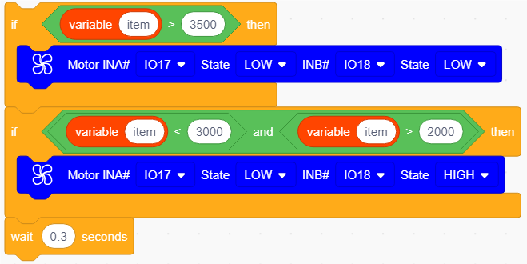

**Complete Test Code**

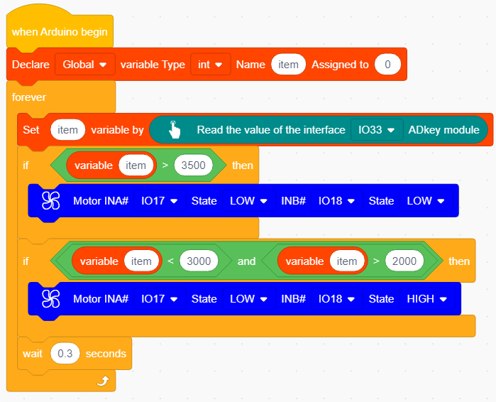

##### 7.24.2.3 Test Result

After uploading code, when we press the yellow button, the fan will turn on. When we press the red button, the fan stops working. 

### 7.25 Auto-door

#### 7.25.1 Overview

Many shopping malls open their doors when someone approaches and close them when no one is detected. Herein, we adopt a PIR motion sensor to simulate this kind of auto-door. The door opens when someone is detected and closes when no one is present.

#### 7.25.2 Test Code

##### 7.25.2.1 Code Flow

##### 7.25.2.2 Build Code

There are two ways to upload the code: directly open the code file we provide; or manually build blocks.

**Directly open the code file we provide:**

1. Click  and choose `Load from your computer`

2. We have already downloaded the codes on computer desktop, so open the file and choose `7-25-InductionDoor.sb3`

**Manually build blocks:**

1. Build the two basic blocks:

2. Drag  to determine the output of PIR motion sensor. If a motion is detected, it will output 1. Otherwise, it outputs 0.

3. When someone is sensed, the servo rotates to 180 degree to open the door. If nothing is detected, the it rotates to 0 degree to close the door.

**Complete Test Code**

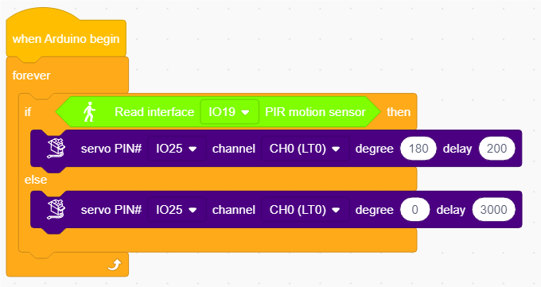

##### 7.25.2.3 Test Result

After uploading code, wave your hand over the PIR motion sensor, and the servo will rotate to 180 degree (door open). After a while, it will back to 0 degree (door close) if nothing is detected.

### 7.26 Access Card

#### 7.26.1 Overview

A common access card is a  magnetic card or a key chain. So in this experiment, we make a simple access device through servo, a magnetic card and an RFID module.

#### 7.26.2 Code Blocks

 

This block assigns strings. You only need to input strings into it. 

#### 7.26.2 Test Code

##### 7.26.2.1 Code Flow

ATTENTION: '93e64720' is my IC card code in the experiment. You need to replace it with yours (details please see in chapter 7.8).

##### 7.26.2.2 Build Code

There are two ways to upload the code: directly open the code file we provide; or manually build blocks.

**Directly open the code file we provide:**

1. Click  and choose `Load from your computer`

2. We have already downloaded the codes on computer desktop, so open the file and choose `7-26-accessControl.sb3`

**Manually build blocks:**

1. Build the two basic blocks:
2. Add a  to initialize the RFID module.
3. Declare a string variable named “idCard”

4. In ,  drag  and input “93e64720” ('93e64720' is my IC card code in the experiment. You need to replace it with yours), and put this block into the assignment box of 

5. use  to determine the read code of RFID module. If the code is “93e64720”, the servo will rotate to 180 degree and stays for a delay of 3000. If not, the servo will stay still.

**Complete Test Code**

##### 7.26.2.3 Test Result

After uploading code, put your IC card at the sensing area of the RFID module, and the servo will rotate to 180 degree for 3s and then come back. If the card code is not correct, the servo will stay still.

### 7.27 Auto-fan

#### 7.27.1 Overview

The weather is getting hotter in summer, so some public places will be equipped with some auto-fans that sense the ambient temperature value. When the temperature reaches a set value, he fan turns on. We add a PIR motion sensor to lower energy consumption. Thus, the fan will turn on only when the temperature reaches the value and someone is sensed nearby. 

Now let's do it!

#### 7.27.2 Test Code

##### 7.27.2.1 Code Flow

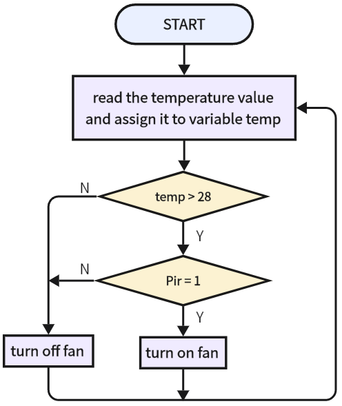

##### 7.27.2.2 Build Code

There are two ways to upload the code: directly open the code file we provide; or manually build blocks.

**Directly open the code file we provide:**

1. Click  and choose `Load from your computer`

2. We have already downloaded the codes on computer desktop, so open the file and choose `7-27-automaticFan.sb3`

**Manually build blocks:**

1. Build the two basic blocks:
2. Declare a variable named “temp”
3. Assign the temperature value read by the sensor to the variable *temp*

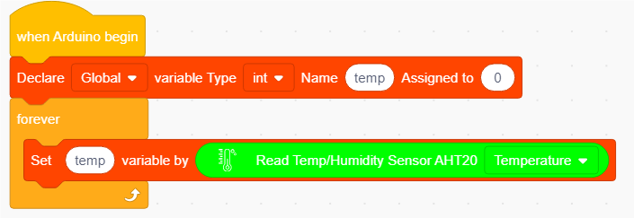

4. Add a  to determine whether the temperature value exceeds the set threshold. Add the code that turns off the fan in "else".
5. Add another  to determine the PIR motion sensor value. If it is 1, the fan rotates. Or else, fan stops.

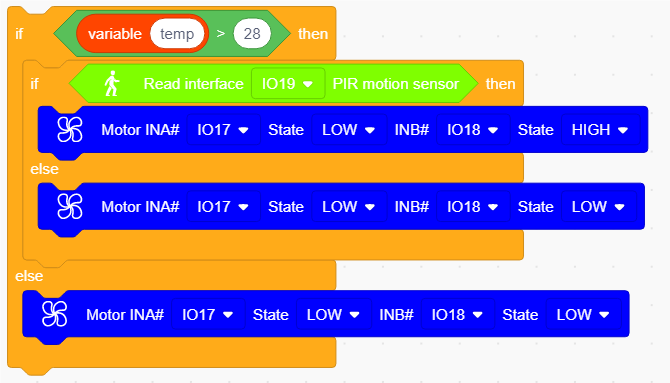

**Complete Test Code**

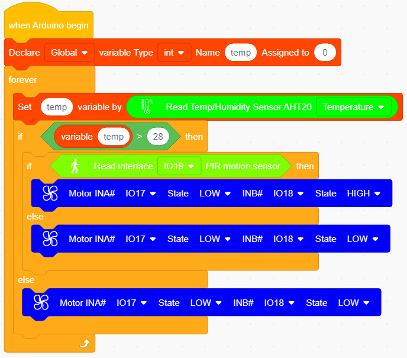

##### 7.27.2.3  Test Result

After uploading code, when the temperature value is higher than 28 and the PIR motion sensor detects someone, the fan turns on. If one of the two conditions are not satisfied, the fan will not rotate.

### 7.28 Environment Monitoring

#### 7.28.1 Overview

In this project, we use an OLED display to reveal the values of temperature, humidity, air pressure and altitude in the environment. It can be regarded as a mini environmental monitoring device. 

#### 7.28.2 Test Code

##### 7.28.2.1 Build Code

There are two ways to upload the code: directly open the code file we provide; or manually build blocks.

**Directly open the code file we provide:**

1. Click  and choose `Load from your computer`

2. We have already downloaded the codes on computer desktop, so open the file and choose `7-28-environmentalMonitoring.sb3`

**Manually build blocks:**

1. Build the two basic blocks:
2. Add a BMP388 and OLED initialization block; Add a string block to set its parameters.

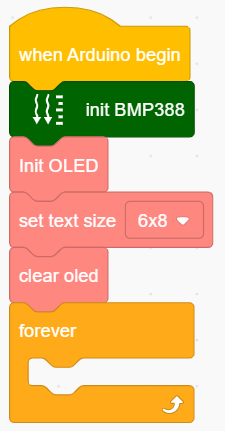

3. Read BMP388 module value, and display “Data Sugges” in the center of the first line of OLED. Centered: set cursor to x=30 (the starting cursors vary with strings).

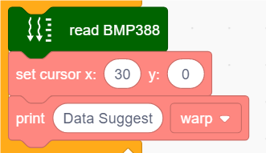

4. Set the starting position of displayed values (Y from 10: the height of the first line).

   Add 3 OLED display blocks and set the display of the first two to "no-warp", set the first line of code to display "T:" (indicating temperature)

   The second line shows the temperature value. The third line shows "C" (temperature in degrees Celsius) and print in "warp" mode.

   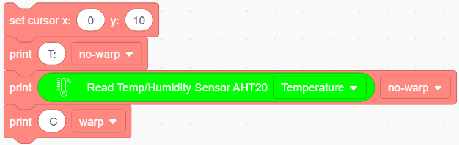.

5. Duplicate  and modify the content in the first line into “RH:(humidity value)”; The second line will show the humidity value. The third line shows the unit of the value “%”.

   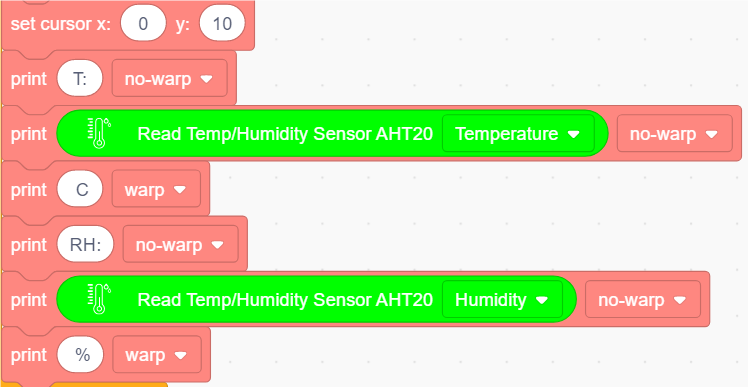

6. Duplicate  and modify the content in the first line into “P:(pressure)”, The second line will show the value. The third line shows the unit of the value “hPa”.

   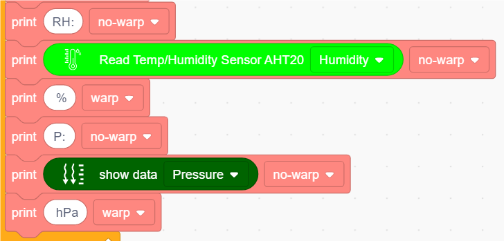

7. Duplicate  and modify the content in the first line into “ASL:(altitude value)”, The second line will show the value. The third line shows the unit of the value “M”(meter). 

   Add a OLED refresh block and add a delay of 1s. 

   

   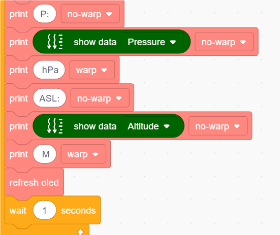

   **Complete Test Code**

   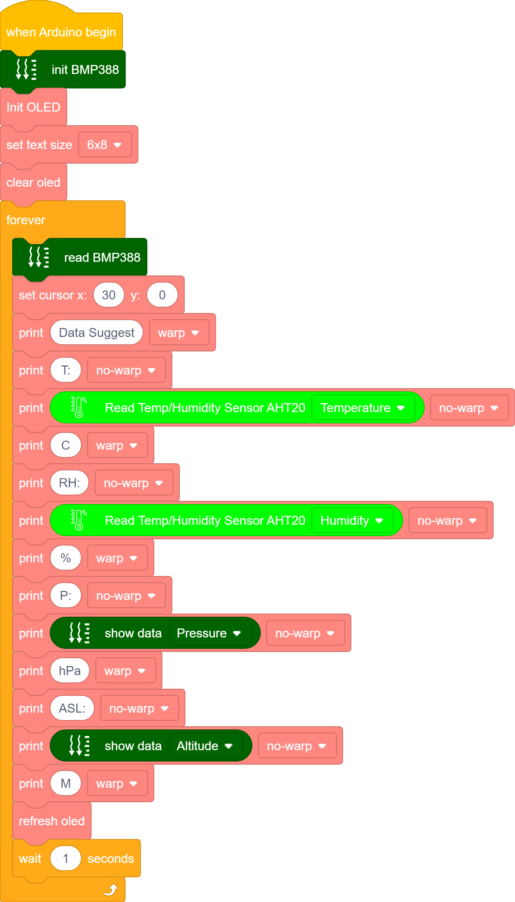

   
   
   

##### 7.28.2.2 Test Result

After uploading code, you will see the values of temperature, humidity, air pressure and altitude on the OLED display.

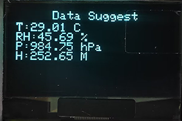

### 7.29 Car Backing Radar

#### 7.29.1 Overview

When a car is in reverse, it will alarm the distance of the obstacles behind the parking space. In this project, we build a mini car backing radar with an ultrasonic sensor for distance detection, a speaker to alarm, and a traffic light module as an indicator.

#### 7.29.2 Test Code

##### 7.29.2.1 Code Flow

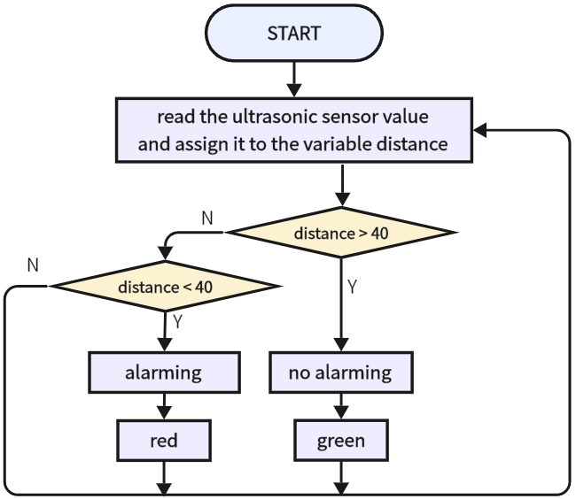

##### 7.29.2.2 Build Code

There are two ways to upload the code: directly open the code file we provide; or manually build blocks.

**Directly open the code file we provide:**

1. Click  and choose `Load from your computer`

2. We have already downloaded the codes on computer desktop, so open the file and choose `7-29-parkingSensor.sb3`

**Manually build blocks:**

1. Build the two basic blocks:

2. Declare a variable named *distance*

3. Assign the detected value of the ultrasonic sensor to *distance*

	

4. Add a  to determine the *distance*. If *distance* > 40, code blocks in it will be executed: the speaker stays quiet, the red LED is off while the green one is ON.

	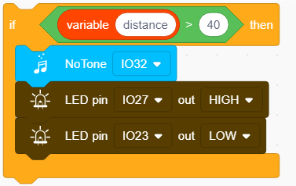

5. Add another . If *distance* < 40, code blocks in it will be executed: the speaker alarms, the red LED is ON while the green one is off.

	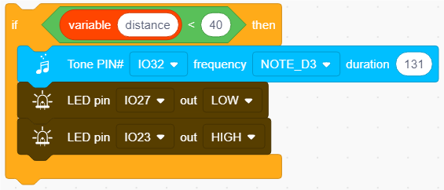

**Complete Test Code**

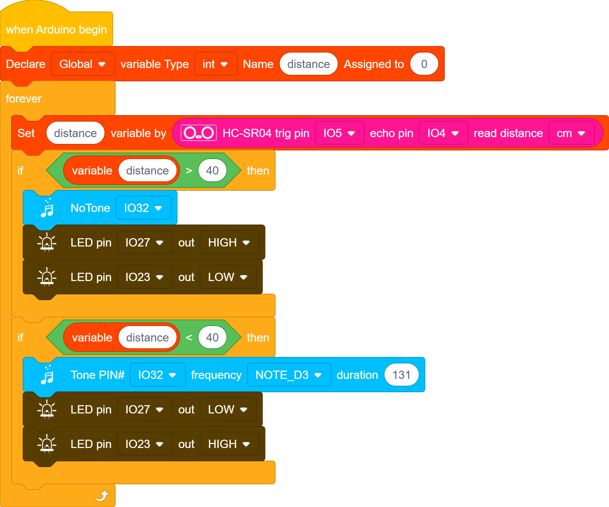

##### 7.29.2.3 Test Result

After uploading code, when the the detected distance value is greater than 40cm, the green LED is on and the amplifier does not emit sound. If the value is less than 40cm, the red LED will light up and the amplifier will alarm.

### 7.30 RGB Ring Clock

#### 7.30.1 Overview

In this project, we build an informal clock with an RGB ring, whose three colors represent hour, minute and second respectively. Since the ring only boasts 12 beads, each bead is 5 seconds/minutes (60/12=5).

#### 7.30.2 Test Code

##### 7.30.2.1 Code Flow

As shown in the flowchart, we use red for hour, green for minutes, blue for seconds. When second = 60, minute adds 1, and when minute = 60, hour adds 1. 

Note that here we adopt 60/5=12 rather than 59/5=11.8, this is because the variable type is integer and the value should be divided by 5. And 60 can be perfectly divided into 12 parts.

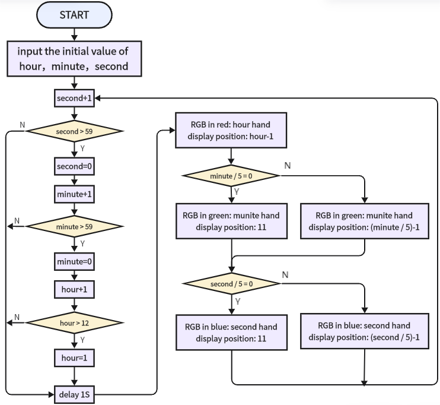

##### 7.30.2.2 Build Code

There are two ways to upload the code: directly open the code file we provide; or manually build blocks.

**Directly open the code file we provide:**

1. Click  and choose `Load from your computer`

2. We have already downloaded the codes on computer desktop, so open the file and choose `7-30-rgbClock.sb3`

**Manually build blocks:**

1. Build the two basic blocks:

2. Initialize the serial port and set baud rate to 9600. 

	Initialize RGB module and declare three variables named *hour*, *minute*, *second* respectively. We assign them initial values, for example, we set the time to 10: 30: 40

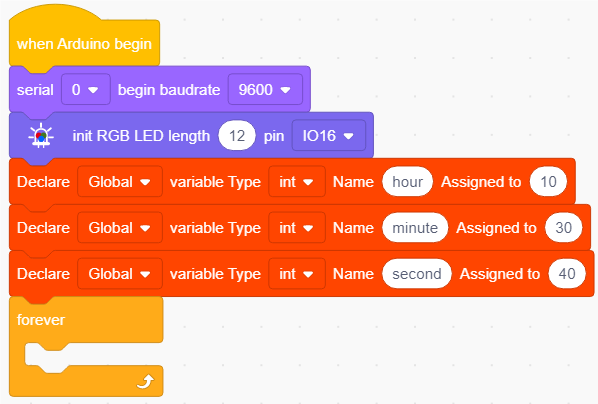

3. In 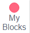, we build a function block. Click  to name the function. Here we name it *clockCode*, click ok.

   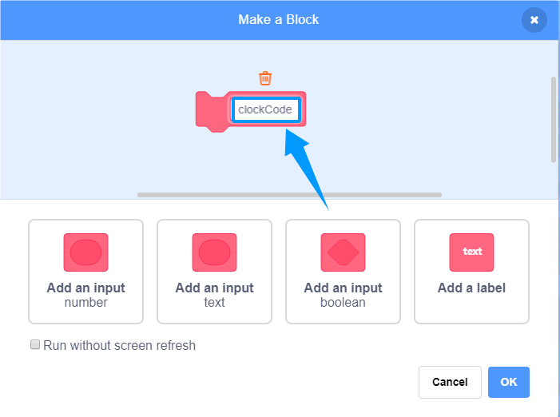

4. Function block: . Add code blocks under this block to define the function. This block is placed separately, when using, drag  in  and put it at the position as needed. 

5. Add a  to count seconds. Then add a  to determine whether second value is greater than 59. If yes, minute+1 and zero out second.

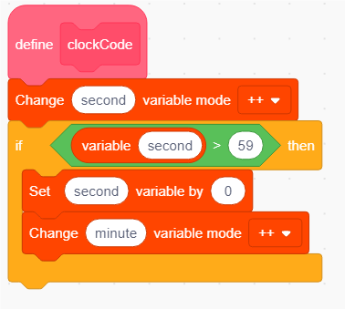

6. Add another  to determine whether minute > 59. If yes, hour+1 and zero out minute. 

	Drag one more  and put it in the above  to determine whether hour > 12. If yes, hour = 1.

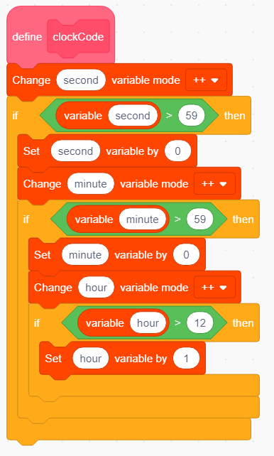

7. Add a delay of 1s, and print the values of hour, minute, second on serial monitor. 

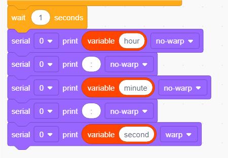

8. Call the function clockCode. In , drag  and place it into . 

	Till now, these are all code blocks of time counting and display. Parts below are settings of beads to light on according to time. 

9. Add  to determine whether second is 0 after dividing by 5. If second=0, current time is within 5s. So we light up the 12th beads of the RGB ring. Pay attention that add a  above. If it is not 0, light up the bead at **(second / 5) - 1**. For instance, when second=30, and 30/5-1=5, so 5th bead lights up. (We set the variable type to integer (int), so the division remainders are omitted.) Second is in BLUE.

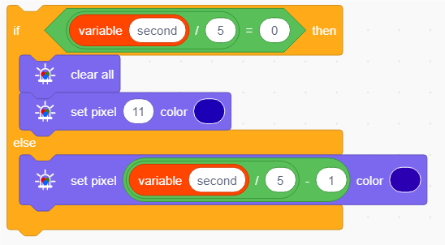

10. Similarly, set the minute. The difference is that this part is without a clear block. Minute is in GREEN.

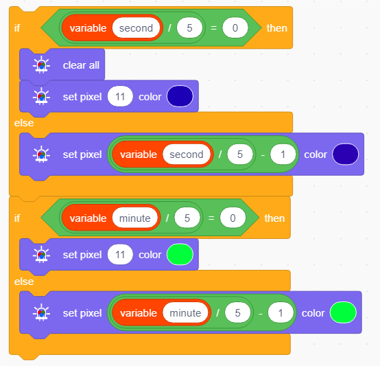

11. When setting hours, only **hour-1** without being divided by 5. Hour range 1-12h corresponds to beads 0-11. Hour is in RED. At last, add a .

**Complete Test Code**

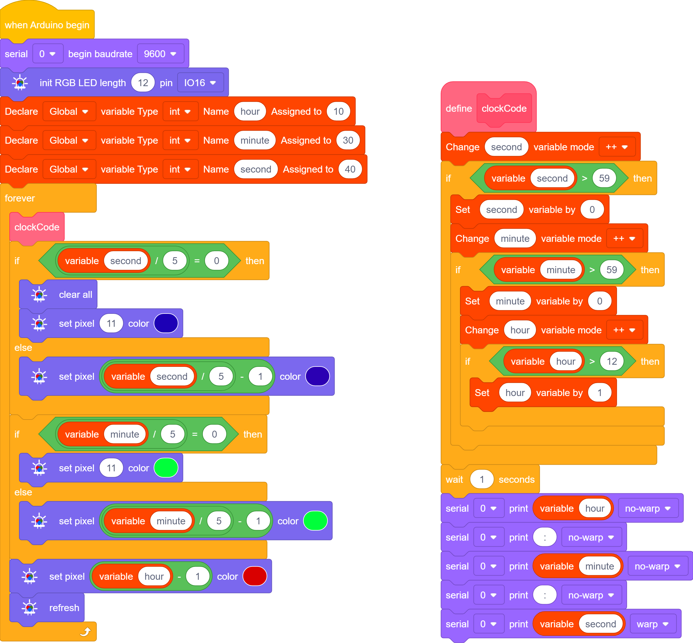

##### 7.30.2.3 Test Result

Before uploading code, you need to input an initial time in the following blocks of variables hour, minute, second. Herein, we set to 10: 30: 40.

After uploading code, you will see the RGB ring shows the time: red for hour, green for minute, blue for second. A minute passes as blue runs a circle. 

Only one color will be displayed when they are overlapped. Blue will not cover green while green will not cover red. 

Note that this is an informal clock without a clock chip. So its errors begin to accumulate over time.

### 7.31 Joystick Control Servo

#### 7.31.1 Overview

We control the servo via the axis X of the joystick. This model is widely applied to mechanical ON/OFF of lights and doors.

#### 7.31.2 Test Code

##### 7.31.2.1 Code Flow

##### 7.31.2.2 Build Code

There are two ways to upload the code: directly open the code file we provide; or manually build blocks.

**Directly open the code file we provide:**

1. Click  and choose `Load from your computer`

2. We have already downloaded the codes on computer desktop, so open the file and choose `7-31-remoteControlServo.sb3`

**Manually build blocks:**

1. Build the two basic blocks:
2. Declare a variable *angle* and assign the x value of joystick to *angle*.

3. Add a  to determine whether *angle* > 3500. If yes, servo rotates to 0 degree.

4. Add a  to determine whether *angle* < 500. If yes, servo rotates to 180 degree.

**Complete Test Code**

##### 7.31.2.3 Test Result

After uploading code, push the joystick to the left and the servo rotates to 180 degree. Push it to the right and the servo rotates to 0 degree.

### 7.32 Ultrasonic Ranger

#### 7.32.1 Overview

In this project, we combine the ultrasonic sensor and the OLED module to build a distance meter, whose detection range is 4-300CM.

#### 7.32.2 Test Code

##### 7.32.2.1 Build Code

There are two ways to upload the code: directly open the code file we provide; or manually build blocks.

**Directly open the code file we provide:**

1. Click  and choose `Load from your computer`

2. We have already downloaded the codes on computer desktop, so open the file and choose `7-32-rangeFinder.sb3`

**Manually build blocks:**

1. Build the two basic blocks:
2. Initialize OLED module by 
3. Add a  and set text size to 12x16
4. Declare a variable *distance* and assign the value detected by the ultrasonic sensor to *distance*

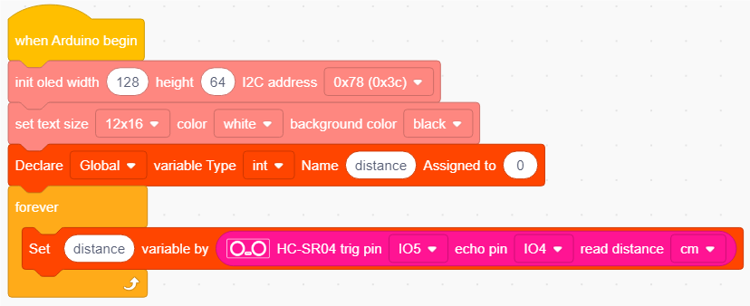

5. Add a  to clear the logo displayed on OLED

6. Add an OLED module to display “Distance:” on the first line and show the value of *distance* on the second line. Add the unit of “CM” after the value. 

6. At last, add a refresh block.

   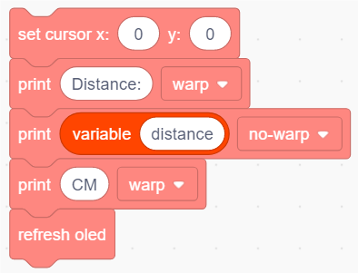

**Complete Test Code**

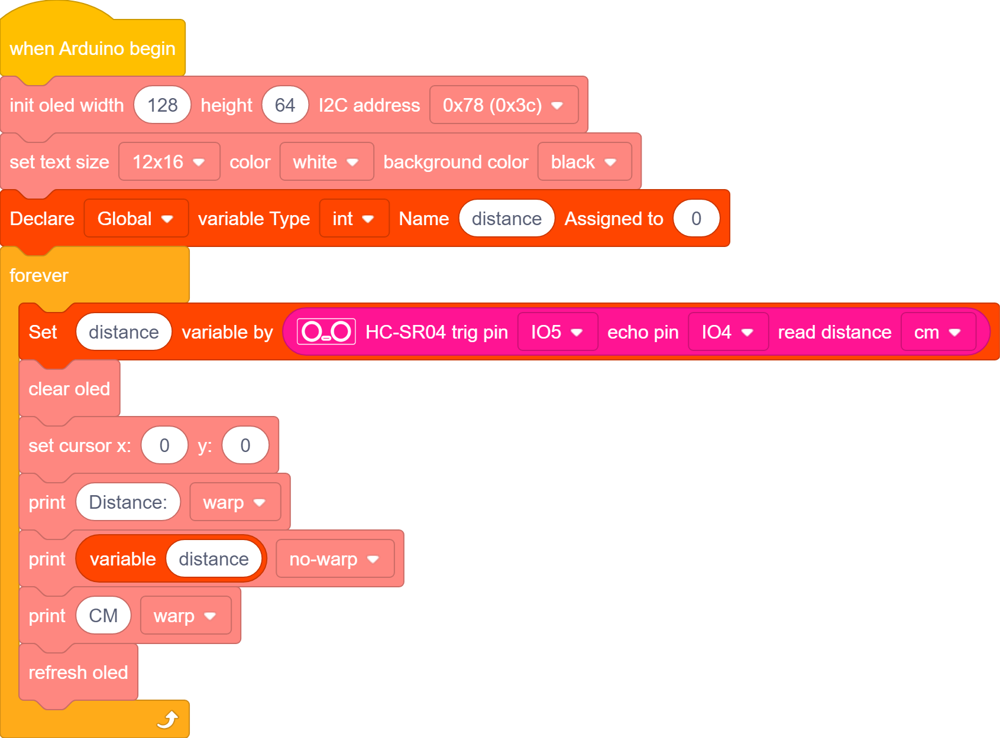

##### 7.32.2.2 Test Result

After uploading code, “Distance:” will be displayed on the first line. What followed is the distance value in “CM” in the second line.

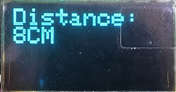

### 7.33 Compass

#### 7.33.1 Overview

The AK8975 module is adopted to read direction values. According to these values, the OLED displays different arrows.

#### 7.33.2 Test Code

##### 7.33.2.1 Code Flow

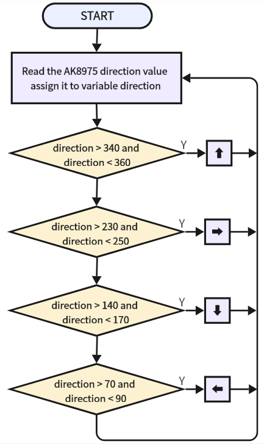

##### 7.33.2.2 Build Code

There are two ways to upload the code: directly open the code file we provide; or manually build blocks.

**Directly open the code file we provide:**

1. Click  and choose `Load from your computer`

2. We have already downloaded the codes on computer desktop, so open the file and choose `7-33-compass.sb3`

**Manually build blocks:**

1. Build the two basic blocks:
2. Initialize AK8975 module and OLED display, declare a variable “direction”.

3. Clear the OLED, and assign the direction value of AK8975 to the variable *direction*

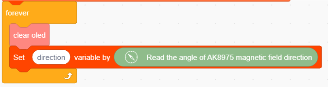

4. Add a  to determine whether 340 < direction < 360. If yes, OLED shows “↑”.

	Block condition: direction > 340 and direction < 360

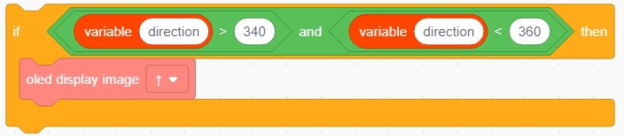

5. Duplicate blocks and determine whether direction > 230 and direction < 250. If yes, OLED shows “→”.
6. If direction > 140 and direction < 170, OLED shows “↓”.
7. If direction > 70 and direction < 90, OLED shows “←”.

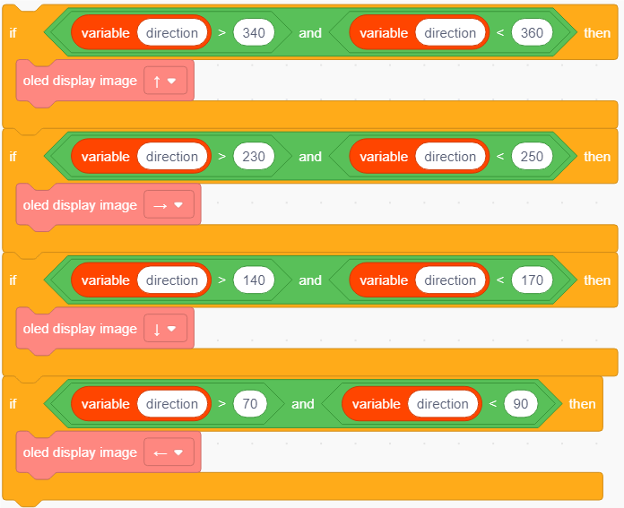

8. Add an OLED refresh block and add a delay of 0.5S.

**Complete Test Code**

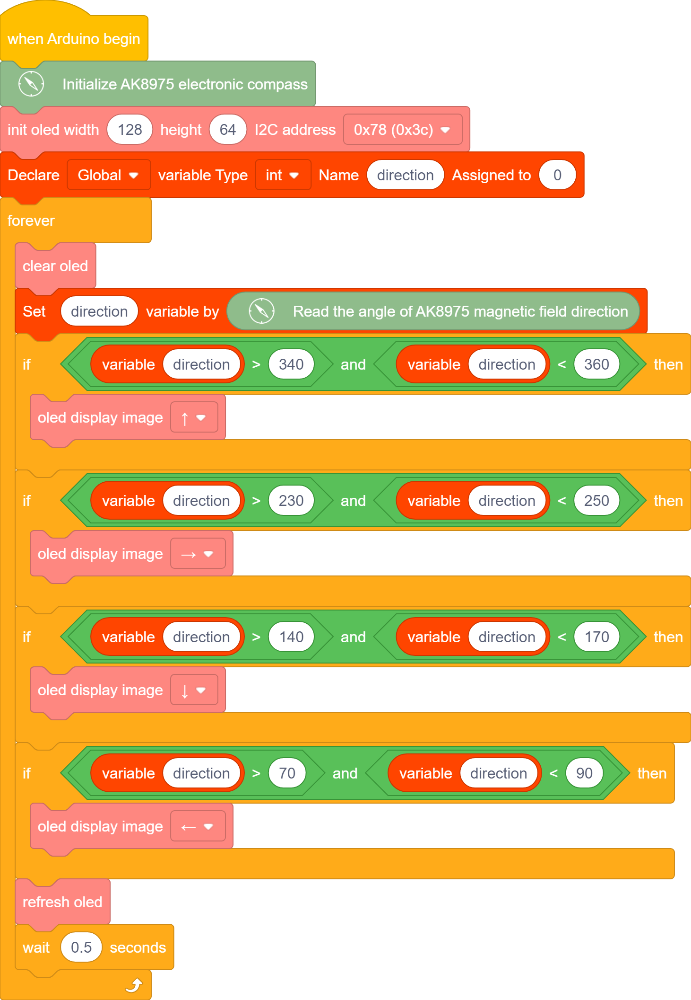

##### 7.33.2.3 Test Result

After uploading code, the arrow on the OLED will nearly point to the South. Move the coding box and you will see the direction changes. 

### 7.34 WiFi

#### 7.34.1 Overview

ESP32 boasts a built-in Wi-Fi and Bluetooth nodule that is widely used in Internet of Things (IoT). With this function, it can remotely control the data transmission through the wireless network. 

In applications, ESP32 can be used as a client to connect to a Wi-Fi network, or as a hotspot to create its own network. Through these connections, ESP32 receives commands to control external devices, such as turning on/off lights and adjusting temperature. In the code, protocols like HTTP and MQTT are used to communicate with the server to achieve data sending and receiving, so as to remotely control and monitoring.

#### 7.34.2 Code Blocks

1.  

	This block initialize wifi module. You need to set the name and passwords of your wifi.

2.  

	This block reads the IP address after esp32 connecting to wifi, and print it on serial monitor.

3.  

	This block updates the sensor values in real time. Input the value name in the first box and its unit in the second one. 

	After that, choose a card ID, which should varies with modules. The value to be displayed is in the final box. 

4.  

	This block adds the web buttons. Set the button usage in the card label. For example, red LED. This is in order to separate buttons. 

	The card ID cannot be the same in the code.

#### 7.34.3 ESP32 WiFi Introduction

ESP32 development board comes with built-in Wi-Fi (2.4G) and Bluetooth (4.2), which enable it to easily connect to Wi-Fi network and communicate with other devices in the network. You can display web pages in your browser via ESP32.

- Base station mode (STA / Wi-Fi Client mode): ESP32 is connected to Wi-Fi hotspot (AP).
- AP mode (Soft-AP / Wi-Fi hotspot mode): Wi-Fi device(s) is(are) connected to ESP32.
- AP-STA mode: ESP32 is both Wi-Fi hotspot and a Wi-Fi device connected to another Wi-Fi.
- These modes supports multiple security modes, including WPA, WPA2 and WEP.
- It is able to scan Wi-Fi hotspot (active or passive)
- It support promiscuous mode monitoring IEEE802.11 Wi-Fi packets.

------

For more wifi reference, please visit https://docs.espressif.com/projects/esp-idf/en/latest/esp32/api-reference/network/esp_wifi.html

espressif official: https://www.espressif.com.cn/en/home

####  7.34.4 Test Code

There are two ways to upload the code: directly open the code file we provide; or manually build blocks.

**Directly open the code file we provide:**

1. Click  and choose `Load from your computer`

2. We have already downloaded the codes on computer desktop, so open the file and choose `7-34-wifi.sb3`

**Manually build blocks:**

Add wifi web page library first:

- Click  to add an Extension

- Click communication to load “**Web Page Editing PRO**”.

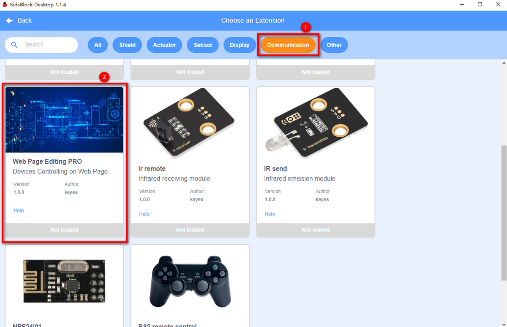

1. In , set the name and passwords of your wifi in block .

2. Display the IP address of the wifi on the OLED

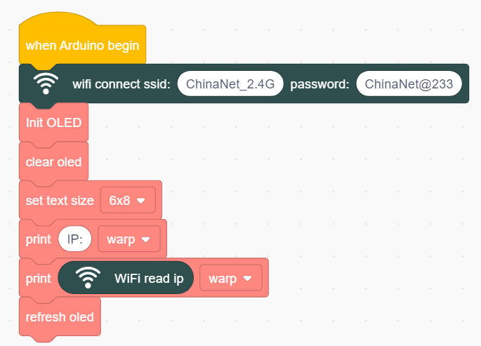

3. Set up a web element named *temperature* in the unit of ℃.

Code block:

Web page:

4. Add a button, set the type to button

Code block:

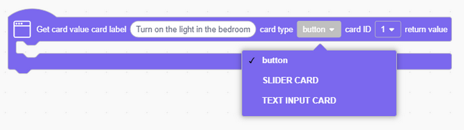

Web page:

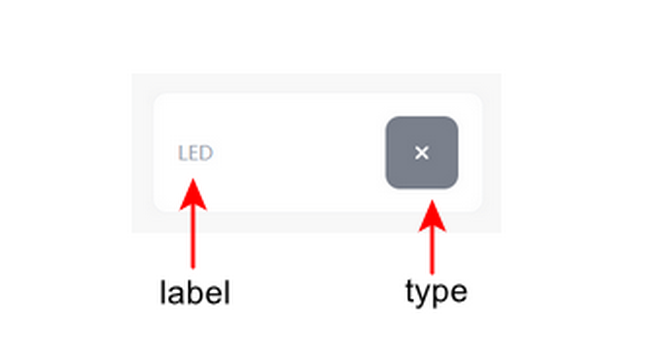

**Complete Test Code**

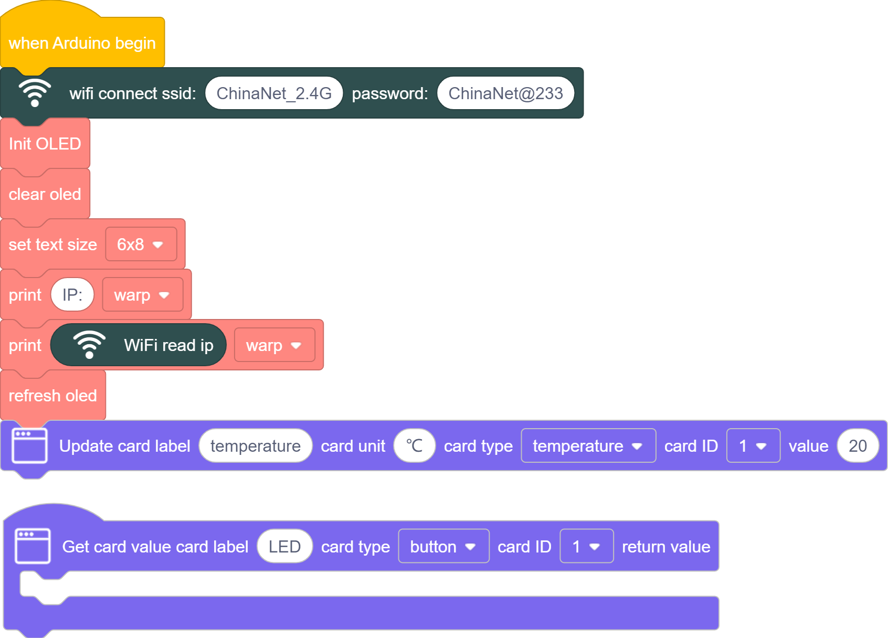

#### 7.34.5 Test Result

After uploading code, the OLED will display the IP address. Connect your computer/mobile phone and ESP32 to the same wifi, and you can access the IP address to see the control page through your device.

PC:

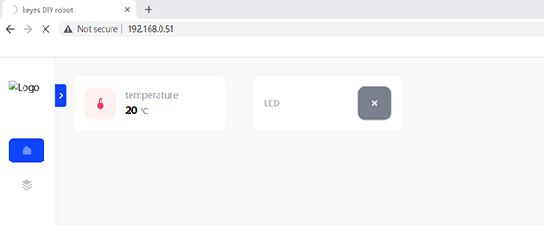

Mobile:

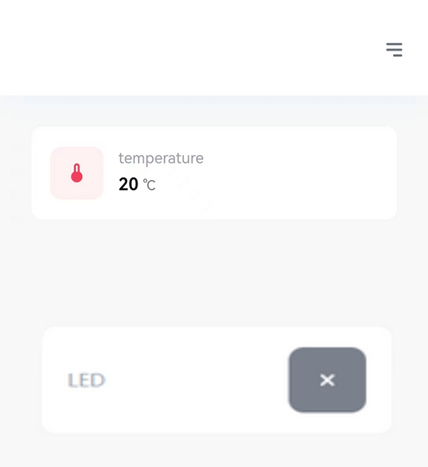

### 7.35 WiFi Real-time Display

#### 7.35.1 Overview

In this project, we display the values of temperature and humidity sensor, pressure sensor, photoresistor, sound sensor, PIR motion sensor and ultrasonic sensor on the web page. 

#### 7.35.2 Test Code

##### 7.35.2.1  Build Code

There are two ways to upload the code: directly open the code file we provide; or manually build blocks.

**Directly open the code file we provide:**

1. Click  and choose `Load from your computer`

2. We have already downloaded the codes on computer desktop, so open the file and choose `7-35-wifiWebpageDisplay.sb3`

**Manually build blocks:**

1. Initialize BMP388 and wifi, set the name and passwords of wifi.

	Initialize OLED and display the IP address of the wifi on it.

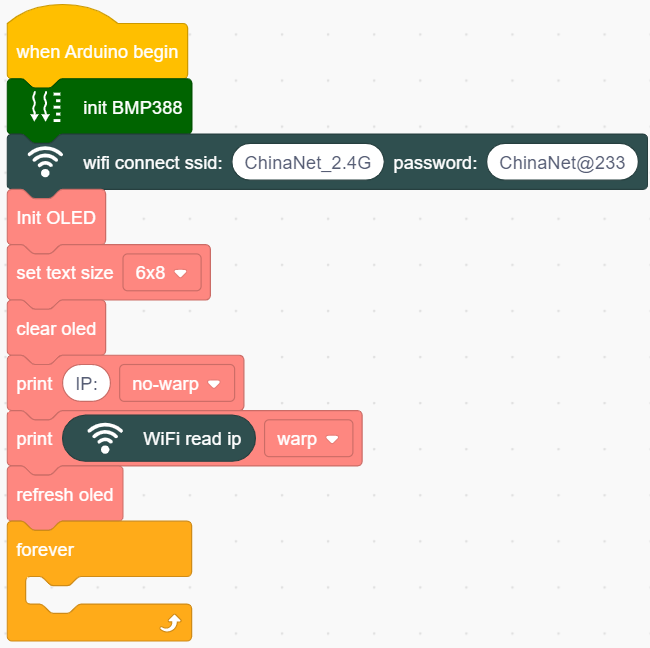

2. set values on web page through block 

   

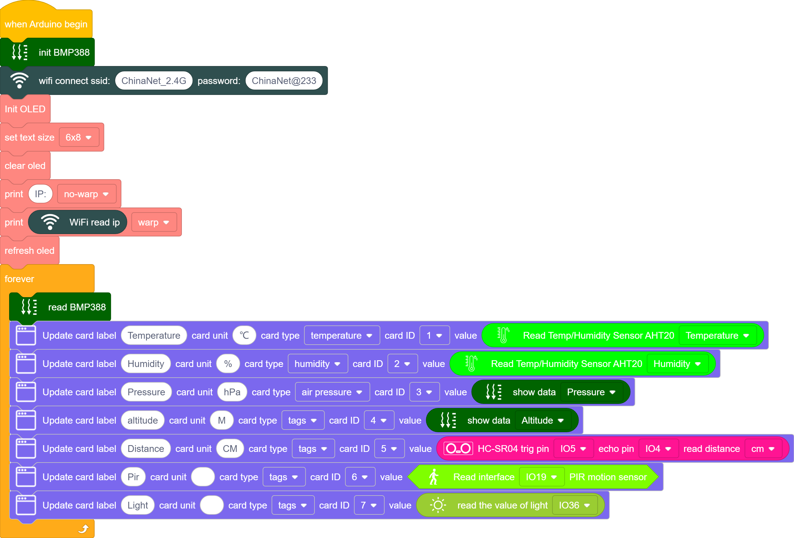

##### 7.35.2.2 Test Result

Upload the code, and the OLED shows the IP address after connecting to wifi. 

Connect your computer/mobile phone and ESP32 to the same wifi, and you can access the IP address to see the values through your device. 

If you are using a mobile phone hotspot, you can directly access the IP via the phone.

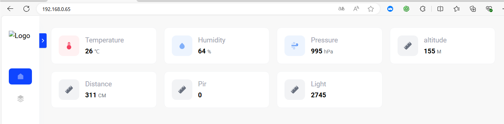

### 7.36 WiFi Control

#### 7.36.1 Overview

We control LED, servo and the fan on the web page button wirelessly. 

#### 7.36.2 Test Code

##### 7.36.2.1 Build Code

There are two ways to upload the code: directly open the code file we provide; or manually build blocks.

**Directly open the code file we provide:**

1. Click  and choose `Load from your computer`

2. We have already downloaded the codes on computer desktop, so open the file and choose `7-36-wifiWebpageControl.sb3`

**Manually build blocks:**

1. Initialize wifi and OLED, display the IP address of the wifi on the OLED. Name a variable used to switch sensor state according to the corresponding functions, for example, we name redLed to represent the red led.

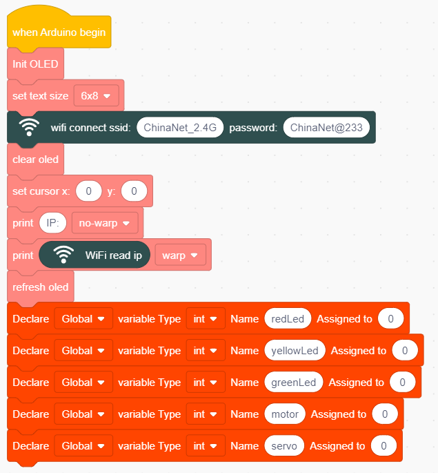

2. Set web buttons and add functions of buttons by block ; Add  to determine whether the value = 0. If yes, execute code in “then”. If not, run code in “else”. 

	We take red led as an example. Initially, redLed = 0. When the red led button is pressed, the red led will light up and redLed becomes 1. When you press this button next time, code in “else” will be execute, so the led goes off and redLed = 0 again. 

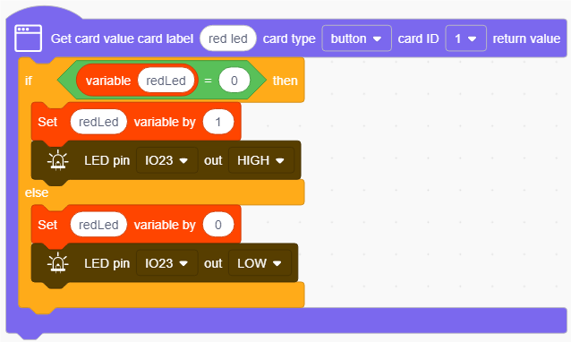

3. Similarly, set blocks of yellow led, green led, Servo and motor.

**Complete Test Code**

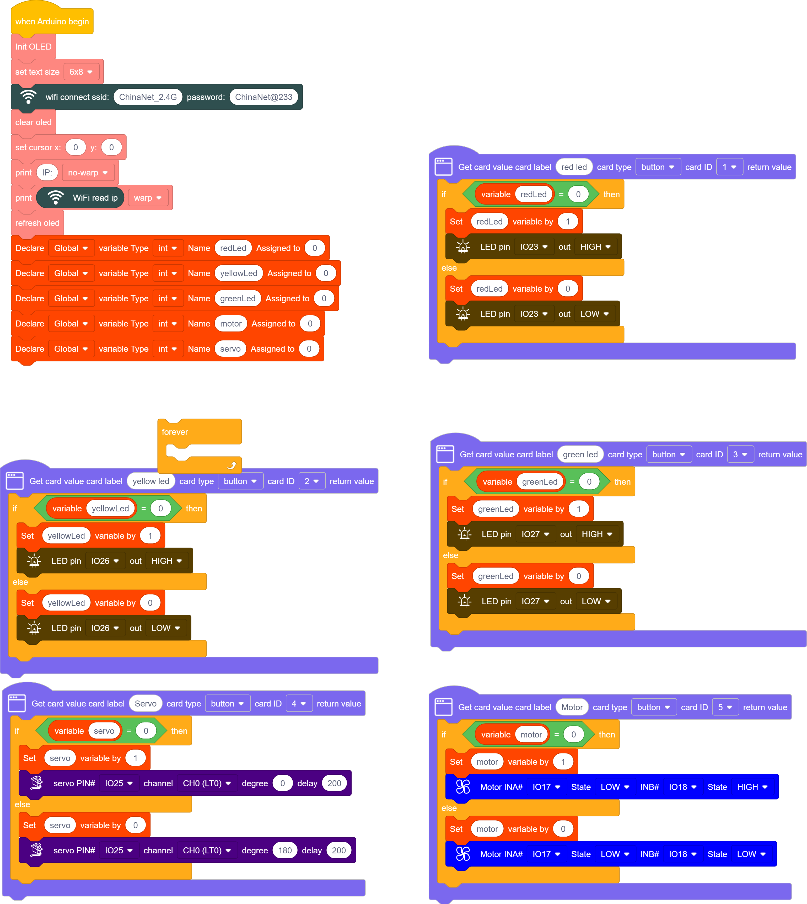

#####    7.36.2.2 Test Result

Upload the code, and the OLED shows the IP address after connecting to wifi. 

Connect your computer/mobile phone and ESP32 to the same wifi, and you can access the IP address to see the control page through your device. 

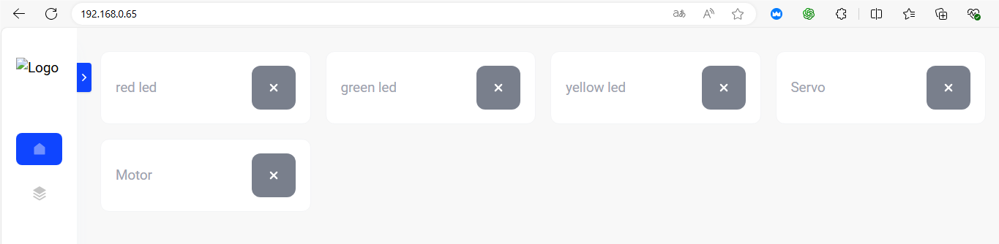

### 7.37 WiFi Piano

#### 7.37.1 Overview

In this project, we set seven buttons to control the speaker to play tones of Do, Re, Mi, Fa, So, La, Si.

#### 7.37.2 Test Code

##### 7.37.2.1 Build Code

There are two ways to upload the code: directly open the code file we provide; or manually build blocks.

**Directly open the code file we provide:**

1. Click  and choose `Load from your computer`

2. We have already downloaded the codes on computer desktop, so open the file and choose `7-37-wifiWebPiano.sb3`

**Manually build blocks:**

1. Initialize wifi and OLED module, display the IP address of the wifi on the OLED
2. define buttons through , modify the button names and functions, press buttons to play tones of Do, Re, Mi, Fa, So, La, Si.

**Complete Test Code**

##### 7.37.2.2 Test Result

Upload the code, and the OLED shows the IP address after connecting to wifi. 

Connect your computer/mobile phone and ESP32 to the same wifi, and you can access the IP address to see the control page through your device. 

### 7.38 Smart Control Panel

#### 7.38.1 Overview

Combined web buttons and wireless control, this control panel in this project is able to control modules and read module values as well. 

#### 7.38.2 Test Code

##### 7.38.2.1 Build Code

There are two ways to upload the code: directly open the code file we provide; or manually build blocks.

**Directly open the code file we provide:**

1. Click  and choose `Load from your computer`

2. We have already downloaded the codes on computer desktop, so open the file and choose `7-38-intelligentConsole.sb3`

**Manually build blocks:**

1. Initialize wifi and OLED module, set the name and passwords of the wifi

2. Set the values to be displayed through block 

3. Define button names and functions through block

**Complete Test Code**

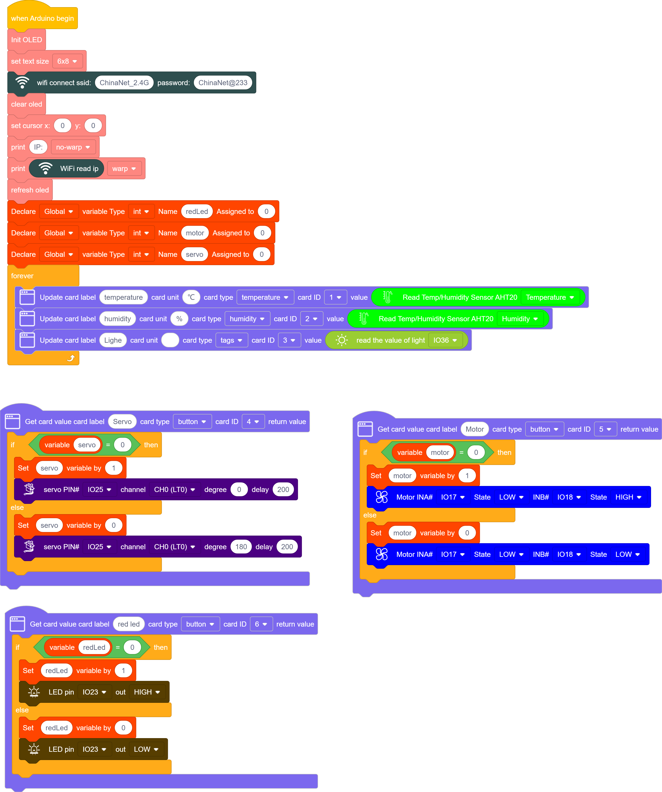

##### 7.38.2.2 Test Result

Upload the code, and the OLED shows the IP address after connecting to wifi. 

Connect your computer/mobile phone and ESP32 to the same wifi, and you can access the IP address to see the control page through your device. 

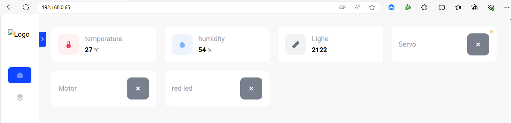
