# MicroBlocks Tutorial

## 1.About MicroBlocks

### 1.1 What Is MicroBlocks?

MicroBlocks is a free graphical programming language similar to Scratch, which supports many educational microcontroller main boards, such as micro:bit, ESP32/ESP8266, Raspberry PI Pico, etc. 

Welcome to use MicroBlocks to learn physical computing!

### 1.2 What Are Its Features?

**Real-Time Programming:** MicroBlocks is a real-time programming environment. Click a block, and it runs immediately on the board. Try out command blocks to view and plot sensor values in real time, with no waiting for code compilation or downloading.

**Autonomous Operation:** MicroBlocks downloads your code as you write it. Once programmed, it runs independently (offline). Create portable games, fitness apps, or glowing wearables as you wish.

**Parallel Tasks:** Want to control a motor while displaying an animation? No problem! MicroBlocks lets you write separate scripts for each task and run them simultaneously. Parallel coding becomes simpler and more intuitive.

**Cross-Platform Compatibility:** MicroBlocks runs on many different boards, “write once, run anywhere”. Blocks for buttons, sensors, and displays work across boards with compatible hardware. It even simulates the micro:bit 5x5 LED matrix on TFT displays.

**Program Portability:** With MicroBlocks, your board acts like a USB drive. No need to store files—just plug it in to reload your code. Share your board with friends, and they can explore your scripts or add new features directly!

While other block-based languages exist for microcontrollers, what truly sets MicroBlocks apart is its combination of real-time programming and autonomous operation. Other languages support only one of these features rather than both.

### 1.3 How MicroBlocks Works?

The MicroBlocks system has three components:

- **Blocks Editor**: Runs on a computer during development.
- **Virtual Machine**: Executes user code on the microcontroller.
- **Communication System**: Updates code on the board as scripts are edited.

The blocks editor lets users create and edit code while managing MicroBlocks libraries for added functionality. Some libraries support sensors or devices like servos and NeoPixels; others provide APIs for text, lists, and music. Libraries themselves are written in MicroBlocks, allowing users to explore, modify, and extend them.

Like MicroPython, MicroBlocks code is compiled into **bytecode** executed by a [virtual machine](https://wiki.microblocks.fun/virtual_machine) on the microcontroller. Bytecode is low-level, processor-agnostic instructions, making it easy to support diverse 32-bit microcontrollers. In fact, the MicroBlocks VM isn’t limited to microcontrollers—it also runs on Linux devices like Raspberry Pi.

To learn more about bytecode, visit the VM page on the wiki. If “Advanced Blocks” are enabled, right-click scripts to view their generated instructions and bytecode—a great way to explore how computers execute code.

The communication system sends bytecode to the VM and updates it incrementally as scripts are edited, enabling immediate execution for rapid testing and iteration. It also handles starting/stopping scripts and relays data from the microcontroller, allowing the editor to visualize events graphically.

**Sensor Insights Through Real-Time Feedback**
The key to understanding sensors is observing their live responses. For example, how does acceleration change when tossing a micro:bit? The communication system displays sensor values and results in small “Dialogue Bubbles” and supports real-time data plotting. Visualization turns abstract physical and electrical properties into intuitive, observable phenomena.

### 1.4 Coding Box Driver !

When installing the driver, connect the coding box to the computer! ! !

#### 1.4.1 Windows

Click to download the [Windows CH340 driver](./Windows.zip).

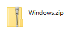

After downloading, extract and save it in a location where you can find it. It's best to store it on your desktop.

For windows 10 and higher versions, they have built-in drivers. If you are their users, connect the coding box to the computer, click on Computer → Properties → Device Manager. As shown in the figure, once the connection is successful, there is no need to install the driver again.

If here’s the case, the driver needs to be installed manually.

Right-click  to “Update driver”.

“Browse my computer for drivers”.

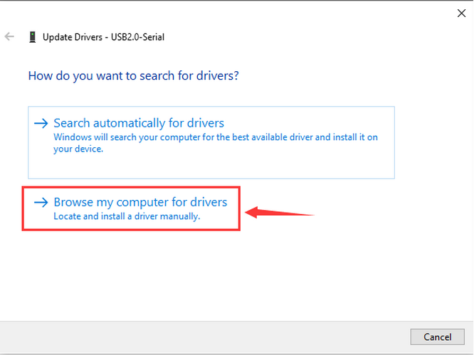

Find the downloaded driver file “usb_ch341_3.1.2009.06”:

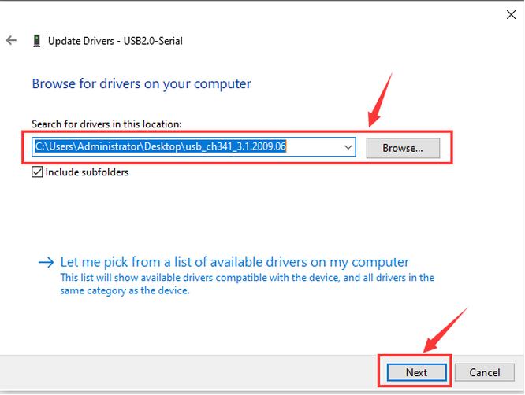

After the driver is installed, click “Close”, and then the serial port number will appear.

In this way, the driver is installed. Click on Computer → Properties → Device Manager, and we can see:

#### 1.4.2 MAC

Click to download the [MAC CH340 driver](./MAC.zip).

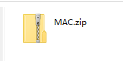

After downloading, extract and save it in a location where you can find it. It's best to store it on your desktop.

Step 1: Download the driver from the Website and extract the file to the local installation directory.

Step 2: For details about how to install the driver in pkg format by default, see Step 3. If OS X 11.0 or later does not support Rosetta, refer to Step 4 to install the dmg driver.

Before installation, please forward to “System Preferences” → “Security & Privacy” → “General” page, below the title “Allow apps downloaded from:” choose the choice 2 → “Mac App Store and identified developers”, then the driver will work normally.

Step 3: To install the driver in pkg format, tap the driver file → Continue → Install.

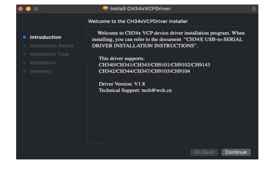

Then the installation will be successful.

To install the pkg format driver on OS X 11.0 and later: Open “LaunchPad” → “CH34xVCPDriver” → Install.

When using OS X 10.9 to OS X 10.15, click “Restart” to restart your computer, and perform the following steps after the restart.

Step 4: To install the dmg driver, tap the dmg file and drag “CH34xVCPDriver” to enter the application folder in the operating system.

Then open “LaunchPad” → “CH34xVCPDriver” → Install.

Then the installation will be successful.

When inserting the CH340 control board into the USB port, open System Report → Hardware → USB. On the right is USB Device Tree. If the USB device is working properly, you will find a device whose “Vendor ID” is [0x1a86].

Open “Terminal” program under Applications → Utilities folder and type the command “ls /dev/tty*”.

You should see the “tty.wchusbserialx” where “x” is the assigned device number similar to Windows COM port assignment.

### 1.5 Program on MicroBlocks

There are two programming methods for MicroBlocks.

#### 1.5.1 Online on Browser (Recommended)

Click on the link: [MicroBlocks](https://microblocks.fun/run-pilot/)

MicroBlocks can be run in Chrome or Edge browsers without installing any software.

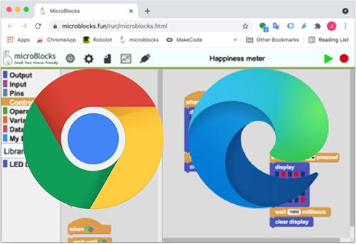

Neither traditional applications nor professional technicians are required when we run MicroBlocks in a browser.

MicroBlocks can also run in other browsers, but it can only connect to the main board when running in Chrome or Edge browsers on desktops, laptops, or Chromebook computers (non-mobile devices).

#### 1.5.2 MicroBlocks Software

Note: The software version is currently in testing, please use '1.5.1 Online on Browser (Recommended)' first, and it is expected to be updated to the software in August. `

[Get Started - MicroBlocks](https://microblocks.fun/get-started#computer)

After entering the Download link, select your computer system. For example, choose the “Windows” system and then click “Download”.

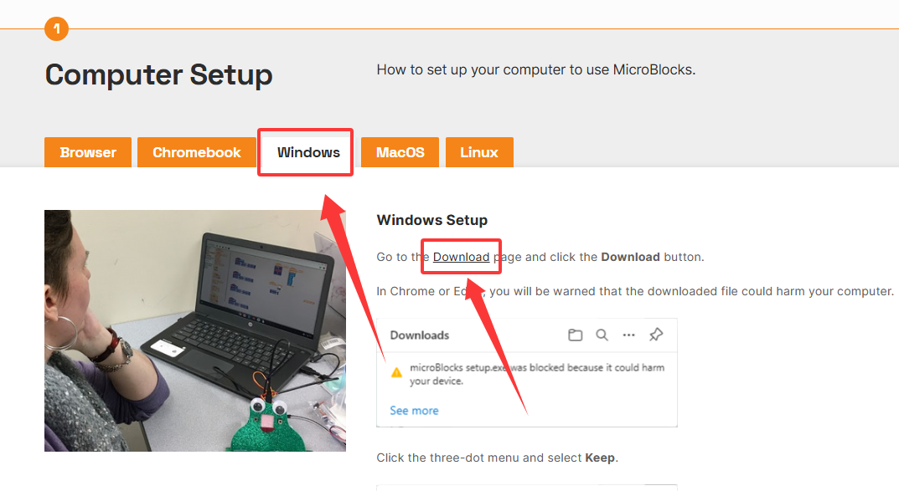

Click to download the MicroBlocks.

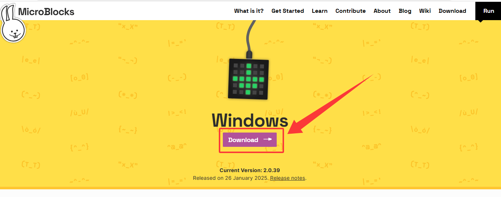

Download successful! Double-click to install.

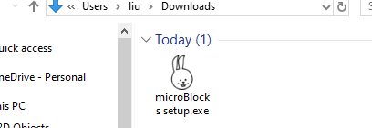

### 1.6 Main Board Firmware !

Here we demonstrate how to burn firmware on browsers, which can be a reference for MicroBlocks software users.

[MicroBlocks](https://microblocks.fun/run-pilot/)

Click on the link and open it in the browser to enter the programming page.

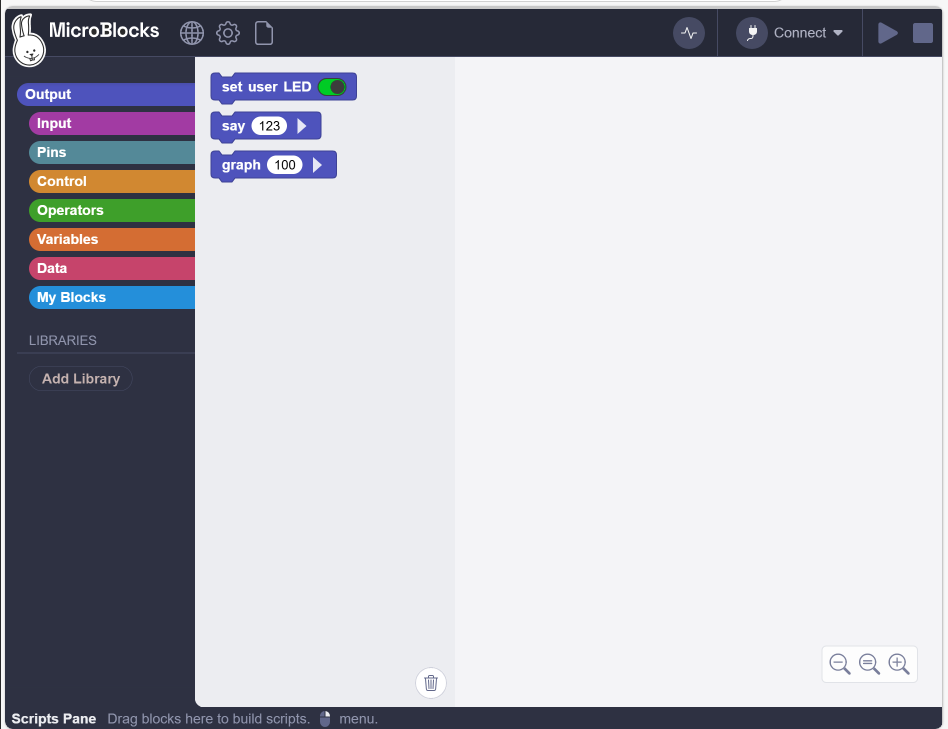

Click  to `update firmware on board` and choose the coding box.

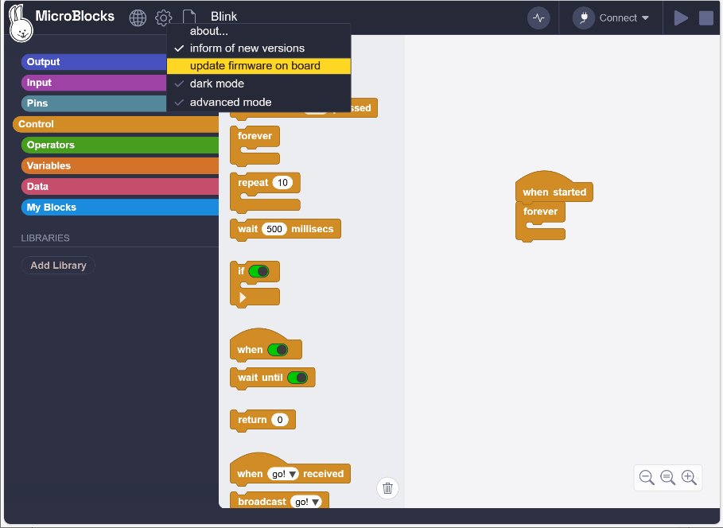

It includes a specified firmware `KidsBits` for the coding box, so we upload this firmware.

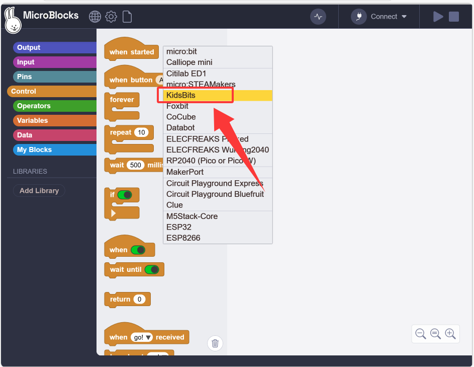

Choose the USB serial number and `connect`. If you have any further questions about this, please back to `1.4 Coding Box Driver !`.

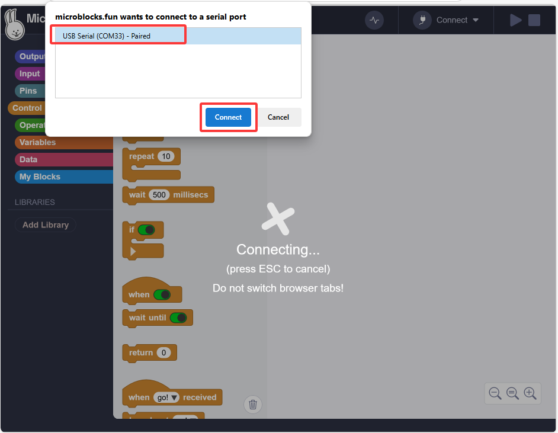

When the upload progress reaches 100%, the firmware upload is complete.

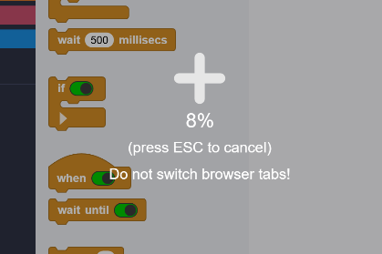

Click `OK`.

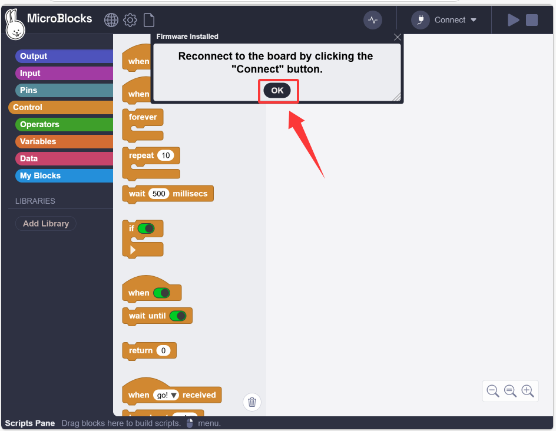

### 1.7 Programming Page

The following figure shows the main interface of the MicroBlocks editor.

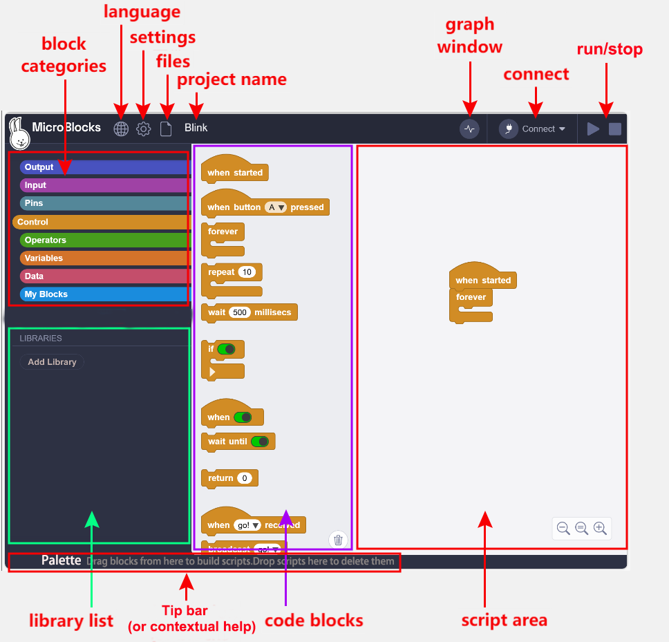

**Block Categories:**

This area contains all block categories used for MicroBlocks programming. They are divided into nine colors of groups. Choose a category and the blocks in it will be listed beside (like opening a drawer with building blocks placed inside).

 stores the code blocks used for outputting data.

 contains the code blocks used for reading the input data.

 stores the code blocks used for operating the input or output data of the pins.

 contains control code blocks.

 stores the code blocks for operations.

 is used to define variables.

 contains the code blocks for data processing.

 is used for customizing code blocks.

Official detailed introduction: [Blocks Reference | MicroBlocks Wiki](https://wiki.microblocks.fun/en/reference_manual)

**Menu Bar:**

Three system menus are provided, along with icon.

 sets the language displayed by the editor.

 is the settings. Click to set up the editor. The firmware of the coding box also needs to be selected here.

 is files that can be operated on, such as creating, saving, opening, etc.

 is the name of the code file.

 is a graph plotter to view the data changes.

 connects the boding box. Click it to select the way to connect to the coding box: USB or Bluetooth.

 is the run and stop buttons, through which the code can be controlled to run and stop running.

**Library List:**

The contents of this area reflects various libraries loaded according to the requirements of user scripts and microprocessors. The list can be empty (without any libraries) or multiple libraries can be introduced.

**Blocks Palette:**

After choosing a category, code blocks with such specific functions will be listed in this area beside the category. Here, these blocks can be dragged into the script area to write programs. If you need to delete a block in the script area, just drag it back to this area.

**Tip bar:**

Move your mouse over the blocks and IDE areas highlighted in yellow, and their types and brief description as well as functions of each area will be displayed in this area. Detailed block description can be obtained through right-click menu of each block.

**Working with Scripts:**

Since the script area is the most frequently used part in the editor, introducing the unique operations and usage conventions of this area can help you work with the editor better.

For more details, please visit [User Guide | MicroBlocks Wiki](https://wiki.microblocks.fun/en/ide).

### 1.8 Coding Box Connection

Click  to connect by USB or Bluetooth. After connection, we can directly upload code to the coding box. Here we choose USB connection.

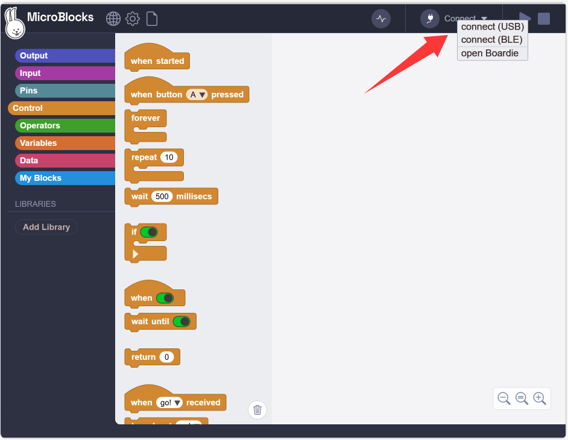

USB connection:

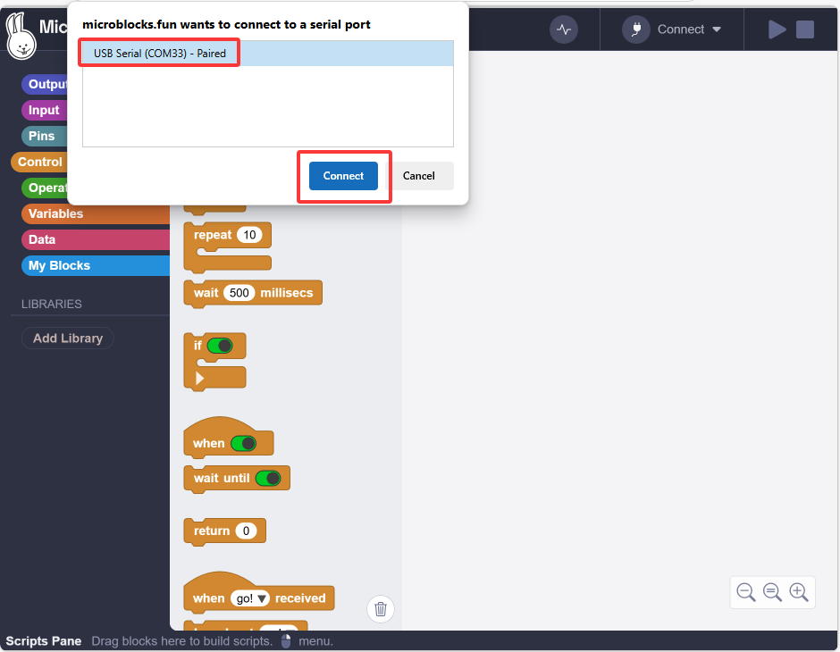

Bluetooth connection:

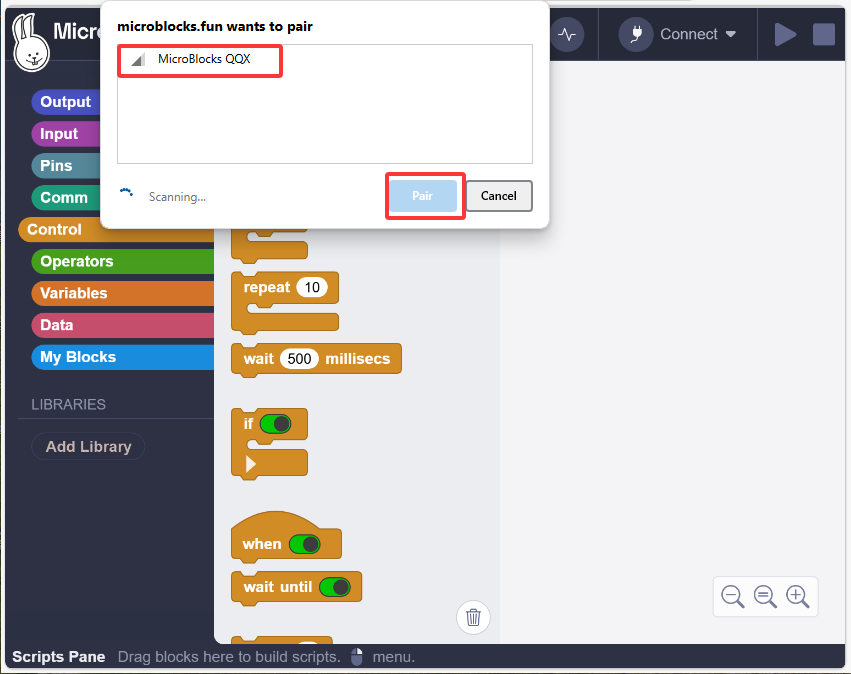

After connecting, it will load library files required by the coding box and show .

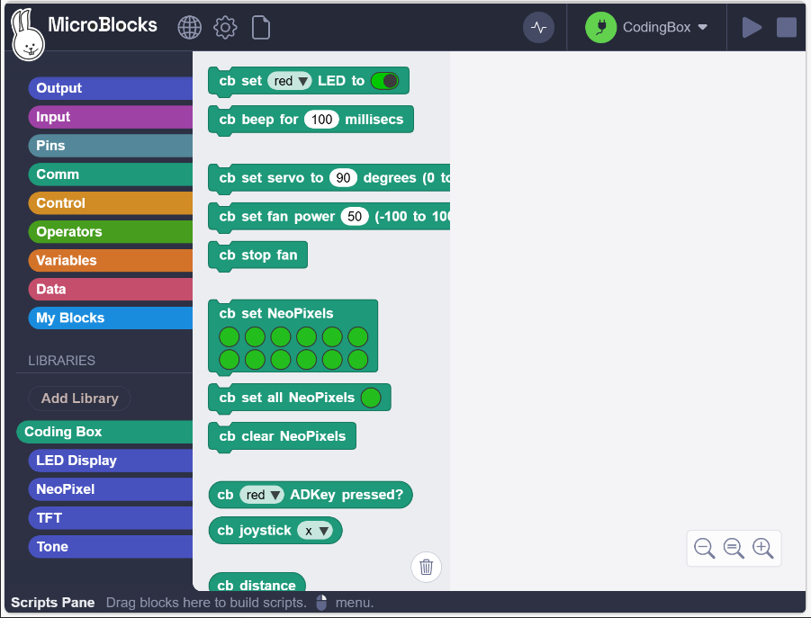

### 1.9 Upload Code

After connecting the coding box, upload the code. We can either build the code manually or open the provided code file.

**Build the code blocks manually:**

When uploading code, since the MicroBlocks code is in real time, you only need to click to run the code to upload it to the coding box.

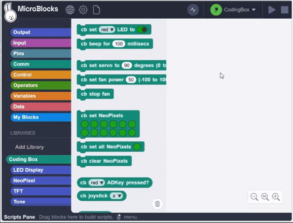

## 2. Code Download

### 2.1 How to Download

Click to [download the code file](./Codes.zip).

### 2.2 How to Open

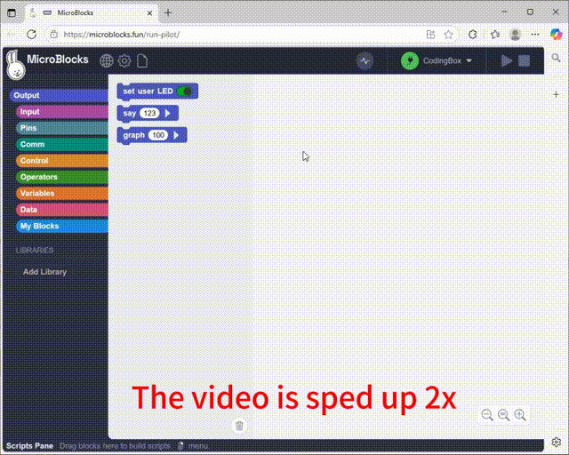

### 2.3 How to Upload

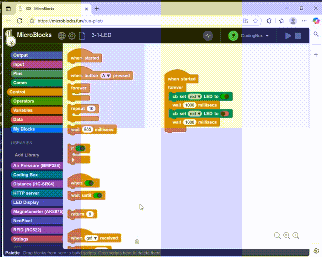

## 3. Projects

### 3.1 LED Blink

#### 3.1.1 Overview

LED Blink is one of the simplest entry-level programming projects for the ESP32 Coding Box. It only needs an LED and then upload the code. This simple project helps beginners better master basic concepts.

#### 3.1.2 Schematic Diagram

**LED lighting on:** The output current of the IO ports is limited, so the LED brightness may not be enough. Therefore, a NPN triode (Q2) is added to the circuit as a switch. We only need to add a high(low) level at the triode base pin 1 to light it up(out).

**Triode on/off:** To put it simple, when the base(pin 1) receives a high level, the collector(pin 3) and the transmitter(pin 2) are connected, so then VCC passes through the current-limiting resistor to the LED and then into the triode to GND, forming a loop. At this time, LED is on. When pin 1 receives a low level, pin 3 and 2 are disconnected so the current loop cannot be formed, resulting LED off.

#### 3.1.3 Code Blocks

Blocks in :

1.  is in “Control” class. Click the green  to run the code. These hat blocks monitor the various conditions described in their titles. When the startup condition is true, **when started** will be activated. The others are to check whether the button status or Boolean conditions are true to determine whether to execute the blocks placed under them.

2. , a C-shaped block, also called LOOP, is a set of control blocks. As long as the conditions described in it are true, the inside codes will run. This repetitive execution will run the code blocks inside it forever. It is often used for plotting numerical values or continuously monitoring port values, etc.

3.  pauses the execution flow for the specified number of milliseconds. It is used to pause and resume the execution in a time-controlled manner. Unit conversion: 1 second = 1000 milliseconds

--------------------------------

Blocks in :

1.  is a block included in coding box library. It can control the red, yellow and green LED on/off on the coding box. Click  to choose an LED and tap  to turn off it.  means ON, and  is OFF.

#### 3.1.4 Test Code

You can manually build blocks, or directly open the code file we provide: `3-1-LED.ubp`. If you have any questions about how to open code files or upload code, please back to `1.9 Upload Code`.

**Build code blocks:**

1. In , drag  and  to the script area, and stack them together.

2. In , drag  block and place it in .

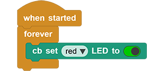

3. In , drag  block and modify `500` into `1000`, and put it under .

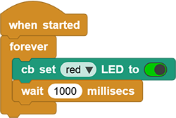

4. Move your mouse onto  and click to choose `duplicate all`. Put the copy under the above blocks and set  to .

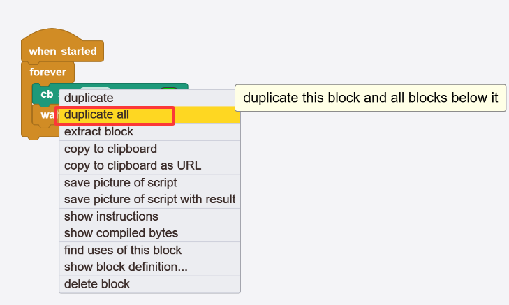

**Complete code:**

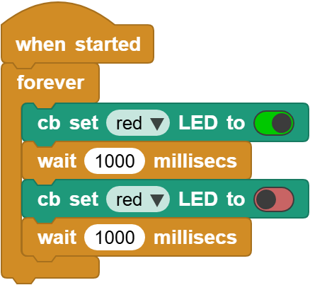

#### 3.1.5 Test Result

Connect the coding box to the MicroBlocks via USB or Bluetooth, and click  to upload the code to the coding box. The red LED will blink with an interval of 1 second. If you want it to flash faster, modify the delay.

### 3.2 Sound Sensor

#### 3.2.1 Overview

The sound sensor, with excellent sound reception, mainly contains a high sensitivity microphone and an LM358 operational amplifier. Weak sound signals are captured by the microphone and amplified by LM358, so the output is clear and recognizable, which can be effectively detected the sounds. 

This sensor features high sensitivity, fast response speed, so is widely used in sound detection and recognition, providing a stable and reliable voice input solution for various intelligent devices.

#### 3.2.2 Schematic Diagram

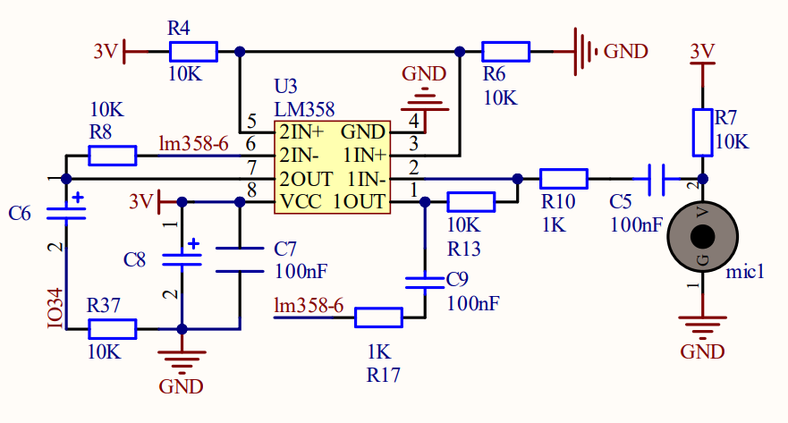

**Working principle:** If the built-in electret film vibrates after receiving sounds, its capacitance will change to produce a tiny voltage. The LM358 chip is adopted in circuits to amplify the sound signals detected by the high-sensitivity microphone.

#### 3.2.3 Code Blocks

Blocks in :

1.  displays the input values. It can be used to display any data type supported by MicroBlocks. In addition to directly entering values, a variable report block can also be placed there. If you want to display more than one piece of data, simply click on the triangle to add more. This is one of the main methods to help troubleshoot the faults in the code. Click on  to add an output blank: 

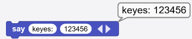

2.  plots input values in a Data Graph. Any type of data can be plotted as a graph: numbers, digital and analog pin input, sensor output, etc. If you want to draw more than one, click on the triangle to add up to six values simultaneously drawn in different colors. Note that plotting is only supported in the IDE. Therefore, it is possible to plot only when a device is connected to the computer. Plotting without a device will result in showing “Not connected to the mainboard”. Click  to check the graph. 

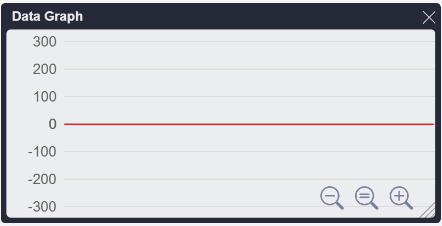

-----------------

Blocks in :

1.  is a block included in coding box library. It reads the analog values of the sound sensors in the coding box.

#### 3.2.4 Test Code

You can manually build blocks, or directly open the code file we provide: `3-2-Sound.ubp`. If you have any questions about how to open code files or upload code, please back to `1.9 Upload Code`.

**Build code blocks:**

1. In , drag  and  to the script area, and stack them together.

2. In , drag  and  block and put them in  respectively. 
3. Tap  of the  to add an output blank. Enter `loudness:` in the first one.

4. In , drag  and put it in both the second blank of  and the .

**Complete code:**

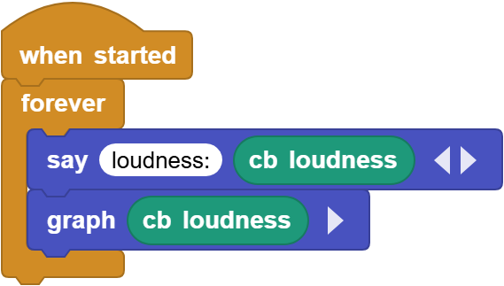

#### 3.2.5 Test Result

Connect the coding box to the MicroBlocks via USB or Bluetooth, and click  to upload the code to the coding box. Click  to check the graph. Make a sound for the sensor to capture, and then we can see the analog values of the sound on the editor.

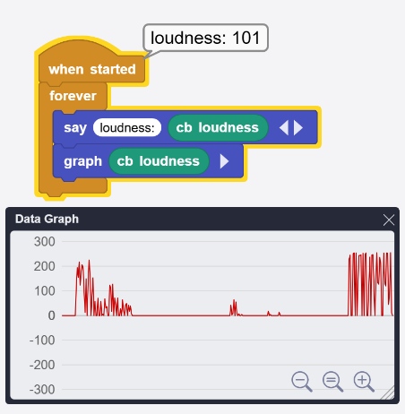

### 3.3 PIR Motion Sensor

#### 3.3.1 Overview

The PIR motion sensor adopts RE200B-P element. 

Based on pyroelectric effect, the sensor is able to detect the infrared ray emitted by human body or animal. With Fresnel lens, it can even detect farther and wider. When a nearby human or animal motion is detected, the sensor outputs a high level.

#### 3.3.2 Schematic Diagram

**Working principle:** The human body maintains at 37 degrees, so it will emit a specific wavelength of about 10μm infrared. The sensor captures 10μM infrared to determine whether there is a motion.

#### 3.3.3 Code Blocks

Blocks in :

1. 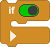 “IF” block checks the Boolean condition. If it is true, the included blocks run once.  allows for expansions by adding multiple “ELSE IF” conditions. If the previous branches are not true, each of the following ELSE IF will be continuously evaluated and executed.

--------------------

Blocks in :

1.  is a block included in coding box library. It reads the value of the PIR motion sensor in the coding box. When a person is detected, the sensor outputs a high level (1); when not, the sensor outputs a low level (0).

#### 3.3.4 Test Code

You can manually build blocks, or directly open the code file we provide: `3-3-Pir.ubp`. If you have any questions about how to open code files or upload code, please back to `1.9 Upload Code`.

**Build code blocks:**

1. In , drag  and  to the script area, and stack them together.

2. In , drag  block and put it in ; Click  to add an “else”.

3. In , drag  block and put it in .

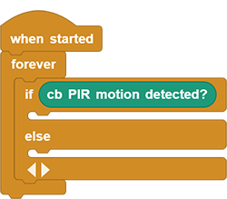

4. In , drag two  and put them in  respectively. Output `Someone!` in “if” and `No one!` in “else”.

   **Complete code:**

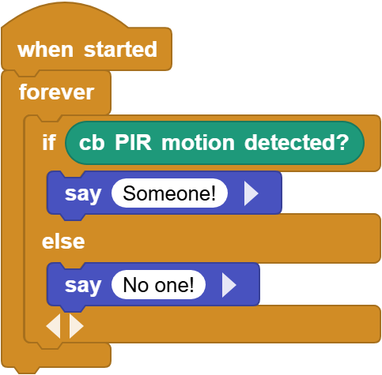

#### 3.3.5 Test Result

Connect the coding box to the MicroBlocks via USB or Bluetooth, and click  to upload the code to the coding box. When the PIR motion sensor detects a human, it outputs `Someone!`. If not, it shows `No one!`.

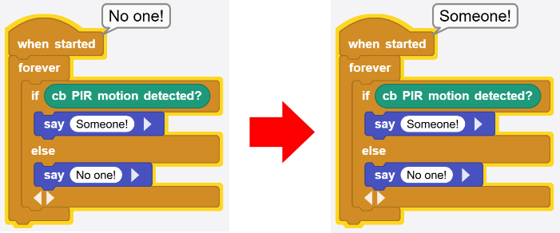

### 3.4 Power Amplifier

#### 3.4.1 Overview

The 8002b power amplifier mainly consists of a speaker and an audio amplification chip. It can amplify small audio signals for about 8.5 times. These amplified sounds will be played through its speaker. Besides, it can also play some music or melodies. 

#### 3.4.2 Schematic Diagram

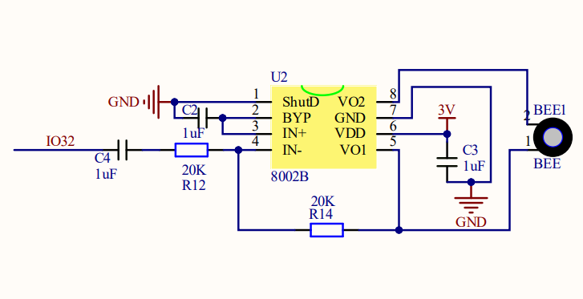

#### 3.4.3 Code Blocks

Blocks in :

1.  plays the given note at a given octave within a set milliseconds. The note name is AG (uppercase or lowercase), followed by a # to indicate a sharp sign.

2.  plays the notes specified by the key numbers (0-127) on the piano, where the center C is 60. This block performs mathematical conversions on music (for example, transposing to another key).

   MIDI, Musical Instrument Digital Interface, is the industry standard for controlling synthesizers, drum machines and other electronic music devices.

3.  plays the notes specified in Hertz (Hz). The central C is approximately 261 Hz, and the upper A is 440 Hz (the note tuned by the orchestra).

4.  starts playing the specified tone in Hertz (Hz) continuously.

5.  stops playing.

6.  sets the pin for playing the tone. Connect the piezoelectric buzzer or headphones to this pin. For a board with a built-in speaker, if this block is omitted, the built-in speaker will be used.

Blocks in :

1.  is a block included in coding box library. It controls the speaker in the coding box to emit a beep  sound and its duration can be set.

#### 3.4.5 Test Code

You can manually build blocks, or directly open the code file we provide: `3-4-Speaker.ubp`. If you have any questions about how to open code files or upload code, please back to `1.9 Upload Code`.

**Build code blocks:**

1. In , drag  and  to the script area, and stack them together.

2. In , drag 7  and set “play note" to `c,d,e,f,g,a,b` reapectively.

**Complete code:**

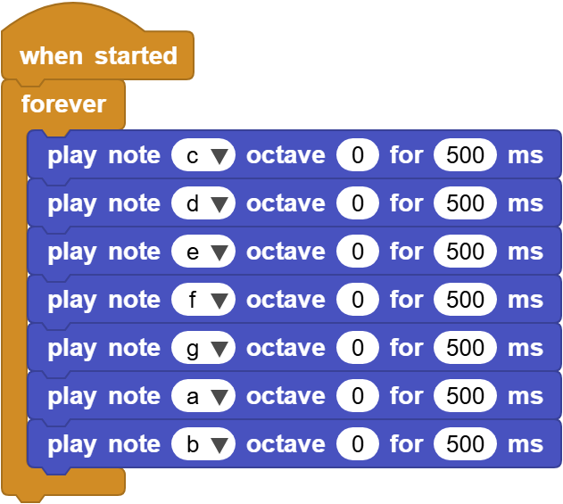

#### 3.4.6 Test Result

Connect the coding box to the MicroBlocks via USB or Bluetooth, and click  to upload the code to the coding box. The power amplifier plays Do, Re, Mi, Fa, Sol, La, Si, in a loop.

### 3.5 Photoresistor

#### 3.5.1 Overview

Photoresistor is photoelectric device that works according to semiconductor photoconductivity. It can be used to sense the brightness of the current environment to output a corresponding analog value.

#### 3.5.2 Schematic Diagram

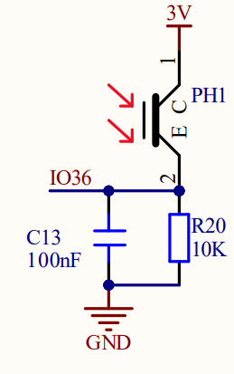

Photoresistor takes advantage of the photoelectric effect of semiconductors. Its resistance varies with ambient light. 

In the light, the semiconductor material absorbs photon energy to produce electron-hole pairs, increasing the conductivity and reducing the resistance. The brighter the light is, the lower the resistance will be. From the changes of resistance, it can sense light intensity accurately. Therefore, it is widely used in automatic lighting, photoelectric control, real-time monitoring and regulation of light.

#### 3.5.3 Code Blocks

Blocks in :

1.  is a block included in coding box library. It reads the analog value of the photoresistor in the coding box. The brighter the light is, the larger the analog value will be (Analog value range: 0-1023)

#### 6.5.4 Test Code

You can manually build blocks, or directly open the code file we provide: `3-5-Light.ubp`. If you have any questions about how to open code files or upload code, please back to `1.9 Upload Code`.

**Build code blocks:**

1. In , drag  and  to the script area, and stack them together.

2. In , drag  and  block and put them in .
3. Tap  of the  to add an output blank. In the first blank, enter `light value:`

4. In , drag  and put it into both the second blank of   and .

**Complete code:**

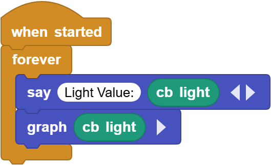

#### 3.5.5 Test Result

Connect the coding box to the MicroBlocks via USB or Bluetooth, and click  to upload the code to the coding box. Click  to check the graph. Cover the sensor with your hand, and you will see the value decreases.

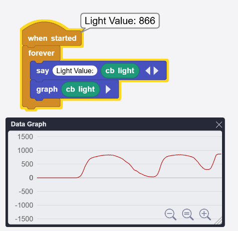

### 3.6 AD Button

#### 3.6.1 Overview

The AD button requires only one analog pin to read multiple button states, which greatly saves IO ports. It adopts analog acquisition, and the output voltages vary from pressed buttons, so that different analog values can be obtained. We can determine which button is pressed according to these values.

#### 3.6.2 Schematic Diagram

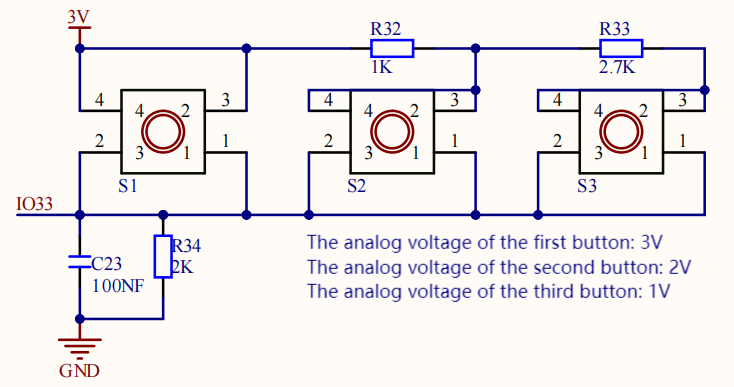

From the Schematic Diagram: 

When no button is pressed, the output at signal pin IO33 is pulled down by R34 (connected to GND. So the analog value of IO33 is 0, that is, low level 0V;

When button S1(the red button) is pressed, pin IO33 is connected to VCC. So the analog value of IO33 is 4095 (voltage = 3.3V).

When button S2(the yellow button) is pressed, the voltage of IO33 is that between R32 and R34: VCCxR34/(R32+R34) ≈ 2.2V, and the analog value is about 2432;

When button S3(the green button) is pressed, the voltage of IO33 is that between R32+R33 and R34: VCCxR34/(R32+R33+R34) ≈ 1.1V, and the analog value is about 1175.

#### 3.6.3 Code Blocks

Blocks in :

1.  is a block included in coding box library. It reads the status value of the AD button in the coding box. Pressing is a high level (1), and releasing is a low level (0). Click on the  to switch buttons.

	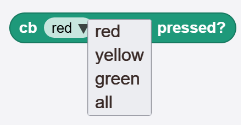

#### 3.6.4 Test Code

You can manually build blocks, or directly open the code file we provide: `3-6-ADKey.ubp`. If you have any questions about how to open code files or upload code, please back to `1.9 Upload Code`.

**Build code blocks:**

1. In , drag  and  to the script area, and stack them together.

2. In , drag  block and put it into , and tap  to add some else-ifs as follows. 

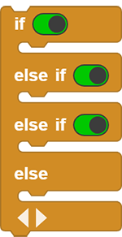

2. In , drag 3  and put it on the  of . Set the first to red, the second to yellow and the third to green. Tap  to remove “else”.

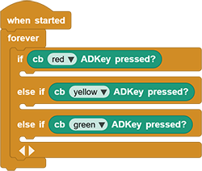

3. In , drag three  blocks and put them in . Press the red button to output “Press the red button”, yellow: “Press the yellow button” and green: “Press the green button”.

**Complete code:**

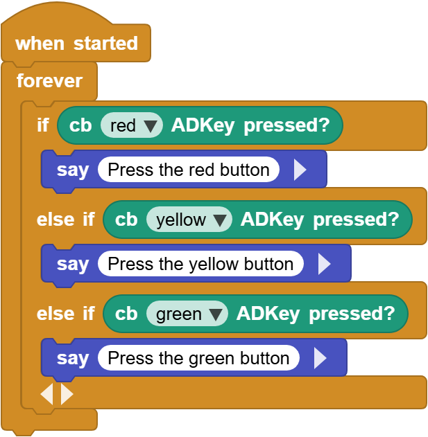

#### 3.6.5 Test Result

Connect the coding box to the MicroBlocks via USB or Bluetooth, and click  to upload the code to the coding box. Press the red button and it outputs `Press the red button`; Press the yellow button and it says `Press the yellow button`; Press the green button it outputs `Press the green button`.

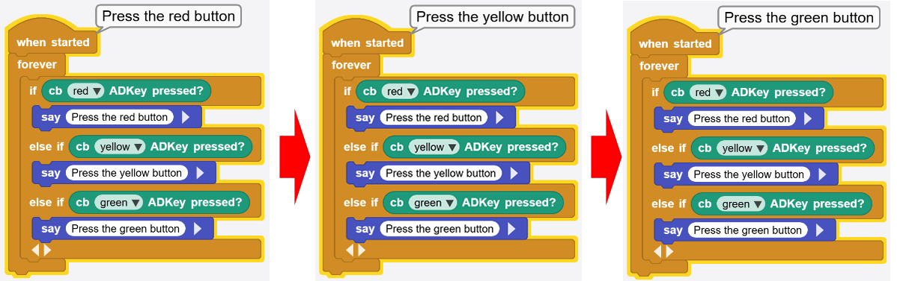

### 3.7 Ultrasonic Sensor

#### 3.7.1 Overview

Ultrasonic sensor measures the distance of an object by sound waves. It boasts a transmitter and a receiver to emit sound waves and then measure the returned waves. The time difference between transmitting and receiving can be used to calculate the distance value. Beyond that, it is also used to detect the shape or presence of objects, build automatic doors, and measure flow rates and pressures.

#### 3.7.2 Schematic Diagram

**Working principle:** Like bats, the ultrasonic sensor sends an ultrasonic signal with a high frequency that human cannot hear. If these signals encounter obstacles, they will immediately reflect back and be received by the sensor. After that, the distance between the sensor and the obstacle is calculated according to the time difference between signals transmitting and receiving. 

**Maximum detection distance:** 3M

**Minimum detection distance:** 4cm

**Detection angle:** no greater than 15 degrees

#### 3.7.3 Code Blocks

Blocks in :

1.  is a block included in coding box library. It reads the distance values detected by the ultrasonic sensor in the coding box.

#### 3.7.4 Test Code

You can manually build blocks, or directly open the code file we provide: `3-7-Ultrasonic.ubp`. If you have any questions about how to open code files or upload code, please back to `1.9 Upload Code`.

**Build code blocks:**

1. In , drag  and  to the script area, and stack them together.

2. In , drag  block and put it in .
3. Tap  of the  to add an output blank. In the first blank, enter `distance：`

4. In , drag  and place it in the second blank of .
5. In , drag  and put it under , and modify the delay to `100ms`.

**Complete code:**

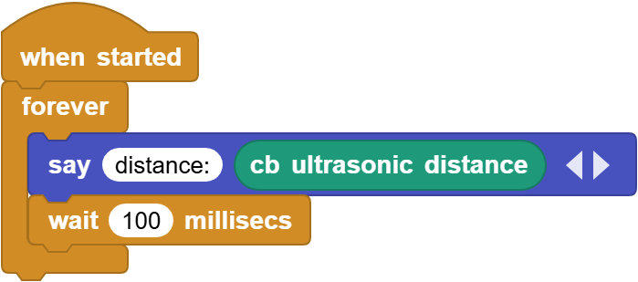

#### 3.7.5 Test Result

Connect the coding box to the MicroBlocks via USB or Bluetooth, and click  to upload the code to the coding box. If you wave you hand in front of the ultrasonic sensor or move back and forth, you can see the change in the printed distance values.

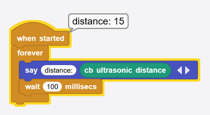

### 3.8 RFID Sensor

#### 3.8.1 Overview

RFID-RC522 module adopts Phillips MFRC522 original chip in card reading circuit, which is easy to use and with low cost. It is suitable for equipment and reader development, advanced applications, RF card terminal design and producing.

#### 3.8.2 Schematic Diagram

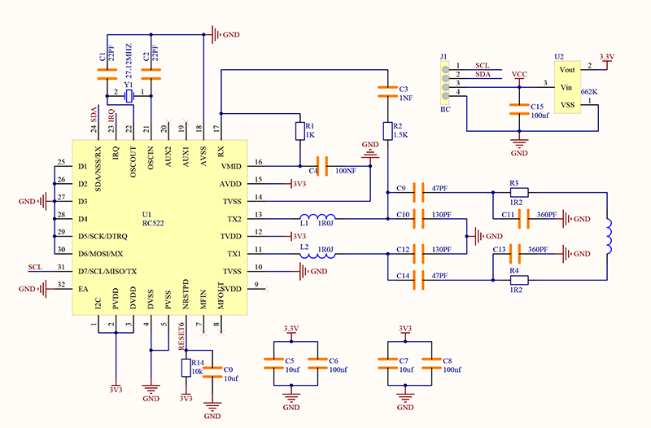

**RFID (Radio Frequency Identification)**: 

The card reader is composed of a frequency transmitter module and a high level magnetic field. The Tag transponder is a device to be sensed without a battery. It consists only of tiny integrated circuit chips, media for storing data, and antennas for receiving and transmitting signals. To read the data in the tag, it must be placed within the reading range of the reader. After that, the reader will generate a magnetic field. According to Lenz's law (magnetic energy generates electricity), the RFID Tag will be powered, thus activating the device.

NOTE: this module only recognize card working at 13.56MHz. It is recommended to use the provided card in the kit.

#### 3.8.3 Code Blocks

Blocks in :

1.  is a block included in coding box library. It reads the card value sensed by the RFID in the coding box.

#### 3.8.4 Test Code

You can manually build blocks, or directly open the code file we provide: `3-8-RFID.ubp`. If you have any questions about how to open code files or upload code, please back to `1.9 Upload Code`.

**Build code blocks:**

1. In , drag  and  to the script area, and stack them together.

2. In , drag  block and place in . 
3. Tap  of the  to add an output blank. In the first blank, enter `RFID：`

4. In , drag  and put it into the second blank of .
5. In , drag  and add it under  and set the delay to `100ms`.

**Complete code:**

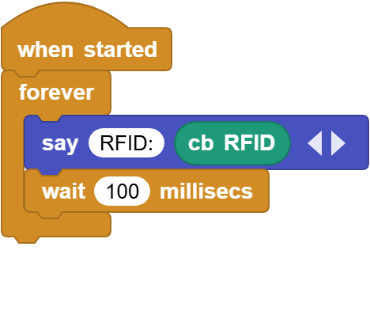

#### 3.8.5 Test Result

Connect the coding box to the MicroBlocks via USB or Bluetooth, and click  to upload the code to the coding box. Cover the RFID sensing area with the IC card, and you will see the ID numbers. Note that the ID number of each card is different. It shall be based on the one you read.

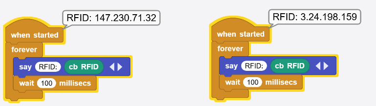

### 3.9 Axis-X&Y Joystick Module

#### 3.9.1 Overview

Axis-X&Y Joystick is a high-precision input device for bidirectional control. Its X and Y axes are separated to control horizontal and vertical movements respectively. This module contains 10K resistance so that it ensures the stability and accuracy of signals. 

#### 3.9.2 Schematic Diagram

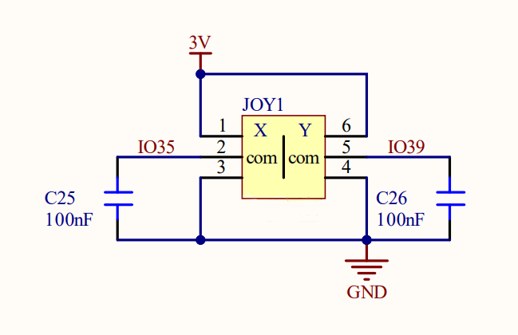

ESP32 Axis-X&Y Joystick works based on a two-axis potentiometer that detects movements on two axes. When the joystick moves on axis X or Y, the resistance of the potentiometer changes, outputting analog voltage signals. After being received by ESP32 analog input pin (ADC), these signals will be read by ESP32 board and converted to digital values. Therefore, the joystick coordinate can be easily revealed during controlling. 

#### 3.9.3 Code Blocks

Blocks in :

1.  is a block included in coding box library. It reads the X and Y values of the joystick in the coding box. Tap  to switch:

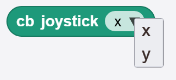

#### 3.9.4 Test Code

You can manually build blocks, or directly open the code file we provide: `3-9-Joystick.ubp`. If you have any questions about how to open code files or upload code, please back to `1.9 Upload Code`.

**Build code blocks:**

1. In , drag  and  to the script area, and stack them together.

2. In , drag  block and place in . 
3. Click  of the  to set 4 output blanks in total. In the first blank, enter `X:`; in the third one enter `Y:`

4. In , drag  block and put it onto the second blank of .
5. In , drag  block and set to Y, and put it onto the fourth blank of .
6. In , drag  block and put it under . Set the delay to `100ms`.

**Complete code:**

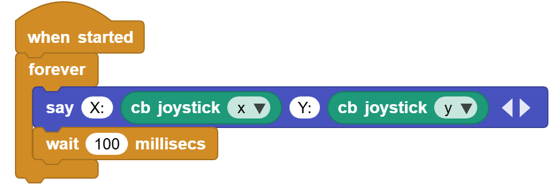

#### 3.9.5 Test Result

Connect the coding box to the MicroBlocks via USB or Bluetooth, and click  to upload the code to the coding box. Toggle the joystick, and the values on axis X and Y changes. 

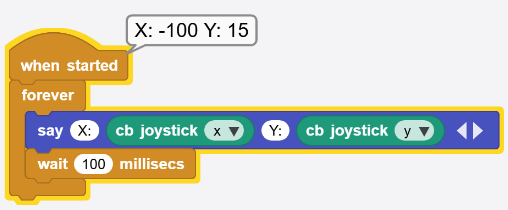

### 3.10 Temperature and Humidity Sensor

#### 3.10.1 Overview

AHT20 temperature and humidity sensor adopts I2C interface and 20Bit ADC, and its operating voltage is 2V-5V. It features small volume, stable performance and high precision (temperature ±0.3℃, humidity ±2%RH). So it is widely used in smart home, consumer electronics, medical and automotive. The sensor is stable and can work in harsh environments.

#### 3.10.2 Schematic Diagram

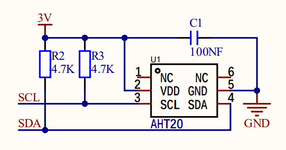

ATH20 temperature and humidity sensor transmits data via I2C interface, and it works according to resistive and capacitive technology. It detects the temperature because the material's conductivity changes with temperature, and it reflects humidity through the change in the capacitance value. The temperature measurement range is -40 ° C to +85 ° C with accuracy of ±0.3 ° C, and the humidity range is 0% ~ 100%RH ±2%RH. Besides, it features high accuracy, high reliability and long-term stability, so it can work under a variety of environmental conditions. With I2C protocol, ATH20 provides real-time and accurate temperature and humidity data.

#### 3.10.3 Code Blocks

Blocks in :

1.  is a block included in coding box library. It reads the ambient temperature sensed by the coding box.
2.  is a block included in coding box library. It reads the ambient humidity sensed by the coding box.

#### 3.10.4 Test Code

You can manually build blocks, or directly open the code file we provide: `3-10-AHT20.ubp`. If you have any questions about how to open code files or upload code, please back to `1.9 Upload Code`.

**Build code blocks:**

1. In , drag  and  to the script area, and stack them together.

2. In , drag  block and place in . 
3. Click  of the  to set 6 outputs blanks in total. In the first blank, enter `Temperature:`; in the fourth one, enter `Humidity:`. Output “°” and “%” as their units respectively.

4. In , drag  and put it onto the second blank of .
5. In , drag  and put it onto the fifth blank of .
6. In , drag  and put it under the  and set the delay to `100ms`.

**Complete code:**

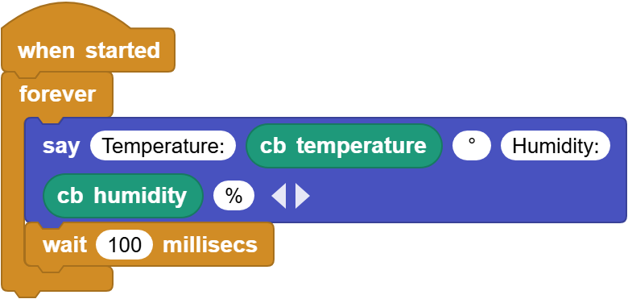

#### 3.10.5 Test Result

Connect the coding box to the MicroBlocks via USB or Bluetooth, and click  to upload the code to the coding box. You will see the temperature and humidity values. If you cover the sensing hole of the sensor with your hand, you can see a significant change in humidity.

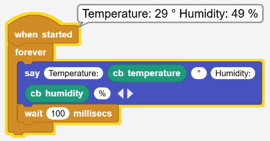

### 3.11 Pressure Sensor

#### 3.11.1 Overview

BMP388 pressure sensor is a pneumatic MEMS sensor a very compact package, featuring small size, low power consumption but high performance. In brief, it is a combination of the temperature and pressure sensor, which is perfect for mobile applications. 

This module adopts proven piezoresistive pressure sensing technology with high accuracy and linearity, as well as long-term stability and high EMC stability. Besides, it maximize flexibility in multi-device working, and is ideal for altitude tracking in consumer electronics drones, wearables, smart homes, etc. 

As for improvement, we can optimize the device in terms of power consumption, resolution and filtering performance.

#### 3.11.2 Schematic Diagram

Based on piezoelectric pressure sensing technology, the BMP388 pressure sensor accurately measures pressure and temperature. It is capable of measuring air pressure in the 300 ~ 1250 hPa range without consuming much power (consuming only 3.4 µA at 1 Hz operating frequency). In addition, the built-in infinite impulse response filter can effectively reduce effects from external interference.

#### 3.11.3 Code Blocks

Blocks in :

1.  is a block included in coding box library. It reads the air pressure values sensed by the pressure sensor in the coding box.

#### 3.11.4 Test Code

You can manually build blocks, or directly open the code file we provide: `3-11-Pressure.ubp`. If you have any questions about how to open code files or upload code, please back to `1.9 Upload Code`.

**Build code blocks:**

1. In , drag  and  to the script area, and stack them together.

2. In , drag  block and place in . 
3. In , drag  block and put it in .
4. In , drag  and set the delay to `200ms`.

**Complete code:**

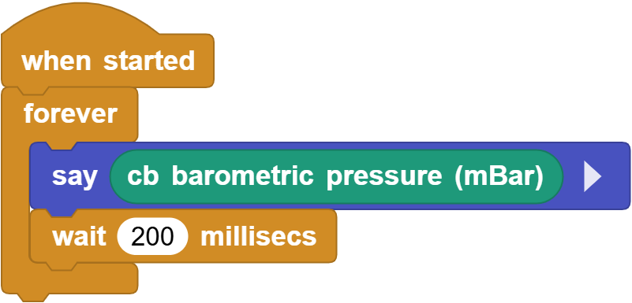

#### 3.11.5 Test Result

Connect the coding box to the MicroBlocks via USB or Bluetooth, and click  to upload the code to the coding box. You will see the ambient air pressure value sensed by the sensor.

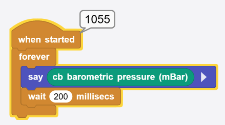

### 3.12 Geomagnetic Sensor (Compass)

#### 3.12.1 Overview

AK8975C geomagnetic sensor is a three-axis electronic compass IC with high sensitivity. It can output 13-bit data and accurately detect X, Y, Z axes geomagnetic values. Thus, it is suitable for portable devices with navigation function such as mobile phones and tablets.

#### 3.12.2 Schematic Diagram

The AK8975C geomagnetic sensor works in the principle of electromagnetic induction. It takes the Earth's magnetic field as a measurement benchmark to sense changes in the magnetic field through its internal magnetic material and coils. Specifically, when the magnetic material is affected by geomagnetic field, a directional constrained electron spin deflection will happen due to the field force, which in turn forms a magnetic field. This field induces potential signals in the coil.

This sensor amplifies and processes the induced potential signals, which are then transmitted to the system for further calculation, analysis and processing. So it measures geomagnetic magnetic field in the axis X, Y, and Z to determine the direction.

#### Code Blocks

Blocks in :

1.  is a block included in coding box library. It reads the angle value sensed by the geomagnetic sensor of the coding box.

#### Test Code

You can manually build blocks, or directly open the code file we provide: `3-12-Geomagnetic.ubp`. If you have any questions about how to open code files or upload code, please back to `1.9 Upload Code`.

**Build code blocks:**

1. In , drag  and  to the script area, and stack them together.

2. In , drag  block and place in . 
3. In , drag  block and put it onto .
4. In , drag  and set the delay to `200ms`.

**Complete code:**

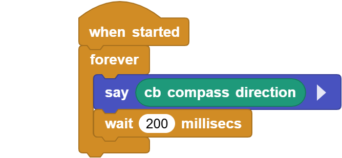

#### Test Result

Connect the coding box to the MicroBlocks via USB or Bluetooth, and click  to upload the code to the coding box. You can see the angles sensed by the geomagnetic sensor. Rotate the coding box to observe that the angle changes from 0 to 360 degrees. 

(Note that the sensor may be affected by electronic devices and environmental magnetic fields, resulting in geomagnetic angle deviations.)

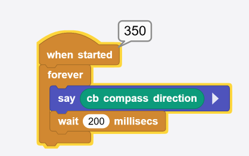

### 3.13 Fan Module

#### 3.13.1 Overview

The motor adopts HR1124S motor control chip that is a single channel H-bridge driver chip used in DC motors. The H-bridge drive uses PMOS and NMOS power tubes with low on-resistance, ensuring lower power loss and longer safe working time. In addition, its standby and static working current are both low, so it is commonly used in toys.

#### 3.13.2 Schematic Diagram

**Motor control logic table:**

| IO18 | IO17 |      motor state      |
| :--: | :--: | :-------------------: |
| HIGH | LOW  |    forward rotate     |
| LOW  | HIGH |    reverse rotate     |
| HIGH | HIGH | stop (a gradual stop) |
| LOW  | LOW  | brake (a brake stop)  |

#### 3.13.3 Code Blocks

Blocks in :

1.  is a block included in coding box library. It controls the rotation of the motor in the coding box.

**Motor control logic table for the blocks:**

|  motor state   | value (speed) |
| :------------: | :-----------: |
| forward rotate |     1~100     |
| reverse rotate |    -1~-100    |
| stop rotating  |       0       |

#### 3.13.4 Test Code

You can manually build blocks, or directly open the code file we provide: `3-13-Fan.ubp`. If you have any questions about how to open code files or upload code, please back to `1.9 Upload Code`.

**Build code blocks:**

1. In , drag  and  to the script area, and stack them together.

2. In , drag  and put it into.

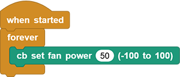

3. In , drag  block and set delay to `2000`. And put it under .

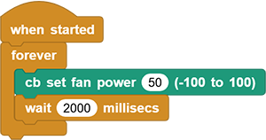

4. Duplicate all  but modify power to `-50`.
5. Duplicate all  again but modify power to `0`.

**Complete code:**

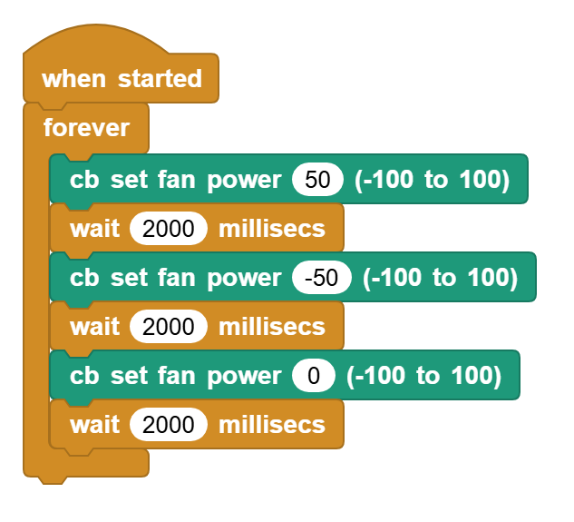

#### 3.13.5 Test Result

Connect the coding box to the MicroBlocks via USB or Bluetooth, and click  to upload the code to the coding box. You will see the fan forward rotates for 2s and then reverses for another 2s. Then it stops rotating for 2 seconds. These actions repeat.

### 3.14 Servo

#### 3.14.1 Overview

The 9g servo features small size but high performance and precision and is with good torque and accuracy, so it is perfect for small machines. With up to 180 degrees rotation angle, it enables extremely precise rotation and control and can be started fast with low noise.

#### 3.14.2 Schematic Diagram

**Angle range:** 180°(there are 360°, 180° and 90°)

**Drive voltage:** 3.3V / 5V

Usually three wires:

**GND:** grounded, in brown

**VCC:** connect to +5v (3.3V) power, in red

**S:** signal pin to control PWM signal, in orange

**Control principle**: The rotation Angle of the servo is controlled by adjusting the duty cycle of the PWM (pulse width modulation) signals. Theoretically, the period of the standard PWM signal is fixed at 20ms (50Hz), so the pulse width should be 1ms ~ 2ms. But in fact, it is 0.5ms ~ 2.5ms, corresponding to the servo angle of  0° ~ 180°. Note that the angle for the same signal varies from servo brands.

#### 3.14.3 Code Blocks

Blocks in :

1.  is a block included in coding box library. It controls the rotation angle of the servo in the coding box.

#### 3.14.4 Test Code

You can manually build blocks, or directly open the code file we provide: `3-14-Servo.ubp`. If you have any questions about how to open code files or upload code, please back to `1.9 Upload Code`.

**Build code blocks:**

1. In , drag  and  to the script area, and stack them together.

2. In , drag  block and put it into . Modify the angle to 0 degree.

3. In , drag  block and set to `1000`, and put it under .

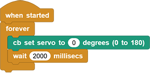

4. Duplicate all  but set degree to `90`.
5. Duplicate all  again but set degree to `180`.

**Complete code:**

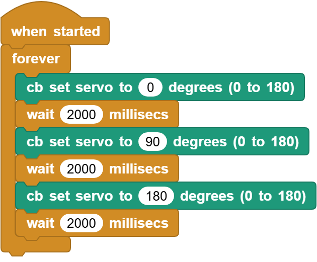

#### 3.14.5 Test Result

Connect the coding box to the MicroBlocks via USB or Bluetooth, and click  to upload the code to the coding box. The servo rotates to 0 degrees ans stays for 2 seconds (If its initial angle is 0, it will not rotate), and then it rotates to 90 degrees and stays for 2 seconds. At last, it turns to 180 degrees and stays for 2 seconds. These actions repeat.

### 3.15 WS2812 RGB LED

#### 3.15.1 Overview

WS2812 RGB LED is an external control LED integrating control circuit and light emitting circuit. It adopts single-line return-to-zero code communication, and supports 256 gray levels to display full-colors. The integrated chip inside each pixels efficiently stabilizes color output. So it is widely used in lighting, display and decoration.

#### 3.15.2 Schematic Diagram

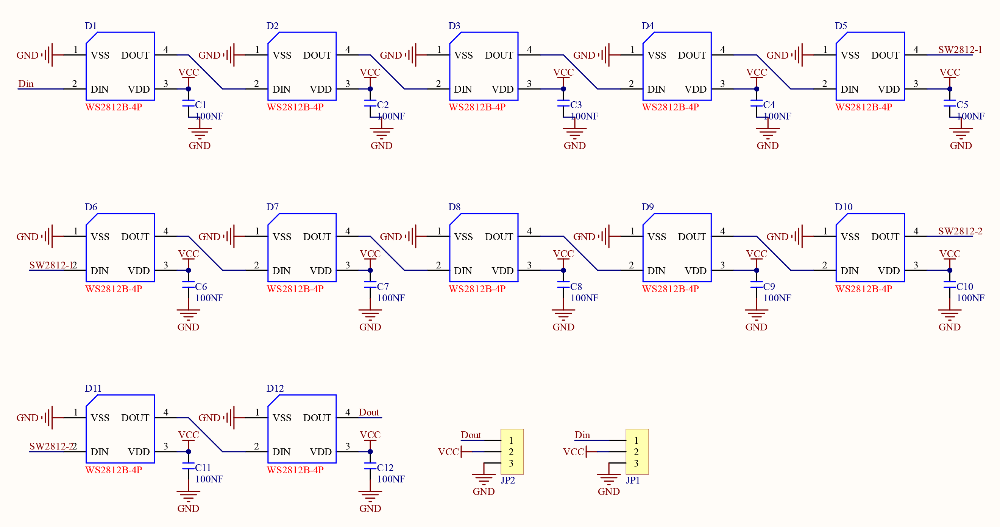

From the Schematic Diagram, ws2812 connects and transmits data over a single wire, which is the communication method named single-bus return-to-zero code (single NZR). The data enters in serial through the DIN port, and each pixel receives and processes 24 bits data (R, G, B color channels with 8 bits each). 

For detailed information of transmission mode, please refer the specification of ws2812.

#### 3.15.3 Code Blocks

Blocks in :

1. 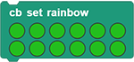 is a block included in coding box library. It controls 12 RGB LEDs in the coding box, and the color of each can be controlled.

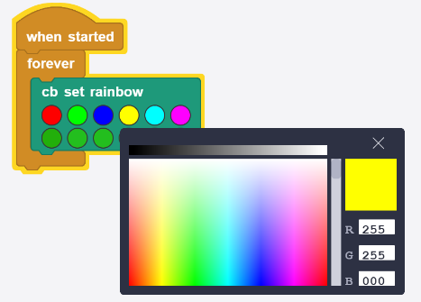

2.  is a block included in coding box library. It controls displayed colors of all RGB LEDs in the coding box.

3.  is a block included in coding box library. It turns off all RGB LEDs in the coding box.

The code blocks in  also control the display of RGB LED, and there are more ways for it. For details, please visit [Libraries | MicroBlocks Wiki](https://wiki.microblocks.fun/en/libraries#attach-neopixel-led-to-pin).

#### 3.15.4 Test Code

You can manually build blocks, or directly open the code file we provide: `3-15-WS2812.ubp`. If you have any questions about how to open code files or upload code, please back to `1.9 Upload Code`.

**Build code blocks:**

1. In , drag  and  to the script area, and stack them together.

2. In , drag  and place in . Set  the first LED to show red, the second LED to show green, the third LED to show blue, the fourth LED to show yellow, the fifth LED to show cyan, the sixth light to show purple, and keep the remaining six ones unchanged.
3. In , drag  and put it under .
4. In , drag  and put it under  and add one more  at last.

**Complete code:**

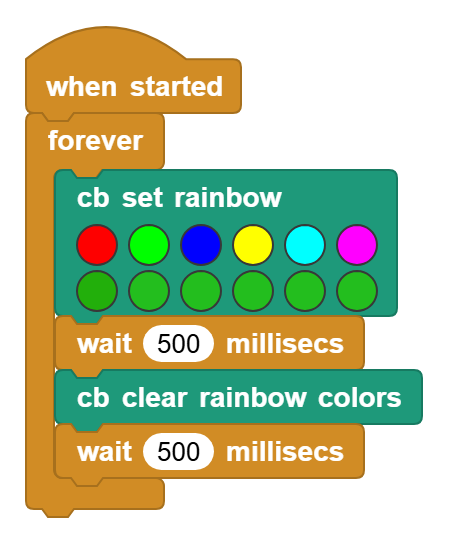

#### 3.15.5 Test Result

Connect the coding box to the MicroBlocks via USB or Bluetooth, and click  to upload the code to the coding box. The first six RGB LEDs respectively light up in red, green, blue, yellow, cyan and purple, while the other six all light up in green. Each RGB LED turns on for 0.5s then off for another 0.5s.

### 3.16 OLED Display

#### 3.16.1 Overview

OLED display is also called organic light-emitting diode or organic dot laser display. This display is self-luminous. It adopts a very thin coating of organic materials and glass substrate which will light up if current passes through. Therefore, it does not require a back-light. Note that it will not light up when just powering on; programing and wiring are also needed.

Besides, it features large viewing Angle, low power consumption, high contrast, thin display, fast response, simple structure, and can work on flexion boards within a wide temperature range.

#### 3.16.2 Parameters

Communication mode: I2C communication

Internal driver chip: SSH1106

Resolution: 128 x 64

#### 3.16.3 Code Blocks

Blocks in :

1. 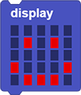 is used to control the OLED display of the coding box. Different display patterns can be created by yourself through the mouse.
2.  is used to set the OLED display patterns.
3.  clears all display.
4.  shows a rectangle on the OLED. Just set the values of X and Y.
5.  clears the display of .
6.  sets characters to show on OLED.
7.  sets scrolling characters to show on OLED.
8.  stops showing  scrolling characters on OLED.

--------

The code blocks in  also control the display of OLED, and there are more ways for it. For details, please visit [OLED Library | MicroBlocks Wiki](https://wiki.microblocks.fun/en/extension_libraries/oled).

-------

Blocks in :

1.  is a block included in coding box library. It controls the values in the characters or variables displayed by the OLED in the coding box. The display position and size can be set.
2.  is a block included in coding box library. It clears the content displayed on the OLED.

#### 3.16.4 Test Code

You can manually build blocks, or directly open the code file we provide: `3-16-OLED.ubp`. If you have any questions about how to open code files or upload code, please back to `1.9 Upload Code`.

**Build code blocks:**

1. In , drag  and  to the script area, and stack them together.

2. In , drag  and place in . Set the icon to 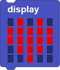.
3. In , drag  and put it under .
4. `duplicate all`  and put the copy under , and set the icon to 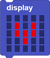.

**Complete code:**

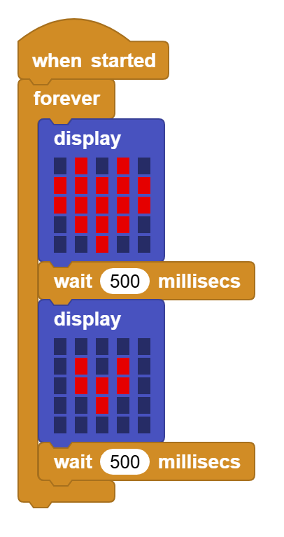

#### 3.16.5 Test Result

Connect the coding box to the MicroBlocks via USB or Bluetooth, and click  to upload the code to the coding box. The OLED displays  and  alternately with each for 0.5s.

### 3.17 Traffic Lights

#### 3.17.1 Overview

The traffic light module limits the pedestrian and vehicular thoroughfare. It includes a red, a yellow and a green light, which imply different instructions.

**Red for Stop:** Pedestrians and vehicles stop proceeding.

**Yellow for Caution:** Pedestrians and vehicles are ready for stopping. If the drive is already in process, the speed should be slow.

**Green for Proceed:** Pedestrians and vehicles keep going with the abidance of traffic regulations.

In this project, you can program on ESP32 Coding Box to control a mini traffic light. For instance, set the duration of each lights and the interval time among them. Besides, you may also add a timer to alter light colors to schedule.

#### 3.17.2 Code Flow

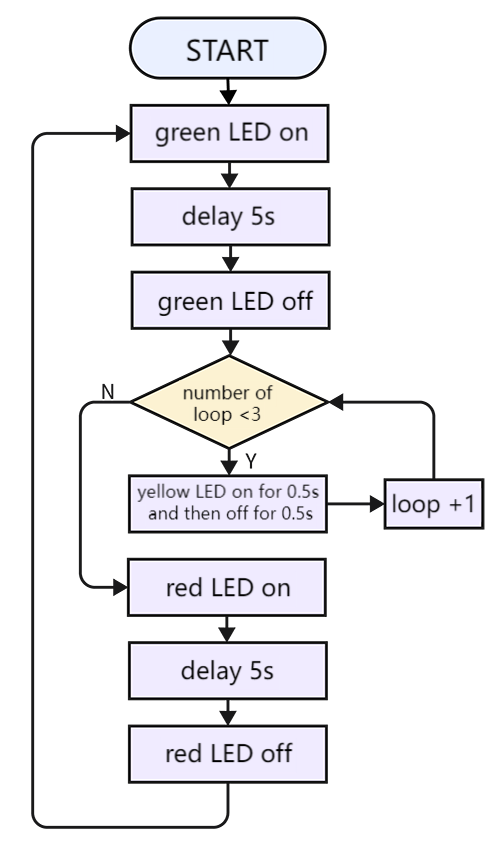

#### 3.17.3 Code Blocks

Blocks in :

1.  repeats the execution for a given number of times. Just input the number of repetitions needed into the white box.

#### 3.17.4 Test Code

You can manually build blocks, or directly open the code file we provide: `3-17-Traffic Lights.ubp`. If you have any questions about how to open code files or upload code, please back to `1.9 Upload Code`.

**Build code blocks:**

1. In , drag  and  to the script area, and stack them together.

2. First, turn off all the LEDs, and place the blocks to turn on required LEDs.

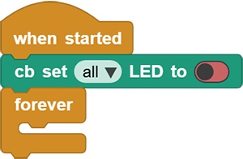

3. The green LED lights up for 5s and goes off.

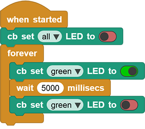

4. The yellow LED blinks for three times with an interval of 0.5s.

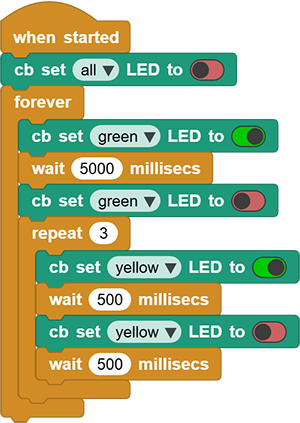

5. The red LED lights up for 5s and goes off. Repeat the set times. And then go ahead till all blocks in  are done.

#### 3.17.5 Test Result

Connect the coding box to the MicroBlocks via USB or Bluetooth, and click  to upload the code to the coding box. And you will see the green LED lights up for 5s and goes off. Immediately, the yellow LED blinks for three times. After that, the red LED lights up for 5s and goes off. These actions are exactly a model of traffic light and will repeat. 

### 3.18 Breathing LED

#### 3.18.1 Overview

PWM breathing LED utilizes on-board programmable PWM to output analog waveform. After powering on, LED brightness can be adjusted through duty cycle of the waveform to eventually realize a breathing light. In this way, ambient light can be simulated by changing LED brightness along with time. Also, breathing LED can form a colorful mini light show to construct a tranquil and warm environment.

#### 3.18.2 Schematic Diagram

PWM controls analog output via digital means, which are able to adjust the duty cycle of the wave (a signal circularly shifting between high level and low level).

digital ports of voltage output are LOW and HIGH, which respectively correspond to 0V and 5V. Generally, we define LOW as 0 and HIGH as 1. will output 500 signals of 0 or 1 within 1s. If they are 500 “1”s, 5V will be output. Oppositely, if they are all 0s, the output will be 0V. Or if they are 010101010101…, the average output will be 2.5V. In other words, output ratio of 0 and 1 affects the voltage value. 

Honestly, it differs from real continuous output, yet the more 0 and 1 signals are output per unit time, the more accurate the control will be.

#### 3.18.3 Code Blocks

Blocks in :

1. Create a variable.

  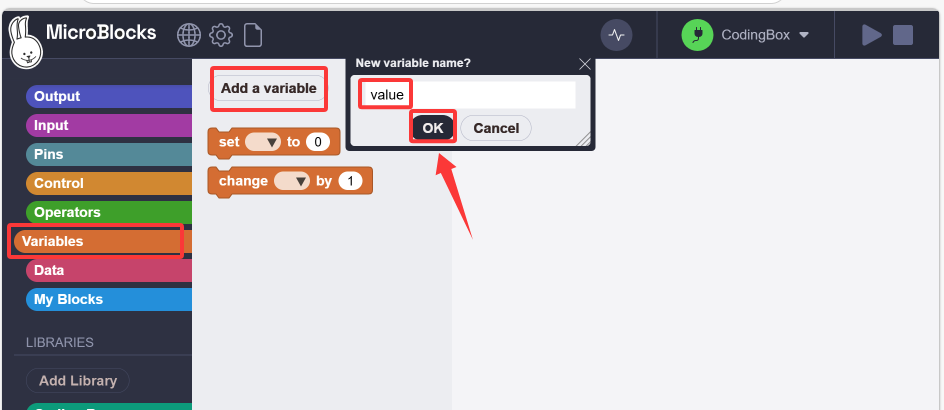

2. 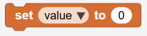 is used to assign values to variables. Its selection menu will display a list of all global and local variables.
3.  changes the value of a certain global variable or local variable according to the given value in the input area. The input value can be a positive number or a negative number.
4. Used to call the value of the corresponding variable name.s

For more details, please visit [Blocks Reference | MicroBlocks Wiki](https://wiki.microblocks.fun/en/reference_manual#variables)

--------

Blocks in :

1.  generates a pulse width modulation (PWM) signal on the given pin, approximately at a power level of 0-1023. PWM works by quickly turning pins on and off. Power is controlled by changing the duty cycle(the percentage of time that the pins are on in each cycle). 0 means pin off, while 1023 means full power (that is, the pin is on 100% of the time). When the value is 512, the duty cycle is 50%, so the pin is on half of the time and off another half of the time. PWM can be used to control the brightness of leds or the speed of motors. 

For more details, please visit [Blocks Reference | MicroBlocks Wiki](https://wiki.microblocks.fun/en/reference_manual#pins).

#### 3.18.4 Test Code

You can manually build blocks, or directly open the code file we provide: `3-18-Breathing LED.ubp`. If you have any questions about how to open code files or upload code, please back to `1.9 Upload Code`.

**Build code blocks:**

1. In , drag  and  to the script area, and stack them together.

2. In , declare a variable named `value`.
3. Drag a  to set to 255 times. Add a  block to increase `value` by 1 after each repetition. Use  to output `value` to pin `io23`, and then add a 10ms delay to slow down the red LED lighting.

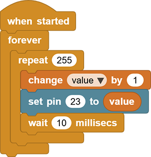

4. Duplicate the code blocks and set `value` to increase by `-1` during each repetition. So the red LED dims.

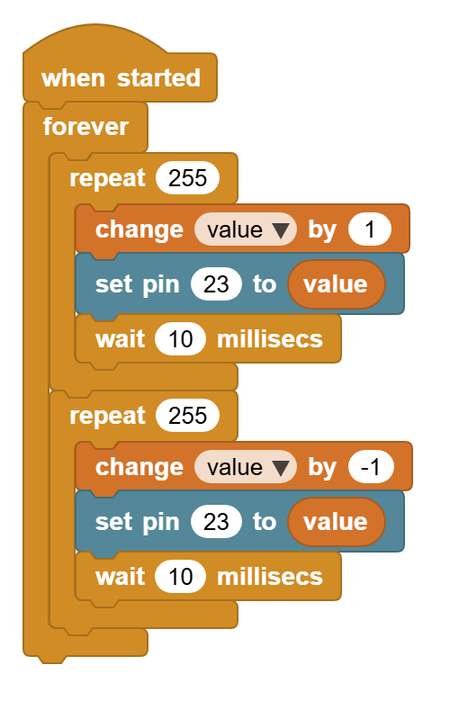

#### 3.18.5 Test Result

Connect the coding box to the MicroBlocks via USB or Bluetooth, and click  to upload the code to the coding box. The red LED gradually lights on and dims out, and vice versa. It “breathes” evenly.

### 3.19 Button Control LED

#### 3.19.1 Overview

In this project, we control the ON/OFF of the LED via an AD button. The LED will light up if we press the button and it goes off when we press the button again.

#### 3.19.2 Code Flow

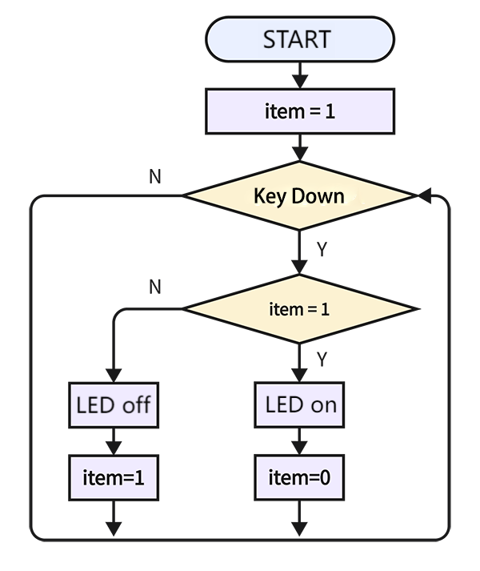

#### 3.19.3 Code Blocks

Blocks in :

1.  is used to determine whether two values are equal. If yes, it returns true; otherwise, it returns false.

For more details, please visit [Blocks Reference | MicroBlocks Wiki](https://wiki.microblocks.fun/en/reference_manual#operators)

#### 3.19.4 Test Code

You can manually build blocks, or directly open the code file we provide: `3-19-Button Control LED.ubp`. If you have any questions about how to open code files or upload code, please back to `1.9 Upload Code`.

**Build code blocks:**

1. In , drag  and  to the script area, and stack them together.

2. In , declare a variable named `item`.
3.  determines whether the red button is pressed.

4. Check if `item` = 0. If yes, red LED turns on and set `item` to 1 . If not, red LED turns off and set `item` to 0. At last, add a delay of 300ms.

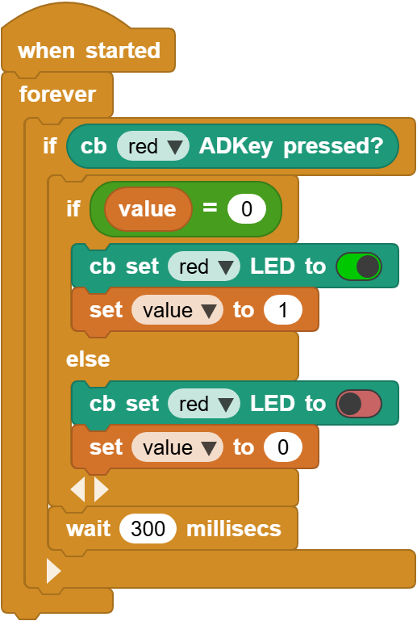

#### 3.19.5 Test Result

Connect the coding box to the MicroBlocks via USB or Bluetooth, and click  to upload the code to the coding box. Press the red button and the red LED lights up; press it again and the LED goes off.

### 3.20  Intrusion Alarm

#### 3.20.1 Overview

Intrusion alarm is a device alerting illegal intrusion into a prevention area. It plays an important role in security. We can see it everywhere: families, stores, warehouses, supermarkets and so on. 

All in all, it protects our personal and property safety.

#### 3.20.2 Code Flow

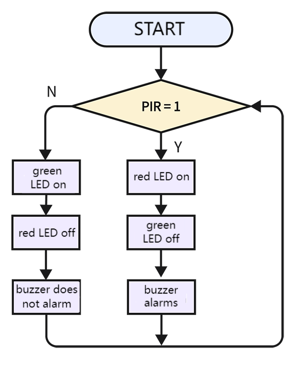

#### 3.20.3 Test Code

You can manually build blocks, or directly open the code file we provide: `3-20-Intrusion Alarm.ubp`. If you have any questions about how to open code files or upload code, please back to `1.9 Upload Code`.

**Build code blocks:**

1. In , drag  and  to the script area, and stack them together.

2.  determines whether there is a human being. If yes, the red LED is on yet the green LED is off, and the buzzer alarms. If not, the buzzer does not alarm, along with red LED off and green LED on.

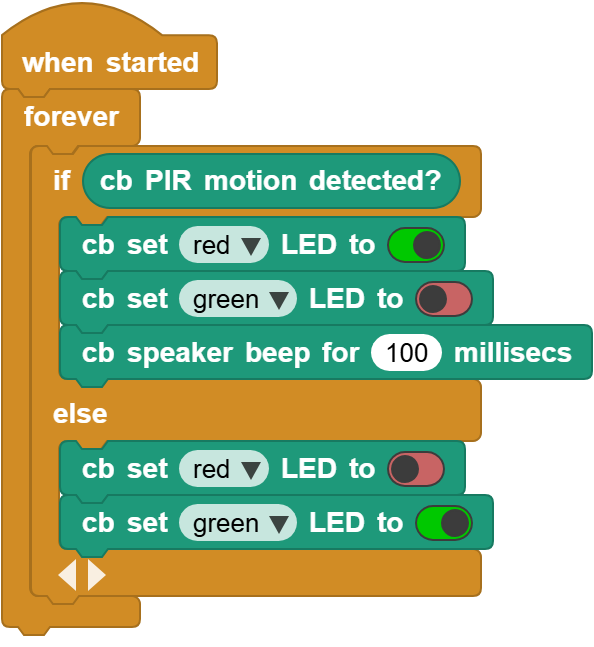

#### 3.20.4 Test Result

Connect the coding box to the MicroBlocks via USB or Bluetooth, and click  to upload the code to the coding box. When the sensor detects a motion around, the speaker alarms, the red LED turns on and the green one is off. If no intrusion is detected, the red LED will go off and the green will be on; at the same time, the speaker stays quiet. 

### 3.21 Window Close In Dark

#### 3.21.1 Overview

In this project, we program to make the window automatically close when getting dark. So the photoresistor is required to sense the ambient light. We set a threshold for the resistor. When ambient light value is lower than the threshold, the servo closes the window.

#### 3.21.2 Code Flow

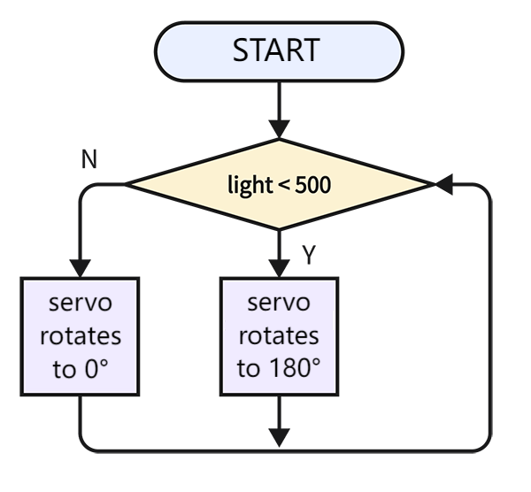

#### 3.21.3 Code Blocks

Blocks in :

1.  is used to compare two values. If the first one is greater than the second one, it returns true.
2.  is also used to compare two values. If the first one is smaller than the second one, it returns true.
3.  determines whether the conditions on both sides are met. If yes, it outputs True; if one of the conditions is not met, it outputs False.

For more details, please visit [Blocks Reference | MicroBlocks Wiki](https://wiki.microblocks.fun/en/reference_manual#operators)

#### 3.21.4 Test Code

You can manually build blocks, or directly open the code file we provide: `3-21-Window Close In Dark.ubp`. If you have any questions about how to open code files or upload code, please back to `1.9 Upload Code`.

**Build code blocks:**

1. In , drag  and  to the script area, and stack them together.

2. Check whether the value of the photoresistor is less than 500. If it is, the servo rotates to 180°; if not, the servo rotates to 0°.

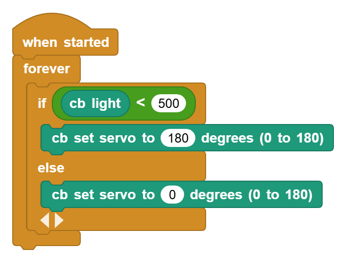

#### 3.21.5 Test Result

Connect the coding box to the MicroBlocks via USB or Bluetooth, and click  to upload the code to the coding box. Cover the photoresistor to lower its analog value under 500 and the servo will rotate to 180°. If the analog value exceeds 500, the servo will rotate to 0°.

### 3.22 Voice Control Light

#### 3.22.1 Overview

Voice-control-light device mainly consists of a sound sensor, a photoresistor and an LED. The photoresistor is adopted to avoid LED lighting up during daytime. The sound sensor measures sound volume to determine whether it is reached the set threshold. If yes, the LED will light up for a few seconds. 

#### 3.22.2 Code Flow

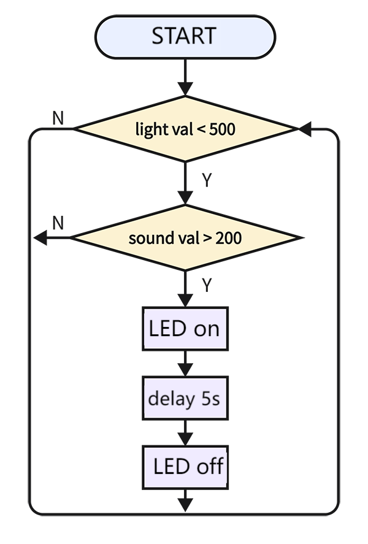

#### 3.22.3 Test Code

You can manually build blocks, or directly open the code file we provide: `3-22-Voice Control Light.ubp`. If you have any questions about how to open code files or upload code, please back to `1.9 Upload Code`.

**Build code blocks:**

1. In , drag  and  to the script area, and stack them together.

2. Determine whether the photoresistor value is lower than 500

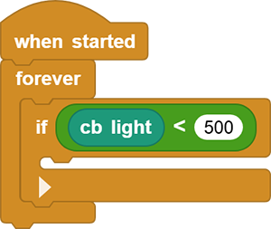

3. Determine whether the photoresistor value is greater than 200. If yes, the red LED turns on for 5 seconds and then goes off.

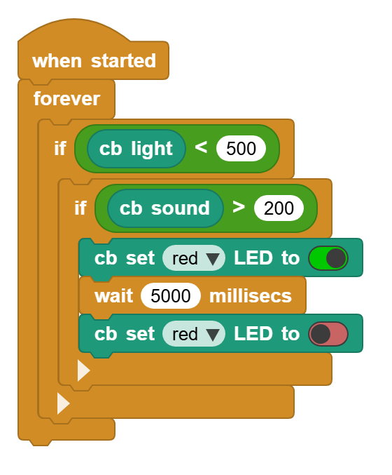

#### 3.22.4 Test Result

Connect the coding box to the MicroBlocks via USB or Bluetooth, and click  to upload the code to the coding box. Cover the photoresistor, and make some sounds, and you will see the LED light up for 5 seconds. 

### 3.23 Human Body Piano

#### 3.23.1 Overview

The analog piano mainly includes an ultrasonic sensor to detect the distance of your position. It plays different tones according to distance values. If there is an open space, you may place it on ground to play musics.

#### 3.23.2 Code Flow

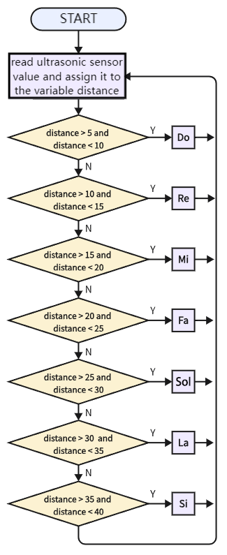

#### 3.23.3 Test Code

You can manually build blocks, or directly open the code file we provide: `3-23-Human Body Piano.ubp`. If you have any questions about how to open code files or upload code, please back to `1.9 Upload Code`.

**Build code blocks:**

1. In , drag  and  to the script area, and stack them together.

2. Declare a variable named `distance` and assign the distance values detected by the ultrasonic sensor to it. 

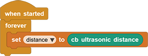

3. Determine whether the distance value is within 5cm ~ 10cm. If yes, play tone `Do`.
4. Determine whether the distance value is within 10cm ~ 15cm. If yes, play tone `Re`.
5. Determine whether the distance value is within 15cm ~ 20cm. If yes, play tone `Mi`.
6. Determine whether the distance value is within 20cm ~ 25cm. If yes, play tone `Fa`.
7. Determine whether the distance value is within 25cm ~ 30cm. If yes, play tone `Sol`.
8. Determine whether the distance value is within 30cm ~ 35cm. If yes, play tone `La`.
9. Determine whether the distance value is within 35cm ~ 40cm. If yes, play tone `Si`.

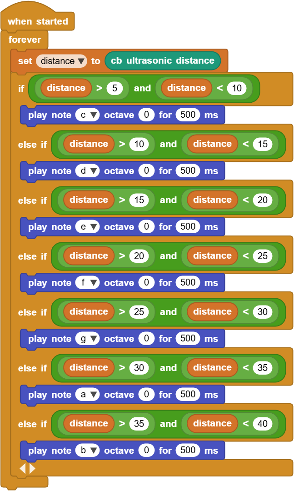

#### 3.23.4 Test Result

Connect the coding box to the MicroBlocks via USB or Bluetooth, and click  to upload the code to the coding box. Put your hand in front of the ultrasonic sensor and the speaker will emit sound. You can control the tone by moving your hand in front of the sensor.

Tones corresponding to distance:

Do: 5-10cm

Re: 10-15cm

Mi: 15-20cm

Fa: 20-25cm

Sol: 25-30cm

La: 30-35cm

Si: 35-40cm

### 3.24 Button Control Fan

#### 3.24.1 Overview

In this experiment, we program to control the fan by a button.

#### 3.24.2 Code Flow

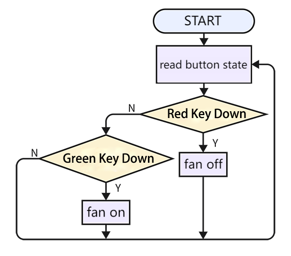

#### 3.24.3 Test Code

You can manually build blocks, or directly open the code file we provide: `3-24-Button Control Fan.ubp`. If you have any questions about how to open code files or upload code, please back to `1.9 Upload Code`.

**Build code blocks:**

1. In , drag  and  to the script area, and stack them together.

2. Press the red button to turn off the fan and delay for 300ms, otherwise press the green button to turn on the fan and delay for 300ms

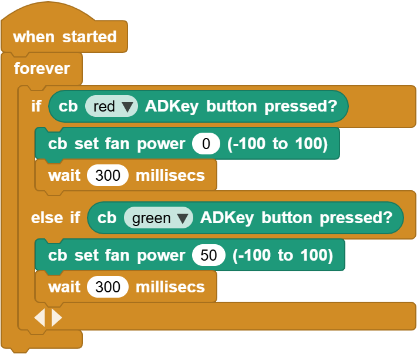

#### 3.24.4 Test Result

Connect the coding box to the MicroBlocks via USB or Bluetooth, and click  to upload the code to the coding box. When we press the green button, the fan will turn on. When we press the red button, the fan stops working. 

### 3.25 Auto-door

#### 3.25.1 Overview

Many shopping malls open their doors when someone approaches and close them when no one is detected. Herein, we adopt a PIR motion sensor to simulate this kind of auto-door. The door opens when someone is detected and closes when no one is present.

#### 3.25.2 Code Flow

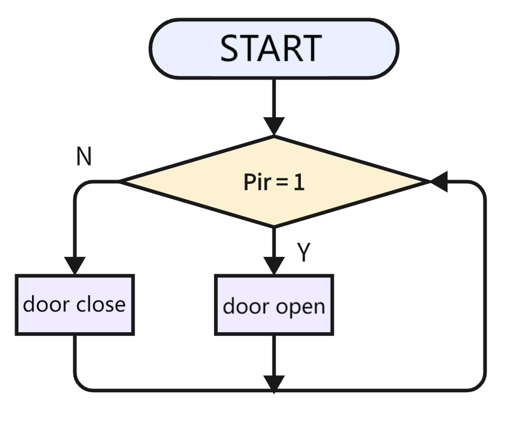

#### 3.25.3 Test Code

You can manually build blocks, or directly open the code file we provide: `3-25-Auto-door.ubp`. If you have any questions about how to open code files or upload code, please back to `1.9 Upload Code`.

**Build code blocks:**

1. In , drag  and  to the script area, and stack them together.

2. When the PIR sensor detects a person, the servo rotates to 180 degrees. It returns to 0° until no one is detected.

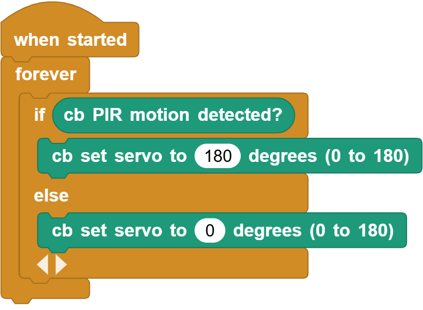

#### 3.25.4 Test Result

Connect the coding box to the MicroBlocks via USB or Bluetooth, and click  to upload the code to the coding box. Wave your hand over the PIR motion sensor, and the servo will rotate to 180 degree (door open). After a while, it will back to 0 degree (door close) if nothing is detected.

### 3.26 Access Card

#### 3.26.1 Overview

A common access card is a  magnetic card or a key chain. So in this experiment, we make a simple access device through servo, a magnetic card and an RFID module.

#### 3.26.2 Code Flow

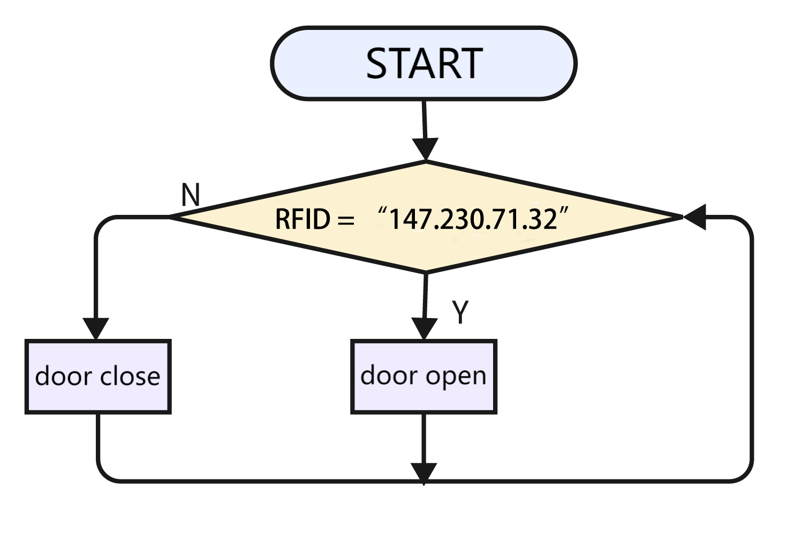

#### 3.26.3 Test Code

You can manually build blocks, or directly open the code file we provide: `3-26-Access Card.ubp`. If you have any questions about how to open code files or upload code, please back to `1.9 Upload Code`.

**Build code blocks:**

1. In , drag  and  to the script area, and stack them together.

2. Check if it is the correct card ID. If it is, the servo rotates to 180° and stays for 5 seconds and then returns to 0°. If not, the servo will not move. Note that the value of each card is different. You need to replace it with the value of your own one.

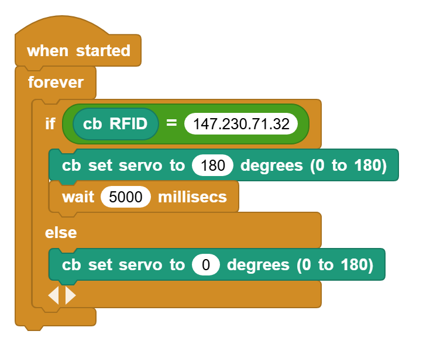

#### 3.26.4 Test Result

Connect the coding box to the MicroBlocks via USB or Bluetooth, and click  to upload the code to the coding box. Put your IC card at the sensing area of the RFID module, and the servo will rotate to 180 degree for 3s and then come back. If the card code is not correct, the servo will stay still.

### 3.27 Auto-fan

#### 3.27.1 Overview

The weather is getting hotter in summer, so some public places will be equipped with some auto-fans that sense the ambient temperature value. When the temperature reaches a set value, he fan turns on. We add a PIR motion sensor to lower energy consumption. Thus, the fan will turn on only when the temperature reaches the value and someone is sensed nearby. Now let's do it!

#### 2.27.2 Code Flow

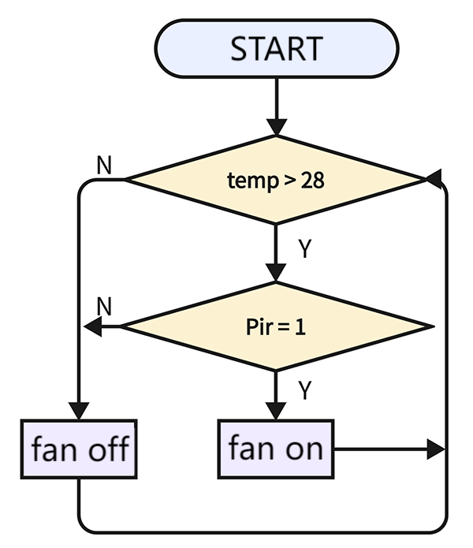

#### 3.27.3 Test Code

You can manually build blocks, or directly open the code file we provide: `3-27-Auto-fan.ubp`. If you have any questions about how to open code files or upload code, please back to `1.9 Upload Code`.

**Build code blocks:**

1. In , drag  and  to the script area, and stack them together.

2. Determine whether the temperature value is higher than 28, and whether there is a human. If there is someone, turn on the fan; if there is no one, do not turn on the fan.

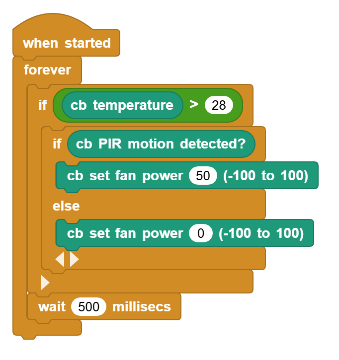

#### 3.27.4 Test Result

Connect the coding box to the MicroBlocks via USB or Bluetooth, and click  to upload the code to the coding box. When the temperature value is higher than 28 and the PIR motion sensor detects someone, the fan turns on. If one of the two conditions are not satisfied, the fan will not rotate.

### 3.28 Environment Monitoring

#### 3.28.1 Overview

In this project, we use an OLED display to reveal the values of temperature, humidity, air pressure and altitude in the environment. It can be regarded as a mini environmental monitoring device. 

#### 3.28.2 Test Code

You can manually build blocks, or directly open the code file we provide: `3-28-Environment Monitoring.ubp`. If you have any questions about how to open code files or upload code, please back to `1.9 Upload Code`.

**Build code blocks:**

1. In , drag  and  to the script area, and stack them together.

2. Before building blocks,  is required to clear all OLED display to prevent initial display content.
2. Add a  to show `Data Suggest` at the position of (X:25, Y:0). Turn the `big` off.
2. Add another  to show `T:` at the position of (X:0, Y:10) at the next line.
2. Show temperature value at the position of (X:20, Y:10) followed a `C` at (X:40, Y:10).
2. Similarly, build blocks to show humidity values and pressure values. Add a delay of 1 second and clear the OLED at last.

**Complete code:**

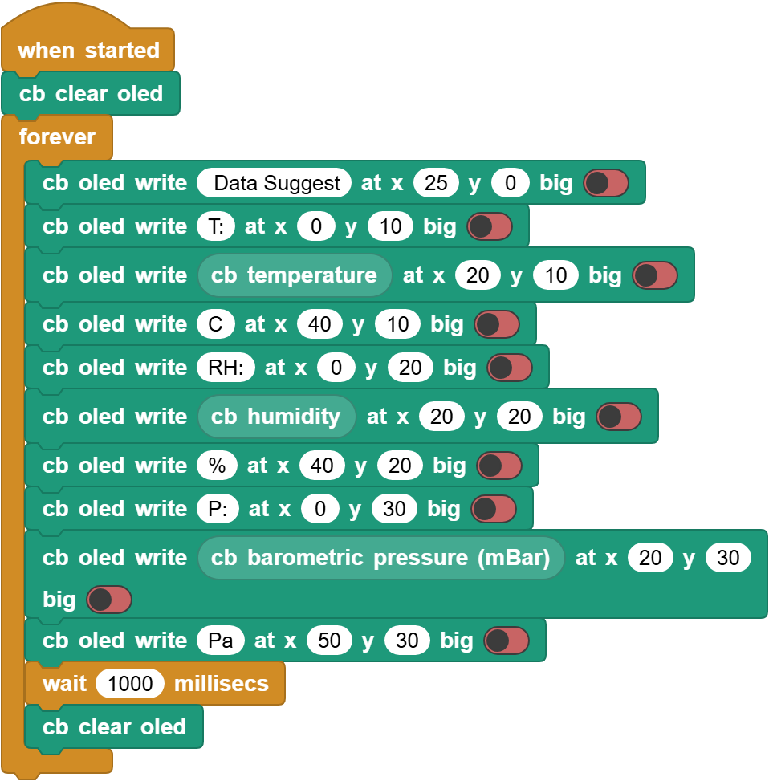

#### 3.28.3 Test Result

Connect the coding box to the MicroBlocks via USB or Bluetooth, and click  to upload the code to the coding box. You will see the values of temperature, humidity, air pressure and altitude on the OLED display. These values refresh every second.

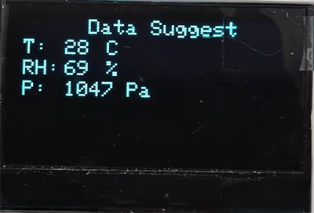

### 3.29 Car Backing Radar

#### 3.29.1 Overview

When a car is in reverse, it will alarm the distance of the obstacles behind the parking space. In this project, we build a mini car backing radar with an ultrasonic sensor for distance detection, a speaker to alarm, and a traffic light module as an indicator.

#### 3.29.2 Code Flow

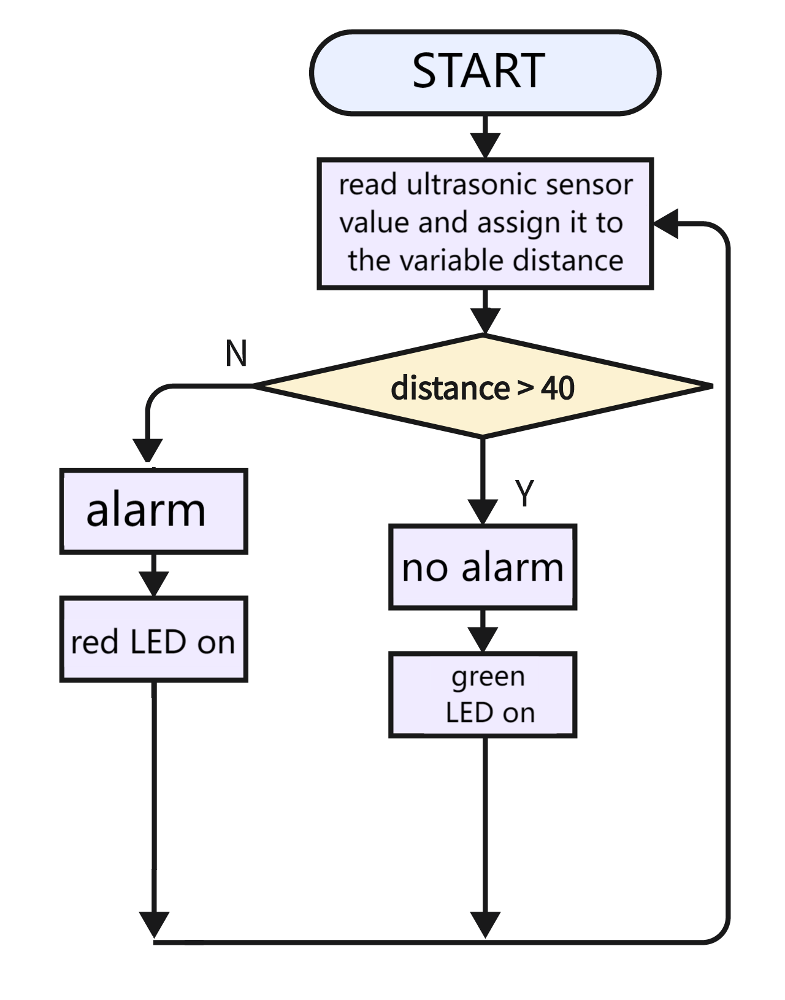

#### 3.29.3 Test Code

You can manually build blocks, or directly open the code file we provide: `3-29-Car Backing Radar.ubp`. If you have any questions about how to open code files or upload code, please back to `1.9 Upload Code`.

**Build code blocks:**

1. In , drag  and  to the script area, and stack them together.

2. Declare a variable named `distance`. Assign the detected value of the ultrasonic sensor to it.
3. Determine whether `distance` > 40. If yes, the speaker stays quiet, the red LED is off while the green one is ON.
4. Determine whether `distance` < 40. If yes, the speaker alarms, the red LED is ON while the green one is off.

**Complete code:**

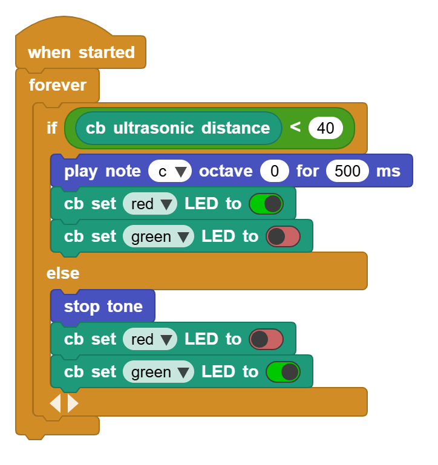

#### 3.29.4 Test Result

Connect the coding box to the MicroBlocks via USB or Bluetooth, and click  to upload the code to the coding box. When the the detected distance value is greater than 40cm, the green LED is on and the amplifier does not emit sound. If the value is less than 40cm, the red LED will light up and the amplifier will alarm.

### 3.30 RGB Ring Clock

#### 3.30.1 Overview

In this project, we build an informal clock with an RGB ring, whose three colors represent hour, minute and second respectively. Since the ring only boasts 12 beads, each bead is 5 seconds/minutes (60/12=5).

#### 3.30.2 Code Flow

As shown in the flowchart, we use red for hour, green for minutes, blue for seconds. When second = 60, minute adds 1, and when minute = 60, hour adds 1. 

Note that here we adopt 60/5=12 rather than 59/5=11.8, this is because the variable type is integer and the value should be divided by 5. And 60 can be perfectly divided into 12 parts.

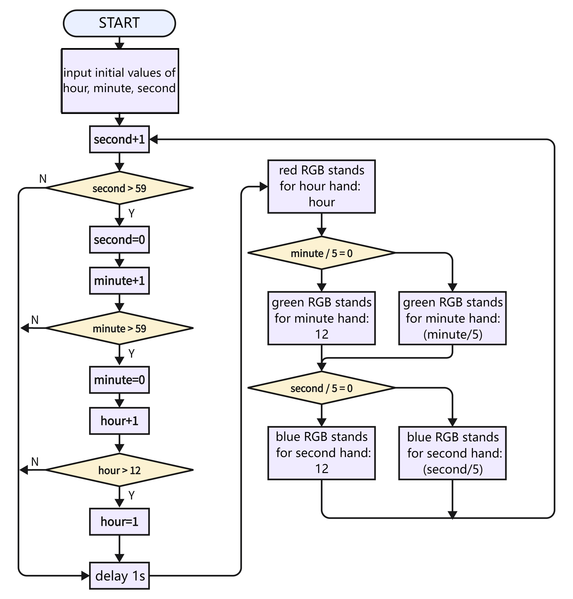

#### 3.30.3 Test Code

You can manually build blocks, or directly open the code file we provide: `3-30-RGB Ring Clock.ubp`. If you have any questions about how to open code files or upload code, please back to `1.9 Upload Code`.

**Build code blocks:**

1. In , drag  and  to the script area, and stack them together.

**Time:**

2. Create 3 variables named `hour`, `minute`, `second`, and set an initial time.
3. Based on `second`, increase by 1 at a time till it reaches 59, and then zero out the `second`.
4. When `second` reaches 59, `minute` increases by 1. Similarly, zero `minute` out till it reaches 59.
5. When `minute` reaches 59, `hour` increases by 1. There are subtle differences: we reset `hour` to 1 till it reaches 12.

**RGB:**

6. There are only 12 LED beads, yet 60 is the maximum in minutes and seconds. Thus, we divide 60 by 12 to get 5: each LED stands for 5 seconds or 5 minutes. We use red(hour), green(minute), and blue(second) to indicate for three clock hands. For instance, when time is 12:59:50, the 12th LED shows in red, the 11th one is green, and the 10th one is blue.

**Complete code:**

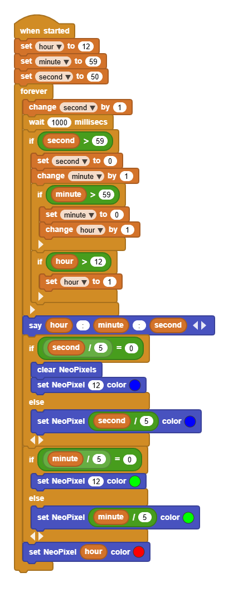

#### 3.30.4 Test Result

Before uploading code, you need to input an initial time in the following blocks of variables hour, minute, second. Herein, we set to 12:59:50.

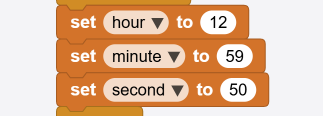

Connect the coding box to the MicroBlocks via USB or Bluetooth, and click  to upload the code to the coding box. You will see the RGB ring shows the time: red for hour, green for minute, blue for second. A minute passes as blue runs a circle. Only one color will be displayed when they are overlapped. Blue will not cover green while green will not cover red. 

Note that this is an informal clock without a clock chip. So its errors begin to accumulate over time.

### 3.31  Joystick Control Servo

#### 3.31.1 Overview

We control the servo via the axis X of the joystick. This model is widely applied to mechanical ON/OFF of lights and doors.

#### 3.31.2 Code Flow

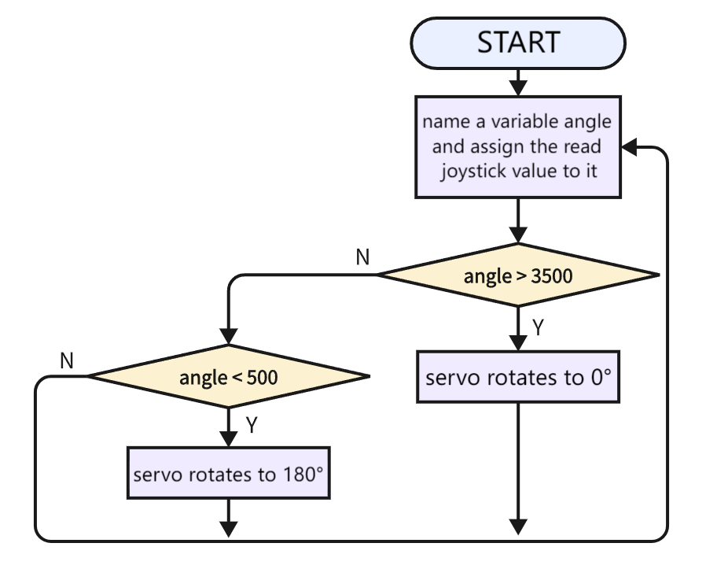

#### 3.31.3 Test Code

You can manually build blocks, or directly open the code file we provide: `3-31-Joystick Control Servo.ubp`. If you have any questions about how to open code files or upload code, please back to `1.9 Upload Code`.

**Build code blocks:**

1. In , drag  and  to the script area, and stack them together.

2. Determine whether the joystick is less than -90. If yes, the servo rotates to 180 degrees.
3. Determine whether the joystick is greater than 90. If yes, the servo rotates to 0 degrees.

**Complete code:**

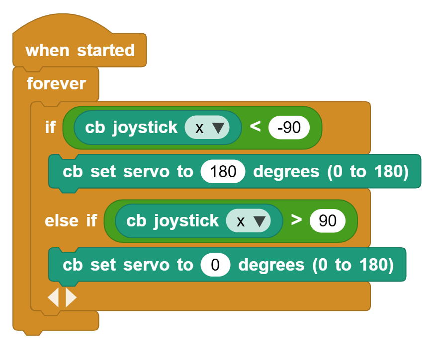

#### 3.31.4 Test Result

Connect the coding box to the MicroBlocks via USB or Bluetooth, and click  to upload the code to the coding box. Push the joystick to the left and the servo rotates to 180 degree. Push it to the right and the servo rotates to 0 degree.

### 3.32 Ultrasonic Ranger

#### 3.32.1 Overview

In this project, we combine the ultrasonic sensor and the OLED module to build a distance meter, whose detection range is 4-300CM.

#### 3.32.2 Test Code

You can manually build blocks, or directly open the code file we provide: `3-32-Ultrasonic Ranger.ubp`. If you have any questions about how to open code files or upload code, please back to `1.9 Upload Code`.

**Build code blocks:**

1. In , drag  and  to the script area, and stack them together.

2. OLED displays `Distance:` at the position of (X:0, Y:0).
3. OLED displays the distance value detected by the ultrasonic sensor at the position of (X:0, Y:20).
4. Delay 1 second and then clear the OLED display.

**Complete code:**

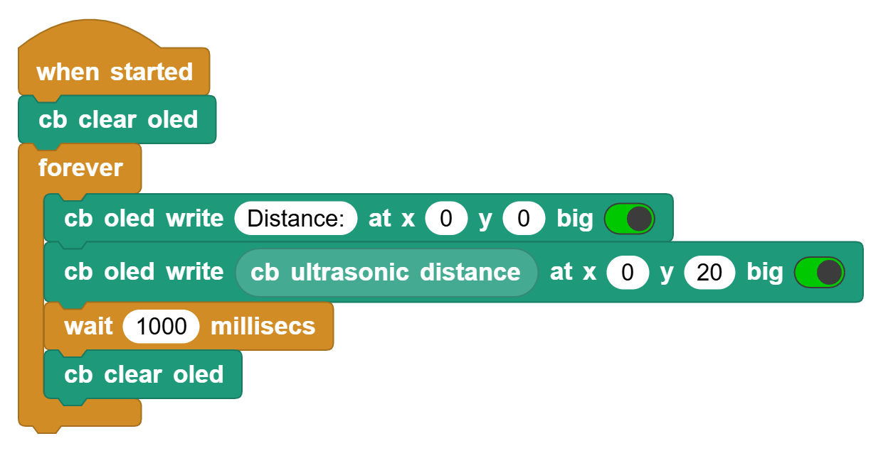

#### 3.32.2 Test Result

Connect the coding box to the MicroBlocks via USB or Bluetooth, and click  to upload the code to the coding box. “Distance:” will be displayed on the first line. What followed is the distance value in “CM” in the second line.

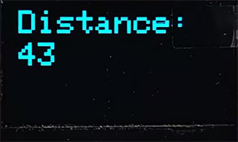

### 3.33 wifi

#### 3.33.1 Overview

As a powerful microcontroller, ESP32 boasts a built-in Wi-Fi and Bluetooth nodule that is widely used in Internet of Things (IoT). With this function, it can remotely control the data transmission through the wireless network. 

In applications, ESP32 can be used as a client to connect to a Wi-Fi network, or as a hotspot to create its own network. Through these connections, ESP32 receives commands to control external devices, such as turning on/off lights and adjusting temperature. In the code, protocols like HTTP and MQTT are used to communicate with the server to achieve data sending and receiving, so as to remotely control and monitoring.

#### 7.33.2 ESP32 wifi Introduction

ESP32 development board comes with built-in Wi-Fi (2.4G) and Bluetooth (4.2), which enable it to easily connect to Wi-Fi network and communicate with other devices in the network. You can display web pages in your browser via ESP32.

- Base station mode (STA / Wi-Fi Client mode): ESP32 is connected to Wi-Fi hotspot (AP).
- AP mode (Soft-AP / Wi-Fi hotspot mode): Wi-Fi device(s) is(are) connected to ESP32.
- AP-STA mode: ESP32 is both Wi-Fi hotspot and a Wi-Fi device connected to another Wi-Fi.
- These modes supports multiple security modes, including WPA, WPA2 and WEP.
- It is able to scan Wi-Fi hotspot (active or passive)
- It support promiscuous mode monitoring IEEE802.11 Wi-Fi packets.

------

For more wifi reference, please visit https://docs.espressif.com/projects/esp-idf/en/latest/esp32/api-reference/network/esp_wifi.html

Espressif official: https://www.espressif.com.cn/en/home

#### 3.33.2 Code Blocks

In :

1.  block is used to set the WiFi name and password for the ESP32 connection. After a successful connection, it will print the IP address of the ESP32. For example, if the connected WIFI name is: LiuTest, the password is: 88888888

2.  block is used to set the URL of the access control page of the browser. You can name it according to your own needs. If multiple coding boxes are occupying the same WiFi, you must customize this name. For example, herein, we just need to type `microblocks.local` in the browser to enter our control page.

If you are interested, you can learn more detailed information in the official website: [WIFI | MicroBlocks Wiki](https://wiki.microblocks.fun/en/network_libraries/wifi)

In :

1.  block is used to reset the Web page to update the data read by the ESP32.
2.  block is used to set the name of the Web page. It is “Micro Blocks Web Panel” by default.
3. 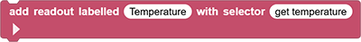 block is used to generate a display tag named “Temperature” on the Web page to show the temperature value. The usage method is as follows:

(1). Click  to open “advanced mode”

(2). Find the temperature block to “copy callable name”, so then this block name is duplicated.

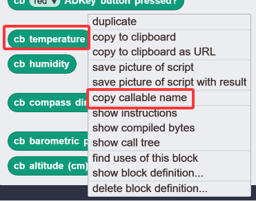

(3). Paste this name into “get temperature” of :

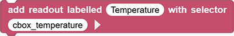

Dynamic demo:

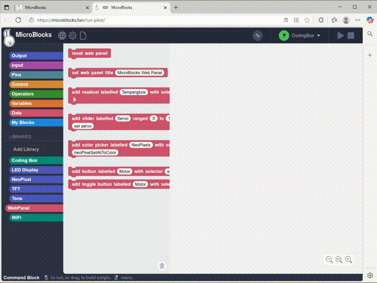

4. 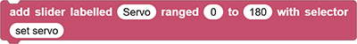 block is used to add a slider to the Web page. When in use, we first set the name of the slider, and then set the value range of the servo to 0-180. At last, we call to set the name of the servo module.

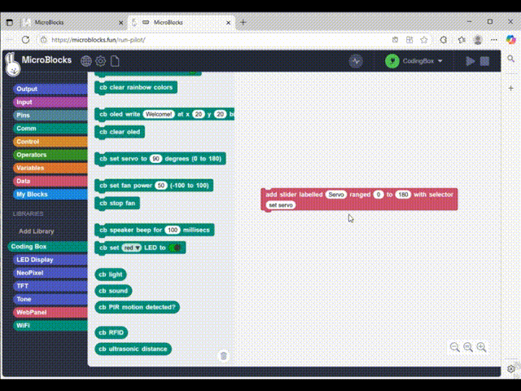

5. 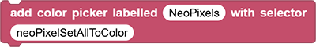 block is used to add a color control label for WS2812 on a Web page. When in use, we set a name for the code block that controls the display of WS2812, and then copy and paste it to the blank behind the “with selector”.
6.  block is used to add a button on the Web page. When in use, we set a name first and then copy and paste it to the blank behind the “with selector”. Each click of the button will execute this block once.
7.  block adds a button on the Web page (unlike the above one, this one can be “dual-controlled”, say, the first click turns on LED, and the second click turns it off).

Note that we must tick the “advanced mode” before we “copy callable name”.

#### 3.33.3 Test Code

You can manually build blocks, or directly open the code file we provide: `3-33-Web Panel.ubp`. If you have any questions about how to open code files or upload code, please back to `1.9 Upload Code`.

**Build code blocks:**

1. In , drag  to the script area.
2. In , drag  and put it under the , and then set the WIFI name to “LiuTest” and password to “88888888”.
3. In , drag  and put it under , and set the Web name to `codingbox.local`.
4. In , drag  and put it under  .
5. In , drag  and put it under , and set the title to `Coding Box Web Panel`.

**Complete code:**

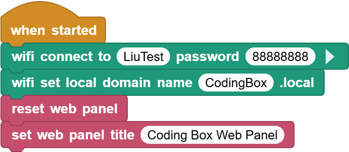

#### 3.33.4 Test Result

Connect the coding box to the MicroBlocks via USB or Bluetooth. Click  to upload code. After connecting to wifi, you can see an IP address: 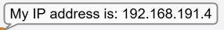. Now connect your control device (mobile phone, tablet, computer) to the same wifi and search `codingbox.local` on the browser to enter the Web page. 

Note: 1. Only when the control device (mobile phone, tablet, computer) and the coding box are connected to the same wifi can the Web control page be accessed. 2. The coding box can only connect to wifi with a frequency of 2.4GHz. 3. It comsumes more power when using the wifi function, so an external power supply or AA battery installation is required to ensure a sufficient power. Ortherwise, the box will keep restarting and resetting.

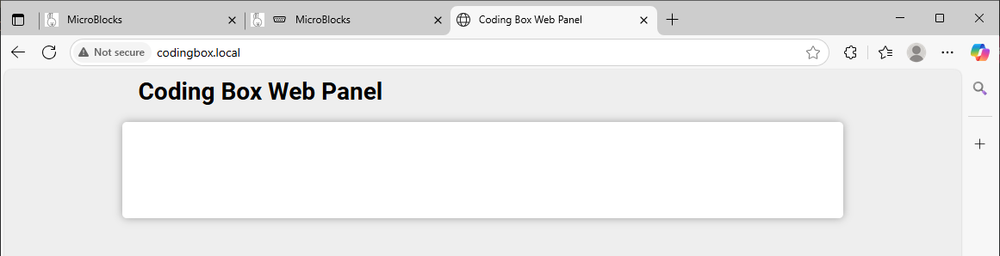

### 3.34 wifi Real-time Display

#### 3.34.1 Overview

In this project, we display the values of temperature and humidity sensor, pressure sensor, photoresistor, sound sensor, PIR motion sensor and ultrasonic sensor on the web page. 

#### 3.34.2 Test Code

You can manually build blocks, or directly open the code file we provide: `3-34-Web Display Panel.ubp`. If you have any questions about how to open code files or upload code, please back to `1.9 Upload Code`.

**Build code blocks:**

1. In , drag  to the script area.

2. Drag  and set the WIFI name to “LiuTest” and password to “88888888”.
3. Drag  and set the Web name to “CodingBox.local”.
4. Add  to refresh the data of each sensor on the Web page.
5. Add  and set the title to “Coding Box Web Panel”.
6. At last, drag some  to display the sensor data on the Web page, including temperature, humidity, air pressure, ultrasonic ranging distance, PIR motion and light sensor in sequence.

For example, add a temperature sensor value:

**Complete code:**

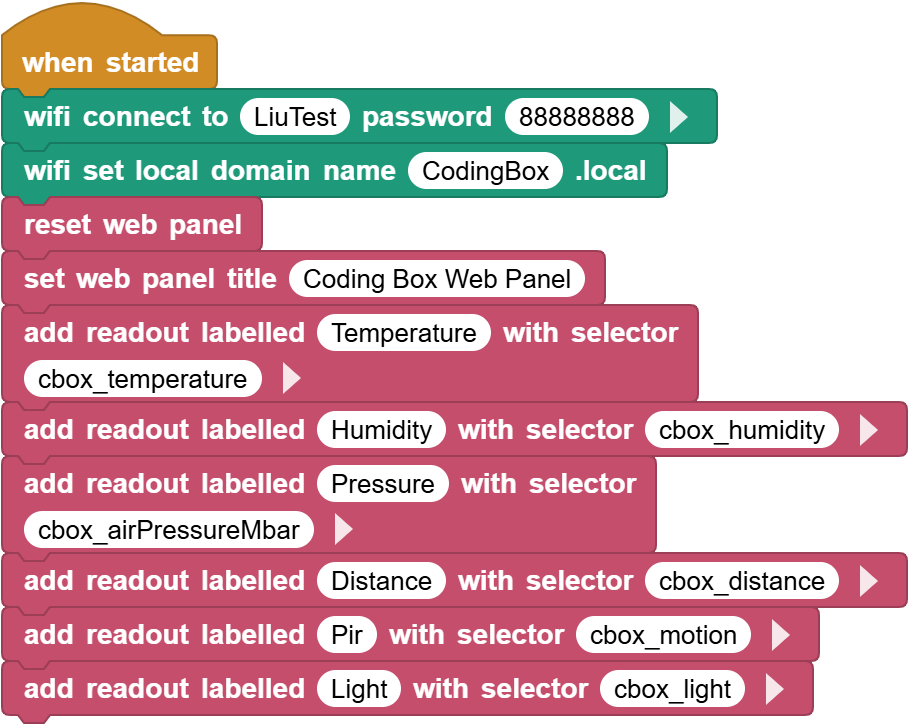

#### 3.34.3 Test Result

Connect the coding box to the MicroBlocks via USB or Bluetooth. Click  to upload code. After connecting to wifi, you can see an IP address: . Now connect your control device (mobile phone, tablet, computer) to the same wifi and search `codingbox.local` on the browser to enter the Web page. 

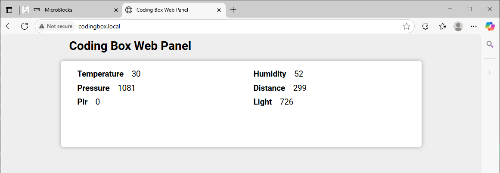

### 3.35 WiFi Control

#### 3.35.1 Overview

We control LED, buzzer, servo and the fan on the web page button wirelessly. 

#### 3.35.2 Test Code

You can manually build blocks, or directly open the code file we provide: `3-35-Web Control Panel.ubp`. If you have any questions about how to open code files or upload code, please back to `1.9 Upload Code`.

**Build code blocks:**

1. In , drag  to the script area.
2. Drag  and set the WIFI name to “LiuTest” and password to “88888888”.
3. Drag  and set the Web name to “CodingBox.local”.
4. Add  to refresh the data of each sensor on the Web page.
5. Add  and set the title to “Coding Box Web Panel”.

6. Use  to add a component that controls the display color of WS2812, and modify the blank behind “with selector” to `cbox_setAllNeoPixels`.
7. Use  to add a slider that controls the servo. Remain the name as default and set the range to 0-180, and modify the blank behind “with selector” to `cbox_setServo`.
8. Use  to add a button that controls the fan on. Set name as “Fan ON”, and modify the blank behind “with selector” to `cbox_setFan`. Click  to add a “params” blank.
9. In , drag  and put it into the “params” blank of the , and modify “cat” to “100”.
10. Use  to add a button that controls the fan off. Set name as “Fan OFF”, and modify the blank behind “with selector” to `cbox_stopFan`.
11. Use  to add a button that controls the buzzer. Set name as “Buzzer”, and modify the blank behind “with selector” to `cbox_beep`. Click  to add a “params” blank, and put  in it and set to “100”.
12. Use  to add a button that controls the red LED. Set name as “Red LED”, and modify the blank behind “with selector” to `cbox_setLED`. Click  to add a “params” blank, and put  in it and set to “red”.
13. Use  to add a button that controls the yellow LED. Set name as “Yellow LED”, and modify the blank behind “with selector” to `cbox_setLED`. Click  to add a “params” blank, and put  in it and set to “yellow”.
14. Use  to add a button that controls the green LED. Set name as “Green LED”, and modify the blank behind “with selector” to `cbox_setLED`. Click  to add a “params” blank, and put  in it and set to “green”.

**Complete code:**

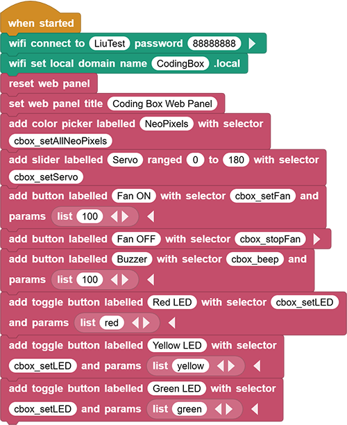

#### 3.35.3 Test Result

Connect the coding box to the MicroBlocks via USB or Bluetooth. Click  to upload code. After connecting to wifi, you can see an IP address: . Now connect your control device (mobile phone, tablet, computer) to the same wifi and search `codingbox.local` on the browser to enter the Web page. 

Slide the slider to control the servo angle. Click the color area below NeoPixels and then click the blank area to set the display color of WS2812. Click the “Fan ON” to turn on the Fan, and click the “Fan OFF” to turn it off. Click “Buzzer” and the buzzer will sound. 

Click “Red LED” to turn on the Red LED, and press again to turn off the red LED. For the “Yellow LED” and “Green LED”, they work in the same way, but the LED colors are different.

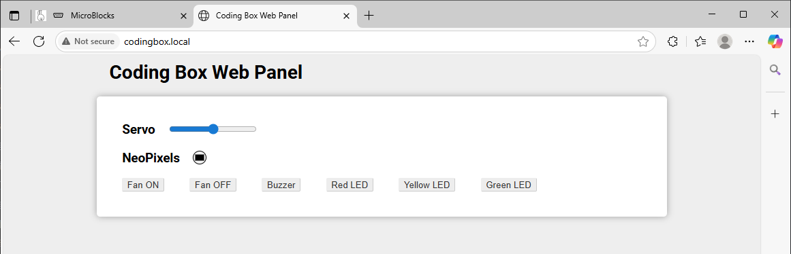

### 3.36 wifi Piano

#### 3.36.1 Overview

In this project, we set seven buttons to control the speaker to play tones of Do, Re, Mi, Fa, So, La, Si.

#### 3.36.2 Test Code

You can manually build blocks, or directly open the code file we provide: `3-36-Web Piano Panel.ubp`. If you have any questions about how to open code files or upload code, please back to `1.9 Upload Code`.

**Build code blocks:**

1. In , drag  to the script area.
2. Drag  and set the WIFI name to “LiuTest” and password to “88888888”.
3. Drag  and set the Web name to “CodingBox.local”.
4. Add  to refresh the data of each sensor on the Web page.
5. Use  and set the title to “Coding Box Web Piano”.
6. Use  to add a button that controls the speaker and set the label to “Do”.
7. In , drag  to “copy callable name”, and paste it to the blank behind the “with selector” of the . Click  to add a “params” blank.

8. In , drag  and click  to add one more blank. Put it into the “params” blank of the, and modify “cat” to “100”, “dog” to “300”.

9. Similarly, set tones of Re, Mi, Fa, Sol, La, Si.

**Complete code:**

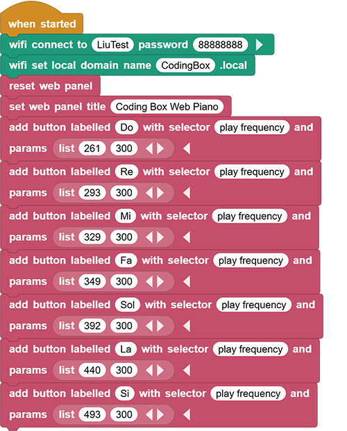

#### 3.36.3 Test Result

Connect the coding box to the MicroBlocks via USB or Bluetooth. Click  to upload code. After connecting to wifi, you can see an IP address: . Now connect your control device (mobile phone, tablet, computer) to the same wifi and search `codingbox.local` on the browser to enter the Web page. 

Click the corresponding button on the Web page, the speaker will play the related tone.

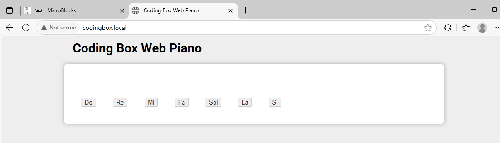

### 3.37 Smart Control Panel

#### 3.37.1 Overview

Combined web buttons and wireless control, this control panel in this project is able to control modules and read module values as well. 

#### 3.37.3 Test Code

You can manually build blocks, or directly open the code file we provide: `3-37-intelligent console.ubp`. If you have any questions about how to open code files or upload code, please back to `1.9 Upload Code`.

**Build code blocks:**

1. In , drag  to the script area.
2. Drag  and set the WIFI name to “LiuTest” and password to “88888888”.
3. Drag  and set the Web name to “CodingBox.local”.
4. Add  to refresh the data of each sensor on the Web page.
5. Add  and set the title to “Coding Box Web Panel”.
6. Use  to display temperature value on the Web page. Modify the blank behind the “with selector” into “cbox_temperature”.
7. Similarly, add humidity, photoresistor, PIR motion and RFID value in sequence.
8. Use  to add a component that controls the display color of WS2812, and modify the blank behind “with selector” to `cbox_setAllNeoPixels`.
9. Use  to add a slider that controls the servo. Remain the name as default and set the range to 0-180, and modify the blank behind “with selector” to `cbox_setServo`.
10. Use  to add a button that controls the fan on. Set name as “Fan ON”, and modify the blank behind “with selector” to `cbox_setFan`. Click  to add a “params” blank, and put  in it and set to “100”.
11. Use  to add a button that controls the fan off. Set name as “Fan OFF”, and modify the blank behind “with selector” to `cbox_stopFan`.
12. Use 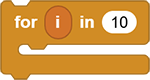 , a loop block, to replace code block that repeatedly executes, such as LED control.
13. Put a  into the blank of  and click  to add “red”, “yellow” and “green”.

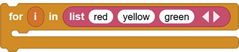

14. Put  in . Use  to bind the “i” value to “LED”, which is the name of button. And modify the blank behind “with selector” to `cbox_setLED`. Click  to add a “params” blank, and put  in it and set to variable “i”.

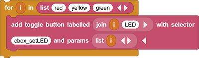

15. Similarly, we set the buttons for OLED display icons. They are “happy”, “heart” and “sad” respectively, of which variable “i” is also available. 

	In , find  and “copy callable name”, and paste to the blank behind the “with selector”: `led_displayImage`. Click  to add a “params” blank, put  in it, and click  of it twice so we get 3 blanks of list. Input variable “i” in the first one and “1” in the remaining two(The starting position of the icon display).

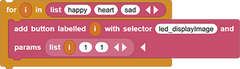

**Complete code:**

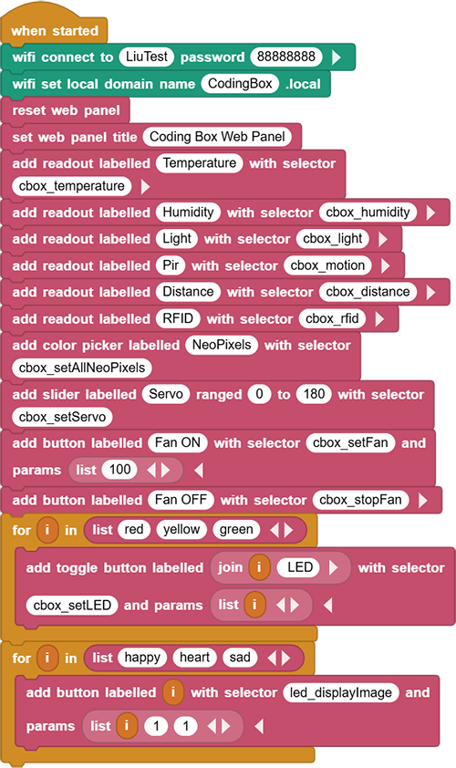

#### 3.37.3 Test Result

Connect the coding box to the MicroBlocks via USB or Bluetooth. Click  to upload code. After connecting to wifi, you can see an IP address: . Now connect your control device (mobile phone, tablet, computer) to the same wifi and search `codingbox.local` on the browser to enter the Web page. 

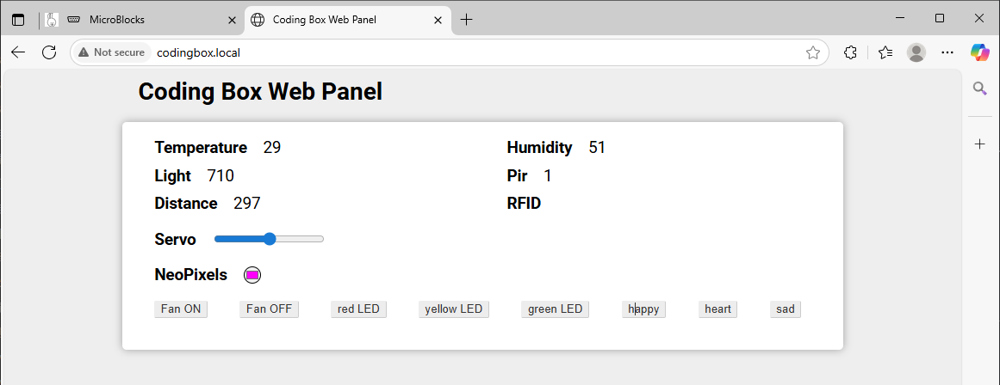
