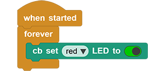
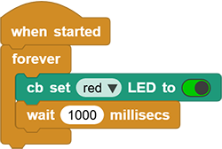
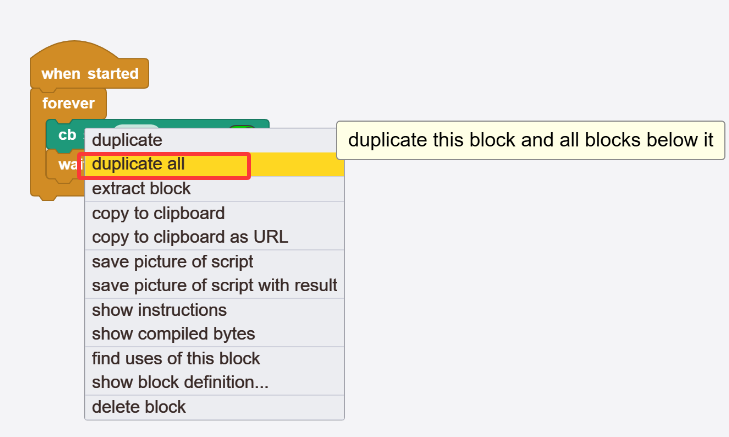
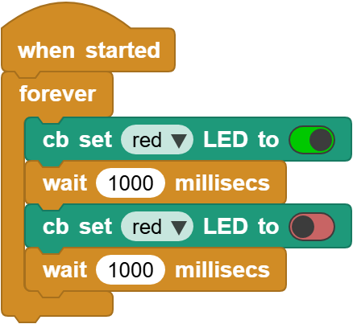

# 3.1 LED Blink

## 3.1.1 Overview

LED Blink is one of the simplest entry-level programming projects for the ESP32 Coding Box. It only needs an LED and then upload the code. This simple project helps beginners better master basic concepts.

## 3.1.2 Schematic Diagram

**LED lighting on:** The output current of the IO ports is limited, so the LED brightness may not be enough. Therefore, a NPN triode (Q2) is added to the circuit as a switch. We only need to add a high(low) level at the triode base pin 1 to light it up(out).

**Triode on/off:** To put it simple, when the base(pin 1) receives a high level, the collector(pin 3) and the transmitter(pin 2) are connected, so then VCC passes through the current-limiting resistor to the LED and then into the triode to GND, forming a loop. At this time, LED is on. When pin 1 receives a low level, pin 3 and 2 are disconnected so the current loop cannot be formed, resulting LED off.

## 3.1.3 Code Blocks

Blocks in :

1.  is in “Control” class. Click the green  to run the code. These hat blocks monitor the various conditions described in their titles. When the startup condition is true, **when started** will be activated. The others are to check whether the button status or Boolean conditions are true to determine whether to execute the blocks placed under them.

2. , a C-shaped block, also called LOOP, is a set of control blocks. As long as the conditions described in it are true, the inside codes will run. This repetitive execution will run the code blocks inside it forever. It is often used for plotting numerical values or continuously monitoring port values, etc.

3.  pauses the execution flow for the specified number of milliseconds. It is used to pause and resume the execution in a time-controlled manner. Unit conversion: 1 second = 1000 milliseconds

--------------------------------

Blocks in :

1.  is a block included in coding box library. It can control the red, yellow and green LED on/off on the coding box. Click  to choose an LED and tap  to turn off it.  means ON, and  is OFF.

## 3.1.4 Test Code

You can manually build blocks, or directly open the code file we provide: `3-1-LED.ubp`. If you have any questions about how to open code files or upload code, please back to `1.9 Upload Code`.

**Build code blocks:**

1. In , drag  and  to the script area, and stack them together.

2. In , drag  block and place it in .

3. In , drag  block and modify `500` into `1000`, and put it under .

4. Move your mouse onto  and click to choose `duplicate all`. Put the copy under the above blocks and set  to .

**Complete code:**

## 3.1.5 Test Result

Connect the coding box to the MicroBlocks via USB or Bluetooth, and click  to upload the code to the coding box. The red LED will blink with an interval of 1 second. If you want it to flash faster, modify the delay.