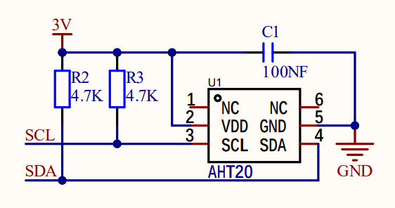
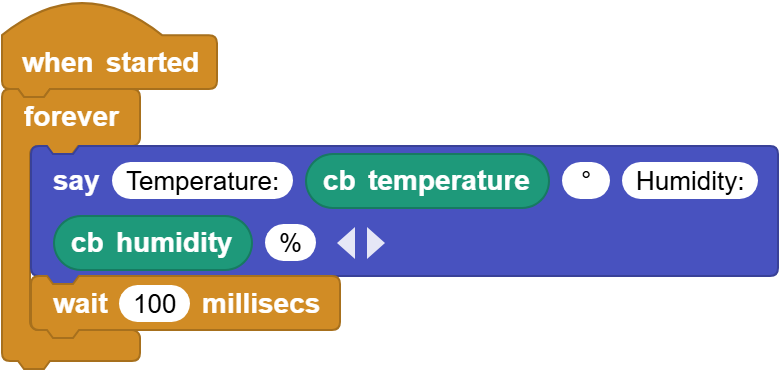
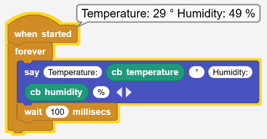

# 3.10 Temperature and Humidity Sensor

## 3.10.1 Overview

AHT20 temperature and humidity sensor adopts I2C interface and 20Bit ADC, and its operating voltage is 2V-5V. It features small volume, stable performance and high precision (temperature ±0.3℃, humidity ±2%RH). So it is widely used in smart home, consumer electronics, medical and automotive. The sensor is stable and can work in harsh environments.

## 3.10.2 Schematic Diagram

ATH20 temperature and humidity sensor transmits data via I2C interface, and it works according to resistive and capacitive technology. It detects the temperature because the material's conductivity changes with temperature, and it reflects humidity through the change in the capacitance value. The temperature measurement range is -40 ° C to +85 ° C with accuracy of ±0.3 ° C, and the humidity range is 0% ~ 100%RH ±2%RH. Besides, it features high accuracy, high reliability and long-term stability, so it can work under a variety of environmental conditions. With I2C protocol, ATH20 provides real-time and accurate temperature and humidity data.

## 3.10.3 Code Blocks

Blocks in :

1.  is a block included in coding box library. It reads the ambient temperature sensed by the coding box.
2.  is a block included in coding box library. It reads the ambient humidity sensed by the coding box.

## 3.10.4 Test Code

You can manually build blocks, or directly open the code file we provide: `3-10-AHT20.ubp`. If you have any questions about how to open code files or upload code, please back to `1.9 Upload Code`.

**Build code blocks:**

1. In , drag  and  to the script area, and stack them together.

2. In , drag  block and place in . 
3. Click  of the  to set 6 outputs blanks in total. In the first blank, enter `Temperature:`; in the fourth one, enter `Humidity:`. Output “°” and “%” as their units respectively.

4. In , drag  and put it onto the second blank of .
5. In , drag  and put it onto the fifth blank of .
6. In , drag  and put it under the  and set the delay to `100ms`.

**Complete code:**

## 3.10.5 Test Result

Connect the coding box to the MicroBlocks via USB or Bluetooth, and click  to upload the code to the coding box. You will see the temperature and humidity values. If you cover the sensing hole of the sensor with your hand, you can see a significant change in humidity.

