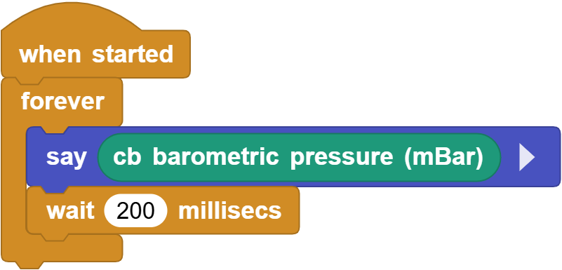
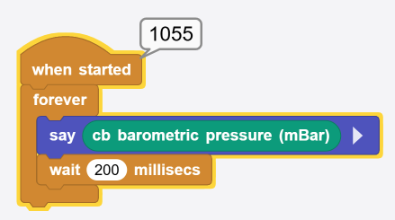

# 3.11 Pressure Sensor

## 3.11.1 Overview

BMP388 pressure sensor is a pneumatic MEMS sensor a very compact package, featuring small size, low power consumption but high performance. In brief, it is a combination of the temperature and pressure sensor, which is perfect for mobile applications. 

This module adopts proven piezoresistive pressure sensing technology with high accuracy and linearity, as well as long-term stability and high EMC stability. Besides, it maximize flexibility in multi-device working, and is ideal for altitude tracking in consumer electronics drones, wearables, smart homes, etc. 

As for improvement, we can optimize the device in terms of power consumption, resolution and filtering performance.

## 3.11.2 Schematic Diagram

Based on piezoelectric pressure sensing technology, the BMP388 pressure sensor accurately measures pressure and temperature. It is capable of measuring air pressure in the 300 ~ 1250 hPa range without consuming much power (consuming only 3.4 µA at 1 Hz operating frequency). In addition, the built-in infinite impulse response filter can effectively reduce effects from external interference.

## 3.11.3 Code Blocks

Blocks in :

1.  is a block included in coding box library. It reads the air pressure values sensed by the pressure sensor in the coding box.

## 3.11.4 Test Code

You can manually build blocks, or directly open the code file we provide: `3-11-Pressure.ubp`. If you have any questions about how to open code files or upload code, please back to `1.9 Upload Code`.

**Build code blocks:**

1. In , drag  and  to the script area, and stack them together.

2. In , drag  block and place in . 
3. In , drag  block and put it in .
4. In , drag  and set the delay to `200ms`.

**Complete code:**

## 3.11.5 Test Result

Connect the coding box to the MicroBlocks via USB or Bluetooth, and click  to upload the code to the coding box. You will see the ambient air pressure value sensed by the sensor.

