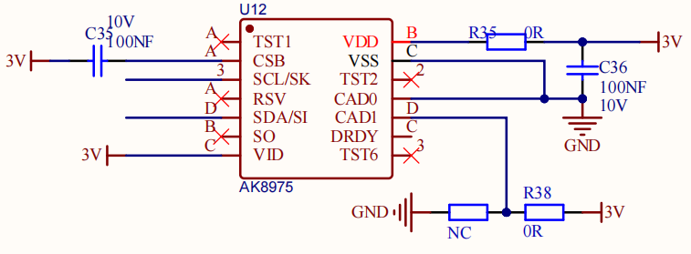
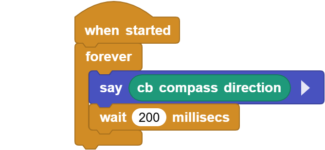
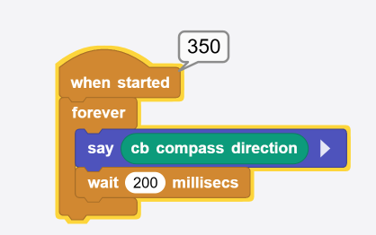

# 3.12 Geomagnetic Sensor (Compass)

## 3.12.1 Overview

AK8975C geomagnetic sensor is a three-axis electronic compass IC with high sensitivity. It can output 13-bit data and accurately detect X, Y, Z axes geomagnetic values. Thus, it is suitable for portable devices with navigation function such as mobile phones and tablets.

## 3.12.2 Schematic Diagram

The AK8975C geomagnetic sensor works in the principle of electromagnetic induction. It takes the Earth's magnetic field as a measurement benchmark to sense changes in the magnetic field through its internal magnetic material and coils. Specifically, when the magnetic material is affected by geomagnetic field, a directional constrained electron spin deflection will happen due to the field force, which in turn forms a magnetic field. This field induces potential signals in the coil.

This sensor amplifies and processes the induced potential signals, which are then transmitted to the system for further calculation, analysis and processing. So it measures geomagnetic magnetic field in the axis X, Y, and Z to determine the direction.

## Code Blocks

Blocks in :

1.  is a block included in coding box library. It reads the angle value sensed by the geomagnetic sensor of the coding box.

## Test Code

You can manually build blocks, or directly open the code file we provide: `3-12-Geomagnetic.ubp`. If you have any questions about how to open code files or upload code, please back to `1.9 Upload Code`.

**Build code blocks:**

1. In , drag  and  to the script area, and stack them together.

2. In , drag  block and place in . 
3. In , drag  block and put it onto .
4. In , drag  and set the delay to `200ms`.

**Complete code:**

## Test Result

Connect the coding box to the MicroBlocks via USB or Bluetooth, and click  to upload the code to the coding box. You can see the angles sensed by the geomagnetic sensor. Rotate the coding box to observe that the angle changes from 0 to 360 degrees. 

(Note that the sensor may be affected by electronic devices and environmental magnetic fields, resulting in geomagnetic angle deviations.)

