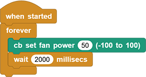
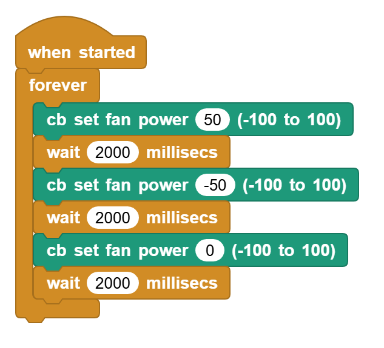

# 3.13 Fan Module

## 3.13.1 Overview

The motor adopts HR1124S motor control chip that is a single channel H-bridge driver chip used in DC motors. The H-bridge drive uses PMOS and NMOS power tubes with low on-resistance, ensuring lower power loss and longer safe working time. In addition, its standby and static working current are both low, so it is commonly used in toys.

## 3.13.2 Schematic Diagram

**Motor control logic table:**

| IO18 | IO17 |      motor state      |
| :--: | :--: | :-------------------: |
| HIGH | LOW  |    forward rotate     |
| LOW  | HIGH |    reverse rotate     |
| HIGH | HIGH | stop (a gradual stop) |
| LOW  | LOW  | brake (a brake stop)  |

## 3.13.3 Code Blocks

Blocks in :

1.  is a block included in coding box library. It controls the rotation of the motor in the coding box.

**Motor control logic table for the blocks:**

|  motor state   | value (speed) |
| :------------: | :-----------: |
| forward rotate |     1~100     |
| reverse rotate |    -1~-100    |
| stop rotating  |       0       |

## 3.13.4 Test Code

You can manually build blocks, or directly open the code file we provide: `3-13-Fan.ubp`. If you have any questions about how to open code files or upload code, please back to `1.9 Upload Code`.

**Build code blocks:**

1. In , drag  and  to the script area, and stack them together.

2. In , drag  and put it into.

3. In , drag  block and set delay to `2000`. And put it under .

4. Duplicate all  but modify power to `-50`.
5. Duplicate all  again but modify power to `0`.

**Complete code:**

## 3.13.5 Test Result

Connect the coding box to the MicroBlocks via USB or Bluetooth, and click  to upload the code to the coding box. You will see the fan forward rotates for 2s and then reverses for another 2s. Then it stops rotating for 2 seconds. These actions repeat.