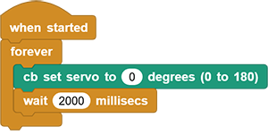
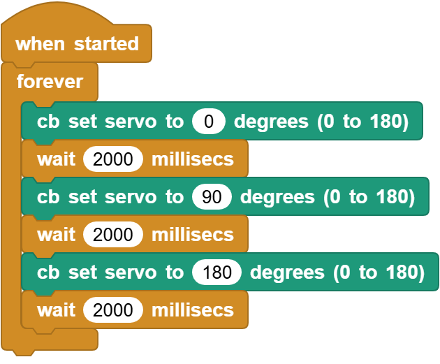

# 3.14 Servo

## 3.14.1 Overview

The 9g servo features small size but high performance and precision and is with good torque and accuracy, so it is perfect for small machines. With up to 180 degrees rotation angle, it enables extremely precise rotation and control and can be started fast with low noise.

## 3.14.2 Schematic Diagram

**Angle range:** 180°(there are 360°, 180° and 90°)

**Drive voltage:** 3.3V / 5V

Usually three wires:

**GND:** grounded, in brown

**VCC:** connect to +5v (3.3V) power, in red

**S:** signal pin to control PWM signal, in orange

**Control principle**: The rotation Angle of the servo is controlled by adjusting the duty cycle of the PWM (pulse width modulation) signals. Theoretically, the period of the standard PWM signal is fixed at 20ms (50Hz), so the pulse width should be 1ms ~ 2ms. But in fact, it is 0.5ms ~ 2.5ms, corresponding to the servo angle of  0° ~ 180°. Note that the angle for the same signal varies from servo brands.

## 3.14.3 Code Blocks

Blocks in :

1.  is a block included in coding box library. It controls the rotation angle of the servo in the coding box.

## 3.14.4 Test Code

You can manually build blocks, or directly open the code file we provide: `3-14-Servo.ubp`. If you have any questions about how to open code files or upload code, please back to `1.9 Upload Code`.

**Build code blocks:**

1. In , drag  and  to the script area, and stack them together.

2. In , drag  block and put it into . Modify the angle to 0 degree.

3. In , drag  block and set to `1000`, and put it under .

4. Duplicate all  but set degree to `90`.
5. Duplicate all  again but set degree to `180`.

**Complete code:**

## 3.14.5 Test Result

Connect the coding box to the MicroBlocks via USB or Bluetooth, and click  to upload the code to the coding box. The servo rotates to 0 degrees ans stays for 2 seconds (If its initial angle is 0, it will not rotate), and then it rotates to 90 degrees and stays for 2 seconds. At last, it turns to 180 degrees and stays for 2 seconds. These actions repeat.