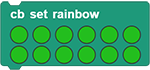
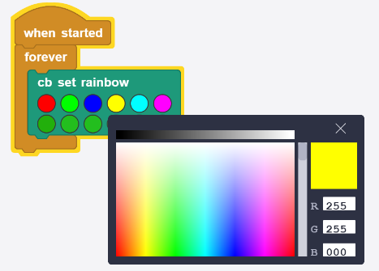
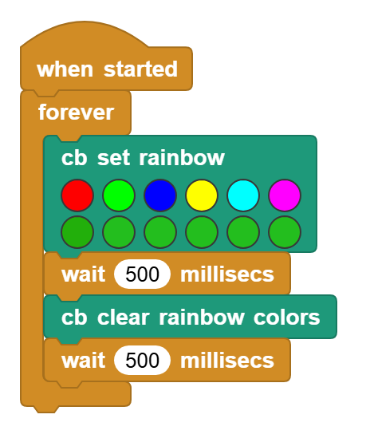

# 3.15 WS2812 RGB LED

## 3.15.1 Overview

WS2812 RGB LED is an external control LED integrating control circuit and light emitting circuit. It adopts single-line return-to-zero code communication, and supports 256 gray levels to display full-colors. The integrated chip inside each pixels efficiently stabilizes color output. So it is widely used in lighting, display and decoration.

## 3.15.2 Schematic Diagram

From the Schematic Diagram, ws2812 connects and transmits data over a single wire, which is the communication method named single-bus return-to-zero code (single NZR). The data enters in serial through the DIN port, and each pixel receives and processes 24 bits data (R, G, B color channels with 8 bits each). 

For detailed information of transmission mode, please refer the specification of ws2812.

## 3.15.3 Code Blocks

Blocks in :

1.  is a block included in coding box library. It controls 12 RGB LEDs in the coding box, and the color of each can be controlled.

2.  is a block included in coding box library. It controls displayed colors of all RGB LEDs in the coding box.

3.  is a block included in coding box library. It turns off all RGB LEDs in the coding box.

The code blocks in  also control the display of RGB LED, and there are more ways for it. For details, please visit [Libraries | MicroBlocks Wiki](https://wiki.microblocks.fun/en/libraries#attach-neopixel-led-to-pin).

## 3.15.4 Test Code

You can manually build blocks, or directly open the code file we provide: `3-15-WS2812.ubp`. If you have any questions about how to open code files or upload code, please back to `1.9 Upload Code`.

**Build code blocks:**

1. In , drag  and  to the script area, and stack them together.

2. In , drag  and place in . Set  the first LED to show red, the second LED to show green, the third LED to show blue, the fourth LED to show yellow, the fifth LED to show cyan, the sixth light to show purple, and keep the remaining six ones unchanged.
3. In , drag  and put it under .
4. In , drag  and put it under  and add one more  at last.

**Complete code:**

## 3.15.5 Test Result

Connect the coding box to the MicroBlocks via USB or Bluetooth, and click  to upload the code to the coding box. The first six RGB LEDs respectively light up in red, green, blue, yellow, cyan and purple, while the other six all light up in green. Each RGB LED turns on for 0.5s then off for another 0.5s.