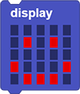
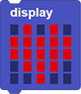
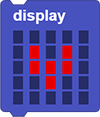
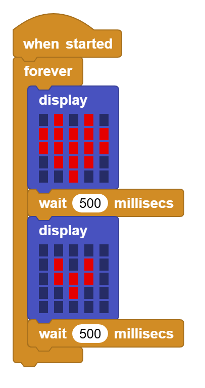

# 3.16 OLED Display

## 3.16.1 Overview

OLED display is also called organic light-emitting diode or organic dot laser display. This display is self-luminous. It adopts a very thin coating of organic materials and glass substrate which will light up if current passes through. Therefore, it does not require a back-light. Note that it will not light up when just powering on; programing and wiring are also needed.

Besides, it features large viewing Angle, low power consumption, high contrast, thin display, fast response, simple structure, and can work on flexion boards within a wide temperature range.

## 3.16.2 Parameters

Communication mode: I2C communication

Internal driver chip: SSH1106

Resolution: 128 x 64

## 3.16.3 Code Blocks

Blocks in :

1.  is used to control the OLED display of the coding box. Different display patterns can be created by yourself through the mouse.
2.  is used to set the OLED display patterns.
3.  clears all display.
4.  shows a rectangle on the OLED. Just set the values of X and Y.
5.  clears the display of .
6.  sets characters to show on OLED.
7.  sets scrolling characters to show on OLED.
8.  stops showing  scrolling characters on OLED.

--------

The code blocks in  also control the display of OLED, and there are more ways for it. For details, please visit [OLED Library | MicroBlocks Wiki](https://wiki.microblocks.fun/en/extension_libraries/oled).

-------

Blocks in :

1.  is a block included in coding box library. It controls the values in the characters or variables displayed by the OLED in the coding box. The display position and size can be set.
2.  is a block included in coding box library. It clears the content displayed on the OLED.

## 3.16.4 Test Code

You can manually build blocks, or directly open the code file we provide: `3-16-OLED.ubp`. If you have any questions about how to open code files or upload code, please back to `1.9 Upload Code`.

**Build code blocks:**

1. In , drag  and  to the script area, and stack them together.

2. In , drag  and place in . Set the icon to .
3. In , drag  and put it under .
4. `duplicate all`  and put the copy under , and set the icon to .

**Complete code:**

## 3.16.5 Test Result

Connect the coding box to the MicroBlocks via USB or Bluetooth, and click  to upload the code to the coding box. The OLED displays  and  alternately with each for 0.5s.