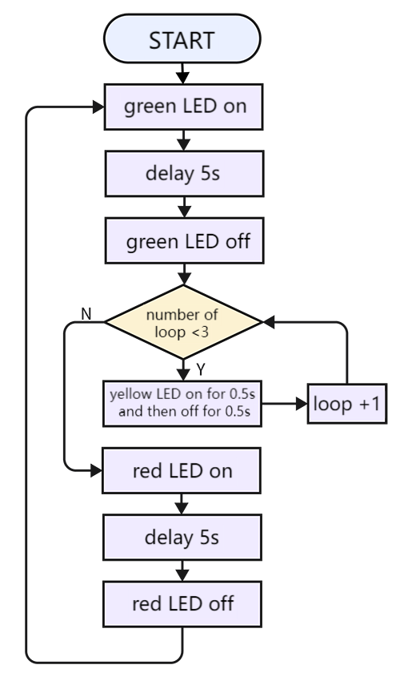
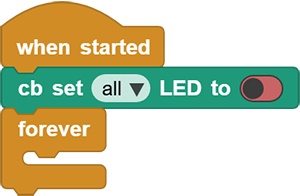
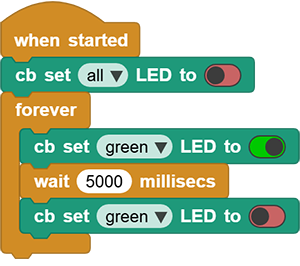
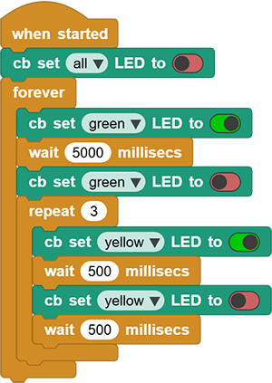
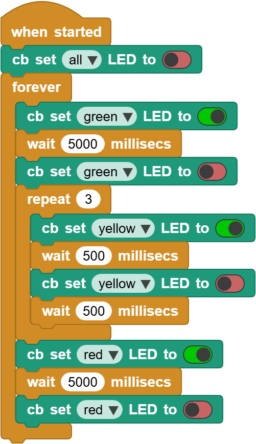

# 3.17 Traffic Lights

## 3.17.1 Overview

The traffic light module limits the pedestrian and vehicular thoroughfare. It includes a red, a yellow and a green light, which imply different instructions.

**Red for Stop:** Pedestrians and vehicles stop proceeding.

**Yellow for Caution:** Pedestrians and vehicles are ready for stopping. If the drive is already in process, the speed should be slow.

**Green for Proceed:** Pedestrians and vehicles keep going with the abidance of traffic regulations.

In this project, you can program on ESP32 Coding Box to control a mini traffic light. For instance, set the duration of each lights and the interval time among them. Besides, you may also add a timer to alter light colors to schedule.

## 3.17.2 Code Flow

## 3.17.3 Code Blocks

Blocks in :

1.  repeats the execution for a given number of times. Just input the number of repetitions needed into the white box.

## 3.17.4 Test Code

You can manually build blocks, or directly open the code file we provide: `3-17-Traffic Lights.ubp`. If you have any questions about how to open code files or upload code, please back to `1.9 Upload Code`.

**Build code blocks:**

1. In , drag  and  to the script area, and stack them together.

2. First, turn off all the LEDs, and place the blocks to turn on required LEDs.

3. The green LED lights up for 5s and goes off.

4. The yellow LED blinks for three times with an interval of 0.5s.

5. The red LED lights up for 5s and goes off. Repeat the set times. And then go ahead till all blocks in  are done.

## 3.17.5 Test Result

Connect the coding box to the MicroBlocks via USB or Bluetooth, and click  to upload the code to the coding box. And you will see the green LED lights up for 5s and goes off. Immediately, the yellow LED blinks for three times. After that, the red LED lights up for 5s and goes off. These actions are exactly a model of traffic light and will repeat. 