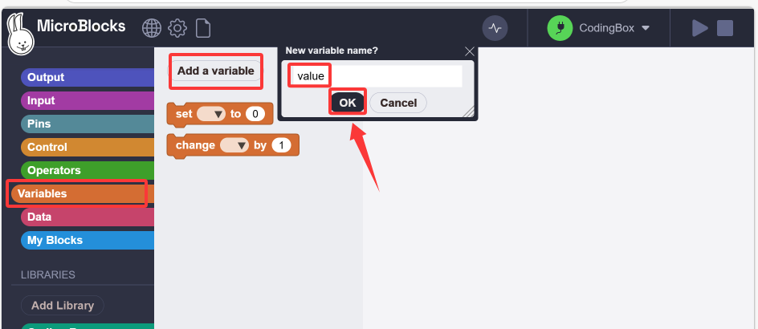
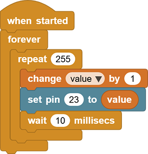
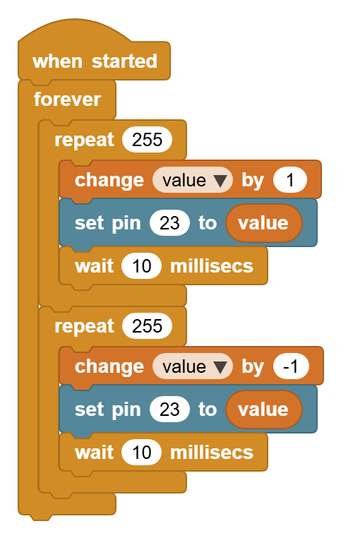

# 3.18 Breathing LED

## 3.18.1 Overview

PWM breathing LED utilizes on-board programmable PWM to output analog waveform. After powering on, LED brightness can be adjusted through duty cycle of the waveform to eventually realize a breathing light. In this way, ambient light can be simulated by changing LED brightness along with time. Also, breathing LED can form a colorful mini light show to construct a tranquil and warm environment.

## 3.18.2 Schematic Diagram

PWM controls analog output via digital means, which are able to adjust the duty cycle of the wave (a signal circularly shifting between high level and low level).

digital ports of voltage output are LOW and HIGH, which respectively correspond to 0V and 5V. Generally, we define LOW as 0 and HIGH as 1. will output 500 signals of 0 or 1 within 1s. If they are 500 “1”s, 5V will be output. Oppositely, if they are all 0s, the output will be 0V. Or if they are 010101010101…, the average output will be 2.5V. In other words, output ratio of 0 and 1 affects the voltage value. 

Honestly, it differs from real continuous output, yet the more 0 and 1 signals are output per unit time, the more accurate the control will be.

## 3.18.3 Code Blocks

Blocks in :

1. Create a variable.

  

2.  is used to assign values to variables. Its selection menu will display a list of all global and local variables.
3.  changes the value of a certain global variable or local variable according to the given value in the input area. The input value can be a positive number or a negative number.
4. Used to call the value of the corresponding variable name.s

For more details, please visit [Blocks Reference | MicroBlocks Wiki](https://wiki.microblocks.fun/en/reference_manual#variables)

--------

Blocks in :

1.  generates a pulse width modulation (PWM) signal on the given pin, approximately at a power level of 0-1023. PWM works by quickly turning pins on and off. Power is controlled by changing the duty cycle(the percentage of time that the pins are on in each cycle). 0 means pin off, while 1023 means full power (that is, the pin is on 100% of the time). When the value is 512, the duty cycle is 50%, so the pin is on half of the time and off another half of the time. PWM can be used to control the brightness of leds or the speed of motors. 

For more details, please visit [Blocks Reference | MicroBlocks Wiki](https://wiki.microblocks.fun/en/reference_manual#pins).

## 3.18.4 Test Code

You can manually build blocks, or directly open the code file we provide: `3-18-Breathing LED.ubp`. If you have any questions about how to open code files or upload code, please back to `1.9 Upload Code`.

**Build code blocks:**

1. In , drag  and  to the script area, and stack them together.

2. In , declare a variable named `value`.
3. Drag a  to set to 255 times. Add a  block to increase `value` by 1 after each repetition. Use  to output `value` to pin `io23`, and then add a 10ms delay to slow down the red LED lighting.

4. Duplicate the code blocks and set `value` to increase by `-1` during each repetition. So the red LED dims.

## 3.18.5 Test Result

Connect the coding box to the MicroBlocks via USB or Bluetooth, and click  to upload the code to the coding box. The red LED gradually lights on and dims out, and vice versa. It “breathes” evenly.