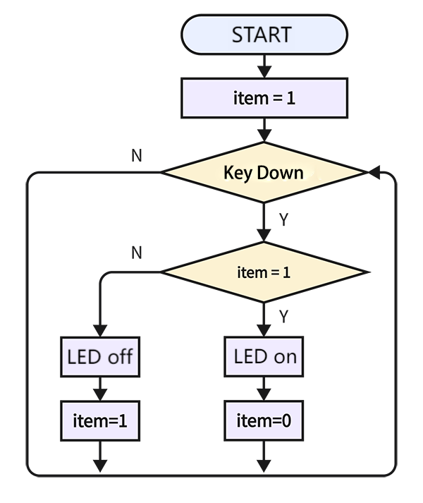
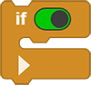
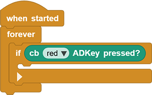
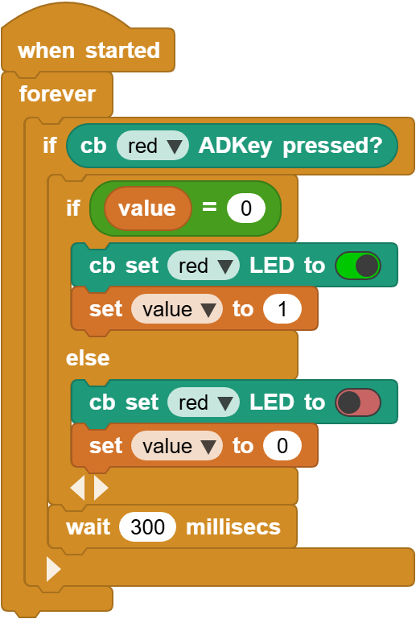

# 3.19 Button Control LED

## 3.19.1 Overview

In this project, we control the ON/OFF of the LED via an AD button. The LED will light up if we press the button and it goes off when we press the button again.

## 3.19.2 Code Flow

## 3.19.3 Code Blocks

Blocks in :

1.  is used to determine whether two values are equal. If yes, it returns true; otherwise, it returns false.

For more details, please visit [Blocks Reference | MicroBlocks Wiki](https://wiki.microblocks.fun/en/reference_manual#operators)

## 3.19.4 Test Code

You can manually build blocks, or directly open the code file we provide: `3-19-Button Control LED.ubp`. If you have any questions about how to open code files or upload code, please back to `1.9 Upload Code`.

**Build code blocks:**

1. In , drag  and  to the script area, and stack them together.

2. In , declare a variable named `item`.
3.  determines whether the red button is pressed.

4. Check if `item` = 0. If yes, red LED turns on and set `item` to 1 . If not, red LED turns off and set `item` to 0. At last, add a delay of 300ms.

## 3.19.5 Test Result

Connect the coding box to the MicroBlocks via USB or Bluetooth, and click  to upload the code to the coding box. Press the red button and the red LED lights up; press it again and the LED goes off.