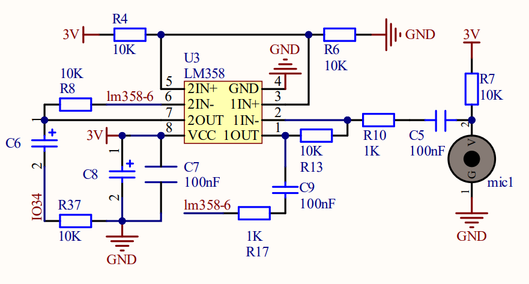
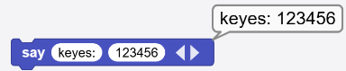
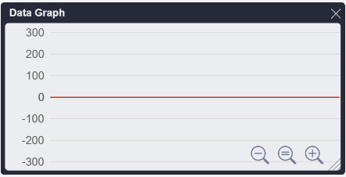
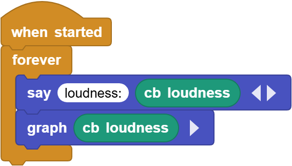
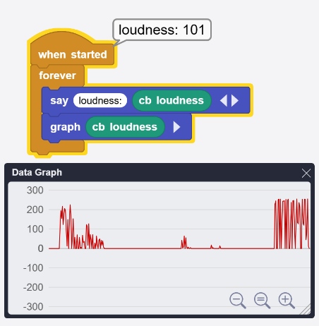

# 3.2 Sound Sensor

## 3.2.1 Overview

The sound sensor, with excellent sound reception, mainly contains a high sensitivity microphone and an LM358 operational amplifier. Weak sound signals are captured by the microphone and amplified by LM358, so the output is clear and recognizable, which can be effectively detected the sounds. 

This sensor features high sensitivity, fast response speed, so is widely used in sound detection and recognition, providing a stable and reliable voice input solution for various intelligent devices.

## 3.2.2 Schematic Diagram

**Working principle:** If the built-in electret film vibrates after receiving sounds, its capacitance will change to produce a tiny voltage. The LM358 chip is adopted in circuits to amplify the sound signals detected by the high-sensitivity microphone.

## 3.2.3 Code Blocks

Blocks in :

1.  displays the input values. It can be used to display any data type supported by MicroBlocks. In addition to directly entering values, a variable report block can also be placed there. If you want to display more than one piece of data, simply click on the triangle to add more. This is one of the main methods to help troubleshoot the faults in the code. Click on  to add an output blank: 

2.  plots input values in a Data Graph. Any type of data can be plotted as a graph: numbers, digital and analog pin input, sensor output, etc. If you want to draw more than one, click on the triangle to add up to six values simultaneously drawn in different colors. Note that plotting is only supported in the IDE. Therefore, it is possible to plot only when a device is connected to the computer. Plotting without a device will result in showing “Not connected to the mainboard”. Click  to check the graph. 

-----------------

Blocks in :

1.  is a block included in coding box library. It reads the analog values of the sound sensors in the coding box.

## 3.2.4 Test Code

You can manually build blocks, or directly open the code file we provide: `3-2-Sound.ubp`. If you have any questions about how to open code files or upload code, please back to `1.9 Upload Code`.

**Build code blocks:**

1. In , drag  and  to the script area, and stack them together.

2. In , drag  and  block and put them in  respectively. 
3. Tap  of the  to add an output blank. Enter `loudness:` in the first one.

4. In , drag  and put it in both the second blank of  and the .

**Complete code:**

## 3.2.5 Test Result

Connect the coding box to the MicroBlocks via USB or Bluetooth, and click  to upload the code to the coding box. Click  to check the graph. Make a sound for the sensor to capture, and then we can see the analog values of the sound on the editor.

