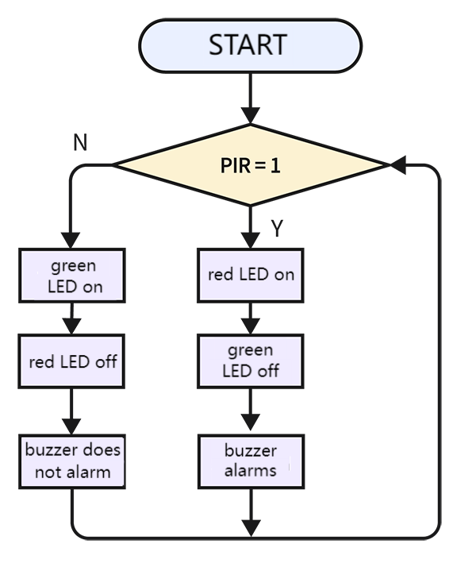
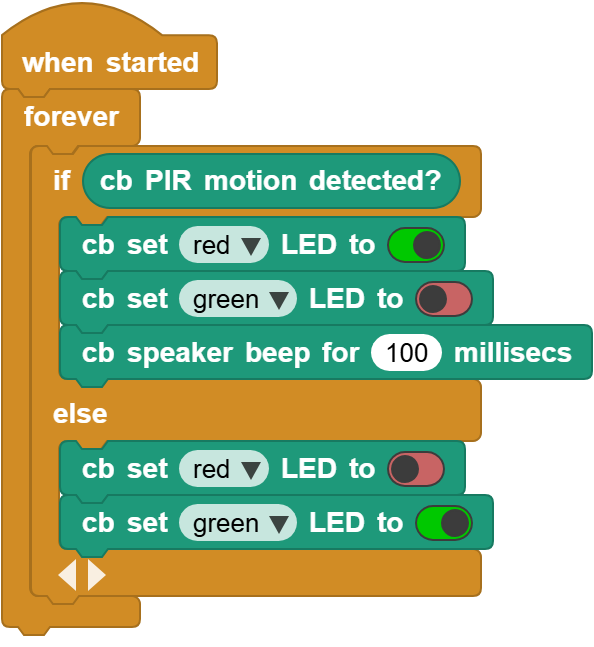

# 3.20  Intrusion Alarm

## 3.20.1 Overview

Intrusion alarm is a device alerting illegal intrusion into a prevention area. It plays an important role in security. We can see it everywhere: families, stores, warehouses, supermarkets and so on. 

All in all, it protects our personal and property safety.

## 3.20.2 Code Flow

## 3.20.3 Test Code

You can manually build blocks, or directly open the code file we provide: `3-20-Intrusion Alarm.ubp`. If you have any questions about how to open code files or upload code, please back to `1.9 Upload Code`.

**Build code blocks:**

1. In , drag  and  to the script area, and stack them together.

2.  determines whether there is a human being. If yes, the red LED is on yet the green LED is off, and the buzzer alarms. If not, the buzzer does not alarm, along with red LED off and green LED on.

## 3.20.4 Test Result

Connect the coding box to the MicroBlocks via USB or Bluetooth, and click  to upload the code to the coding box. When the sensor detects a motion around, the speaker alarms, the red LED turns on and the green one is off. If no intrusion is detected, the red LED will go off and the green will be on; at the same time, the speaker stays quiet. 