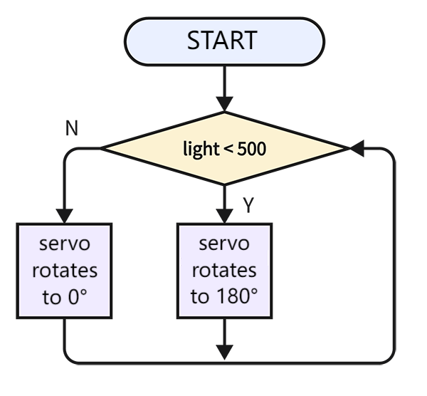
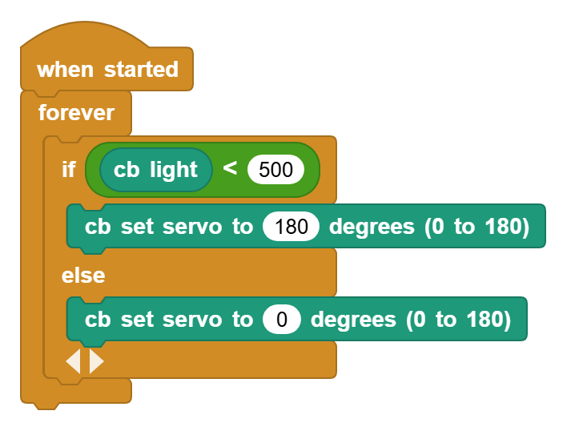

# 3.21 Window Close In Dark

## 3.21.1 Overview

In this project, we program to make the window automatically close when getting dark. So the photoresistor is required to sense the ambient light. We set a threshold for the resistor. When ambient light value is lower than the threshold, the servo closes the window.

## 3.21.2 Code Flow

## 3.21.3 Code Blocks

Blocks in :

1.  is used to compare two values. If the first one is greater than the second one, it returns true.
2.  is also used to compare two values. If the first one is smaller than the second one, it returns true.
3.  determines whether the conditions on both sides are met. If yes, it outputs True; if one of the conditions is not met, it outputs False.

For more details, please visit [Blocks Reference | MicroBlocks Wiki](https://wiki.microblocks.fun/en/reference_manual#operators)

## 3.21.4 Test Code

You can manually build blocks, or directly open the code file we provide: `3-21-Window Close In Dark.ubp`. If you have any questions about how to open code files or upload code, please back to `1.9 Upload Code`.

**Build code blocks:**

1. In , drag  and  to the script area, and stack them together.

2. Check whether the value of the photoresistor is less than 500. If it is, the servo rotates to 180°; if not, the servo rotates to 0°.

## 3.21.5 Test Result

Connect the coding box to the MicroBlocks via USB or Bluetooth, and click  to upload the code to the coding box. Cover the photoresistor to lower its analog value under 500 and the servo will rotate to 180°. If the analog value exceeds 500, the servo will rotate to 0°.