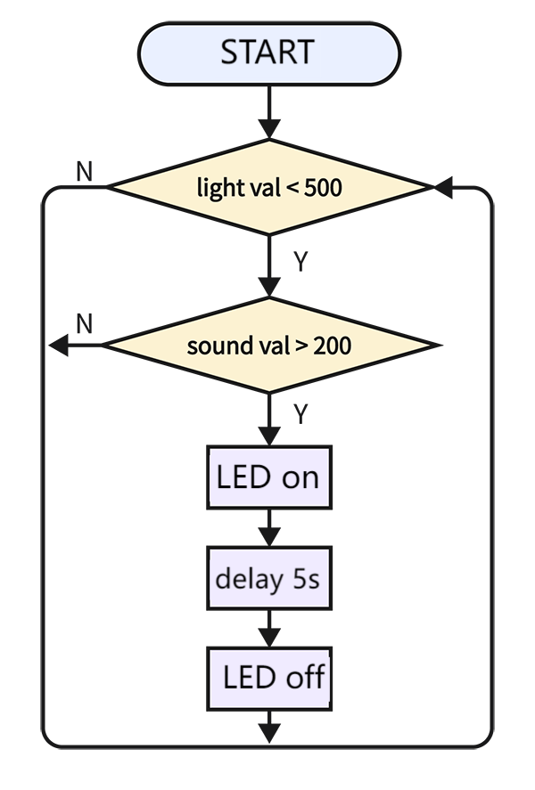
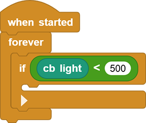
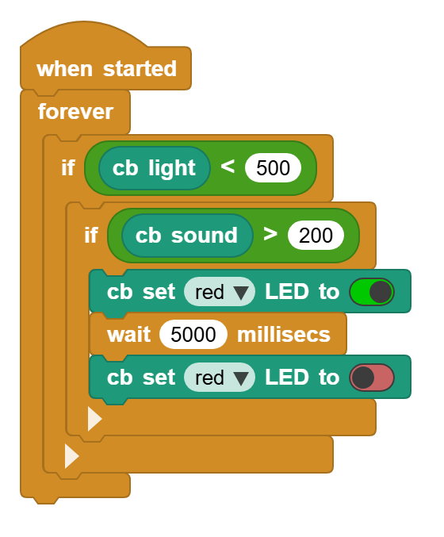

# 3.22 Voice Control Light

## 3.22.1 Overview

Voice-control-light device mainly consists of a sound sensor, a photoresistor and an LED. The photoresistor is adopted to avoid LED lighting up during daytime. The sound sensor measures sound volume to determine whether it is reached the set threshold. If yes, the LED will light up for a few seconds. 

## 3.22.2 Code Flow

## 3.22.3 Test Code

You can manually build blocks, or directly open the code file we provide: `3-22-Voice Control Light.ubp`. If you have any questions about how to open code files or upload code, please back to `1.9 Upload Code`.

**Build code blocks:**

1. In , drag  and  to the script area, and stack them together.

2. Determine whether the photoresistor value is lower than 500

3. Determine whether the photoresistor value is greater than 200. If yes, the red LED turns on for 5 seconds and then goes off.

## 3.22.4 Test Result

Connect the coding box to the MicroBlocks via USB or Bluetooth, and click  to upload the code to the coding box. Cover the photoresistor, and make some sounds, and you will see the LED light up for 5 seconds. 