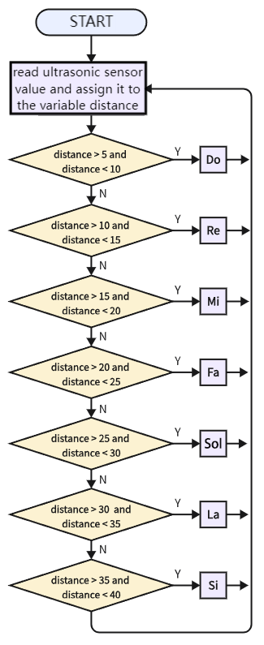
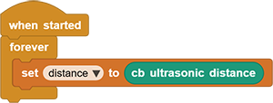
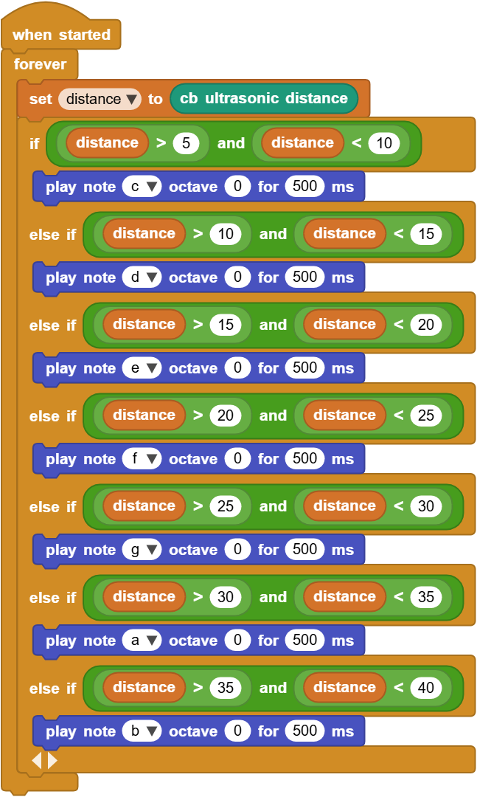

# 3.23 Human Body Piano

## 3.23.1 Overview

The analog piano mainly includes an ultrasonic sensor to detect the distance of your position. It plays different tones according to distance values. If there is an open space, you may place it on ground to play musics.

## 3.23.2 Code Flow

## 3.23.3 Test Code

You can manually build blocks, or directly open the code file we provide: `3-23-Human Body Piano.ubp`. If you have any questions about how to open code files or upload code, please back to `1.9 Upload Code`.

**Build code blocks:**

1. In , drag  and  to the script area, and stack them together.

2. Declare a variable named `distance` and assign the distance values detected by the ultrasonic sensor to it. 

3. Determine whether the distance value is within 5cm ~ 10cm. If yes, play tone `Do`.
4. Determine whether the distance value is within 10cm ~ 15cm. If yes, play tone `Re`.
5. Determine whether the distance value is within 15cm ~ 20cm. If yes, play tone `Mi`.
6. Determine whether the distance value is within 20cm ~ 25cm. If yes, play tone `Fa`.
7. Determine whether the distance value is within 25cm ~ 30cm. If yes, play tone `Sol`.
8. Determine whether the distance value is within 30cm ~ 35cm. If yes, play tone `La`.
9. Determine whether the distance value is within 35cm ~ 40cm. If yes, play tone `Si`.

## 3.23.4 Test Result

Connect the coding box to the MicroBlocks via USB or Bluetooth, and click  to upload the code to the coding box. Put your hand in front of the ultrasonic sensor and the speaker will emit sound. You can control the tone by moving your hand in front of the sensor.

Tones corresponding to distance:

Do: 5-10cm

Re: 10-15cm

Mi: 15-20cm

Fa: 20-25cm

Sol: 25-30cm

La: 30-35cm

Si: 35-40cm