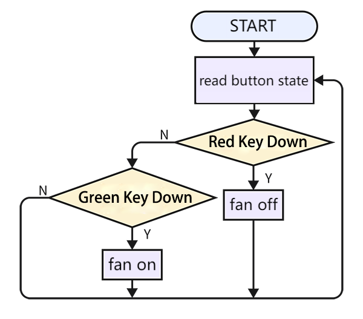
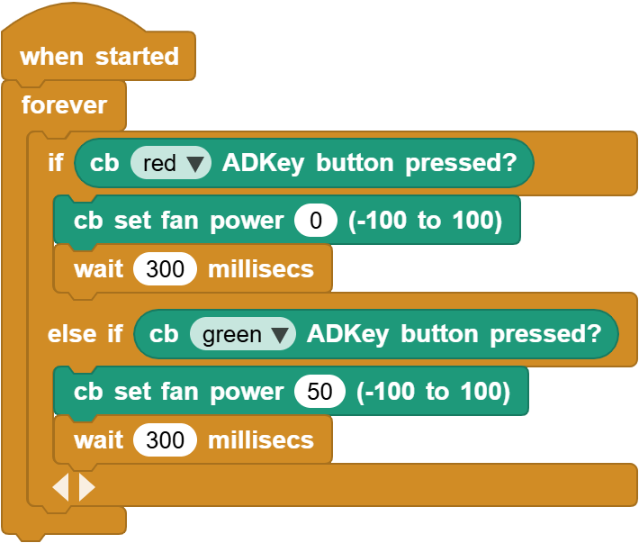

# 3.24 Button Control Fan

## 3.24.1 Overview

In this experiment, we program to control the fan by a button.

## 3.24.2 Code Flow

## 3.24.3 Test Code

You can manually build blocks, or directly open the code file we provide: `3-24-Button Control Fan.ubp`. If you have any questions about how to open code files or upload code, please back to `1.9 Upload Code`.

**Build code blocks:**

1. In , drag  and  to the script area, and stack them together.

2. Press the red button to turn off the fan and delay for 300ms, otherwise press the green button to turn on the fan and delay for 300ms

## 3.24.4 Test Result

Connect the coding box to the MicroBlocks via USB or Bluetooth, and click  to upload the code to the coding box. When we press the green button, the fan will turn on. When we press the red button, the fan stops working. 