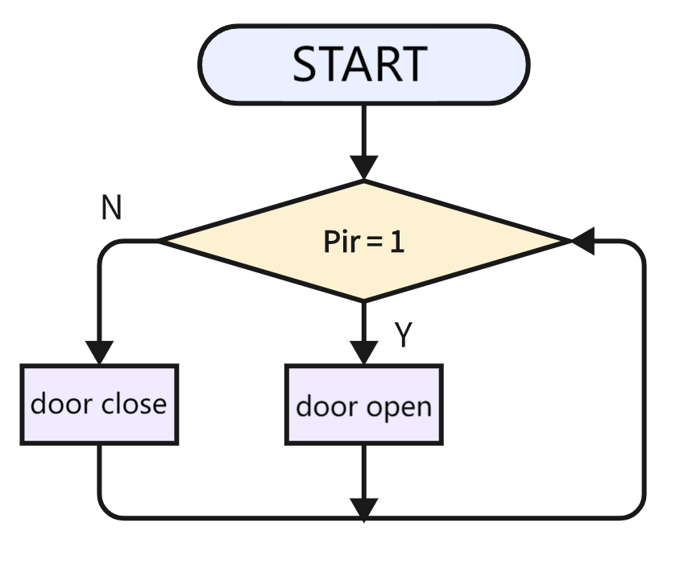
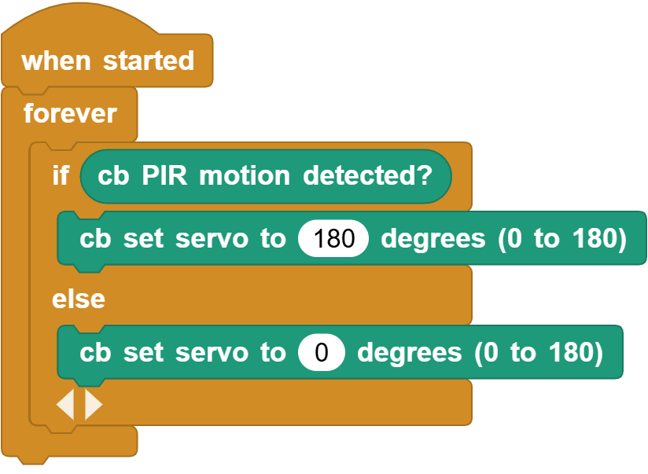

# 3.25 Auto-door

## 3.25.1 Overview

Many shopping malls open their doors when someone approaches and close them when no one is detected. Herein, we adopt a PIR motion sensor to simulate this kind of auto-door. The door opens when someone is detected and closes when no one is present.

## 3.25.2 Code Flow

## 3.25.3 Test Code

You can manually build blocks, or directly open the code file we provide: `3-25-Auto-door.ubp`. If you have any questions about how to open code files or upload code, please back to `1.9 Upload Code`.

**Build code blocks:**

1. In , drag  and  to the script area, and stack them together.

2. When the PIR sensor detects a person, the servo rotates to 180 degrees. It returns to 0° until no one is detected.

## 3.25.4 Test Result

Connect the coding box to the MicroBlocks via USB or Bluetooth, and click  to upload the code to the coding box. Wave your hand over the PIR motion sensor, and the servo will rotate to 180 degree (door open). After a while, it will back to 0 degree (door close) if nothing is detected.