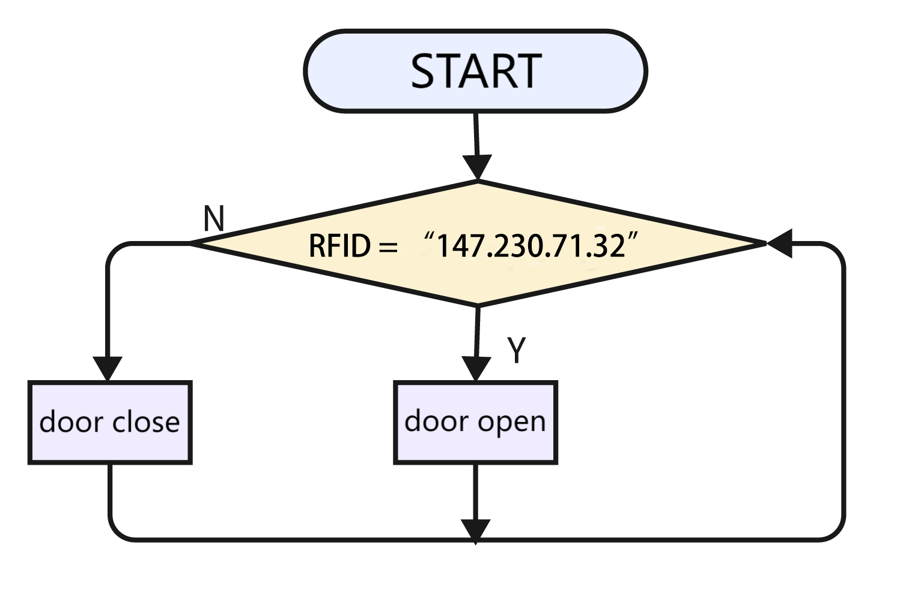
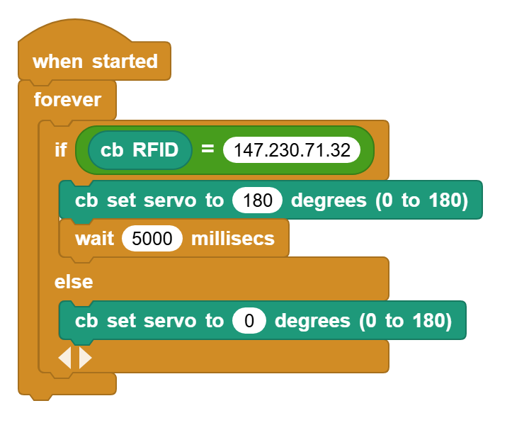

# 3.26 Access Card

## 3.26.1 Overview

A common access card is a  magnetic card or a key chain. So in this experiment, we make a simple access device through servo, a magnetic card and an RFID module.

## 3.26.2 Code Flow

## 3.26.3 Test Code

You can manually build blocks, or directly open the code file we provide: `3-26-Access Card.ubp`. If you have any questions about how to open code files or upload code, please back to `1.9 Upload Code`.

**Build code blocks:**

1. In , drag  and  to the script area, and stack them together.

2. Check if it is the correct card ID. If it is, the servo rotates to 180° and stays for 5 seconds and then returns to 0°. If not, the servo will not move. Note that the value of each card is different. You need to replace it with the value of your own one.

## 3.26.4 Test Result

Connect the coding box to the MicroBlocks via USB or Bluetooth, and click  to upload the code to the coding box. Put your IC card at the sensing area of the RFID module, and the servo will rotate to 180 degree for 3s and then come back. If the card code is not correct, the servo will stay still.